文章编号：1001-4179（2022）05-0007-07

引用本文：许全喜，袁晶.2020年三峡水库泥沙淤积特点及原因分析[J].人民长江，2022,53(5)：7-13.

# 2020年三峡水库泥沙淤积特点及原因分析

许金喜，袁晶

（长江水利委员会水文局，湖北武汉430010）

摘要：2020年汛期，长江上游暴雨洪水频发，三峡水库入库沙量显著增大，年入库沙量达到了1.94亿t。在系统分析长江上游水沙变化特性的基础上，总结提炼了2020年三峡库区泥沙淤积出现的新特点，主要是库区泥沙淤积量较往年明显偏大，同时库尾河段和防洪库容内泥沙淤积明显。铜锣峡以上河段由以往的冲刷变为淤积353万m³，淤积量占三峡库区总淤积量的3%；防洪库容内淤积泥沙2440万m³，为三峡水库175m试验性蓄水以来最大值，此外坝前河段淤积强度显著增大。分析原因后认为主要是8月上游嘉陵江、岷江等支流暴雨产沙导致入库沙量偏多与水库拦洪导致坝前水位偏高所致。相关结论可为三峡水库科学调度提供更有力的技术支撑。

关键词：输沙量；泥沙淤积；库尾；防洪库容；淤积强度；三峡水库

中图法分类号：TV697

文献标志码：A

DOI:10.16232/j.cnki.1001-4179.2022.05.002

# 0 引言

泥沙问题是三峡工程的关键技术问题之一，直接关系到三峡水库寿命和工程综合效益的发挥，也是三峡水库“安全、健康、高效”运行的必要条件。从三峡工程论证阶段开始，国内外众多专家学者针对三峡水库的泥沙问题开展过大量的研究，取得了十分丰硕的研究成果。韩其为等[1]对中国水库泥沙淤积研究的状况和成果进行了全面的综述，在水库泥沙淤积方面，系统总结了在水库淤积观测资料和分析、水库淤积形态、水库排沙及运行方式以及变动回水区的冲淤、水库淤积数学模型等方面的研究进展，充分肯定了水库泥沙淤积及泥沙调度方面的研究成果。针对三峡水库蓄水运用以来不同阶段的进出库水沙特性、库区泥沙冲淤情况、坝下游水沙变化与河道冲刷特性开展了大量研究，还有些研究较为系统地阐述了三峡水库蓄水运

用以来水库泥沙淤积分布和坝下游河床冲刷特点，也提出了需要进一步深入研究的问题[2-7]，为掌握了解三峡工程泥沙冲淤变化以及水库的科学调度起到了重要的技术支撑作用。唐小娅等[8]针对汛期库区泥沙淤积特点，分析了三峡入库水沙特性及汛期泥沙淤积特点，利用滞后响应模型探究了汛期泥沙淤积的滞后规律。针对减轻水库泥沙淤积方面，也有很多成果，胡春宏[9]提出了长江三峡水库和黄河小浪底水库等工程运行方式进一步优化的建议；潘庆燊[10]提出了基于三峡水库有效库容长期使用的三峡水库排沙调度的建议，即在水库泥沙淤积达到初步平衡之前，应控制水库有效库容的年损失率小于1000万  $\mathrm{m}^3 /\mathrm{a}$  ，以及水库变动回水区上、中段无累积性泥沙淤积。任实等[11]根据实测资料，分析了蓄水以来三峡水库淤积特性，以及在汛期和消落期的减淤措施的实施时机及效果。董炳江等[12]在分析三峡水库洪峰、沙峰传播特性的基础上，

针对三峡水库入库洪峰、沙峰传播的时间差异性，提出了“洪峰到来时拦洪削峰，沙峰临近时加大泄量排沙”的沙峰调度策略。上述研究和探索丰富了水库泥沙淤积及泥沙调度方面的研究成果，为更好地保障水利枢纽工程的安全和综合效益的发挥，促进水库泥沙理论与技术的发展提供了科技支撑。

2020年，长江流域发生了新中国成立以来仅次于1954年、1998年的流域性大洪水，特别是在汛期，三峡水库入库沙量大、坝前水位高、滞洪时间长，三峡水库泥沙淤积产生了一些新的变化特点，引起了社会各界的广泛关注。本文在系统分析2020年长江上游水沙变化特性的基础上，总结了三峡库区泥沙淤积的新特点，并从来水来沙变化、库区水位和水库的调度方面对产生这些变化的原因进行了研究。

# 1 2020年长江上游来水来沙特性

多年来,长江上游径流量变化不大,受水利工程拦沙、降雨时空分布变化、水土保持、河道采砂等因素的综合影响,输沙量减少趋势明显,如表1所列。特别是随着金沙江下游梯级水库的建成运行,长江上游来沙进一步减少。2013~2019年,三峡水库入库控制站(朱沱站+北碚站+武隆站)来沙较2003~2012年均值偏少了65%。在入库沙量减少的同时,相应来沙地区组成也发生了显著变化,金沙江在三峡水库入库泥沙的占比由2003~2012年的57%减小为2013年以来的1.8%。

表 1 长江上游主要水文站径流量和输沙量与多年均值比较  
Tab.1 Runoff and sediment discharge comparison of main control stations in upstream of Yangtze River  

<table><tr><td rowspan="2">站点</td><td rowspan="2">集水面积/万km²</td><td colspan="4">径流量/亿m³</td><td colspan="4">输沙量/万t</td></tr><tr><td>1990年前</td><td>1991~2002年</td><td>2003~2019年</td><td>2020年</td><td>1990年前</td><td>1991~2002年</td><td>2003~2019年</td><td>2020年</td></tr><tr><td>金沙江向家坝</td><td>45.88</td><td>1440</td><td>1506</td><td>1381</td><td>1586</td><td>24600</td><td>28100</td><td>8400</td><td>125</td></tr><tr><td>横江横江</td><td>1.48</td><td>90.14</td><td>76.71</td><td>77.19</td><td>85.56</td><td>1370</td><td>1390</td><td>593</td><td>614</td></tr><tr><td>岷江高场</td><td>13.54</td><td>882.0</td><td>814.7</td><td>807.8</td><td>1086.0</td><td>5260</td><td>3450</td><td>2480</td><td>6630</td></tr><tr><td>沱江富顺</td><td>1.96</td><td>129.0</td><td>107.8</td><td>114.4</td><td>173.3</td><td>1170</td><td>372</td><td>536</td><td>2100</td></tr><tr><td>长江朱沱</td><td>69.47</td><td>2659</td><td>2672</td><td>2580</td><td>3179</td><td>31600</td><td>29300</td><td>11700</td><td>9820</td></tr><tr><td>嘉陵江北</td><td>15.67</td><td>704.0</td><td>529.4</td><td>646.2</td><td>886.7</td><td>13400</td><td>3720</td><td>2790</td><td>8920</td></tr><tr><td>长江寸滩</td><td>86.66</td><td>3520</td><td>3339</td><td>3317</td><td>4221</td><td>46100</td><td>33700</td><td>13800</td><td>18700</td></tr><tr><td>乌江武隆</td><td>8.30</td><td>495.0</td><td>531.7</td><td>441.0</td><td>666.8</td><td>3040</td><td>2040</td><td>439</td><td>654</td></tr><tr><td>三峡水库入库</td><td>93.45</td><td>3858</td><td>3733</td><td>3667</td><td>4733</td><td>48000</td><td>35100</td><td>14900</td><td>19400</td></tr></table>

注：1990年前数据为三峡工程初步设计采用值；三峡水库入库控制站包括朱沱站、北碚站和武隆站，表中径流量和输沙量为三站之和。

2020年8月中旬，长江上游发生集中性强降雨，且强降水区位于长江上游主要产沙区（见图1），岷江、沱江、嘉陵江等流域出现了较大输沙过程，三峡水库入

库水沙出现显著增大。2020年，三峡水库入库径流量4733亿  $\mathbf{m}^3$  ，较多年和  $2003\sim 2019$  年均值分别偏多 $24\%$  和  $29\%$  。2020年三峡水库入库悬移质输沙量为1.94亿t,较多年均值偏少  $47\%$  ，但较  $2003\sim 2019$  年和  $2013\sim 2019$  年均值分别偏多  $30\%$  和  $171\%$  。2020年三峡水库入库泥沙主要来自嘉陵江和岷江，分别为8920万t和6630万t,较  $2003\sim 2019$  年均值分别增多  $220\%$  和  $167\%$  ，分别占入库总沙量的  $46\%$  和  $34\%$  （见表1）。此外，2020年朱沱站推移质总量为2.28万t,较  $2012\sim 2019$  年均值(5.69万t)减少了  $60\%$  ；2020年寸滩站推移质总量为4.50万t,较  $2003\sim 2019$  年均值(5.28万t)减少了  $15\%$  。

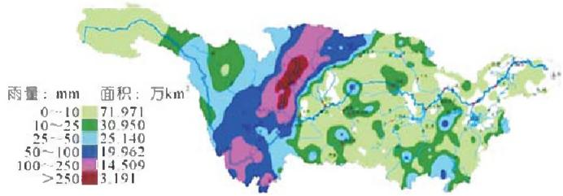  
图1 2020年8月14~18日长江流域降雨  
Fig.1 Rainfall map of the Yangtze River Basin (Aug.14-18,2020)

# 2 2020年三峡库区干流淤积变化新特点

通过对实测资料的整理和分析，2020年三峡库区干流淤积主要呈现以下几方面特点：

（1）三峡库区淤积量较往年明显偏大。从三峡水库  $175\mathrm{m}$  试验性蓄水以来库区总淤积量变化来看（见图2），在  $175\mathrm{m}$  试验性蓄水初期  $2008\sim 2013$  年，库区淤积量较大，年均淤积量为1.353亿  $\mathrm{m}^3$  ；2013年以后，受上游水库群蓄水拦沙的影响，三峡入库沙量大幅减少，库区泥沙淤积显著减小，2015年甚至表现为冲刷（含河道采砂影响）。

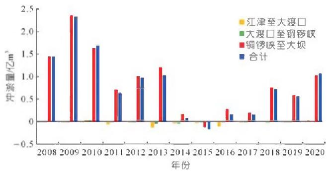  
图2试验性蓄水以来三峡水库干流淤积量年际变化  
Fig. 2 Interannual variation of sediment deposition in the main stream of the Three Gorges Reservoir since experimental impoundment

2020年，受长江上游地区暴雨洪水影响，三峡水库入库沙量剧增，其入库沙量达到1.94亿t，较2003

$\sim 2019$  年和  $2013\sim 2019$  年均值分别偏多  $30\%$  和  $171\%$  。入库沙量增多导致三峡库区淤积显著，2020年三峡库区干流淤积泥沙1.066亿  $\mathfrak{m}^3$  。淤积主要集中在铜锣峡以下至大坝河段，共淤积1.030亿  $\mathfrak{m}^3$  ，占干流总淤积量的  $96.7\%$  。

(2) 库尾河段较往年淤积明显。2003 年以来, 随着三峡水库蓄水运用, 回水范围逐渐向上游延伸, 奉节至丰都段泥沙淤积占总淤积量的比例逐渐增加, 大坝至奉节段泥沙淤积占总淤积量的比例则逐渐减小, 库区泥沙淤积逐渐向上游发展, 如图 3 所示。三峡水库  $175 \mathrm{~m}$  试验性蓄水运行以来, 受入库沙量大幅减小、河道采砂和水库调度等影响, 水库变动回水区总体表现为冲刷, 泥沙淤积主要集中在涪陵以下的常年回水区, 其中, 变动回水区 (江津至涪陵段) 累计冲刷泥沙 0.751 亿  $\mathrm{m}^{3}$ , 而常年回水区则淤积泥沙 17.937 亿  $\mathrm{m}^{3}$  。

2020年，受上游支流岷江、沱江、嘉陵江来沙增大影响，且汛期坝前调洪水位较高，导致三峡库区库尾河段发生淤积，铜锣峡以上河段河床淤积泥沙353万 $\mathbf{m}^3$ ，其中江津至大渡口段、大渡口至铜锣峡段分别淤积255万 $\mathbf{m}^3$ 和98万 $\mathbf{m}^3$ ，分别占三峡库区总淤积量的 $2.4\%$ 和 $0.9\%$ （见图3）。

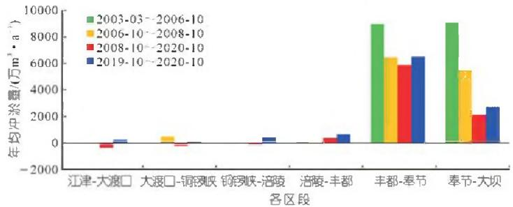  
图3三峡水库库区各段泥沙年均淤积量对比  
Fig.3 Comparison of average annual sediment deposition in different sections of the Three Gorges Reservoir Area

（3）三峡水库干流防洪库容内淤积量增多，淤积主要集中在涪陵-万县段。2003~2019年，三峡水库干流防洪库容内累计淤积泥沙11607万  $\mathbf{m}^3$  ，自2013年以来，三峡水库防洪库容内整体呈现冲刷态势，年均冲刷量1156万  $\mathbf{m}^3$  （见图4）。2020年，三峡库区干流防洪库容内淤积泥沙2440万  $\mathbf{m}^3$  ，为三峡水库  $175\mathrm{m}$  试验性蓄水以来最大值，占2020年  $175\mathrm{m}$  以下总淤积量的  $23\%$  ，且淤积主要集中在涪陵-万县河段。  
（4）三峡水库坝前河段淤积强度明显增大。从三峡库区不同河段年均冲淤强度对比来看（见表2），2020年三峡库区铜锣峡以下河段泥沙淤积分布与往年基本一致，淤积主要集中在坝前段以及丰都至奉节段，分别淤积泥沙1620万  $\mathbf{m}^3$  和7180万  $\mathbf{m}^3$  。

从年际间淤积强度变化来看，2020年三峡库区近

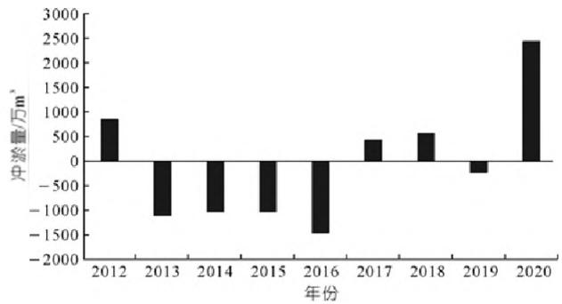  
图4三峡水库静防洪库容淤积量年际变化  
Fig.4 Interannual variation of static flood control capacity and sedimentation of Three Gorges Reservoir

坝段大坝至庙河段淤积强度最大，达到107.2万 $\mathbf{m}^3 /(\mathbf{km}\cdot \mathbf{a})$  ，较2003\~2019年均值偏大  $53\%$  ，较2008\~2019年均值偏大  $161\%$  。坝前局部最大淤积强度为342万  $\mathbf{m}^3 /(\mathbf{km}\cdot \mathbf{a})$  ，且越靠近坝前越大；其次为丰都至铜锣峡河段，2020年该河段年均淤积强度达到6.6万  $\mathbf{m}^3 /(\mathbf{km}\cdot \mathbf{a})$  ，而此河段多年均值不足1万 $\mathbf{m}^3 /(\mathbf{km}\cdot \mathbf{a})$  。

表 2 三峡水库不同河段年均淤积强度  
Tab. 2 Average annual siltation intensity in different reaches  

<table><tr><td rowspan="2">时段</td><td colspan="3">of the Three Gorges Reservoir</td><td>\( \overline{\mathbf{m}}^3/(km \cdot a) \)</td></tr><tr><td>大坝-庙河(15.1 km)</td><td>庙河-奉节(156 km)</td><td>奉节-丰都(260.3 km)</td><td>丰都-铜锣峡(166.5 km)</td></tr><tr><td>2003~2019年</td><td>70.1</td><td>17.1</td><td>24.2</td><td>0.7</td></tr><tr><td>2008~2019年</td><td>41.3</td><td>9.4</td><td>22.4</td><td>0.5</td></tr><tr><td>2020年</td><td>107.2</td><td>6.9</td><td>25.0</td><td>6.6</td></tr></table>

# 3 2020年三峡库区泥沙淤积变化原因分析

2020年，三峡库区泥沙淤积量较往年明显偏大，且呈现出库尾河段淤积、防洪库容内淤积量偏大、坝前河段淤积强度增大等新特点，这些均与三峡库区2020年特殊的水沙情势直接相关。

（1）汛期入库沙量偏大，是库区淤积量较往年明显偏大的主要原因。2020年受长江上游地区暴雨影响，三峡水库入库沙量剧增。汛期6月10日至9月10日入库沙量1.85亿t，为2012年以来入库沙量最大值（见表3）。2020年汛期入库沙量主要集中在8月份，其入库沙量达到1.41亿t，占全年入库沙量的  $72\%$  。且8月份汛期入库沙峰与汛期高水位遭遇，造成库区淤积较大。  
（2）库区水位偏高，高水位持续时间长，导致三峡库区泥沙淤积严重，且库尾河段和防洪库容内淤积较往年明显偏多。2020年8月，长江上游接连形成2020年第4号和第5号洪水，寸滩站洪峰流量分别达到 $57600\mathrm{m}^3 /\mathrm{s}$  和  $77400\mathrm{m}^3 /\mathrm{s}$  。受连续大洪水入库影响，三峡水库水位持续攀升，8月22日坝前水位上升至主汛期最高的  $167.65\mathrm{m}$  ，为三峡水库建库以来最高

调洪水位。2020年7月坝前平均水位  $155.83\mathrm{m},8$  月坝前平均水位更是达到  $160.49\mathrm{m}$  ，均为2012年以来同期最高月均水位(见表4)。

表 3 汛期三峡水库入库沙量统计  
Tab.3 Statistics of sediment inflow into the Three Gorges Reservoir in flood season  

<table><tr><td>年份</td><td>汛期沙量/万t(6.10~9.10)</td><td>8月沙量/万t</td><td>全年沙量/万t</td><td>汛期来沙占比/%</td><td>8月份来沙占比/%</td></tr><tr><td>2012</td><td>18230</td><td>3197</td><td>21898</td><td>83</td><td>15</td></tr><tr><td>2013</td><td>12037</td><td>1046</td><td>12684.3</td><td>95</td><td>8</td></tr><tr><td>2014</td><td>3250</td><td>1360</td><td>5544</td><td>59</td><td>25</td></tr><tr><td>2015</td><td>2407</td><td>860</td><td>3202</td><td>75</td><td>27</td></tr><tr><td>2016</td><td>3280</td><td>453</td><td>4215</td><td>78</td><td>11</td></tr><tr><td>2017</td><td>2604</td><td>1499</td><td>3438</td><td>76</td><td>44</td></tr><tr><td>2018</td><td>13482</td><td>1703</td><td>14289</td><td>94</td><td>12</td></tr><tr><td>2019</td><td>4916</td><td>2618</td><td>6851</td><td>72</td><td>38</td></tr><tr><td>2020</td><td>18491</td><td>14054</td><td>19394</td><td>95</td><td>72</td></tr></table>

表 4 汛期三峡水库坝前月均水位  
Tab.4 Monthly average water level in front of the dam of Three Gorges Reservoir in flood season m  

<table><tr><td>年份</td><td>6月</td><td>7月</td><td>8月</td><td>9月</td><td>最高水位</td></tr><tr><td>2012</td><td>146.94</td><td>155.26</td><td>152.89</td><td>163.07</td><td>162.95</td></tr><tr><td>2013</td><td>146.51</td><td>150.08</td><td>149.33</td><td>160.67</td><td>155.78</td></tr><tr><td>2014</td><td>146.19</td><td>147.62</td><td>151.42</td><td>165.22</td><td>163.24</td></tr><tr><td>2015</td><td>148.69</td><td>145.90</td><td>148.25</td><td>159.38</td><td>153.00</td></tr><tr><td>2016</td><td>146.01</td><td>153.32</td><td>147.24</td><td>151.17</td><td>158.44</td></tr><tr><td>2017</td><td>146.13</td><td>151.45</td><td>147.10</td><td>159.35</td><td>156.81</td></tr><tr><td>2018</td><td>146.17</td><td>150.81</td><td>152.37</td><td>156.75</td><td>156.73</td></tr><tr><td>2019</td><td>146.09</td><td>148.45</td><td>147.05</td><td>154.22</td><td>155.55</td></tr><tr><td>2020</td><td>146.59</td><td>155.83</td><td>160.49</td><td>158.40</td><td>167.65</td></tr><tr><td>多年平均</td><td>146.55</td><td>150.43</td><td>150.41</td><td>158.15</td><td>-</td></tr></table>

除库区水位偏高外，高水位持续时间也较长。如表5所列，为2020年三峡库区高水位持续时间统计表。2020年汛期，三峡水库坝前水位在  $150\mathrm{m}$  以上天数为  $62\mathrm{d}$ ，坝前水位在  $155\mathrm{m}$  以上天数为  $55\mathrm{d}$ ，坝前水位在  $160\mathrm{m}$  以上天数也达到  $31\mathrm{d}$  之久，甚至有  $4\mathrm{d}$  水位在  $165\mathrm{m}$  以上，高水位持续时间远超过历史同期。汛期水位高，高水位持续时间长，导致2020年三峡库区泥沙淤积严重，且库尾河段和防洪库容内淤积较往年明显偏多。

表 5 汛期三峡水库坝前高水位持续时间  
Tab.5 Duration of high water level in front of Three Gorges Dam in flood season d  

<table><tr><td>年份</td><td>坝前水位高于150m天数</td><td>坝前水位高于155m天数</td><td>坝前水位高于160m天数</td><td>坝前水位高于165m天数</td></tr><tr><td>2012</td><td>56</td><td>39</td><td>8</td><td>0</td></tr><tr><td>2013</td><td>31</td><td>6</td><td>0</td><td>0</td></tr><tr><td>2014</td><td>34</td><td>13</td><td>9</td><td>0</td></tr><tr><td>2015</td><td>32</td><td>3</td><td>0</td><td>0</td></tr><tr><td>2016</td><td>30</td><td>9</td><td>0</td><td>0</td></tr><tr><td>2017</td><td>33</td><td>5</td><td>0</td><td>0</td></tr><tr><td>2018</td><td>57</td><td>10</td><td>0</td><td>0</td></tr><tr><td>2019</td><td>11</td><td>3</td><td>0</td><td>0</td></tr><tr><td>2020</td><td>62</td><td>55</td><td>31</td><td>4</td></tr></table>

三峡水库有效库容损失与上游来水来沙、水库调度、人类活动等密切相关。上游来水越大、来沙越多，干流防洪库容内泥沙淤积量也相对较大，汛期坝前水位的上浮一定程度也增加了防洪库容内的泥沙淤积，特别是在入库洪峰流量较大，如2012年寸滩站洪峰流量达  $63200\mathrm{m}^3/\mathrm{s}$ ，坝前最高水位上浮至  $162.95\mathrm{m}$ ，防洪库容内泥沙淤积量达855万  $\mathrm{m}^3$ ；2020年汛期寸滩站洪峰流量更是达到  $77400\mathrm{m}^3/\mathrm{s}$ ，坝前最高调洪水位上浮至  $167.65\mathrm{m}$ ，防洪库容内泥沙淤积量达到2443万  $\mathrm{m}^3$ （见表6）。2020年汛期防洪库容内泥沙淤积较明显的大多位于库区重点淤积河段（万县至涪陵河段），防洪库容内淤积变化较大的典型断面见图5。此外，入库沙量较少时，即使坝前最高水位上浮较多，对防洪库容泥沙淤积影响不大，如2014年入库径流量3820亿  $\mathrm{m}^3$ ，汛期最高洪水位达到  $163.24\mathrm{m}$ （9月6日），汛期平均水位  $150.06\mathrm{m}$ ，同时入库沙量较少，仅为5544万  $\mathrm{t}$ ，防洪库容内河床冲刷1030万  $\mathrm{m}^3$ 。

表 6 三峡库区干流防洪库容泥沙淤积统计  
Tab. 6 Statistics of flood control storage capacity and sediment deposition in main stream of Three Gorges Reservoir Area  

<table><tr><td rowspan="2">年份</td><td rowspan="2">年入库径流量/
亿m³</td><td rowspan="2">年入库
沙量/万t</td><td rowspan="2">汛期沙量在全年
中占比/%</td><td colspan="2">汛期坝前水位/m</td><td rowspan="2">寸滩洪峰流量/
(m³·s-1)</td><td rowspan="2">防洪库容内淤积量/
万m³</td></tr><tr><td>平均</td><td>最高</td></tr><tr><td>2012</td><td>4166</td><td>21898</td><td>83</td><td>152.51</td><td>162.95</td><td>63200</td><td>855</td></tr><tr><td>2013</td><td>3345</td><td>12684</td><td>95</td><td>149.14</td><td>155.78</td><td>44100</td><td>-1108</td></tr><tr><td>2014</td><td>3820</td><td>5544</td><td>59</td><td>150.06</td><td>163.24</td><td>29400</td><td>-1030</td></tr><tr><td>2015</td><td>3358</td><td>3202</td><td>75</td><td>147.89</td><td>153.00</td><td>28800</td><td>-1030</td></tr><tr><td>2016</td><td>3719</td><td>4215</td><td>78</td><td>148.86</td><td>158.44</td><td>27500</td><td>-1455</td></tr><tr><td>2017</td><td>3728</td><td>3438</td><td>76</td><td>148.74</td><td>156.81</td><td>29100</td><td>434</td></tr><tr><td>2018</td><td>4294</td><td>14289</td><td>94</td><td>150.21</td><td>156.73</td><td>57100</td><td>569</td></tr><tr><td>2019</td><td>4016</td><td>6851</td><td>72</td><td>147.18</td><td>155.55</td><td>41200</td><td>-233</td></tr><tr><td>2020</td><td>4733</td><td>19400</td><td>95</td><td>155.49</td><td>167.65</td><td>77400</td><td>2443</td></tr></table>

注：表中汛期为6月10日至9月10日；2014年汛期坝前最高水位 $163.24\mathrm{m}$  为9月6日（此时库区来沙较少）。

近几年，三峡水库实施了消落期库尾减淤调度，尽可能多地将库尾淤积的泥沙输移至常年回水区，对于减少防洪库容内泥沙淤积是有利的，2012，2013，2015，2019年分别实施了库尾减淤调度，汛前消落期间，重庆主城区河段分别冲刷了302万，330万，251万，139万  $\mathbf{m}^3$  ，铜锣峡至涪陵河段分别冲刷了540万，867万，1237万，141万  $\mathbf{m}^3$  。

（3）汛期沙峰排沙调度。2020年汛期，在水情预报和泥沙预报的基础上，综合考虑上下游防洪压力，开展了汛期沙峰排沙调度：自8月18日起，三峡水库下泄流量由  $44000\mathrm{m}^3 /\mathrm{s}$  增大至  $49000\mathrm{m}^3 /\mathrm{s};8$  月22日坝前最高调洪水位达  $167.65\mathrm{m}$  ，后基本维持下泄流量在  $48000\mathrm{m}^3 /\mathrm{s}$  直至25日；之后为减轻长江中下游防洪压力，保障两坝间通航安全，三峡水库下泄流量逐渐减小，27日减小至  $34000\mathrm{m}^3 /\mathrm{s}$  左右。

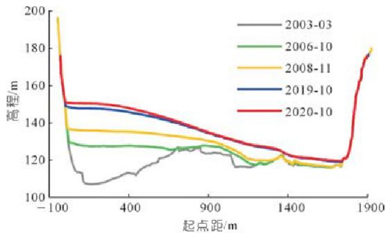  
(a)S206断面(黄花城河段)

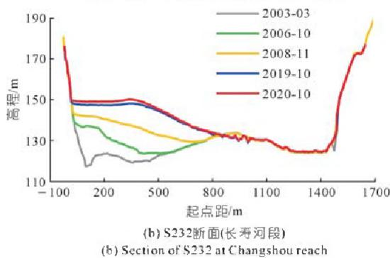  
(a) Section of S206 at Huanghuacheng reach  
图5 2020年三峡库区防洪库容内泥沙淤积明显的典型断面  
Fig.5 Typical section with obvious sediment deposition in the flood control capacity of the Three Gorges Reservoir Area in 2020

从2020年汛期库区洪峰沙峰传播过程与坝前水位变化来看（见图6），其中巴东站无流量数据，在沙峰到达清溪场站时（8月20日），坝前水位在160m左右；当沙峰传播至万县站时（8月22日），坝前水位已涨至167.65m；直至沙峰到达坝前（8月26日），坝前水位均在163.56m以上。可见，在沙峰自清溪场站一直传播至坝前这段时间内，库区水位持续偏高，造成清溪场以下河段泥沙淤积较严重。

从出库含沙量过程来看，黄陵庙站8月26日才出现沙峰（峰值含沙量  $0.928\mathrm{kg} / \mathrm{m}^3$ ），8月30日含沙量降至  $0.5\mathrm{kg} / \mathrm{m}^3$  以下，至9月8日排沙过程才完全结束（含沙量小于  $0.1\mathrm{kg} / \mathrm{m}^3$ ）。对比三峡水库流量下泄过程（见图7），由于受航运及下游防洪压力的影响，8月25日三峡水库下泄流量由  $48000\mathrm{m}^3 /\mathrm{s}$  开始减小，26日减小至  $44000\mathrm{m}^3 /\mathrm{s}$ ，27日减小至  $38000\mathrm{m}^3 /\mathrm{s}$ ，28日减小至  $34000\mathrm{m}^3 /\mathrm{s}$ ，而这段时间正是沙峰到达坝前的时间，下泄流量减小导致大量含沙水流未能及时排出库外，造成坝前河段淤积严重。

可见，虽然2020年汛期通过沙峰排沙调度一定程度上增大了水库排沙，但是受限于上下游防洪压力，库区内水位仍维持在一个较高水平，尤其是沙峰在库区输移这段时间，库区水位偏高，造成泥沙落淤严重。在沙峰到达坝前时水库下泄流量已经开始减小，造成库区排沙不充分，泥沙在坝前河段落淤。

  
(a)寸滩站

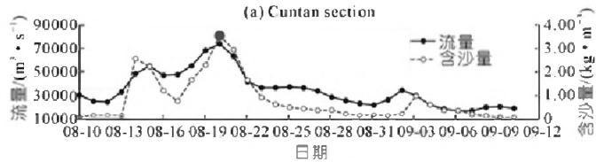  
(b) 清溪场站

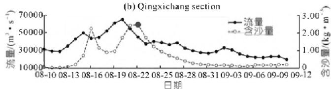  
(c)万县站

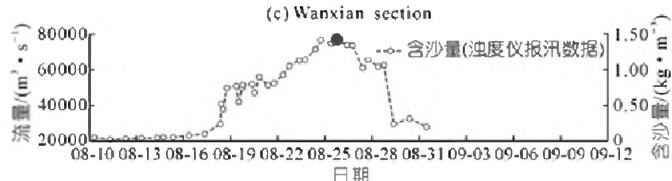

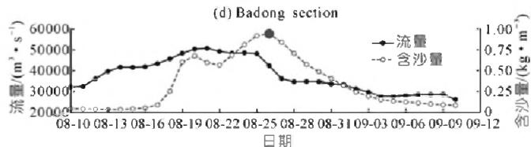  
(d)巴东站  
(e)庙河站

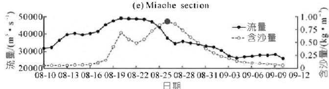

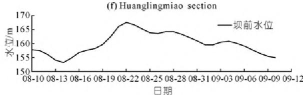  
(1)黄陵庙站  
(g)坝前水位  
(g) Water level before dam site  
图62020年汛期三峡库区洪峰沙峰传播过程及坝前水位变化

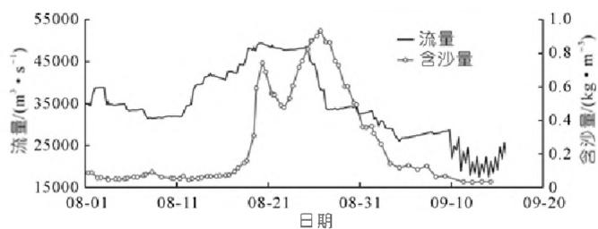  
Fig.6 Propagation process of flood peak and sediment peak and water level in front of the dam in the Three Gorges  
Reservoir Area in flood season of 2020  
图7 2020年长江4、5号洪水黄陵庙站流量和含沙量过程  
Fig.7 Discharge and sediment concentration process at Huanglingmiao Station for No.4 and No.5 Yangtze River floods in 2020

# 4 结论

（1）2020年，长江上游来水来沙偏多显著。三峡水库入库径流量4733亿  $\mathrm{m}^3$  ，较  $2003\sim 2019$  年均值偏丰  $29\%$  ；入库沙量1.94亿t，较  $2003\sim 2019$  和  $2013\sim$  2019年均值分别偏多了  $30\%$  和  $171\%$  。泥沙主要来自嘉陵江和岷江，分别占入库总沙量的  $46\%$  和  $34\%$  。  
(2) 2020年, 三峡库区干流累计淤积泥沙10657万  $\mathrm{m}^3$ , 较2008年以来多年均值偏多  $9\%$ , 且库尾河段和防洪库容内淤积占比均较往年显著偏多。铜锣峡以上河段淤积353万  $\mathrm{m}^3$ , 占三峡库区总淤积量的  $3\%$ ; 防洪库容内淤积泥沙达2440万  $\mathrm{m}^3$ , 为三峡水库  $175\mathrm{m}$  试验性蓄水以来最大值, 占  $175\mathrm{m}$  以下总淤积量的  $23\%$  。2020年三峡水库坝前河段淤积强度达到107.2万  $\mathrm{m}^3 /(\mathrm{km}\cdot \mathrm{a})$ , 较2008~2019年均值偏大  $161\%$ , 越靠近坝前淤积强度越大。  
(3) 2020年8月, 入库沙峰与高水位遭遇, 是造成库区淤积严重的主要原因。2020年三峡水库水位偏高, 坝前最高调洪水位达  $167.65 \mathrm{~m}$ , 且高水位持续时间长, 坝前水位高于  $160 \mathrm{~m}$  的滞洪时间长达  $31 \mathrm{~d}$ ; 同时入库沙量大, 2020年汛期三峡水库入库沙量1.85亿t, 其中8月份入库沙量就达到1.41亿t。受限于下游河段防洪压力, 汛期开展的沙峰排沙调度不充分, 一定程度上也造成坝前河段淤积。

综上，2020年水库泥沙淤积新特点主要是8月三峡水库上游嘉陵江、岷江等支流暴雨产沙导致入库沙量偏多与水库拦洪导致坝前水位偏高所致，建议进一

步加强长江上游暴雨产输沙特性以及泥沙实时监测与预报研究，进一步提高泥沙预报精度和预见期，为三峡水库科学调度提供更有力的技术支撑。

# 参考文献：

[1] 韩其为, 杨小庆. 我国水库泥沙淤积研究综述[J]. 中国水利水电科学研究院学报, 2003, 1(3): 169-178.  
[2] 胡春宏. 三峡水库  $175 \mathrm{~m}$  试验性蓄水十年泥沙冲淤变化分析[J]. 水利水电技术, 2019, 50(8): 18-26.  
[3] 卢金友, 董耀华, 黄悦. 三峡水库蓄水运用以来水库淤积和坝下游河道冲刷初步分析 [C]//水电2016国际研讨会论文集, 昆明, 2016.  
[4] 许全喜. 三峡水库蓄水以来水库淤积和坝下冲刷研究[J]. 人民长江, 2012, 43(7): 1-6.  
[5] 袁晶, 许全喜, 童辉. 三峡水库蓄水运用以来库区泥沙淤积特性研究[J]. 水力发电学报, 2013, 32(2): 139-145.  
[6] 李文杰, 杨胜发, 付旭辉, 等. 三峡水库运行初期的泥沙淤积特点 [J]. 水科学进展, 2015, 26(5): 676-685.  
[7] 雷雅文. 三峡水库变动回水区整体泥沙冲淤研究[J]. 人民长江, 2018, 49(增2):7-11.  
[8] 唐小娅, 童思陈, 许光祥, 等. 三峡水库汛期泥沙淤积对坝前水位的滞后响应[J]. 水科学进展, 2019, 30(4): 528-536.  
[9] 胡春宏. 我国多沙河流水库“蓄清排浑”运用方式的发展与实践 [J]. 水利学报, 2016, 47(3): 283-291.  
[10] 潘庆桑. 关于三峡水库排沙调度的建议[J]. 长江科学院院报, 2015, 32(12): 1-7.  
[11] 任实, 刘亮. 三峡水库泥沙淤积及减淤措施探讨[J]. 泥沙研究, 2019, 44(6):40-45.  
[12] 董炳江, 乔伟, 许全喜. 三峡水库汛期沙峰排沙调度研究与初步实践[J]. 人民长江, 2014, 45(3): 7-11.

（编辑：郑毅）

# 特邀作者简介

许金喜,男,1974年生,湖北新洲人,曾任长江水利委员会水文局副局长,现任长江水利委员会规划计划局局长,毕业于武汉大学,工学博士,正高级工程师,湖北省新世纪高层次人才工程第二层次人选,湖北省有突出贡献中青年专家。主要研究方向为长江水文泥沙、河道演变、泥沙监测与预报、水库调度、河道崩岸预警等;主持长江水科学研究联合基金、“973”项目课题、国家重点研发计划课题、水利部水利行业公益项目、三峡水库科学调度关键技术研究等30余项;发表论文100余篇,获省部级奖7项,国家发明专利3项,主编和参编专著10部、标准3部。E-mail:276596742@qq.com

# Study on characteristics and causes of sediment deposition in Three Gorges Reservoir in 2020

# XU Quanxi, YUAN Jing

(Bureau of Hydrology, Changjiang Water Resources Commission, Wuhan 430010, China)

Abstract: In the flood season of 2020, heavy rains and floods occurred frequently in the upper reaches of the Yangtze River, and the amount of sand entering the Three Gorges Reservoir had increased significantly with annual amount of 194 million tons. We first systematically analyze the features of water and sand variation in upper reaches of Changjiang River, and point out the new characteristics of sediment deposition of Three Gorges Reservoir in 2020: the amount of sediment deposition in the reservoir area was significantly larger than that in previous years. At the same time, the reservoir tail and flood control storage capacity had obvious deposition. Among them, the river section above Tongluoxia had changed from previous erosion to deposition with volume of 3. 53 million  $\mathfrak{m}^3$ , accounting for  $3\%$  of the total deposition volume in the Three Gorges Reservoir area; the Three Gorges Reservoir suffered the highest deposition of 24.4 million  $\mathfrak{m}^3$  in its flood control storage capacity since the  $175\mathrm{m}$  pilot impoundment; and the deposition intensity in front of the dam had increased significantly. Based on the systematic analysis on characteristics of water and sediment changes in the upper reaches of the Yangtze River, we summarize reasons of sedimentation in the Three Gorges Reservoir area in 2020, namely the heavy rain - induced sand yield in upper tributaries, such as Jialing River and Minjiang River, and the higher water level in front of dam site due to flood retention operation. The results provide more powerful technical support for the scientific operation of the Three Gorges Reservoir.

Key words: sediment transport volume; sediment deposition; reservoir tail reach; flood control storage capacity; deposition intensity; Three Gorges Reservoir

# （上接第6页）

# Study on river classification method and overview of river morphology science

DONG Yaohua $^{1}$ , WANG Xiuli $^{2}$

(1. Key Laboratory of River Regulation and Flood Control of the Middle and Lower Yangtze River of MWR, Changjiang River Scientific Research Institute, Wuhan 430010, China; 2. Library of Wuhan University, Wuhan 430072, China)

Abstract: Up to now, the academic community has conducted sufficient researches on river classification and segmentation, but there is still a lack of systematic analysis and unified understanding. In this paper, based on three river morphology elements of watershed basin, drainage network and mainstream channel, independent rivers and non - independent rivers as a method of river classification were firstly proposed. Then, comprehensive lists were ranked respectively for 55 independent rivers worldwide and for non - independent tributaries or drainage networks of the Yangtze River while a pedigree was summarized for all rivers or drainages of the Yangtze River. Finally, the river morphology science was preliminarily established and discussed. The research results were as follows: (1) Independent rivers follow principle of estuary priority while complexity of river morphology can be classified into compound watershed or drainage and complex mainstream channel. Based on approximate 0.5 power correlationship between river length and river basin area, 3 characteristic indexes of river morphology, namely river featured length, composite river basin area and river curved indicator were proposed. (2) By index of composite river basin area, the top 10 rivers worldwide are Rivers of Amazon, Nile, Congo, Ob, Yenise, Yangtze, Lena, Mississippi, Niger and Amur. While river numbers of summarized pedigree for all rivers or drainages of the Yagtze River are 1, 4, 9, 24, 49, 63, 374 and 581. (3) The river morphology science should include cornerstone researches of river classification, stream - order gradation and river segmentation, and researches on morphology of river channel. Study on river classification and establishment of river morphology science enable to fill researching gap between sciences of river geomorphology and fluvial processes, and gradually form researching system on river features of geometry - kinematics - dynamics corresponding to river morphology, fluvial processes and river mechanics.

Key words: river classification; independent river; river morphology science; watershed; drainage network; mainstream channel; estuary priority principle; composite river basin area; morphology of river channel