# 2020年长江中下游干流河道冲淤变化特点及分析

# 许金喜1,董炳江1,张为2

(1.长江水利委员会水文局，湖北武汉430010；2.武汉大学水资源与水电工程科学国家重点实验室，湖北武汉430072)

摘要：2020年汛期长江流域出现了历时长、范围广的强降雨过程，发生了新中国成立以来仅次于1954，1998年的罕见大洪水。基于现有资料，对2020年大洪水条件下长江中下游干流河道的冲淤变化特点进行了分析。结果表明：上游来沙和三峡水库出库泥沙明显增多是造成宜昌至湖口河段河床冲刷量偏小的原因之一，同时中下游干流洪水顶托严重，减小了宜昌至湖口河道的输沙能力；汛期长江中下游干流涨水较快，易造成河道泥沙落淤，汛后退水慢，河道泥沙得不到有效冲刷。湖口至江阴江段水面比降大，加之河道含沙量低，造成冲刷量偏大。研究成果为进一步深入研究长江中下游河道冲淤变化规律和未来冲淤趋势预测提供了基础和参考依据。

关键词：河道冲淤；洪水顶托；2020年长江洪水；长江中下游

中图法分类号：TV697 文献标志码：A

DOI: 10.16232/j.cnki.1001-4179.2021.12.001

# 0 引言

2020年汛期，长江流域出现了历时长、范围广的强降雨过程，发生了新中国成立以来仅次于1954年和1998年的流域性大洪水，7~8月份长江干流共发生5次编号洪水[1-3]。其中：长江干流（除枝城江段外）及鄱阳湖、洞庭湖（以下简称“两湖”）水位全线超警，中下游监利到大通河段主要控制站洪峰水位较高，位居历史最高水位第2~5位；九江站、湖口站洪峰水位居历史最高水位第2位（仅次于1998年）；马鞍山至镇江江段潮位超历史，高水位持续时间长，主要控制站超警戒水位累积天数达28~60d[4-6]。

三峡水库蓄水以来，受清水下泄、河道采砂等因素影响，长江中下游河段总体以冲刷为主，且强冲刷带向下游发展，城陵矶以下河段冲刷强度逐渐增大[7-9]。一般而言，在大洪水条件下，长江中下游河道多以冲刷为主[10-14]，如在2014，2016，2018年等典型大洪水年，宜昌至湖口河段平滩河槽冲刷分别达到了3.45亿，4.65亿，

2.82亿  $\mathrm{m}^3$  ，冲刷量均较多年均值显著偏大，且为滩槽均冲。2020年长江中下游干流发生罕见大洪水，但宜昌至湖口河段平滩河槽冲刷量仅为0.692亿  $\mathrm{m}^3$  ，相对该河段三峡水库蓄水以来年均冲刷量1.42亿  $\mathrm{m}^3$  而言，明显偏小，且滩地淤积泥沙较多；湖口至徐六泾河段冲刷量明显增加，平滩河槽冲刷量达到了2.33亿  $\mathrm{m}^3$  ，较该河段三峡水库蓄水以来年均冲刷量(1.14亿  $\mathrm{m}^3$  )偏大了1倍。

2020年汛期复杂的水情对长江中下游干流河道冲淤规律产生了一定的影响，河道冲淤规律较以往典型大洪水年呈现出不同的特点。基于此，本文对2020年大洪水条件下长江中下游干流河道的冲淤变化特点进行分析，并对其变化原因进行了初步研究，取得了一些新的认识，可为进一步深入研究长江中下游河道冲淤变化规律和未来冲淤趋势预测提供基础和参考依据。

# 1 长江中下游水沙情势和河道冲淤变化

# 1.1 水沙情势变化

长江中下游主要水文站径流量和输沙量对比见表1，

表 1 长江中下游主要水文站径流量和输沙量对比  
Tab. 1 Comparison of runoff and sediment discharge of main hydrological stations in the middle and lower reaches of the Yangtze River with annual average  

<table><tr><td rowspan="2">水文站</td><td colspan="5">径流量/亿m3</td><td colspan="5">输沙量/万t</td><td colspan="5">含沙量/(kg·m-3)</td></tr><tr><td>2002年前</td><td>2003~2012年</td><td>2013~2020年</td><td>2003~2020年</td><td>2020年</td><td>2002年前</td><td>2003~2012年</td><td>2013~2020年</td><td>2003~2020年</td><td>2020年</td><td>2002年前</td><td>2003~2012年</td><td>2013~2020年</td><td>2003~2020年</td><td>2020年</td></tr><tr><td>宜昌</td><td>4369</td><td>3978</td><td>4450</td><td>4188</td><td>5442</td><td>49200</td><td>4820</td><td>1830</td><td>3490</td><td>4680</td><td>1.130</td><td>0.121</td><td>0.041</td><td>0.083</td><td>0.086</td></tr><tr><td>枝城</td><td>4450</td><td>4093</td><td>4520</td><td>4283</td><td>5614</td><td>50000</td><td>5840</td><td>2180</td><td>4220</td><td>5510</td><td>1.120</td><td>0.143</td><td>0.048</td><td>0.098</td><td>0.098</td></tr><tr><td>沙市</td><td>3942</td><td>3758</td><td>4094</td><td>3907</td><td>4978</td><td>43400</td><td>6930</td><td>3080</td><td>5220</td><td>5870</td><td>1.100</td><td>0.184</td><td>0.075</td><td>0.134</td><td>0.118</td></tr><tr><td>监利</td><td>3576</td><td>3631</td><td>3965</td><td>3779</td><td>4750</td><td>35800</td><td>8360</td><td>4940</td><td>6840</td><td>7510</td><td>1.000</td><td>0.230</td><td>0.125</td><td>0.181</td><td>0.158</td></tr><tr><td>攀山</td><td>6460</td><td>5886</td><td>6643</td><td>6222</td><td>8156</td><td>40900</td><td>9650</td><td>6940</td><td>8440</td><td>9610</td><td>0.633</td><td>0.164</td><td>0.104</td><td>0.136</td><td>0.118</td></tr><tr><td>汉口</td><td>7111</td><td>6694</td><td>7224</td><td>6929</td><td>8794</td><td>39800</td><td>11400</td><td>7490</td><td>9670</td><td>8860</td><td>0.560</td><td>0.170</td><td>0.104</td><td>0.140</td><td>0.101</td></tr><tr><td>大通</td><td>9052</td><td>8376</td><td>9288</td><td>8782</td><td>11180</td><td>42700</td><td>14500</td><td>12000</td><td>13400</td><td>16400</td><td>0.472</td><td>0.173</td><td>0.129</td><td>0.153</td><td>0.147</td></tr></table>

径流量、年输沙量历年变化过程见图1。三峡水库蓄水前，宜昌、汉口、大通站多年平均径流量分别为4369亿，7111亿，9052亿  $\mathrm{m}^3$  ，输沙量分别为4.92亿，3.98亿，4.27亿t。三峡水库蓄水后，2003～2020年长江中下游各站除监利站水量较蓄水前偏丰  $6\%$  外，其他各站水量偏枯  $1\% \sim 4\%$  。由于水库上游来沙偏少和三峡水库拦沙作用，坝下游各站输沙量大幅减小，且减幅沿程递减。2003～2012年，宜昌、汉口、大通站年均输沙量分别为0.48亿，1.14亿，1.45亿t，较蓄水前分别偏少  $93\%$  ，  $75\%$  ，  $68\%$  ；金沙江下游梯级电站相继建成运用后，坝下游各站输沙量进一步减少，2013～2020年，宜昌、汉口、大通站年均输沙量分别仅为0.18亿，0.75亿，1.20亿t，较蓄水前分别偏少  $96\%$  ，  $81\%$  ，  $72\%$  。

2020年，宜昌、汉口、大通站径流量分别为5442亿，8794亿，11180亿  $\mathrm{m}^3$  ，与  $2003\sim 2019$  年均值相比，分别偏多  $32\%$  ，  $29\%$  ，  $29\%$  ；输沙量分别为0.47亿，0.89亿，1.64亿t，与  $2003\sim 2019$  年均值相比，分别偏多  $37\%$  、偏少  $9\%$  、偏多  $24\%$  。

# 1.2 河道冲淤情况

长江中下游干流河道上起宜昌，下迄长江河口原50号灯标，全长约  $1893\mathrm{km}$  。其中：宜昌至湖口河段为长江中游，长约  $955\mathrm{km}$  ；湖口至徐六泾河段为长江下游，长约  $756\mathrm{km}$  ，徐六泾以下为河口段，长约182 $\mathrm{km}$  。

三峡水库蓄水运用以来，大量泥沙拦蓄库内，出库沙量大幅减少，导致长江中下游河道产生长距离、长历时的河床冲刷调整。特别是2012年以来，三峡水库坝下游河道出现较强冲刷，宜昌至湖口河段2012年10月~2020年11月的平滩河槽年均冲刷量达到了1.82亿  $\mathrm{m}^3 /\mathrm{a}$  ，相较于2002年10月~2012年10月的年均冲刷量偏大了  $56\%$  。在特殊洪水年份，如2014，2016，2018年宜昌至湖口河段冲刷量明显增加，分别达到了3.45亿，4.65亿，2.82亿  $\mathrm{m}^3$  。同时坝下游冲刷逐渐向下游发展，城陵矶以下河段河床冲刷强度明显增大，目前河道冲刷已发展至河口。

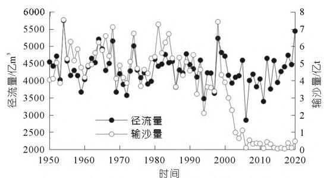  
(a)宜昌站

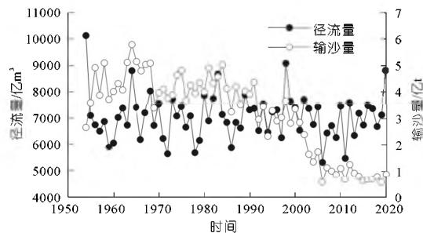  
(a) Yichang Station  
(b) 汉□站

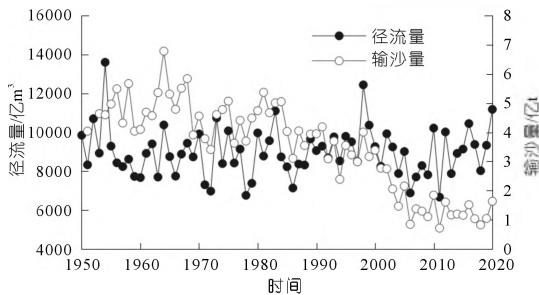  
(b) Hankou Station  
(c)大通站  
(c) Datong Station  
图1长江中下游主要水文站年径流量、年输沙量历年变化过程  
Fig.1 The annual runoff and sediment discharge of main hydrological stations in the middle and lower reaches of the Yangtze River

# 1.2.1 宜昌至湖口段

宜昌至湖口河段不同时期冲淤量对比见表2。三峡水库蓄水运用前（1975~2002年），宜昌至湖口河段平滩河槽总体冲刷1.69亿  $\mathrm{m}^3$  ，年均冲刷量仅0.063亿  $\mathrm{m}^3 /\mathrm{a}$  ，河段总体冲淤平衡。其中，  $1996\sim 1998$  年期间，宜昌至湖口河段平滩河槽共淤积泥沙1.99亿  $\mathrm{m}^3$

表 2 不同时段宜昌至湖口河段平滩河槽冲淤量对比  
Tab. 2 Comparison of erosion and deposition in bankfull channel of Yichang - Hukou reach in different periods  

<table><tr><td rowspan="2">河段</td><td colspan="9">总冲淤量/万m³</td><td colspan="9">年均冲淤强度/[万m³·(km·a)-1]</td></tr><tr><td>1975~1996</td><td>1996~1998</td><td>1998~2002</td><td>1975~2002</td><td>2002~2006-10</td><td>2006-10~2008-10</td><td>2008-10~2020-11</td><td>2019-10~2020-11</td><td>2002-10~2020-11</td><td>1975~1996</td><td>1996~1998</td><td>1998~2002</td><td>1975~2002</td><td>2002-10~2006-10</td><td>2006-10~2008-10</td><td>2008-10~2020-11</td><td>2019-10~2020-11</td><td>2002-10~2020-11</td></tr><tr><td>宜昌-枝城(60.8)</td><td>-13501</td><td>3448</td><td>-4347</td><td>-14400</td><td>-8138</td><td>-2230</td><td>-6051</td><td>222</td><td>-16419</td><td>-10.6</td><td>28.4</td><td>-17.9</td><td>-8.8</td><td>-33.5</td><td>-18.3</td><td>-8.3</td><td>3.7</td><td>-15.0</td></tr><tr><td>荆江(347.2)</td><td>-20360</td><td>745</td><td>-10189</td><td>-29804</td><td>-32830</td><td>-3569</td><td>-86547</td><td>-3782</td><td>-122946</td><td>-2.8</td><td>1.1</td><td>-7.3</td><td>-3.2</td><td>-23.6</td><td>-5.1</td><td>-20.8</td><td>-10.9</td><td>-19.7</td></tr><tr><td>城陵矶-汉口(251)</td><td>27380</td><td>-9960</td><td>-6694</td><td>10726</td><td>-5990</td><td>197</td><td>-46279</td><td>-1724</td><td>-52072</td><td>5.2</td><td>-19.8</td><td>-8.9</td><td>1.6</td><td>-4.8</td><td>0.4</td><td>-15.4</td><td>-6.9</td><td>-10.9</td></tr><tr><td>汉口-湖口(295.4)</td><td>24408</td><td>25632</td><td>-33433</td><td>16607</td><td>-14679</td><td>4693</td><td>-61394</td><td>-1635</td><td>-71380</td><td>3.9</td><td>43.4</td><td>-37.7</td><td>2.1</td><td>-9.9</td><td>7.9</td><td>-17.3</td><td>-5.5</td><td>-12.7</td></tr><tr><td>宜昌-湖口(954.4)</td><td>17927</td><td>19865</td><td>-54663</td><td>-16871</td><td>-61637</td><td>-909</td><td>-200271</td><td>-6919</td><td>-262817</td><td>0.9</td><td>10.4</td><td>-17.8</td><td>-0.7</td><td>-15.1</td><td>-0.5</td><td>-17.5</td><td>-7.2</td><td>-14.9</td></tr></table>

注：括号内为相应河段长度，km，下同；城陵矶至湖口河段2002年10月地形(断面)资料采用2001年10月资料。

年均淤积量为0.993亿  $\mathrm{m}^3 /\mathrm{a}$  。三峡水库蓄水运用后，2002年10月至2020年11月，宜昌至湖口河段平滩河槽总冲刷量为26.28亿  $\mathrm{m}^3$  ，年均冲刷量为1.424亿 $\mathrm{m}^3 /\mathrm{a}$  。断面表现为滩槽均冲，冲刷主要集中在枯水河槽，其冲刷量占平滩河槽冲刷量的  $92\%$  。在三峡水库围堰蓄水期，河段普遍冲刷，宜昌至枝城河段冲刷强度最大；在三峡水库初期运用期，河床略有冲刷；自三峡水库  $175\mathrm{m}$  试验性蓄水以来，坝下游河床冲刷强度明显增大，其年均冲刷泥沙1.669亿  $\mathrm{m}^3 /\mathrm{a}$  ，大于围堰蓄水期的1.438亿  $\mathrm{m}^3 /\mathrm{a}$  和初期蓄水期的0.045亿  $\mathrm{m}^3 /\mathrm{a}$  ，以荆江河段冲刷强度最大。

# 1.2.2 湖口至徐六泾段

湖口至江阴河段不同时期的冲淤量见表3。三峡水库蓄水运用之前（1975~2001年），湖口至江阴河段冲淤变化较小，平滩河槽总体淤积1.27亿 $\mathrm{m}^3$ ，年均淤积量为0.049亿 $\mathrm{m}^3/\mathrm{a}$ ，其中，1998年湖口至江阴河段冲刷1.75亿 $\mathrm{m}^3$ 。三峡水库蓄水运用以来以冲刷为主，2001年10月至2020年11月，平滩河槽冲刷泥沙16.23亿 $\mathrm{m}^3$ ，年均冲刷量达0.854亿 $\mathrm{m}^3/\mathrm{a}$ ，且主要集中在枯水河槽，占平滩河槽冲刷量的 $86\%$ 。

2001年10月至2020年11月，江阴至徐六泾河段累积冲刷5.41亿  $\mathrm{m}^3$  ，年均冲刷量为0.285亿  $\mathrm{m}^3 /\mathrm{a}$  。

# 1.2.3 长江河口段

三峡水库蓄水运用以来，2001年8月至2020年11月，南支河段累计冲刷3.84亿  $\mathrm{m}^3$  ，年均冲刷量为

0.202亿  $\mathrm{m}^3 /\mathrm{a}$  ；北支河段淤积2.98亿  $\mathrm{m}^3$  ，年均淤积量为0.157亿  $\mathrm{m}^3 /\mathrm{a}$  ，总体延续了三峡水库蓄水运用前长江口南支冲刷、北支淤积的趋势。

# 2 2020年长江中下游干流河道冲淤变化特点

2020年汛期复杂的水情对长江中下游干流河道冲淤规律产生了一定的影响，与以往典型大洪水年相比，宜昌至湖口河段冲刷量偏小，且滩地淤积偏多，而湖口至江阴河段冲刷量偏大，江阴以下河段则泥沙淤积。

# 2.1 宜昌至湖口河段

2019年10月至2020年11月，宜昌至湖口河段平滩河槽冲刷0.692亿  $\mathrm{m}^3$  ，较三峡蓄水以来多年冲刷均值(1.424亿  $\mathrm{m}^3/\mathrm{a}$  )偏少了  $51\%$  ，冲刷量较近年来的大洪水年2014年(3.453亿  $\mathrm{m}^3$  )、2016年(4.649亿  $\mathrm{m}^3$  )、2018年(2.818亿  $\mathrm{m}^3$  )显著偏小，而1998年大洪水期间该河段表现为淤积(1996～1998年共淤积1.99亿  $\mathrm{m}^3$  )。河床变化总体表现为“冲槽淤滩”，滩地淤积较以往更为明显，洪水河槽、枯水河槽分别冲刷了0.468亿，0.929亿  $\mathrm{m}^3$  ，滩地淤积泥沙0.461亿  $\mathrm{m}^3$  ，而三峡水库蓄水以来枯水河槽冲刷量占洪水河槽的  $92\%$  。

# 2.1.1 宜昌至城陵矶河段

2019年10月至2020年11月，宜昌至城陵矶河段平滩河槽冲刷0.356亿  $\mathrm{m}^3$  ，冲刷量偏少明显，仅为三峡水库蓄水以来年均冲刷量(0.774亿  $\mathrm{m}^3 /\mathrm{a}$  )的  $45\%$  ；且滩地泥沙淤积严重，洪水河槽、枯水河槽分别冲刷0.286亿，0.395亿  $\mathrm{m}^3$  ，滩地淤积泥沙0.109亿  $\mathrm{m}^3$  ，三

表 3 不同时段湖口至江阴河段平滩河槽冲淤量对比  
Tab. 3 Comparison of erosion and deposition in bankfull channel of Hukou - Jiangyin reach in different periods  

<table><tr><td rowspan="2">河段</td><td colspan="9">总冲淤量/万m³</td><td colspan="10">年均冲淤强度/[万m³·(km·a)-1]</td><td></td></tr><tr><td>1975~1997</td><td>1998~1998</td><td>1975~2001</td><td>2001~10~2006~10</td><td>2006~10~2011~10</td><td>2011~10~2016~10</td><td>2016~10~2020~11</td><td>2019~11~2020~11</td><td>2001~10~1997</td><td>1997~1998</td><td>1998~1998</td><td>1975~2001</td><td>2001~10~2006~10</td><td>2006~10~2011~10</td><td>2011~10~2016~10</td><td>2016~10~2020~11</td><td>2019~11~2020~11</td><td>2001~10~2020~11</td><td></td><td></td></tr><tr><td>湖口-大通(228.0)</td><td>26818</td><td>-13709</td><td>4773</td><td>17882</td><td>-7986</td><td>-7611</td><td>-21569</td><td>-10904</td><td>-4889</td><td>-48070</td><td>5.3</td><td>-60.1</td><td>7.0</td><td>3.0</td><td>-7.0</td><td>-6.7</td><td>-18.9</td><td>-12.0</td><td>-21.4</td><td>-11.1</td></tr><tr><td>大通-江阴(431.4)</td><td>11284</td><td>-3784</td><td>42654</td><td>-5154</td><td>-15087</td><td>-38150</td><td>-27109</td><td>-33855</td><td>-21478</td><td>-114201</td><td>1.2</td><td>-8.8</td><td>-9.8</td><td>-0.5</td><td>-7.0</td><td>-17.7</td><td>-12.6</td><td>-19.6</td><td>-49.8</td><td>-13.9</td></tr><tr><td>湖口-江阴(659.4)</td><td>38102</td><td>-17493</td><td>7881</td><td>12728</td><td>-23073</td><td>-45761</td><td>-48678</td><td>-44759</td><td>-26367</td><td>-162271</td><td>2.6</td><td>-26.5</td><td>-4.0</td><td>0.7</td><td>-7.0</td><td>-13.9</td><td>-14.8</td><td>-17.0</td><td>-40.0</td><td>-13.0</td></tr></table>

峡水库蓄水以来宜昌至城陵矶河段滩地年均冲刷0.113亿  $\mathrm{m}^3 /\mathrm{a}$  。从河道沿程冲淤变化看，宜昌至城陵矶河段表现为“两端淤、中间冲”，其中：宜昌至枝城河段淤积0.022亿  $\mathrm{m}^3$  ，枝城至调关河段冲刷0.419亿 $\mathrm{m}^3$  ，调关以下河段淤积0.041亿  $\mathrm{m}^3$  （见图2\~3）。

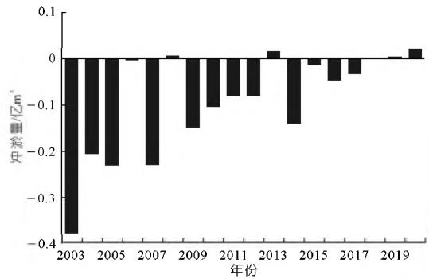  
图2三峡水库蓄水后宜昌－枝城河段平滩河槽年际冲淤量变化过程

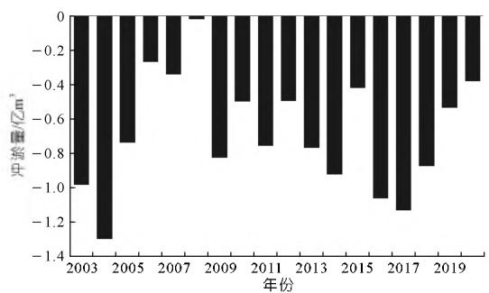  
Fig. 2 Variation process of interannual erosion and deposition in bankfull channel of Yichang-Zhicheng reach after Three Gorges Reservoir impoundment  
图3三峡水库蓄水后荆江河段平滩河槽年际冲淤量变化过程  
Fig.3 Variation process of interannual erosion and deposition in bankfull channel of Jingjiang reach after Three Gorges Reservoir impoundment

# 2.1.2 城陵矶至汉口河段

2019年10月至2020年11月，城陵矶至汉口河段平滩河槽冲刷0.172亿  $\mathrm{m}^3$  ，仅为三峡水库蓄水以来年均冲刷量(0.274亿  $\mathrm{m}^3/\mathrm{a}$  )的  $63\%$  ，与2014,2016,2018年大洪水年冲刷量(分别为1.41亿,2.19亿,0.78亿  $\mathrm{m}^3$  )相比，冲刷强度显著偏小(见图4)；且滩地泥沙淤积严重，洪水河槽、枯水河槽分别冲刷0.0653亿，0.1740亿 $\mathrm{m}^3$  ，滩地淤积泥沙0.109亿  $\mathrm{m}^3$  ，而三峡水库蓄水以来城陵矶至汉口河段滩地年均冲刷0.044亿  $\mathrm{m}^3/\mathrm{a}$  。从河道沿程冲淤变化看，除界牌河段和武汉上段淤积明显外，白螺矶、陆溪口、嘉鱼和箴洲河段均为冲刷。

# 2.1.3 汉口至湖口河段

2019年10月至2020年11月，汉口至湖口河段平滩河槽冲刷0.164亿  $\mathrm{m}^3$  ，仅为三峡水库蓄水以来年均冲刷量(0.376亿  $\mathrm{m}^3 /\mathrm{a}$  )的  $44\%$  ；与2014，2016，2018

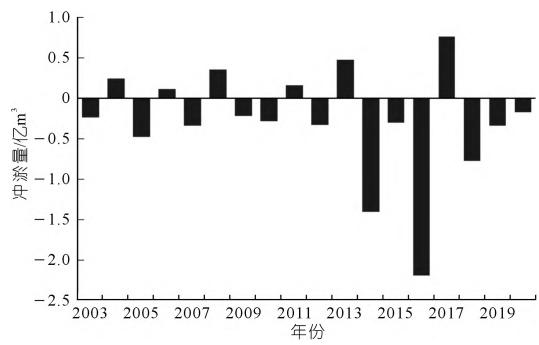  
图4三峡水库蓄水后城陵矶至汉口河段平滩河槽年际冲淤量变化过程  
Fig.4 Variation process of interannual erosion and deposition in bankfull channel of Chenglingji - Hankou reach after Three Gorges Reservoir impoundment

年大水年冲刷量（分别为0.985亿，1.350亿，1.170亿 $\mathrm{m}^3$ ）相比，冲刷强度显著偏小（见图5）；且滩地泥沙淤积严重，洪水河槽、枯水河槽分别冲刷0.116亿，0.360亿 $\mathrm{m}^3$ ，滩地淤积泥沙0.244亿 $\mathrm{m}^3$ ，而三峡蓄水以来汉口至湖口河段滩地年均冲刷0.064亿 $\mathrm{m}^3/\mathrm{a}$ 。从河道沿程冲淤变化看，张家洲、韦源口、叶家洲、龙坪等较宽河段淤积明显，武汉下段、团风、黄州、戴家洲、黄石、田家镇、九江河段等均为冲刷。

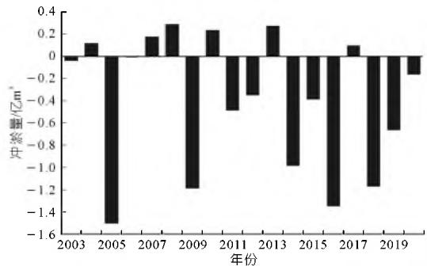  
图5三峡水库蓄水后汉口至湖口河段平滩河槽年际冲淤量变化过程  
Fig.5 Variation process of interannual erosion and deposition in bankfull channel of Hankou-Hukou reach after Three Gorges Reservoir impoundment

# 2.2 湖口至江阴河段

2019年11月至2020年11月，湖口至江阴河段冲刷明显，平滩河槽冲刷2.64亿  $\mathrm{m}^3$  ，冲刷强度较三峡水库蓄水以来多年冲刷均值(0.854亿  $\mathrm{m}^3/\mathrm{a}$  )显著增大，较1998年(1.75亿  $\mathrm{m}^3$  )偏多  $51\%$  ；冲刷主要位于枯水河槽，洪水河槽、枯水河槽分别冲刷2.85亿，2.35亿  $\mathrm{m}^3$  ；且大通以下的冲刷量远大于大通以上河段。其中：湖口至大通河段平滩河槽冲刷0.489亿  $\mathrm{m}^3$  ，三峡水库蓄水以来该河段多年冲刷均值为0.253亿  $\mathrm{m}^3/\mathrm{a}$  ，洪水河槽、枯水河槽分别冲刷0.508亿，0.456亿  $\mathrm{m}^3$  ，

枯水河槽占总冲刷量的  $90\%$  。从河道沿程冲淤变化看，除安庆河段淤积外，其他河段均为冲刷。

大通至江阴河段平滩冲刷2.15亿  $\mathrm{m}^3$  ，远大于该河段三峡水库蓄水以来年均冲刷量0.601亿  $\mathrm{m}^3 /\mathrm{a}$  ，洪水河槽、枯水河槽分别冲刷2.35亿，1.89亿  $\mathrm{m}^3$  ，枯水河槽占总冲刷量的  $80\%$  。从河道沿程冲淤变化看，除南京河段淤积外，其他河段均为冲刷，特别是铜陵至马鞍山河段冲刷明显，占大通至江阴河段冲刷量的  $83\%$  （河道长度占  $40\%$  ）。

# 2.3 江阴至长江口河段

2019年11月至2020年11月，江阴至长江口河段淤积明显， $0\mathrm{m}$  以下河槽淤积泥沙0.778亿 $\mathrm{m}^3$ ，而三峡水库蓄水以来该河段年均冲刷量为0.330亿 $\mathrm{m}^3/\mathrm{a}$ ，其中，澄通、南支、北支河段分别淤积泥沙0.307亿，0.178亿，0.293亿 $\mathrm{m}^3$ 。

# 3 2020年长江中下游河道冲淤变化原因分析

（1）汛期三峡水库出库沙量显著增多，是造成宜昌至湖口河段河床冲刷量偏小的原因之一。2020年8月中旬，长江流域上游发生集中性强降雨，接连形成4，5号洪水，强降雨带主要位于岷江、沱江和嘉陵江等主要产沙区，岷江高场站、沱江富顺站、嘉陵江支流涪江小河坝站最大含沙量分别达到5.62，16.3，17.8kg/m³。经估计，8月13~23日洪水期间，三峡入库沙量达到1.27亿t，短短12d的输沙量已远大于2014~2017年和2019年全年入库输沙量(0.320亿~0.685亿t)。期间三峡水库进行了沙峰排沙调度，沙峰过程排沙比仍达到了27%，大量泥沙被下泄至坝下游河道[15]。

2020年，三峡水库出库宜昌站沙量达到了0.468亿t，较2003～2019年均值偏多  $37\%$  ，较2013～2019年均值偏多  $227\%$  ，为试验性蓄水以来最大值，见图1(a)。三峡水库出库沙量偏多，尤其是大量泥沙集中在汛期7～9月份输送至坝下游河段，这是造成2020年宜昌至湖口河段河床冲刷量偏小的原因之一。

此外，2020年三峡水库沙峰调度期间，出库宜昌站最大含沙量达到了  $0.872\mathrm{kg} / \mathrm{m}^3$  （8月26日），但在出库沙峰最大时水库下泄流量由  $48000\mathrm{m}^3 /\mathrm{s}$  快速减小至了  $34000\mathrm{m}^3 /\mathrm{s}$  （见图6），坝下游含沙量较大，而流量相对较小，导致宜昌至枝城河段出现淤积，其平滩河槽淤积泥沙0.022亿  $\mathrm{m}^3$  。

（2）汛期长江中下游洪峰水位高、高水位持续时间长，对宜昌至湖口河段泥沙输移能力造成显著影响，高水条件下也造成该河段边滩泥沙淤积显著增多。2020年汛期，受持续强降雨影响，长江中下游河段水位全线偏高。长江中下游干、支流主要控制站洪峰特征值及历

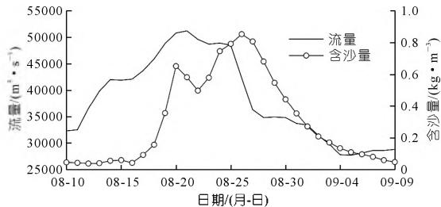  
图62020年长江4,5号洪水期间宜昌站泄流量和含沙量过程  
Fig. 6 Flow and sediment concentration process of Yichang Station during flood No. 4 and 5 of Yangtze River in 2020

史排位统计见表4。长江干流沙市以下江段全线超警，各站最大超警幅度  $0.36\sim 2.81\mathrm{m}$  ，以九江站超警2.81 $\mathrm{m}$  为最。长江干流监利站最高水位  $37.30\mathrm{m}$  ，超保证 $0.07\mathrm{m}$  ；莲花塘站最高水位  $34.59\mathrm{m}$  ，超保证  $0.19\mathrm{m}$  。除沙市站外，石首至大通江段各站洪峰水位居第  $2\sim 5$  位，马鞍山至镇江江段(感潮江段)各站最高潮位均居历史第1位。长江中下游干流监利以下江段超警天数  $28\sim$ $59\mathrm{d}$  ，以莲花塘站的  $59\mathrm{d}$  为最，莲花塘站超保天数为6d。与1998年相比，2020年中下游干流大通以上江段洪峰水位偏低，马鞍山至镇江江段最高潮水位偏高。2020年汛期坝下游河段水位普遍偏高，严重削弱了长江中下游河道输沙能力，加剧汛期泥沙沿程落淤，且高水条件下漫滩水流造成边滩泥沙淤积严重。

表 4 2020 年汛期长江中下游干流主要控制站洪峰特征值  
Tab. 4 Characteristic value of flood peak of main control stations in the middle and lower reaches of the Yangtze River during  
flood season in 2020  

<table><tr><td rowspan="2">站名</td><td colspan="5">2020年</td><td colspan="3">1998年</td></tr><tr><td>时间/(月-日时刻)</td><td>洪峰特征值水位/m</td><td>超警/超保幅度/m</td><td>历史排序</td><td>超警(超保)天数/d</td><td>水位/m</td><td>洪峰特征值超警/超保幅度/m</td><td>历史排序</td></tr><tr><td>宜昌</td><td>08-21 13:00</td><td>53.51</td><td>0.51</td><td>40</td><td>7</td><td>54.50</td><td>1.50</td><td>14</td></tr><tr><td>沙市</td><td>07-24 16:00</td><td>43.36</td><td>0.36</td><td>31</td><td>9</td><td>45.22</td><td>2.22/0.22</td><td>1</td></tr><tr><td>监利</td><td>07-24 21:00</td><td>37.30</td><td>1.80/0.07</td><td>3</td><td>52(2)</td><td>38.31</td><td>2.81/1.08</td><td>1</td></tr><tr><td>莲花塘</td><td>07-28 12:00</td><td>34.59</td><td>2.09/0.19</td><td>5</td><td>59(6)</td><td>35.80</td><td>3.30/1.40</td><td>1</td></tr><tr><td>螺山</td><td>07-28 16:00</td><td>33.63</td><td>1.63</td><td>5</td><td>41</td><td>34.95</td><td>2.95/0.94</td><td>1</td></tr><tr><td>汉口</td><td>07-12 23:00</td><td>28.77</td><td>1.47</td><td>4</td><td>32</td><td>29.43</td><td>2.13</td><td>2</td></tr><tr><td>黄石港</td><td>07-12 21:00</td><td>25.75</td><td>1.25</td><td>4</td><td>28</td><td>26.32</td><td>1.82</td><td>2</td></tr><tr><td>九江</td><td>07-12 18:00</td><td>22.81</td><td>2.81</td><td>2</td><td>41</td><td>23.03</td><td>3.03</td><td>1</td></tr><tr><td>大通</td><td>07-13 21:00</td><td>16.24</td><td>1.84</td><td>3</td><td>36</td><td>16.32</td><td>1.92</td><td>2</td></tr><tr><td>南京(潮)</td><td>07-21 09:45</td><td>10.39</td><td>1.69</td><td>1</td><td>40</td><td>10.14</td><td>1.44</td><td>3</td></tr></table>

（3）汛期长江中游干流水位涨势猛、退水慢，造成宜昌至湖口河段河床冲刷量偏小。2020年6~7月，受持续强降雨影响，长江流域来水快速增加，中下游干流及两湖出口控制站水位涨速加快，尤其是进入7月份以后，水位涨势迅猛。6月1日至7月13日涨水阶段，长江中下游干流及两湖出口控制站莲花塘、汉口、九江、大通、七里山、湖口站水位总涨幅9.10~11.23m，其中7月份涨幅3.08~4.69m，最大日涨幅0.46~0.63m。莲花塘至大通江段主要控制站水位日均涨幅

均大于1998年，各站从起涨至超警历时均短于1998年8~9月，长江中下游各站退水缓慢，至9月底仍保持较高水位，水位下降速率明显小于2016，2018和1998年。

以莲花塘站为代表，2020年汛期涨水阶段，涨水持续时间长，日均涨幅大，水位最大涨幅为  $9.67\mathrm{m}$ ，仅次于1998年的  $9.98\mathrm{m}$ ，涨水时间长达  $59\mathrm{d}$ ，平均日涨幅  $0.16\mathrm{m/d}$ ，仅次于2014年的  $0.17\mathrm{m/d}$ ，大于1998年的  $0.12\mathrm{m/d}$ 。汛期退水阶段，退水持续时间长达64d，日均水位降幅显著偏小，仅为  $0.06\mathrm{m/d}$ ，远小于1998，2014，2016年的  $0.15,0.15,0.14\mathrm{m/d}$ 。莲花塘站汛期水位变化过程见图7，莲花塘站涨水期和退水期水位变化特征值分别见表5和表6。

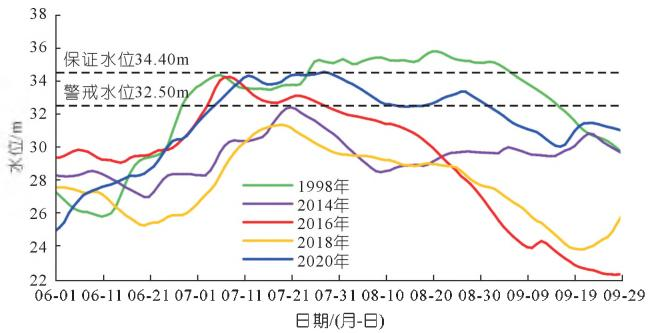  
图7 莲花塘站汛期水位变化过程  
Fig.7 Water level change process of Lianhuatang Station in flood season

表 5 汛期 6~9 月莲花塘站涨水水位变化特征值

Tab. 5 Variation characteristic value of rising water level of Lianhuatang Station from June to September in flood season  

<table><tr><td>年份</td><td>起涨 水位/m</td><td>峰值 水位/m</td><td>水位 涨幅/m</td><td>涨水持续 时间/d</td><td>平均日 涨幅/m</td><td>最大日 涨幅/m</td></tr><tr><td>1998</td><td>25.82</td><td>35.80</td><td>9.98</td><td>81</td><td>0.12</td><td>0.84</td></tr><tr><td>2014</td><td>27.00</td><td>32.41</td><td>5.41</td><td>32</td><td>0.17</td><td>0.60</td></tr><tr><td>2016</td><td>29.07</td><td>34.26</td><td>5.19</td><td>38</td><td>0.14</td><td>0.66</td></tr><tr><td>2018</td><td>25.28</td><td>31.36</td><td>6.08</td><td>49</td><td>0.12</td><td>0.52</td></tr><tr><td>2020</td><td>24.92</td><td>34.59</td><td>9.67</td><td>59</td><td>0.16</td><td>0.57</td></tr></table>

表 6 汛期 6~9 月莲花塘站退水水位变化特征值  
Tab. 6 Variation characteristic values of falling water level of Lianhuatang Station from June to September in flood season  

<table><tr><td>年份</td><td>峰值水位/ m</td><td>9月30日 水位/m</td><td>水位降幅/ m</td><td>退水持续 时间/d</td><td>平均日降 幅/m</td><td>最大日降 幅/m</td></tr><tr><td>1998</td><td>35.80</td><td>29.49</td><td>6.31</td><td>41</td><td>0.15</td><td>-0.34</td></tr><tr><td>2014</td><td>32.41</td><td>29.49</td><td>2.92</td><td>20</td><td>0.15</td><td>-0.23</td></tr><tr><td>2016</td><td>34.26</td><td>22.49</td><td>11.77</td><td>84</td><td>0.14</td><td>-0.40</td></tr><tr><td>2018</td><td>31.36</td><td>26.14</td><td>5.22</td><td>73</td><td>0.07</td><td>-0.29</td></tr><tr><td>2020</td><td>34.59</td><td>30.93</td><td>3.66</td><td>64</td><td>0.06</td><td>-0.23</td></tr></table>

因此，涨水期水位上涨较快，易造成河道泥沙落淤，同时汛后退水期退水较慢，导致汛后河道泥沙得不到有效冲刷，造成2020年宜昌至湖口河段河床冲刷量偏小。  
(4) 汛期宜昌至湖口河段受洪水顶托影响严重，减小了河道输沙能力，加剧了汛期泥沙落淤。2020

年汛期，受连续强降雨影响，中下游干流及区间支流、两湖水系洪水并发，长江中下游江段水位顶托影响严重，洪水宣泄不畅。鄱阳湖水系于2020年6月下旬至7月上中旬期间共发生两次致洪性大暴雨，长江中游干流高水位与鄱阳湖入湖洪水遭遇严重，致使鄱阳湖出口湖口站最高洪水位达  $22.49\mathrm{m}$  （7月12日），接近保证水位  $22.5\mathrm{m}$ ，历史排位第2位，仅次于1998年洪水。洞庭湖水系于2020年6月下旬至7月上中旬期间亦发生致洪性大暴雨，长江中游干流高水位与洞庭湖入湖洪水遭遇，致使洞庭湖出口城陵矶(七里山)站同期最高水位达  $34.56\mathrm{m}$ ，超保证水位  $34.55\mathrm{m}$  。7月下旬洞庭湖水系再次发生大洪水过程，恰好叠加遭遇长江3号洪水过程及长江干流高水位，在汉口水位顶托影响下，致使长江中下游干流水位返涨，螺山以上江段水位再次超保，出现最高水位  $33.63\mathrm{m}$  （见表4）。

2020年汛期，受江湖汇流顶托的影响，宜昌至城陵矶河段水面比降较其他大洪水年显著偏小，且越往下游水面比降偏小越明显（见表7）。7~9月，监利至城陵矶河段的月均水面比降分别为  $0.31\%$  ，  $0.37\%$  ，  $0.34\%$  ，较往年均明显偏小。受此影响，荆江河段调关以上河段冲刷4194万  $\mathrm{m}^3$  ，而调关以下河段则淤积了412万  $\mathrm{m}^3$  ，2020年荆江河段平滩河槽沿程冲淤变化见图8。

表 7 典型大洪水年宜昌至城陵矶河段沿程水面比降对比  
Tab. 7 Comparison of water surface gradient along Yichang - Chenglingji in typical flood years  

<table><tr><td></td><td>时间</td><td>宜昌-枝城</td><td>枝城-沙市</td><td>沙市-石首</td><td>石首-监利</td><td>监利-城陵</td></tr><tr><td rowspan="4">7月</td><td>2014年</td><td>0.59</td><td>0.52</td><td>0.39</td><td>0.37</td><td>0.34</td></tr><tr><td>2016年</td><td>0.55</td><td>0.47</td><td>0.32</td><td>0.31</td><td>0.28</td></tr><tr><td>2018年</td><td>0.70</td><td>0.59</td><td>0.45</td><td>0.41</td><td>0.44</td></tr><tr><td>2020年</td><td>0.66</td><td>0.50</td><td>0.36</td><td>0.32</td><td>0.31</td></tr><tr><td rowspan="4">8月</td><td>2014年</td><td>0.58</td><td>0.53</td><td>0.40</td><td>0.39</td><td>0.37</td></tr><tr><td>2016年</td><td>0.52</td><td>0.52</td><td>0.32</td><td>0.33</td><td>0.33</td></tr><tr><td>2018年</td><td>0.63</td><td>0.57</td><td>0.42</td><td>0.40</td><td>0.42</td></tr><tr><td>2020年</td><td>0.73</td><td>0.54</td><td>0.40</td><td>0.36</td><td>0.37</td></tr><tr><td rowspan="4">9月</td><td>2014年</td><td>0.62</td><td>0.56</td><td>0.45</td><td>0.40</td><td>0.41</td></tr><tr><td>2016年</td><td>0.41</td><td>0.68</td><td>0.35</td><td>0.39</td><td>0.50</td></tr><tr><td>2018年</td><td>0.50</td><td>0.63</td><td>0.36</td><td>0.41</td><td>0.47</td></tr><tr><td>2020年</td><td>0.61</td><td>0.51</td><td>0.33</td><td>0.32</td><td>0.34</td></tr></table>

（5）汛期湖口至江阴河段水面比降较大，加之湖口来沙偏少，干流洪峰期间含沙量偏低，造成长江下游河段冲刷量偏大；而江阴以下河段受其上游河段冲刷影响来沙增加，同时河道较宽，淤积明显。2020年汛期长江中下游水位显著偏高，其中九江站、湖口站洪峰水位居历史最高水位第2位（仅次于1998年），受下游支流来水及潮位顶托共同影响，马鞍山至镇江江段最高潮位超历史，其中南京潮位站最高

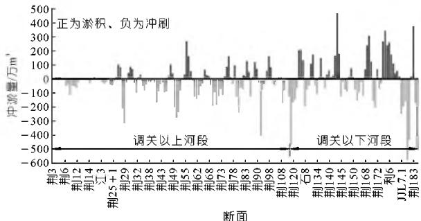  
图82020年荆江河段平滩河槽沿程冲淤变化  
Fig. 8 Change of scouring and silting along the bankfull channel of Jingjiang River in 2020

水位  $10.39\mathrm{m}$  （超历史  $0.17\mathrm{m}$  ）。而长江口水位与往年相比变化不大，2020年徐六径站高潮位排名历史第16位，最高潮位和最低潮位较以往基本相当（见表8）。因此，这导致2020年汛期湖口以下河段水面比降较往年有所偏大，河道走沙能力增强，河床冲刷加剧，特别是大通至江阴河段，平滩河槽冲刷了2.15亿  $\mathrm{m}^3$  ，远大于该河段三峡水库蓄水以来年均冲刷量0.601亿  $\mathrm{m}^3 /\mathrm{a}$  。

表 8 徐六径潮位站潮汐特征值统计(85 高程)  
Tab. 8 Statistics of tidal characteristic values of Xuliujing tidal level station (National Vertical Datum 1985)  

<table><tr><td rowspan="2">统计时段/(年-月)</td><td colspan="2">高潮潮位</td><td colspan="2">低潮潮位</td><td colspan="4">平均特性/m</td></tr><tr><td>最高/m</td><td>出现时间/(月-日时刻)</td><td>最低/m</td><td>出现时间/(月-日时刻)</td><td>高潮位</td><td>低潮位</td><td>潮位</td><td>潮差</td></tr><tr><td>1998-08</td><td>3.54</td><td>08-09 02:44</td><td>0.24</td><td>08-11 00:50</td><td>2.51</td><td>0.54</td><td>1.51</td><td>1.97</td></tr><tr><td>2016-07</td><td>3.62</td><td>07-06 02:50</td><td>0.24</td><td>07-26 14:30</td><td>2.50</td><td>0.53</td><td>1.47</td><td>1.97</td></tr><tr><td>2020-07</td><td>3.65</td><td>07-24 04:00</td><td>0.23</td><td>07-03 20:35</td><td>2.55</td><td>0.65</td><td>1.56</td><td>1.90</td></tr></table>

此外，2020年鄱阳湖入长江泥沙显著偏少，湖口站输沙量仅为341万t，较2003~2019年均值偏少了 $69\%$ ，为三峡水库蓄水以来最小值。长江干流大通站2020年径流量达到了11180亿  $\mathrm{m}^3$ 、输沙量为1.64亿t，较2003~2019年均值分别偏多  $29\%$  和  $24\%$ 。但洪水期间，大通站同流量下的含沙量值较几个典型年明显偏低（见图9），河道中水流挟沙量未得到有效补充，加剧了湖口至江阴河段的冲刷。

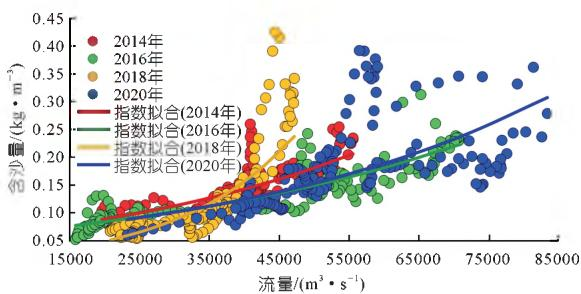  
图9大通站汛期流量与含沙量关系  
Fig. 9 Relationship between flow and sediment concentration in flood season of Datong Station

江阴以下河段受其上游河段冲刷影响来沙增加，同时河道较宽，平均河宽达到  $8\mathrm{km}$ ，来自上游的泥沙被携带至该河段并大量落淤，导致2020年江阴至长江口河段  $0\mathrm{m}$  以下河槽淤积泥沙0.778亿  $\mathrm{m}^3$ 。

# 4 结论

2020年汛期长江流域发生了仅次于1954，1998年的大洪水，复杂的水情对长江中下游干流河道冲淤规律产生了一定的影响。其中，上游来沙和三峡水库出库泥沙显著增多，宜昌站沙量达到了0.468亿t，较2003～2019年均值偏多  $37\%$  ，大量泥沙集中在汛期输送至坝下游河段，是造成2020年坝下游宜昌至湖口河段河床冲刷量偏小的原因之一；同时，汛期长江中下游干流洪水顶托严重，减小了长江中下游河道输沙能力；长江中下游干流河道长时间处于高水位，对宜昌至湖口河道泥沙输移能力造成了显著影响，高水条件也造成边滩泥沙淤积显著增多；汛期长江中下游干流河段洪水过程中，涨水期水位上涨较快，易造成河道泥沙落淤，汛后退水期退水较慢，导致汛后河道泥沙得不到有效冲刷；此外，湖口以下河段水面比降较大，加之湖口来沙偏少，干流河道含沙量偏低，造成湖口至江阴河段冲刷量偏大，而江阴以下河段受其上游河段冲刷影响来沙增加，同时河道较宽，淤积明显。

# 参考文献：

[1] 马建华.2020年长江流域防洪减灾工作实践及思考[J].人民长江,2020,51(12):1-7.  
[2] 尚全民, 褚明华, 骆进军, 等. 2020 年长江流域性大洪水防御[J]. 人民长江, 2020, 51(12): 15-20.  
[3] 陈敏. 2020年长江暴雨洪水特点与启示[J]. 人民长江, 2020, 51(12): 76-81.  
[4] 郾建平, 邓鹏鑫, 徐高洪, 等. 2020年长江中下游干流高洪水位特点及成因分析[J]. 水利水电快报, 2021, 42(1): 10-16.  
[5] 姚仕明, 郭小虎, 陈栋, 等. 2020年汛期长江中下游河道洪水过程及特性分析[J]. 中国防汛抗旱, 2021, 31(2): 5-10.  
[6] 周新春, 许银山, 杨雁飞, 等. 长江流域性洪水辨识与特征对比分析[J]. 人民长江, 2020, 51(12): 111-115.  
[7] 董炳江, 许全喜, 袁晶, 等. 近年来三峡水库坝下游河道强烈冲刷机理分析[J]. 泥沙研究, 2019, 44(5): 42-47.  
[8] 许全喜, 朱玲玲, 袁晶. 长江中下游水沙与河床冲淤变化特性研究[J]. 人民长江, 2013, 44(23): 16-21.  
[9] 许全喜. 三峡工程蓄水运用前后长江中下游干流河道冲淤规律研究[J]. 水力发电学报, 2013, 32(2): 146-154.  
[10] 卢金友, 黄悦, 王军. 三峡工程蓄水运用后水库泥沙淤积及坝下游河道冲刷分析[J]. 中国工程科学, 2011, 13(7): 129-136.  
[11] 郭小虎, 李义天, 渠庚. 三峡工程蓄水后长江中游泥沙输移规律分析[J]. 泥沙研究, 2014, 10(5). 11-17.  
[12] 郭小虎，于倩，渠庚，等. 清水冲刷下均匀天然沙含沙量恢复过程试验研究[J]. 应用基础与工程科学学报，2017，25(3)：427-

441.  
[13] 杨云平, 张明进, 李义天, 等. 长江三峡水坝下游河道悬沙恢复和床沙补给机制[J]. 地理学报, 2016, 71(7): 1241-1254.  
[14] 朱玲玲，许全喜，陈子寒.新水沙条件下荆江河段强冲刷响应研

究[J].应用基础与工程科学学报，2018,26(1)：85-97.  
[15] 董炳江, 许全喜, 杨成刚, 等. 2020 年三峡水库沙峰排沙调度分析[J]. 水利水电快报, 2021, 42(1): 27-32.

（编辑：郑毅）

引用本文：许全喜，董炳江，张为.2020年长江中下游干流河道冲淤变化特点及分析[J].人民长江，2021,52(12):1-8.

# Characteristics and analysis on scouring and silting changes in main stream of middle and lower reaches of Changjiang River in 2020

XU Quanxi $^{1}$ , DONG Bingjiang $^{1}$ , ZHANG Wei $^{2}$

(1. Hydrology Bureau, Changjiang Water Resources Commission, Wuhan 430010, China; 2. State Key Laboratory of Water Resources and Hydropower Engineering, Wuhan University, Wuhan 430072, China)  
Abstract: In the flood season of 2020, there was a long - lasting and wide - ranging heavy rainfall process in the Changjiang River Basin, which was only less than flood in 1954 and 1998 flood since 1949. We analyzed the scouring and silting change characteristics of the main stream of the middle and lower reaches of the Changjiang River under the 2020 flood. The results showed that the increase of upstream sediment and discharge sediment of Three Gorges Reservoir led to the decrease of scouring in the reach of Yichang to Hukou, and at the same time the severe backwater effect at middle and lower reach also reduced the sediment transport ability of this reach. During the flood, the water level rose quickly in the middle and lower reach, leading to easy silting, however the water fell slowly after the flood, causing un - sufficient scouring of sediment in the reach. In the Hukou to Jiangyin reach near the estuary, the water gradient was large and with less sediment concentration, so the sediment transport was relative large. The research provides a basis and reference for further study on the change law of scouring and silting in the middle and lower reaches of the Changjiang River and the prediction of scouring and silting trend in the future.  
Key words: river channel scouring and silting; flood jacking; Changjiang River flood in 2020; middle and lower reaches of the Yangtze River

