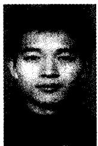
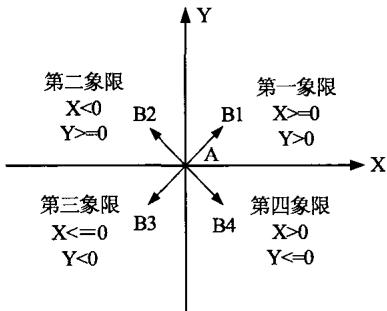
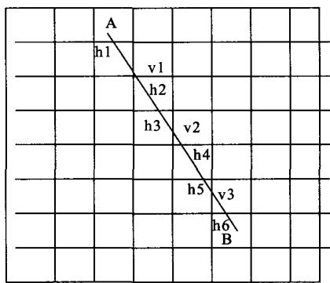
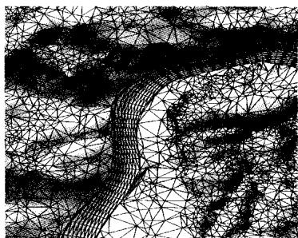
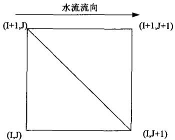
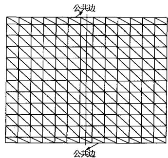
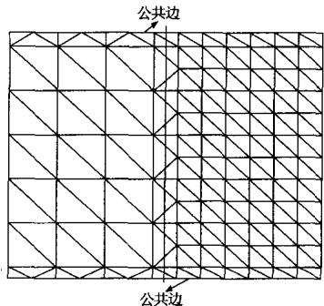
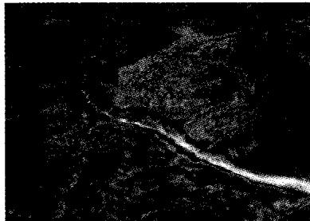
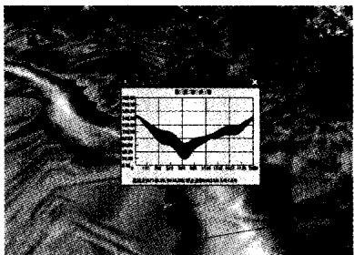

# 三峡库区河道泥沙冲淤过程动态仿真研究

冶运涛，张尚弘，王兴奎

（清华大学水沙科学与水利水电工程国家重点实验室，北京100084）



摘要：泥沙冲淤过程模拟的三维可视化不仅能改善泥沙过程信息的视觉效果，更有助于发现泥沙运动的宏观规律，并为过程模拟数据的深层次分析奠定基础。主要提出了基于高精度、大范围DEM数据的断面控制点提取方法，采用网格逼近的方法生成了三维河道地形；与大尺度流域三维场景形成嵌套结构；研究了大范围河道泥沙动态仿真中的LOD和无缝拼接技术，并采用伪彩色技术表现河道冲淤时空分布，开发了纵横断面冲淤分析模块。该研究能够直观地分析泥沙冲淤变化规律，能够为水利工程规划和设计、河道和航道整治提供决策支持。

关键词：数字流域；泥沙过程；动态可视化仿真；LOD；无缝拼接

中图分类号：TV212；TP391.9 文献标识码：A 文章编号：1004-731X(2009)15-4806-05

# Research on 3D Visualization of Sediment Process Simulation in Three Gorge Reservoir Area

YE Yun-tao, ZHANG Shang-hong, WANG Xing-kui

(State Key Laboratory of Hydroscience and Engineering, Tsinghua University, Beijing 100084, China)

Abstract: The 3D visualization of sediment simulation can not only improve the presentation of sedimentation process, but also be very helpful for discovering the overall rules controlling sediment, and so can lay good foundation for providing further analyzing. The method for extracting the section's control coordinates based on high resolution and large scale DEM data was studied, and the 3D river was generated with triangular mesh approximation approach, which is integrated with 3D terrain models. The real-time rendering techniques for the large-scale 3D scene rendering such as LOD and seamless tiling of LOD patches, which were adapted to render the river bed, were discussed. The spatial-temporal distribution of erosion and deposition was showed by pseudo-color, and the section's erosion and deposition module was developed. The research can analyze the sediment process rules, which provide the decision support for water resources planning and design, as well as river and navigation regulation.

Key words: digital watershed; sediment process; dynamic visual simulation; LOD; seamlessly tiling of LOD patches

# 引言

基于三维虚拟仿真的流域可视化技术，以其逼真的三维场景和友好的实时动态交互特性，引起了研究学者的广泛关注。它为研究者开辟了一个具有沉浸感的虚拟环境，实现了多维空间和时间数据的视觉化，使研究者既能够在虚拟环境中交互操控研究对象，更可以在仿真模拟等科学计算过程中实时得到正在处理的动态过程的反馈。

泥沙冲淤过程可视化仿真系统可以从流域、区域全局或局部实现泥沙淤积过程的三维动态可视化，将离散数据转化为直观的动态或静态画面，有助于从纷繁复杂的数据中认清水沙运动规律，从而为泥沙冲淤状况分布数据的进一步分析与解释提供便利。不但有利于计算结果的全局表达，而且易于明晰冲淤变化过程，有助于计算结果的分析和研究。

数字流域仿真的研究重点是水体和泥沙，大范围水体仿真的研究已有一些成果[1-2]，但是基于三维虚拟仿真平台大

范围泥沙冲淤过程动态仿真的研究目前暂无人涉及；在仿真平台与数学模型的集成方面，张尚弘等做了一定的工作[3-5]。

本文就泥沙冲淤过程动态仿真方面，基于前人已有成果，以三峡库区为例，提出了虚拟仿真平台与数学模型集成的统一网格体系结构；由于计算机技术的发展，数学模型计算的范围越来越大，精度越来越高，必须解决流域三维场景漫游中由于模拟范围太大和数据精度高而带来的视觉停滞、延缓等不能满足实时性要求的情况，提出了采用LOD技术和无缝拼接技术以实现大范围河道泥沙冲淤过程的动态仿真，采用流域三维场景与动态河道的嵌套建模以及动静河道互相切换来减少系统的渲染量和提高场景的实时性；为了实现三维虚拟仿真平台能够为工程规划、论证和设计提供科学决策，便于分析河道泥沙冲淤过程，采用了伪彩色增强技术表达河道冲淤的时空分布；同时开发了与仿真平台交互进行河道断面冲淤分析的功能。

# 1 二维水流泥沙数学模型及定解条件

二维水流泥沙模型控制方程由水流连续方程、动量方程、悬移质泥沙扩散方程和河床变形方程组成。

水流连续方程

$$
\frac {\partial Z s}{\partial t} + \frac {\partial (H U)}{\partial x} + \frac {\partial (H V)}{\partial y} = 0
$$

动量方程

$$
\frac {\partial U}{\partial t} + U \frac {\partial U}{\partial x} + V \frac {\partial U}{\partial y} = - g \frac {\partial Z s}{\partial x} - \frac {\tau_ {x}}{\rho} + \gamma_ {t} \left(\frac {\partial^ {2} U}{\partial x ^ {2}} + \frac {\partial^ {2} U}{\partial y ^ {2}}\right)
$$

$$
\frac {\partial V}{\partial t} + U \frac {\partial V}{\partial x} + V \frac {\partial V}{\partial y} = - g \frac {\partial Z s}{\partial y} - \frac {\tau_ {y}}{\rho} + \gamma_ {t} \left(\frac {\partial^ {2} V}{\partial x ^ {2}} + \frac {\partial^ {2} V}{\partial y ^ {2}}\right)
$$

悬移质泥沙扩散方程

$$
\frac {\partial S}{\partial t} + U \frac {\partial S}{\partial x} + V \frac {\partial S}{\partial y} = \varepsilon_ {s} \left(\frac {\partial^ {2} S}{\partial x ^ {2}} + \frac {\partial^ {2} S}{\partial y ^ {2}}\right) - \frac {\alpha \omega}{H} \left(S - S _ {\bullet}\right)
$$

河床变形方程

$$
\gamma^ {\prime} \frac {\partial Z b}{\partial t} = \alpha \omega \left(S - S _ {\bullet}\right)
$$

式中  $U$  、  $V$  分别为垂线平均流速在  $x$  、  $y$  方向上的分量；  $Zs$  、  $Zb$  和  $H$  分别为水位、河底高程和水深；  $g$  为重力加速度；  $\rho$  为水的密度；  $\tau_{x}$  、  $\tau_{y}$  分别为底部切应力在  $x$  、  $y$  方向上的分量；  $C$  为谢才系数；  $\gamma_{t}$  为水流紊动粘性系数，由零方程紊流模型确定；  $S$  和  $S_{\bullet}$  分别为垂线平均含沙量和挟沙力；  $\varepsilon_{s}$  为泥沙紊动扩散系数；  $\omega$  为泥沙沉速；  $\gamma^{\prime}$  为床沙干容重；  $\alpha$  为悬移质泥沙恢复饱和系数。

水流挟沙力和分组挟沙力级配采用文献[6]进行计算。

数值计算定解条件为：进口给定流量、含沙量及级配，出口给定水位。对固壁边界，取法向流速为0。初始时刻给出地形、水位、流速和含沙量等物理量初始值。

数学模型控制方程及定解条件的数值离散和求解基于 SIMPLERC 算法。在求解离散时采用 Patanker 和 Spalding 给出的欠松弛技术、块校正技术及逐行迭代法。

数学模型的计算结果给出了每个网格节点上的水位、流速、含沙量及河底高程随时间的变化过程，将其与仿真平台耦合，可实时显示水流、泥沙、河床的动态变化过程。

# 2 大流域三维仿真模型的生成

将处理后的高程 DEM、遥感影像、各种矢量数据根据高斯一克力格投影方式导入 Terra Vista；采用分块技术设置分块的大小和块内三角形数量以及地形模型采用的 LOD 的层数；矢量数据按用途和表现进行赋值，如将道路矢量线赋值为道路标识，并设定道路宽度、路面纹理；将河道、湖泊等设置为水面标识、水面纹理等。最后选定所要生成的目标区域，生成 OpenFlight 格式的地形文件。

# 3 河道三维仿真地形的生成

河道三维仿真地形的生成包括大范围、高精度 DEM 数据的管理；河道断面的划分以及断面左右岸平面坐标点的提取；河道断面与栅格数据文件的交点；河道三维仿真地形的生成。

# 3.1 河道断面左右岸坐标提取

三峡库区采用的数学模型以实测大断面资料为基础，所以生成的三维仿真河道的断面中应包括用于数学模型计算

的断面，这也是数学模型与三维虚拟仿真平台集成的关键。

将河道高精度的 DEM 灰度图调入 Arcgis，根据数模计算断面的端点坐标画出断面线作为控制断面，并在控制断面之间加密断面。控制断面和加密断面共同组成具有左右岸平面坐标的断面 SHAPE 文件。自主开发了读取 SHAPE 文件点、线、面的程序，能够读取左右岸坐标点。

# 3.2 河道地形栅格数据文件的存储

河道 DEM 数据精度高，数据量大。采用全局搜索插值速度慢，效率低而且不可能一次将其调入内存进行管理。本文采用分块插值和两级存储[7]的模式对河道栅格数据进行处理。分块插值可以满足数据量大、分块多、读取快的需要；两级存储的关键是建立一个索引文件存储地形块的相关信息，如 DEM 数据块的 ASCII 格式的栅格数据文件名、数据范围以及存储路径等。索引文件中每个数据块的具体索引信息的存储结构为：

```javascript
struct AsciiFileInfo{ char AscName[64];//ASCII格式栅格数据文件名 int nColumns; //栅格数据块的列数 int nRows; //栅格数据块的行数 float fCellSize; //单元格尺寸大小 double dNoDataValue; //无数据区域的默认值 double dTop; //栅格数据块范围顶部坐标 double dBottom; //栅格数据块范围底部坐标 double dLeft; //栅格数据块范围左边坐标 double dRight; //栅格数据块范围右边坐标 char FilePath[256];//栅格数据文件存储路径 };
```

对两级存储栅格地形块的具体操作是：首先打开索引文件，根据一定的要求读取满足条件的地形块的索引信息；然后根据索引信息中的地形块的文件名和存储路径读取相应的地形栅格数据文件。两级存储结构可以避免逐个打开DEM栅格数据文件，仅需要按照指定要求读取满足条件的栅格数据文件即可，提高了地形块的搜索速度，为河道地形三维网格的自动生成奠定了基础。

# 3.3 河道断面控制点空间坐标提取

河道断面是一条连续的曲线，但现有的数学模型计算以及真实地形的生成主要基于离散点进行计算和构建。在实际处理中，就是将一条连续曲线用一条折线来代替，即用有限的点来反映断面的宏观形态。确定断面的形态有两种方法：一种是先确定断面上有限点的平面坐标，然后对这些点在地形DEM栅格数据文件中进行插值求出相应的高程；另一种是先确定断面线与地形栅格数据文件的交点的三维坐标  $(x,y,z)$ ，然后对断面控制点重新进行采样插值。本文采用的是第二种方法。

一个断面在水平面上的投影是一条线段，求断面控制点坐标的过程，就是一条边与系列正方形求交的过程，即线段跨越了哪些栅格。为了对断面插值后的控制点进行排序，

需要确定线段（断面）以左岸为起始点的空间走向。在平面坐标系中，一条线段的走向有四种位置关系，即分别在第一、二、三和四象限（见图1）。假设位于栅格中的一条线段  $AB$  跨越的栅格如图2。

  
图1 断面在直角坐标系中走向

  
图2 断面跨越栅格示意图

根据线段（断面）两个端点平面坐标  $A\left(x_{a},y_{a}\right)$  、 $B\left(x_{b},y_{b}\right)$  可以求得线段的参数方程为：

$$
\left\{ \begin{array}{l} x = x _ {a} + \left(x _ {b} - x _ {a}\right) t \\ y = y _ {a} + \left(y _ {b} - y _ {a}\right) t \end{array} \right.
$$

其中  $t$  为参数，  $t\in [0,1]$  。DEM数据文件的栅格数据结构是按照一定的规则排列的，其所在的位置根据行列号以及数据文件头信息能够转换为相应的空间坐标。知道栅格的坐标后，可以求得线段  $AB$  与竖直网格线的平面交点  $\nu 1$  、  $\nu 2$  、  $\nu 3$  ，与水平网格线的平面交点  $h1$  、  $h2$  、  $h3$  、  $h4$  、  $h5$  、  $h6$  ；如果与水平(竖直)网格线平行，只求得与竖直(平行)网格线的交点即可。当求出线段  $AB$  与网格相交的平面交点坐标以后，就要求解交点的高程值。由于栅格数据的分辨率比较高，只需利用交点上下端或者左右端的栅格坐标根据反距离权重插值得出高程值。

水平网格点上高程值的求解方法与竖直网格类似。根据上述思想，可以求解出已知线段与栅格的全部交点坐标。

一条线段与栅格线的交点形成一个点列。如果某条线段恰好经过栅格的顶点，即不但与水平格网相交，而且与竖直格网相交，则交点中必然存在一个重复点。此时从点列中删除一个即可。为了更好的描述点的拓扑关系以生成河道三维地形，应对断面上的点进行从左岸到右岸的排序。

# 3.4 河道三维仿真地形的生成

由于河道 DEM 数据的分辨率高，河道断面信息不但能反映真实河道的情况，提高数学模型的计算精度，而且由此构成的三维可视化仿真模型精确逼真。

河道断面与栅格数据的交点比较密集，点的数目也不一致，为了构网和计算的方便，所有的断面均经过插值使各断面的点数保持相等，这样的数据拓扑关系简单，存储方便，便于构网，而且能够提高河道边界的搜索速度。

在可视化仿真领域，OpenFlight 是通常采用的格式，采用树状的层次结构对仿真对象进行组织和管理。Creator 平台提供了对该格式的编辑修改功能。为了构建三维可视化河道，根据具有结构网格的离散点进行三角构网，生成具有三角形面的河道仿真数据库。将生成河道三维地形文件调入 Creator 平台设置光照效果，材质属性和纹理映射。最后将三维河道地形与大流域三维场景进行嵌套建模(如图 3)。生成的模型可以在 PC 机有限的资源环境下实时动态地演示河流洪水演进、水位变化以及河道冲淤过程的真实场景。

  
图3三峡库区嵌套地形网格

# 4 多细节层次模型

为了提高模型计算精度，计算网格的划分比较密集，在三维仿真系统中表达河床冲淤变化分布的质量也比较高，致使实时绘制速度较慢，描述精度和绘制效率将相互矛盾。可采用多层细节层次模型协调此矛盾，它在大范围场景的生成和实时调度方面是一项关键技术。

细节层次 LOD（Level Of Detail）模型是对同一个场景或场景中的物体，使用不同细节的描述方法得到的一组模型，供绘制时选择使用。在绘制河道床面网格单元时，也可以采用类似的技术。在工程应用中，往往需要详细观看局部的泥沙冲淤状况，鉴于视域限制，想要从全局去观察河道是不切合实际的。因此，不关注的河段没有必要采取很高的分辨率，仅仅对关注的河段动态河床的绘制采用较高的分辨率，这样可以提高动态河床的绘制效率。将三维场景用不同的精度表示，并根据视点的位置变化来选择不同精度予以实时绘制图形，能够更好地实现场景的实时漫游。

三维场景中河道床面的绘制以相互连接的三角形表现，三角形数量越多则模拟越精细。在水沙模型计算中，为了能够保证计算的精度和稳定性，河道多采用正交贴体坐标网格

剖分。该网格属于结构网格的范畴，河道断面上控制点数目一致，均为  $M$  ，断面的数目为  $N$  ，则河道离散点的数目为  $M \times N$  （如图5(a)所示）。河道的冲淤变化是通过每个节点高程值的实时更新表达的，当节点高程值发生变化时，对所有节点采用三角形网格连接方式绘制床面，三角形网格索引组合为  $\{(i,j), (i,j+1), (i+1,j)\}, \{(i,j+1), (i+1,j+1), (i+1,j)\}$  （如图4），在三维虚拟场景下可以观察到床面的动态变化。

  
图4三角形网格索引关系图

本文对研究区域的河道采用分区 LOD 思想，即对大范围河道分段，然后对每段河道建立 LOD 模型。建立 LOD 模型需要对每个河段组成点重新采样，为了在采样过程中保证河段各级 LOD 的网格属于结构性网格，每个河段纵横向网格采样点数目一致，其中对于河道与流域三维场景的公共边不能重新采样，这样避免河道冲淤过程动静地形接边处出现裂缝。

根据结构性网格的特点，从河段采样点建立LOD模型方式有三种：沿着河道方向采样，断面方向点保持不变；沿着断面方向采样，河道方向点数目保持一致；沿着河道、断面方向均采样。采样后的网格的连接方式如图5，虚线左边是重新采样后的河段，右边是原始河段。

用于大地形LOD切换方法同样适用于河道冲淤过程的可视化仿真[2]：设置LOD的切换距离，同时设置切换的临界距离，当在临界距离时同时显现两种LOD下的河道床面，但以不同的透明度表现，并在视点不断变化时改变透明度，直至到达新的LOD，从而实现LOD的平滑过渡。

# 5 无缝拼接技术

在流域场景漫游过程中，各河段距离视点的位置不同，采用的LOD模型不一样，这样导致河段与相邻河段以及河段与周围场景出现裂缝，破坏了视景的真实性，这样就涉及到无缝拼接的问题。在河道冲淤可视化中无缝拼接分为三种情况：相同LOD情况下拼接(如图5(a))，该情况下沿断面方向节点数目一样，取出相邻河段的边界坐标，直接构造三角形网格；不同LOD情况下的接边；LOD情况下河段与两岸虚拟场景的拼接。另一种是非LOD下河段之间的拼接(如图5(b))，由于绘制河段纵轴方向节点数目的不同，裂缝两边出现数据点不对称的情况，破坏了结构性数据的性质。此种情况下，漏掉一个数据点，河床动态显示时就会出现裂缝。在

绘制前，需要确定裂缝两边数据点的连接关系，如何构造三角形网格成为面临的问题。对于散点进行三角形网格化有多种方法，而Delaunay三角化是其中的代表。故在不同LOD河段进行拼接时，把接缝处两边的点当作散点，进行Delaunay三角化，并按照逆时针顺序记录三角形的顶点，为绘制做准备。设置公共边完成对河道地形与两岸周围场景的拼接有很好的视觉效果。公共边上点数目在不同LOD切换时保持不变，与初始网格最外边界点数目一致。当边界重新采样造成与公共边点数目不一样的时候，同样可以采用Delaunay三角化的方式构造三角形网格(如图5(b))。

  
(a) 相同 LOD 无缝拼接

  
(b) 非 LOD 无缝拼接  
图5 LOD无缝拼接

# 6 伪彩色技术

河道冲淤过程采用伪彩色技术表示，用不同的颜色渲染不同冲淤的区域，使用户对河床的冲淤分布一目了然，较之用单一颜色均匀着色的模型，更具有立体感、真实性。顶点映射的颜色值的选择取决于冲淤值。将三维网格点的坐标与具有时间特性的冲淤数据结合起来，建立时空上对应的三维冲淤场，依据计算时段的推移，不断更新的冲淤分布场构成了动态三维冲淤场。河道床面的动态性通过空间点位置的移动直观地表现，而对应于不同时刻的冲淤值变化通过颜色差异等地图视觉变量逐一按时间显示，从而表现出冲淤值的动态分布（如图6）。

三角形面内的着色采用Gouraud着色方式，该方式是常用的渲染方法，为三角形各个顶点提供了单独的颜色值，并对各顶点的颜色进行平滑、融合处理，为三角形着上渐变色。它渲染出河床床面丰富的颜色和平滑的变色效果。Gouraud

  
图6 某时刻河道冲淤分布

插值算法的基本思想是利用多边形各顶点的颜色值做线性内插，以求得平面多边形内其余各点的颜色值，结果使整个多边形成为非常连续的变化。用颜色映射的方法表示冲淤的时空变化，关键是取得网格节点的颜色值。

确定三角形网格节点颜色值步骤如下：(1) 设计表达冲淤变化的颜色表。颜色表中一般采用由暗到亮的色系来表达冲淤值从小到大的变化，并且表中每种颜色有一个入口值（标识值）；(2) 按给定冲淤值间隔计算分带数；(3) 计算网格节点冲淤值所属带数；(4) 按照每个网格节点所属带数索引颜色表中的颜色号，并据此颜色绘图。

# 7 断面冲淤变化分析

纵断面与横断面冲淤变化分析的实时动态查询是通过鼠标的选择与点击操作来实现的，不需要进行场景画面的切换。为了便于分析不同位置断面的冲淤变化信息，根据以下步骤完成：

(1) 确定断面在三维虚拟场景中的起止点坐标；

确定鼠标在屏幕上拉线起止点对应于三维虚拟场景中的位置，转换为确定鼠标点击位置对应于流域空间坐标。

根据三维图形显示原理，三维图形需要经过几何、投影等变换，实现三维空间到二维计算机屏幕的投影。在计算机屏幕上点选图形，通过屏幕的二维坐标选取对应的空间实体对象，即根据投影变化的原理求解鼠标屏幕位置对应的空间点的空间坐标，即三维图形显示的逆过程。根据视口矩阵、投影变换矩阵和几何变换矩阵，可以求出视线的方向，并根据视点(摄像机)的位置以及视锥体的远截面范围，确定视线的空间位置，而且能够求得视线线段的起止点坐标  $\mathsf{p0}^{[3]}$  ， $\mathsf{p1}^{[3]}$  。而后根据内置函数GV Geo inq intersection获得射线与场景相交的交点坐标，也是屏幕点所对应的空间坐标。由此，可以得到查询断面的左右岸坐标，在绘制过程中，调用OpenGL绘制直线图元函数，可以看到断面在平面上的投影线段（图7所示）。

(2) 断面冲淤分析图生成

三维场景中断面起止点坐标确定后，通过对断面进行平面等距离取点，从数据库或者文件中实时获取模型计算或者实测结果，插值出断面点的初始高程值和冲淤后的高程值。根据一定的搜索半径确定断面点周围用来插值的点，点数不能少于3个，然后采用反距离权重插值出待求断面点的高程

  
图7 断面冲淤分析

值，依次类推，可以求出断面上各控制点空间坐标。

在对话框中绘制出初始床面断面绝对高程和冲淤变化后的床面的绝对高程值组成的断面形状。为了表示断面随时间推进时断面的冲淤过程，对断面的淤积部分，填充为红色；断面的冲刷部分，填充为绿色。从而可以分析和预测断面冲淤变化情况以及沿河道方向的坡降变化趋势（图7所示）。

# 8 结论

本文以三峡库区为例，探讨了数字流域中的河道冲淤过程三维可视化仿真的问题，主要结论如下：

(1) 提出了在大范围、高精度 DEM 数据中自动提取断面控制点的算法。该算法采取分块插值、自动建立断面控制点的拓扑关系，提高了断面控制点坐标的提取效率，为河道三维仿真数据库的生成奠定了基础。同时提取的断面与数学模型计算断面进行自动匹配，能够很好地进行数学模型与三维虚拟仿真平台的集成。  
(2) 为了提高仿真平台的实时性和渲染效率，研究了 LOD 模型和无缝拼接的技术，实现了大范围流域场景的实时控制漫游。  
(3) 获得具有结构性的河道地形三维离散数据点，通过Creator API 生成了河道的三维仿真地形，并在Creator平台中完成光照、材质、纹理映射，生成了具有真实感的三维河道场景，并将其嵌套于大流域三维虚拟场景中。  
(4) 采用伪彩色技术实现了河道冲淤时空分布的表示，开发了纵横断面冲淤变化分析模块。

# 参考文献：

[1] Songxin Shi, Xiuzi Ye, Zhaoxia Dong, Yin Zhang. Real-time simulation of large-scale dynamic river water [J]. Practice and Theory (S1569-190X), 2007, 15(6): 635-646.  
[2] 陈文辉，谈晓军，董朝霞.大范围流域内水体三维仿真研究[J].系统仿真学报，2004,16(11):2409-2412.  
[3] 张尚弘, 姚仕明, 曲兆松. 等. 流域三维可视化与数值模拟的实时交互运行[J]. 清华大学学报(自然科学), 2004, 44(12): 1638-1641.  
[4] 师彪，李先华，于新花，等. 海洋三维仿真平台的潮流模拟可视化建模[J]. 上海大学学报(自然科学版)，2007, 13(4): 449-455.  
[5] 马劲松, 朱大奎. 海岸海洋潮流模拟可视化与虚拟现实建模[J]. 测绘学报, 2002, 31(1): 49-53.  
[6] 李义天. 河道平面二维泥沙数学模型研究及应用 C// 第三届全国泥沙基本理论研究学术讨论会论文集. 北京: 中国建材工业出版社, 1995.  
[7] 王光谦，刘家宏. 数字流域模型[M]. 北京：科学出版社，2006.