DOI:10.12170/20221130002

曹双，程龙，李洁，等.2020年流域性大洪水下长江下游干流河道演变分析[J].水利水运工程学报，2023(4):1-11.(CAO Shuang, CHENG Long, LI Jie, et al. Analysis of evolution in the lower Yangtze River under the effect of the great basin flood in 2020[J]. Hydro-Science and Engineering, 2023(4):1-11. (in Chinese))

# 2020年流域性大洪水下长江下游干流河道演变分析

曹双,程龙,李洁,罗红雨

(长江水利委员会 水文局局长江下游水文水资源勘测局, 江苏 南京 210011)

摘要：自2003年三峡水库蓄水以来，长江下游水沙特性发生了显著变化，2020年夏长江流域发生了流域性大洪水。在分析三峡水库蓄水以来长江下游水沙特性变化的基础上，结合2020年洪水期的水情、沙情，利用实测河床地形及大断面资料，分析长江下游干流湖口至江阴多年河道冲淤特性，探讨2020年洪水作用下长江下游河床冲淤变化及河势演变特性。研究表明：自三峡水库蓄水以来，长江下游年均径流量变化较小，输沙量锐减，水沙关系发生明显改变；湖口至江阴河段1998—2006年有淤有冲，2006年后呈单向冲刷状态，且滩槽普冲，在2020年流域性大洪水作用后，长江下游河道延续这一冲刷特征，冲刷强度明显增强，各水位河槽冲刷强度为2016—2020年平均值的2.0~2.8倍；大通以上河段冲刷强度小于下游河段；长江下游分流格局总体稳定，但铜陵河段成德洲汉道有主支汉易位趋势，多次测得右汊分流比超过左汊；扬中河段支汉发展，分流比呈持续微增趋势；河势总体稳定，尚有多个江心洲边滩冲刷明显，铜陵沙首度出现撇岸切滩现象，扬中等局部江段江心洲高滩陡坎有条崩发生；河床纵向仍有冲刷，河道束窄段横断面形态进一步窄深化。对大洪水条件下河道冲淤演变特性的分析研究，有利于更加全面系统地掌握长江下游河道的河势演变规律。

关键词：长江下游；流域性大洪水；河道冲淤；河势演变

中图分类号：TV147

文献标志码：A

文章编号：1009-640X(2023)04-0001-11

长江下游起于湖口，流经湖北、江西、安徽、江苏和上海五省市，干流全长约  $938\mathrm{km}$  ，属于分汊河型，河道平面呈藕节状，宽窄相间。其中湖口至江阴段按照节点、束窄段或特定的支流河口可分成15个河段[1]，自上而下依次为上下三号、马塗、东流、官洲、安庆、太子矶、贵池、大通、铜陵、黑沙洲、芜裕、马鞍山、南京、镇扬、扬中河段(图1)。两岸入汇的主要支流有江西省鄱阳湖水系，安徽省华阳河、皖河、裕溪河、滁河、青弋江、水阳江、后河、秋浦河等，江苏省淮河入江水道及大运河、秦淮河等。河段中最大的江心洲是扬中的太平洲，河床最低处在江阴鹅鼻嘴。

长江下游干流多年来陆续实施了河道治理、航道整治、崩岸应急治理等工程，加之天然节点控制及人工强化的河道边界限制，河势基本稳定，但局部河段河势仍有较大变化[2-4]。2003年6月三峡水库开始蓄水以来，大量泥沙在库区淤积[5-6]，清水下泄改变了长江中下游河道的水沙条件[7-8]，河势变化特性及河道冲淤也产生了新的变化[9-13]。李义天等[14]曾通过与其他水库下游冲淤规律的对比研究，预测三峡水库下游的冲刷发展过程将比已有的计算成果缓慢；姚仕明等[15]研究认为，虽然长江中下游河段的河(航)道整治工程有效控制了总体河势，但三峡水库运行后河道仍向冲刷方向发展，并通过数学模型计算和物理模型试验预测2008—2022年荆江河段将持续冲刷；许全喜等[16]对宜昌至大通干流河道冲淤规律分析发现，三峡水库蓄水运行后，长江中下游河道由三峡工程建设前“上冲下淤”和“滩淤槽冲”的特征转变为近乎全程的“滩槽普冲”；朱玲玲等[17]通过原型观测数据分析认为，三峡大坝下游河道进入了强冲刷状态。

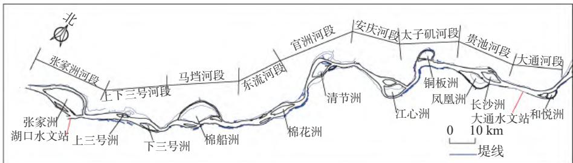  
(a) 湖口至大通河段

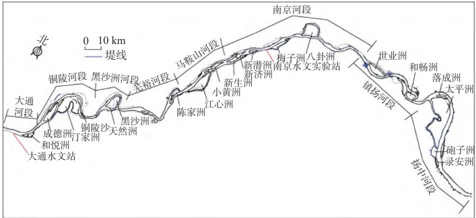  
(b)大通至江阴河段  
图1长江下游湖口至江阴河段河势  
Fig. 1 River map of Hukou to Jiangyin reach of the lower Yangtze River

2020年长江流域性大洪水发生后，许全喜等[18]对2020年长江中下游(宜昌至长江口)的河道总体冲淤变化分析发现，上游来沙和三峡水库出库泥沙明显增多、中下游干流洪水顶托严重、汛期水位快涨和汛后水位慢退是宜昌至湖口河段河床冲刷量偏小的主要原因；湖口至江阴段水面比降大，加之水流含沙量低，使冲刷量偏大。另有多名学者研究了2020年大洪水对个别洲滩、分汊河段的影响[19-20]，得到了一些局域性河道演变特征。本文在以往研究成果的基础上，对2020年流域性大洪水作用后长江下游干流河道水沙变化、河道冲淤及河势演变特征等进行较为全面及深入的研究和探讨。

# 1 材料与方法

研究河段内设有九江、大通两个常年水文站，水文资料采用两站的长系列水位、流量和泥沙观测数据，以及沿程各主要汊道测验数据等。河道地形采用1998年以来长江下游水文水资源勘测局测绘的河道地形图及断面实测资料，其中包含了2020年11月实测大断面资料、2021年3月1：10000长程地形资料。

本次冲淤分析采用断面法计算冲淤量。根据河段内主要水文站的水位流量关系及河段地形情况确定水面线，分枯水、平均、平滩和洪水4个水位进行计算，对应大通站流量分别为15000、30000、45000和 $60000\mathrm{m}^3 /\mathrm{s}$  。固定断面平均间隔约  $1.0\mathrm{km}$  ，弯曲段及变化较大部位的间隔缩小至  $500\mathrm{m}$  左右。河道断面一般按  $1:5000$  进行数据提取，即横向平均点距  $35\sim 40\mathrm{m}$  ，陡坎及局部地形变化剧烈区域横向点距加密至约 $20\mathrm{m}$  。采用截锥公式计算相邻两断面间的河道槽蓄量。

$$
V _ {i} \left(z _ {j}\right) = \left(A _ {i} + A _ {i + 1} + \sqrt {A _ {i} A _ {i + 1}}\right) L _ {i} / 3 \tag {1}
$$

式中:  $V_{i}(z_{j})$  为在水位  $z_{j}$  条件下, 断面  $i$  和断面  $i+1$  间的河道槽蓄量;  $A_{i}$  为断面  $i$  的过水断面面积;  $L_{i}$  为断面

间距。

河段槽蓄量  $V$  由各断面间槽蓄量累加得到，两测次之间的槽蓄量之差即为冲淤量  $\Delta V$  。冲淤强度  $\Delta G$  为单位河长年平均冲淤量，即  $\Delta G = \Delta V / (Ln)$ ，其中： $L$  为河段长度， $n$  为两测次间隔的年数。采用套图比较法分析河道地形和断面的变化规律。

# 2 三峡水库蓄水以来长江下游水沙特性变化

# 2.1 年际变化

以三峡水库蓄水时间(2003年)为界，分蓄水前及蓄水后两个时段进行水沙特性空间差异性统计分析。对比三峡水库蓄水前后数据可知，九江水文站径流量减小  $4.6\%$  ，输沙量减小  $67.8\%$  (图2(a))；大通水文站径流量减小  $2.5\%$  ，输沙量减小  $69.5\%$  (图2(b))。三峡水库蓄水后，下游径流量微减，而输沙量锐减，输沙量减幅显著大于径流量的减幅，水沙关系发生重大改变。

(a) 九江站  
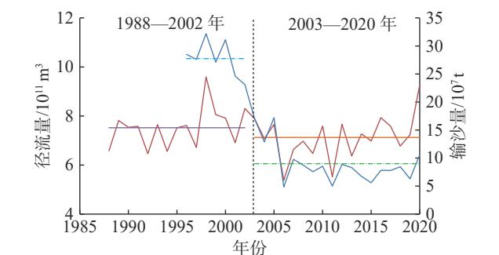  
-径流量 一平均径流量(1988—2002年) 一平均径流量(2003—2020年)  
-输沙量 一平均输沙量(1996—2002年) 一平均输沙量(2003—2020年)

(b) 大通站  
Fig. 2 Changes in annual runoff and sediment runoff at Jiujiang and Datong hydrological stations  
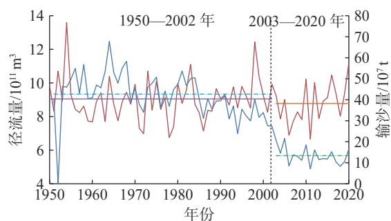  
一径流量 一平均径流量(1950—2002年) 一平均径流量(2003—2020年) 一输沙量 一平均输沙量(1951—2002年) 一平均输沙量(2003—2020年)

# 2.2 年内变化

大通水文站是长江下游流量控制站，其下游干流区间入江流量仅约占其流量的  $3\%$  ，大通水文站的流量、泥沙特征基本代表长江下游来水、来沙特征。根据1950年以来大通站的水沙资料，以2003年为界分别统计流量和输沙率的年内差异(图3)。

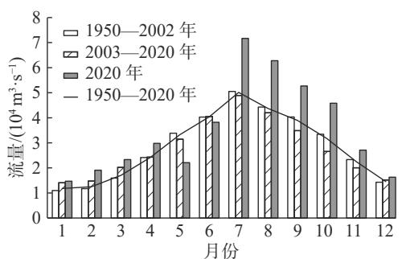  
图2 九江站、大通站年径流量及输沙量变化  
(a) 月均流量  
图3 大通站月均流量及输沙率变化  
Fig. 3 Variation of monthly average discharge and sediment transport rate at Datong hydrological station

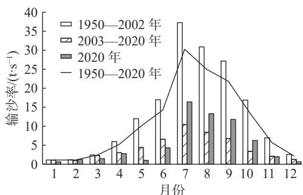  
(b) 月均输沙率

由图3可见，长江下游水沙年内分配不均，存在明显的汛期和枯水期。三峡水库蓄水以后，汛期洪峰有所坦化，枯水期流量略有增大，常年流量不低于  $10000\mathrm{m}^3/\mathrm{s}$ ；沙峰的坦化更为明显，三峡水库蓄水后的汛期输沙率远小于蓄水前和1950年以来的平均值，长江下游汛期的不饱和输沙现象更为突出。三峡工程对长江下游输沙年内分配的影响远大于对径流的影响。

# 2.3 2020年流域性大洪水特性

2020年，长江发生了自1949年以来仅次于1954、1998年的流域性大洪水，长江干流发生5次编号洪

水。其中，长江上游发生特大洪水，寸滩站洪峰水位居实测记录第2位，三峡水库出现建库以来最大入库流量；长江中下游干流监利至大通段洪峰水位列有实测记录以来的第2~5位，马鞍山至镇江段潮位达历史最高[21-22]。大通站于7月13日达到最高水位  $16.24\mathrm{m}$ ，仅低于1954和1998年；同时达到了最大洪峰流量  $83800\mathrm{m}^3/\mathrm{s}$ ，该值仅次于1954和1999年，位列历史第3；最大1日洪量和最大3日洪量介于1954和1998年之间，但最大7日和最大15日洪量均低于1954和1998年。大通站2020年汛期日均流量、水位过程见图4。

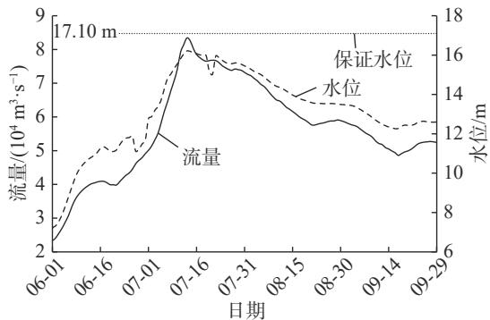  
图42020年长江洪水大通站水位、流量过程  
Fig. 4 Process of water level and flow at Datong hydrological station during the 2020 Yangtze River flood

长江下游河段水情还与鄱阳湖来水密切相关。2020年，鄱阳湖虽发生流域性超历史大洪水，湖口站洪峰水位居实测记录第2位，鄱阳“五河”最大合成流量  $43200\mathrm{m}^3/\mathrm{s}$ ，但湖口站年径流量(1547亿  $\mathrm{m}^3$ )却维持在多年均值附近。这主要是由于长江水位持续居高，顶托鄱阳湖形成持续高水位，造成湖口出流不畅，进一步延缓了长江洪峰过后的退水过程。

2020年主汛期，长江流域具有入梅早、出梅晚、梅雨量大，暴雨强度大、极端性强，暴雨阶段性分布明显、各阶段强雨区重叠度高等特征。在长江中下游超长超强梅雨和四川盆地强降雨影响下，2020年长江流域性大洪水主要有以下6个特点：(1)上游来水早，洪水发生范围广；(2)干流区间洪水突出；(3)中下游干流水位涨势猛；(4)中下游洪峰水位高、高水位持续时间长，南京站出现最高水位  $10.39\mathrm{m}$ ，超历史最高水位  $0.17\mathrm{m}$ ，超警戒水位48天，超保证水位6天；(5)上游洪水峰高量大，大通站最大30天洪量接近1998年水平；(6)水库群联合调度影响显著[21,23]。

# 3 河道冲淤变化特性

# 3.1 湖口至大通河段

计算湖口至大通河段1998—2020年间各时段的冲淤量、冲淤强度见表1。可见湖口至大通段河床累计为冲刷。三峡水库蓄水前，除枯水期外该河段河床总体表现为淤积；三峡水库蓄水后，该河段河床转淤为冲，其后呈单向冲刷态势。具体特征为：(1)2001—2006年三峡水库蓄水前后，河床呈槽淤滩冲，且冲刷量、冲刷强度均随水位抬高而增大，说明该时段冲刷部位主要在河滩；(2)2006—2011年上游水库群运用前，河床表现为滩槽普冲，但冲刷相对较缓；(3)2011—2016年上游水库相继投入运行，冲刷逐渐增大，这期间各计算水位下河槽冲刷量较为接近，说明冲刷主要发生在枯水河槽；(4)2016—2020年上游水库群实现初期蓄水后，冲刷有所减缓，但整体冲刷强度仍高于2011年以前水平。

2019—2020年河床冲刷幅度显著增大，冲刷量占2016—2020年5年冲刷量的  $50\%$  左右，冲刷强度是2016—2020年平均值的  $2.0\sim 2.3$  倍。2001—2020年间，该段河床平滩河槽冲刷总量达49682万  $\mathrm{m}^3$  ，其中2020年洪水作用后的冲刷量为6501万  $\mathrm{m}^3$  ，占比  $13.2\%$  ，年均冲刷强度是2001年以来均值的2.5倍。

表 1 湖口至大通段冲淤量和冲淤强度统计  
Tab. 1 Statistics of erosion/deposition amount and intensity from Hukou to Datong  

<table><tr><td rowspan="2">时段</td><td colspan="2">枯水(15000m3/s)</td><td colspan="2">平均(30000m3/s)</td><td colspan="2">平滩(45000m3/s)</td><td colspan="2">洪水(60000m3/s)</td></tr><tr><td>冲淤量/万m3</td><td>冲淤强度/(\( \text{万m}^3 \cdot (\text{km}\cdot \text{a})^{-1} \))</td><td>冲淤量/万m3</td><td>冲淤强度/(\( \text{万m}^3 \cdot (\text{km}\cdot \text{a})^{-1} \))</td><td>冲淤量/万m3</td><td>冲淤强度/(\( \text{万m}^3 \cdot (\text{km}\cdot \text{a})^{-1} \))</td><td>冲淤量/万m3</td><td>冲淤强度/(\( \text{万m}^3 \cdot (\text{km}\cdot \text{a})^{-1} \))</td></tr><tr><td>1998-2001年</td><td>-7012</td><td>-10.25</td><td>859</td><td>1.25</td><td>4773</td><td>6.98</td><td>11509</td><td>16.82</td></tr><tr><td>2001-2006年</td><td>2631</td><td>2.31</td><td>-4432</td><td>-3.89</td><td>-7986</td><td>-7.00</td><td>-15627</td><td>-13.71</td></tr><tr><td>2006-2011年</td><td>-5462</td><td>-4.79</td><td>-6897</td><td>-6.05</td><td>-7611</td><td>-6.68</td><td>-12136</td><td>-10.64</td></tr><tr><td>2011-2016年</td><td>-21494</td><td>-18.86</td><td>-20786</td><td>-18.23</td><td>-21569</td><td>-18.92</td><td>-20383</td><td>-17.88</td></tr><tr><td>2016-2020年</td><td>-12261</td><td>-12.24</td><td>-12551</td><td>-13.76</td><td>-12516</td><td>-13.72</td><td>-13275</td><td>-14.56</td></tr><tr><td>2019-2020年</td><td>-5658</td><td>-20.01</td><td>-6471</td><td>-28.38</td><td>-6501</td><td>-28.51</td><td>-6886</td><td>-30.20</td></tr><tr><td>1998-2020年</td><td>-43598</td><td>-8.47</td><td>-43807</td><td>-8.73</td><td>-44909</td><td>-8.95</td><td>-49912</td><td>-9.95</td></tr></table>

注：正值为淤，负值为冲。

# 3.2 大通至江阴河段

大通至江阴河段1998—2020年间各时段的冲淤量、冲淤强度见表2。1998—2020年大通至江阴段河床呈单向冲刷趋势。三峡水库蓄水前的1998—2001年，该河段河床冲刷相对较小，冲刷量随计算水位升高而减小，说明该河段河滩总体呈小幅淤积态势；三峡水库蓄水后，该河段河床保持单向冲刷态势。具体特征为：(1)2001—2006年三峡水库蓄水前后，河床滩槽普冲，冲刷相对较缓，冲刷量及冲刷强度随水位抬高而增大；(2)2006—2011年，冲刷强度显著增大，约为前一时段的2.5倍；(3)2011—2016年上游水库群相继投入运行，冲刷又出现一定程度的减小，但仍约为2001—2006年的2倍；(4)2016—2020年上游水库群实现初期蓄水后，河床冲刷再次加剧。

表 2 大通至江阴段冲淤量和冲淤强度统计  
Tab. 2 Statistics of erosion/deposition amount and intensity from Datong to Jiangyin  

<table><tr><td rowspan="2">时段</td><td colspan="2">枯水(15000m3/s)</td><td colspan="2">平均(30000m3/s)</td><td colspan="2">平滩(45000m3/s)</td><td colspan="2">洪水(60000m3/s)</td></tr><tr><td>冲淤量/万m3</td><td>冲淤强度/(\( \text{万m}^3 \cdot (\text{km} \cdot \text{a})^{-1} \))</td><td>冲淤量/万m3</td><td>冲淤强度/(\( \text{万m}^3 \cdot (\text{km} \cdot \text{a})^{-1} \))</td><td>冲淤量/万m3</td><td>冲淤强度/(\( \text{万m}^3 \cdot (\text{km} \cdot \text{a})^{-1} \))</td><td>冲淤量/万m3</td><td>冲淤强度/(\( \text{万m}^3 \cdot (\text{km} \cdot \text{a})^{-1} \))</td></tr><tr><td>1998-2001年</td><td>-17483</td><td>-13.52</td><td>-13717</td><td>-10.61</td><td>-11131</td><td>-8.61</td><td>-9931</td><td>-7.68</td></tr><tr><td>2001-2006年</td><td>-10968</td><td>-5.09</td><td>-13440</td><td>-6.24</td><td>-14433</td><td>-6.70</td><td>-17424</td><td>-8.09</td></tr><tr><td>2006-2011年</td><td>-34889</td><td>-16.19</td><td>-35504</td><td>-16.48</td><td>-38119</td><td>-17.69</td><td>-43621</td><td>-20.24</td></tr><tr><td>2011-2016年</td><td>-24332</td><td>-11.29</td><td>-24855</td><td>-11.53</td><td>-26563</td><td>-12.33</td><td>-35966</td><td>-16.69</td></tr><tr><td>2016-2020年</td><td>-33036</td><td>-19.16</td><td>-34186</td><td>-19.83</td><td>-33855</td><td>-19.64</td><td>-33458</td><td>-19.41</td></tr><tr><td>2019-2020年</td><td>-18925</td><td>-43.91</td><td>-20084</td><td>-46.60</td><td>-21478</td><td>-49.83</td><td>-23408</td><td>-54.31</td></tr><tr><td>1998-2020年</td><td>-120708</td><td>-12.73</td><td>-121702</td><td>-12.84</td><td>-124101</td><td>-13.09</td><td>-140400</td><td>-14.81</td></tr></table>

注：正值为淤，负值为冲。

由表2可见，与1998—2020年冲淤相比，2019—2020年河床冲刷强度显著增大，2019—2020年河床冲刷量约占2016—2020年冲刷量的  $60\%$  ，冲刷强度是2016—2020年平均值的  $2.3\sim 2.8$  倍；1998—2020年间，该河段河床平滩河槽冲刷总量达124101万  $\mathrm{m}^3$  ，其中2020年洪水作用下的冲刷量为21478万  $\mathrm{m}^3$  ，占比 $17.3\%$  ，年均冲刷强度是1998年以来均值的3.8倍。

2020年大洪水作用下，大通至江阴河段洪水河槽冲刷强度达54.31万  $\mathrm{m}^3 /\mathrm{(km}\cdot \mathrm{a)}$  ，是上游湖口至大通河段的1.8倍，其余各水位河槽冲刷强度也是上游河段的  $1.6\sim 2.2$  倍。湖口至大通河段与大通至江阴河段的来水来沙条件相近，两者冲刷强度不同主要是受河床边界条件的影响，长江下游干流床沙总体趋势为沿程变细，故而同等条件下越向下游越易冲刷。已有研究[24]表明，随着三峡水库的蓄水运用，坝下游河道发生沿程冲刷，并逐步向下游发展。上段河床经过多年剧烈冲刷后，冲刷强度已有所减缓，而下段则正处于剧烈冲刷时期，在大洪水的作用下冲刷强度增大更为显著。

# 3.3 南京河段

2019—2020年，长江下游除南京段出现微淤[19]（图5，淤积强度为12.6万  $\mathrm{m}^3 /(\mathrm{km}\cdot \mathrm{a}))$  ，其他河段以冲刷

为主。长江湖口至南京段没有大的支流入汇，该河段流量差仅约  $2\%$  。在经历湖口以下多个河段约  $430\mathrm{km}$  河长连续冲刷后，江水含沙量应有明显增大。但事实上，通过对比大通水文站及南京水文实验站的含沙量资料发现，南京站含沙量反而小于上游的大通站(图6)，鉴于两测站流量差甚小，可推知有大量泥沙在南京河段落淤，由表3统计的数据可见，从新济洲汊道段开始出现了较为显著的淤积。

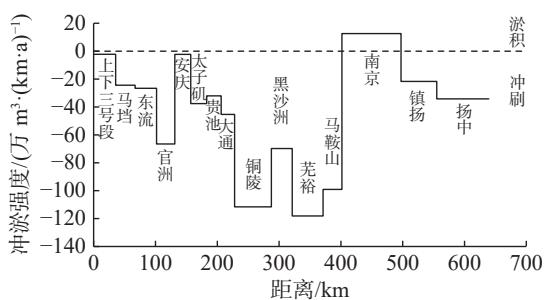  
图5 2019—2020年长江下游河段平滩河槽冲淤强度

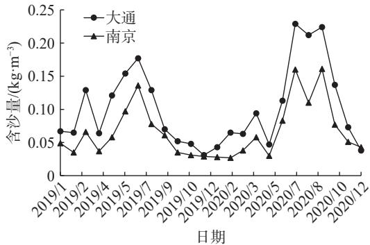  
Fig. 5 Variation of mean erosion/deposition intensity under bankfull water level along the lower Yangtze River during 2019-2020  
图6 2019—2020年大通站和南京站含沙量变化  
Fig. 6 Variation of sand content at Datong and Nanjing hydrological stations during 2019-2020

表 3 2019-2020 年南京河段冲淤量统计  
Tab. 3 Statistics of erosion/deposition amount in Nanjing reach during 2019-2020  

<table><tr><td rowspan="2">河段</td><td colspan="4">冲淤量/10^4 m^3</td></tr><tr><td>枯水(15 000 m^3/s)</td><td>平均(30 000 m^3/s)</td><td>平滩(45 000 m^3/s)</td><td>洪水(60 000 m^3/s)</td></tr><tr><td>新生洲分汊前干流段</td><td>-114</td><td>-108</td><td>-104</td><td>-104</td></tr><tr><td>新生洲、新济洲左汊</td><td>280</td><td>354</td><td>360</td><td>357</td></tr><tr><td>新生洲、新济洲右汊</td><td>326</td><td>364</td><td>380</td><td>392</td></tr><tr><td>梅子洲分汊前干流段</td><td>-16</td><td>-72</td><td>-25</td><td>5</td></tr><tr><td>梅子洲左汊</td><td>-334</td><td>-293</td><td>-248</td><td>-244</td></tr><tr><td>梅子洲右汊</td><td>-6</td><td>-3</td><td>3</td><td>2</td></tr><tr><td>八卦洲分汊前干流段</td><td>-190</td><td>-184</td><td>-178</td><td>-175</td></tr><tr><td>八卦洲左汊</td><td>83</td><td>134</td><td>184</td><td>202</td></tr><tr><td>八卦洲右汊</td><td>220</td><td>229</td><td>237</td><td>244</td></tr><tr><td>龙潭、仪征水道</td><td>420</td><td>504</td><td>556</td><td>579</td></tr><tr><td>全河段</td><td>669</td><td>925</td><td>1 165</td><td>1 258</td></tr></table>

初步分析得出南京河段冲淤异常的成因主要包括两个方面：一是由于2020年大洪水期间叠加了高潮位，在南京河段形成了长时间与流量不匹配的高水位，使水流流速下降明显；二是长江南京河段先后进行了9次较大规模的河道整治工程，护岸总长约  $110\mathrm{km}^{[20]}$  。整治工程的实施，使水流顶冲岸段的岸线得到有效保护，基本控制了河势，河床冲刷被限制在江心较窄范围内。南京河段冲淤异常的详细成因及其影响机理尚需进一步研究。

# 4 河势演变特征

20世纪50年代以来，长江下游河道在自然因素及人工干预下演变，且人工干预的影响近年来明显增强。具体表现为：总体河势基本稳定，两岸岸线相对稳定，崩岸频次及总长有所减小，河道冲淤基本限制在远离河岸的江心河槽部位；三峡水库蓄水运行以来，长江下游河道几乎呈单向冲刷态势，部分河段冲刷幅度较大；人工干预未改变河道演变的基本规律。2020年长江流域性大洪水作用虽未改变总体基本稳定的态

势，但仍造成了河床冲刷明显加剧、局部河段河势有所调整、个别河段河势剧烈变化等影响。

# 4.1 主流走势与分流格局

三峡水库蓄水以来，长江下游主流走势及各洲滩分流格局总体相对稳定，但局部河段随洲头低滩冲刷变化，分流区及进口段主流走势有所调整；有些支汊分流比呈微增趋势，个别河段出现主支汉易位趋势。

湖口至江阴段20多个汊道大部分保持了相对稳定的态势，如南京河段梅子洲汊道，多年来主支汊分流比稳定在  $19:1$  左右；八卦洲汊道在经历了多轮河道整治工程后，左汊缓慢衰退的趋势得到进一步遏制，近5年汛期分流比基本维持在  $15\%$  以上，2020年大洪水后，分流格局未发生大的变化(图7(a))。

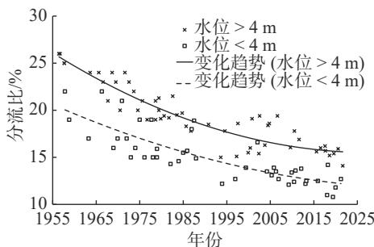  
(a)八卦洲左汊

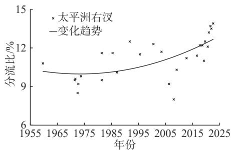  
(b) 太平洲右汊

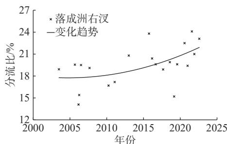  
(c) 落成洲右汊  
图7 部分汊道分流比变化  
Fig. 7 Variation of diversion ratio of selected branching channels

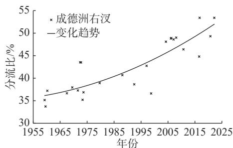  
(d)成德洲右汊

2020年大洪水冲刷后，太平洲、落成洲等原已表现出支汉发展势头的汊道，其支汉发展趋势进一步巩固。太平洲进口段主流进一步右偏，使得落成洲右汊及太平洲右汊更易获得进流，支汉冲刷在大水作用后明显加速。2021年7月，太平洲右汊实测分流比达  $13.7\%$  （图7(b))，为多年来实测最大值，落成洲右汊分流比则达  $24.1\%$  （图7(c))，超越了航道部门控制目标  $(20\%)$  和整治前水平。

铜陵河段成德洲长期以左汊为主汊，1959—1998年左汊分流比为  $56.5\% \sim 66.3\%$  ，1998年以后有所下降，但仍维持主汊地位。2016年9月和2022年2月两次实测右汊分流比超过左汊，达到  $53.4\%$  （图7(d)）。可见在右汊冲刷发展的汊道演变趋势下，经过2016、2018、2020年连续多次大水冲刷后，成德洲已呈现出主支汊易位状况。

# 4.2 岸线与滩槽格局

长江下游河道经过多年治理，岸线、滩槽格局相对稳定，大部分河段的变化仅限于局部小幅度调整。但个别河段有崩岸发生，洲滩相对薄弱，江心洲依附的边滩有多处明显冲刷。

扬中河段是长江下游崩岸较为频发的河段之一。2017年11月在太平洲左缘指南村附近江岸发生较大尺度灾害性窝崩。经应急抢险和系统治理，2020年大洪水后，虽在崩窝外侧河床形成-60m冲刷坑，但未发生新的窝崩险情。在系统加固治理工程保护下，2020年大洪水后未发生类似灾害性崩岸，但仍有局部高滩陡坎条崩。如落成洲右汊丰乐桥、雷公岛一带沿岸流增强，丰乐桥出现条崩，右汊分流比骤然回调。

滩槽变化多为依附在江心洲的边滩局部调整。马挡河段棉船洲洲头左缘河滩崩坍, 左汊进口段河槽右移; 安庆河段江心洲左缘下段  $2.6 \mathrm{~km}$  范围河滩崩坍(图 8(a)), 中汊出口段深槽右摆约  $100 \mathrm{~m}$ , 略向顺直发

展;太子矶河段铜板洲洲头右缘边滩发生趋势性冲退,2016—2021年累计冲退  $480\mathrm{m}$  (图8(b));贵池河段长沙洲右缘中下段约  $3.8\mathrm{km}$  范围内边滩大幅冲退超  $300\mathrm{m}$  (图8(c));铜陵河段汀家洲左缘铜陵沙发生撇岸切滩,凸岸冲刷(图8(d)),2016—2021年最大累计冲退约  $340\mathrm{m}$ ;芜裕河段新沙洲由于未守护,累计趋势性冲退  $1.4\mathrm{km}$ ,洲尾下延,2016—2021年冲退近  $400\mathrm{m}$ ,面积缩小约1/4。

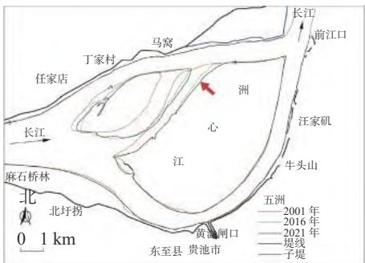  
(a)安庆河段江心洲  $5\mathrm{m}$  线

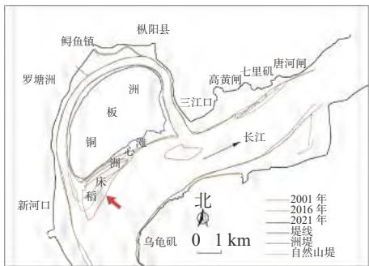  
(b) 太子矶河段铜板洲  $5 \mathrm{~m}$  线

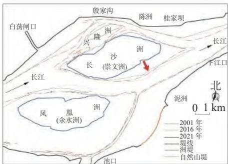  
(c) 贵池河段长沙洲  $0 \mathrm{~m}$  线

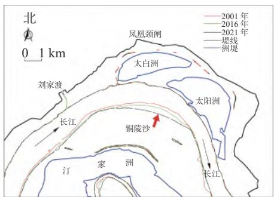  
(d) 铜陵河段铜陵沙  $0 \mathrm{~m}$  线  
图8 部分洲滩岸线变化  
Fig. 8 Shoreline changes on selected beaches

上述滩槽局部调整多发生在未经守护或守护相对薄弱的江心洲，且对上游来水的水沙特性较为敏感。河滩崩坍或冲退虽为2016—2021年间形成，但较三峡水库蓄水以来平均的冲刷变化有明显加剧，综合本文前述冲刷强度的变化数据可推知，2020年大洪水的造床作用对其影响最为显著。

# 4.3 河道断面

近年来，长江下游河道总体上以冲刷为主，纵断面进一步下切。以马挡河段棉船洲右汊为例，2001—2021年深泓纵剖面以冲刷下切为主(图9)，20年间纵剖面最大冲深约  $14.5\mathrm{m}$ ，平均冲深约  $2.0\mathrm{m}$ 。

河道束窄段横断面形态有进一步窄深化的趋势，例如官洲河段进口段(图10(a))，受吉阳矶节点控制河道束窄，主流自右向左过渡，2001年以来左缘稳定，右缘淤积束窄，深槽略有冲深；南京河段龙潭河口至三江口段亦为束窄段(图10(b))，主流贴右岸下行，近年来左缘淤积，深槽略有冲深，河相系数 $(\sqrt{B} /H)$ 由2.3减小到1.6。鉴于河道束窄段河势通常较展宽段和分汊段更为稳定，其变化趋势可在一定程度上反映河段总体的演变趋势，长江下游河段束窄段多有窄深化的发展趋势，也印证了河段总体上呈冲刷态势。

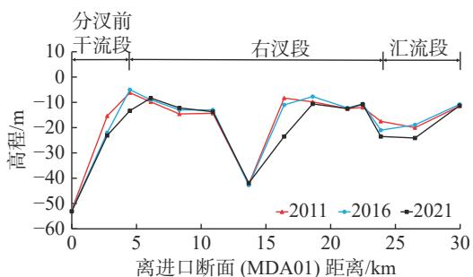  
图9 马挡河段棉船洲右汊深泓纵剖面变化  
Fig. 9 Changes in the longitudinal profile of the right branch of Mianchuan Island in Madang reach

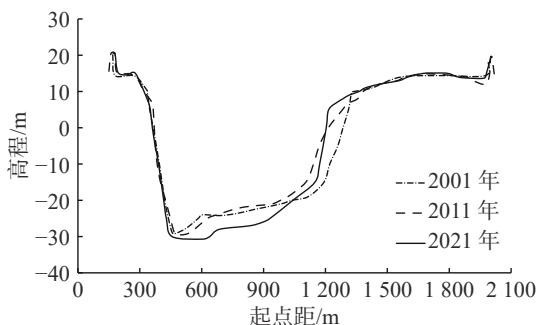  
(a) 官洲河段进口段 (GZA01)  
图10长江下游部分束窄段河道横断面变化

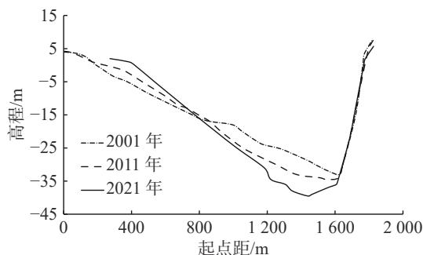  
(b) 南京河段龙潭河口至三江口段 (NJA25)  
Fig. 10 Changes in river cross-sections in some narrow sections of the lower Yangtze River

# 5 结语

2020年流域性大洪水后长江下游总体河势基本稳定，大多数河段冲刷加剧，且呈现滩槽普冲态势，各水位河槽冲刷强度为2016—2020年平均值的2.0~2.8倍，大通至江阴河段冲刷强度是上游湖口至大通河段的1.8倍，单河段以芜裕河段冲刷强度最大。南京河段不冲反淤，一方面是由于高潮位顶托降低了流速；另一方面与相对较为完善的河道守护限制了冲淤变化范围有关。南京河段的淤积成因与机理尚需深入研究。各汊道主流线走势整体稳定，分汊及汇流区仍有一定摆幅；整体分流格局相对稳定，但铜陵河段成德洲汊道有主支汊易位趋势，多次测得右汊分流比超过左汊；扬中河段支汊分流比持续微增，2020年大洪水冲刷使其支汊发展趋势进一步巩固，虽不危及主支汊格局，但趋势很难扭转。

长江下游两岸岸线基本稳定，局部虽有条崩发生，但基本无指南村类似的大型、灾害性窝崩发生，由于2020年高水位持续时间长，不少江心洲高滩、陡坎长期浸泡，未护段及薄弱段条崩频发。江心洲洲滩冲刷明显，洲滩面积萎缩，以江西、安徽两省尤为明显，主要原因是洲头守护工程相对于江苏薄弱，铜陵河段的铜陵沙一带出现撇岸切滩现象，滩槽冲淤仍较为频繁。长江下游河道演变规律虽未改变，但人工干预日益增强，双重影响下长江下游水沙特性及河床冲淤、河势变化将更加复杂，后续应进一步加强原型观测及分析研究工作。

# 参考文献：

[1]郑珮，王志昆.长江下游河道基本情况[C]//长江中下游河床演变分析文集(第四辑).武汉：水利部长江水利委员会水文局，1992.（ZHENG Ying, WANG Zhikun. Basic information of the lower Yangtze River[C]//Anthology of Analysis of Riverbed Evolution in the Middle and Lower Yangtze River (Ser4). Wuhan: Hydrology Bureau of Changjiang Water Resources Commission, Ministry of Water Resources, 1992. (in Chinese))  
[2] 忤宇凡, 姚仕明, 桑华龙, 等. 长江下游安庆河段演变规律与治理思路研究[J]. 人民长江, 2022, 53(4): 8-13. (WU Yufan, YAO Shiming, LUAN Hualong, et al. Research on evolution law of Anqing reach of lower reaches of Changjiang River and regulation thought[J]. Yangtze River, 2022, 53(4): 8-13. (in Chinese))  
[3] 曹双, 刘沛, 蔡磊, 等. 长江下游扬中环岛崩岸段河势变化及水动力特征分析[J]. 水利水电快报, 2020, 41(7): 41-48. (CAO Shuang, LIU Pei, CAI Lei, et al. Analysis of river regime change and hydrodynamic characteristics of ring island bank collapse in Yangzhong reach of lower Yangtze River[J]. Express Water Resources & Hydropower Information, 2020, 41(7): 41-48. (in Chinese))  
[4] 王爱春.长江下游仪征水道12.5m深水航道整治工程方案优化[J].水运工程，2016(6):1-6.（WANG Aichun. Optimization of waterway regulation scheme of Yizheng water reach in the lower reach of the Yangtze River[J]. Port & Waterway Engineering, 2016(6):1-6. (in Chinese))  
[5] 李文杰, 杨胜发, 付旭辉, 等. 三峡水库运行初期的泥沙淤积特点[J]. 水科学进展, 2015, 26(5): 676-685. (LI Wenjie,

YANG Shengfa, FU Xuhui, et al. Sedimentation characteristics in the Three Gorges Reservoir during the initial operation stage[J]. Advances in Water Science, 2015, 26(5): 676-685. (in Chinese))  
[6] LI W J, YANG S F, XIAO Y, et al. Rate and distribution of sedimentation in the Three Gorges Reservoir, upper Yangtze River[J]. Journal of Hydraulic Engineering, 2018, 144(8): 05018006.1-05018006.14.  
[7] 韦立新, 曹双, 包伟静. 长江下游控制站大通水文站来沙特性分析[C]//水文泥沙研究新进展: 中国水力发电工程学会水文泥沙专业委员会第八届学术讨论会论文集. 北京: 中国水利水电出版社, 2010: 356-362. (WEI Lixin, CAO Shuang, BAO Weijing. Analysis of incoming sand characteristics at Datong Hydrological Station in the lower reaches of Yangtze River[C]//New Progress in Hydrology and Sediment Research: Proceedings of the 8th Academic Symposium of the Hydrology and Sediment Professional Committee of the Chinese Hydroelectric Engineering Society. Beijing: China Water & Power Press, 2010: 356-362. (in Chinese))  
[8] 史常乐, 牛兰花, 赵国龙, 等. 三峡大坝—葛洲坝河段水沙变化及冲淤特性[J]. 水科学进展, 2020, 31(6): 875-884. (SHI Changle, NIU Lanhua, ZHAO Guolong, et al. Variation in water and sediment conditions and erosion and deposition characteristics in the reach between Three Gorges Dam and Gezhou Dam[J]. Advances in Water Science, 2020, 31(6): 875-884. (in Chinese))  
[9] 李志威, 王兆印, 贾艳红, 等. 三峡水库蓄水前后长江中下游江心洲的演变及其机理分析[J]. 长江流域资源与环境, 2015, 24(1): 65-73. (LI Zhiwei, WANG Zhaoyin, JIA Yanhong, et al. Evolution analysis of channel bars in the middle and lower Yangtze River before and after impoundment of Three Gorges Reservoir[J]. Resources and Environment in the Yangtze Basin, 2015, 24(1): 65-73. (in Chinese))  
[10] 朱玲玲, 许全喜, 熊明. 三峡水库蓄水后下荆江急弯河道凸冲凹淤成因[J]. 水科学进展, 2017, 28(2): 193-202. (ZHU Lingling, XU Quanxi, XIONG Ming. Fluvial processes of meandering channels in the lower Jingjiang River reach after the impoundment of Three Gorges Reservoir[J]. Advances in Water Science, 2017, 28(2): 193-202. (in Chinese))  
[11] 李明, 胡春宏. 三峡工程运用后坝下游分汊型河道演变与调整机理研究[J]. 泥沙研究, 2017, 42(6): 1-7. (LI Ming, HU Chunhong. Study on processes of braided river downstream of the Three Gorges Reservoir[J]. Journal of Sediment Research, 2017, 42(6): 1-7. (in Chinese))  
[12] 李明, 胡春宏, 方春明. 三峡水库坝下游河道断面形态调整模式与机理研究[J]. 水利学报, 2018, 49(12): 1439-1450. (LI Ming, HU Chunhong, FANG Chunming. Study on pattern and mechanism of river section topography adjustment in the downstream of the Three Gorges Project[J]. Journal of Hydraulic Engineering, 2018, 49(12): 1439-1450. (in Chinese))  
[13] YANG Yunping, ZHANG Mingjin, SUN Zhaohua, et al. The relationship between water level change and river channel geometry adjustment in the downstream of the Three Gorges Dam[J]. Journal of Geographical Sciences, 2018, 28(12): 1975-1993.  
[14] 李义天, 孙昭华, 邓金运. 论三峡水库下游的河床冲淤变化[J]. 应用基础与工程科学学报, 2003, 11(3): 283-295. (LI Yitian, SUN Zhaohua, DENG Jinyun. A study on riverbed erosion downstream from the Three Gorges Reservoir[J]. Journal of Basic Science and Engineering, 2003, 11(3): 283-295. (in Chinese))  
[15] 姚仕明, 卢金友. 长江中下游河道演变规律及冲淤预测[J]. 人民长江, 2013, 44(23): 22-28. (YAO Shiming, LU Jinyou. Evolution analysis and scouring-deposition prediction of middle and lower reaches of Yangtze River[J]. Yangtze River, 2013, 44(23): 22-28. (in Chinese))  
[16] 许全喜, 袁晶, 伍文俊, 等. 三峡工程蓄水运用后长江中游河道演变初步研究[J]. 泥沙研究, 2011(2): 38-46. (XU Quanxi, YUAN Jing, WU Wenjun, et al. Fluvial processes in middle Yangtze River after impoundment of Three Gorges Project[J]. Journal of Sediment Research, 2011(2): 38-46. (in Chinese))  
[17] 朱玲玲, 许全喜, 陈子寒. 新水沙条件下荆江河段强冲刷响应研究[J]. 应用基础与工程科学学报, 2018, 26(1): 85-97. (ZHU Lingling, XU Quanxi, CHEN Zihan. Extraordinary scour of Jingjiang reach downstream from Three Gorges Project[J]. Journal of Basic Science and Engineering, 2018, 26(1): 85-97. (in Chinese))  
[18] 许全喜, 董炳江, 张为. 2020年长江中下游干流河道冲淤变化特点及分析[J]. 人民长江, 2021, 52(12): 1-8. (XU Quanxi, DONG Bingjiang, ZHANG Wei. Characteristics and analysis on scouring and silting changes in main stream of middle and lower reaches of Changjiang River in 2020[J]. Yangtze River, 2021, 52(12): 1-8. (in Chinese))  
[19] 祁仰旭, 朱春光, 王义坤, 等. 流域性大洪水后长江新济洲汊道河势分析研究[J]. 江苏水利, 2022(1): 51-54, 59. (QI Yangxu, ZHU Chunguang, WANG Yikun, et al. Analysis and research on river regime of Xinjizhou Branch of Yangtze River after basin flood[J]. Jiangsu Water Resources, 2022(1): 51-54, 59. (in Chinese))  
[20]臧英平,李涛章,朱春光,等.长江南京河段河势变化分析[J].江苏水利,2021(增刊2):86-88.(ZANG Yingping,LI

Taozhang, ZHU Chunguang, et al. Analysis on river regime change in Nanjing reach of the Yangtze River[J]. Jiangsu Water Resources, 2021(Suppl2): 86-88. (in Chinese))  
[21] 陈敏. 2020年长江暴雨洪水特点与启示[J]. 人民长江, 2020, 51(12): 76-81. (CHEN Min. Characteristics and enlightenment of rainstorm and flood in Yangtze River in 2020[J]. Yangtze River, 2020, 51(12): 76-81. (in Chinese))  
[22] 姚仕明, 郭小虎, 陈栋, 等. 2020年汛期长江中下游河道洪水过程及特性分析[J]. 中国防汛抗旱, 2021, 31(2): 5-10. (YAO Shiming, GUO Xiaohu, CHEN Dong, et al. Analysis of the flood process and characteristics in the middle and lower reaches of the Yangtze River during the 2020 flood season[J]. China Flood & Drought Management, 2021, 31(2): 5-10. (in Chinese))  
[23] 郜建平, 邓鹏鑫, 徐高洪, 等. 2020年长江中下游干流高洪水位特点及成因分析[J]. 水利水电快报, 2021, 42(1): 10-16. (BING Jianping, DENG Pengxin, XU Gaohong, et al. Analysis on characteristics and causes of high flood level in middle and lower reaches of Yangtze River of 2020[J]. Express Water Resources & Hydropower Information, 2021, 42(1): 10-16. (in Chinese))  
[24] 许全喜. 三峡工程蓄水运用前后长江中下游干流河道冲淤规律研究[J]. 水力发电学报, 2013, 32(2): 146-154. (XU Quanxi. Study of sediment deposition and erosion patterns in the middle and downstream Changjiang mainstream after impoundment of TGR[J]. Journal of Hydroelectric Engineering, 2013, 32(2): 146-154. (in Chinese))

# Analysis of evolution in the lower Yangtze River under the effect of the great basin flood in 2020

CAO Shuang, CHENG Long, LI Jie, LUO Hongyu

(Lower Changjiang River Bureau of Hydrology and Water Resources Survey, Changjiang Water Resources Commission, Nanjing 210011, China)

Abstract: Since the impoundment of the Three Gorges Reservoir (TGR) in 2003, the flow-sediment characteristics of the lower Yangtze River have changed significantly. In the summer of 2020, the Yangtze River basin experienced a great basin flood second only to those of 1954 and 1998 since the founding of PRC. Based on the analysis of the flow and sediment characteristics of the lower Yangtze River since TGR operation, the characteristics of multi-year river erosion and deposition in the lower Yangtze River from Hukou to Jiangyin were analyzed, and the characteristics of riverbed erosion and deposition and riverbed evolution under the effect of the 2020 flood were discussed, using the topographic and cross-sectional data. The study showed that the average annual runoff of the lower Yangtze River had changed little since TGR was impounded, but sediment transport had decreased sharply and the relationship between flow and sediment transport had changed significantly. The Hukou-Jiangyin reach had both erosion and deposition from 1998 to 2006, and turned to unidirectional erosion in both channel and beach after 2006. After the 2020 flood, the lower Yangtze River continued and enlarged this erosion characteristic, with the erosion intensity at different water levels enlarged by 2.0 to 2.8 times comparing to the average value during 2016 to 2020. The erosion intensity of the reaches upstream of Datong was less than that of the downstream reaches. The overall pattern of diversions in the lower Yangtze River was stable. But there was a tendency for the main branch to shift in the Chengdezhou branching channel, with the right branching diversion ratio exceeding that of the left in several measurements. The anabranch developed in the Yangzhong reach, with a continuous trend of slight increase in the diversion ratio. The river was generally stable, while a number of sandbanks eroded significantly. Tonglingsha experienced shore-cutting for the first time. And avalanches occurred in some central islands in river sections such as the Yangzhong reach. The riverbed was eroded in the longitudinal direction as before, and the cross-sectional pattern of the narrower sections was further narrowed and deepened. Analysis on the evolution characteristics of river channel erosion and deposition under great flood conditions is conducive to a more comprehensive and systematic grasp of the riverbed evolution of the lower Yangtze River.

Key words: the lower reaches of the Yangtze River; great basin flood; erosion and deposition of river; riverbed evolution