# 光伏发电系统抑制电力系统功率振荡的机理

柴华1, 张学军1, 李明贤2, 唐震1,3, 郝捷3, 郑惠萍3

(1. 山西大学 电力与建筑学院, 山西省 太原市 030006;

2. 中国矿业大学 电气与动力工程学院，江苏省 徐州市 221116;  
3.国网山西电力公司电力科学研究院，山西省太原市030001）

# Mechanism for Photovoltaic Generation System Suppressing Power System Oscillations

CHAI Hua1, ZHANG Xuejun1, LI Mingxian2, TANG Zhen1,3, HAO Jie3, ZHENG Huiping3

(1. School of Electric Power and Architecture, Shanxi University, Taiyuan 030006, Shanxi Province, China;  
2. College of Electrical and Power Engineering, China University of Mining and Technology, Xuzhou 221116, Jiangsu Province, China;  
3. State Grid Shanxi Electric Power Research Institute, Taiyuan 030001, Shanxi Province, China)

ABSTRACT: Photovoltaic (PV) generation system can improve the power balance characteristics of the power system by dynamically adjusting the active power and reactive power injected into the grid, and suppress the power grid oscillation phenomenon. To reveal the mechanism of PV suppressing power system oscillations, this paper describes the active and reactive power output characteristics of PV through two controlled current sources under the electromechanical time scale. Based on this, the system active power distribution model of PV suppressing oscillation is established. The electrical torque method is used to analyze the physical mechanism of PV affecting the system inertia level, damping capacity, and synchronization characteristics and its influence law under the oscillation suppression mode. The research show that: If PV dynamically adjusts the active and reactive power output according to the change of the characteristic quantities such as speed, frequency, power, and power angle during the system oscillation process, the system inertia level, damping capacity, and synchronization characteristics will be equivalently enhanced. Therefore, PV can actively adjust the rotor speed oscillation amplitude, oscillation period and attenuation speed.

KEY WORDS: power oscillation; photovoltaic power generation system; inertia level; damping capacity; synchronization characteristics

摘要：光伏��ovoltaic，PV)发电系统可通过动态调控注入电网的有功功率、无功功率来改善电力系统的功率平衡特性，从而抑制电网功率振荡现象。为揭示PV抑制电网功率振荡的机理，通过2个受控电流源来描述PV在机电时间尺度下的有功、无功功率输出特性，建立了PV抑制功率振荡时电网有功功率分布模型，利用电气转矩法分析了PV在振荡抑制模式下影响同步机系统惯量水平、阻尼能力以及同步特性的物理机制及其影响规律。研究结果表明：根据系统振荡过

程中的转速、频率、功率、功角等特征量的变化趋势来动态调控 PV 输出的有功、无功功率，能改变系统的惯量水平、阻尼能力、同步特性，从而可对系统功率振荡的幅值、周期以及振幅的衰减速度进行有效的调控。

关键词：功率振荡；光伏发电系统；惯量水平；阻尼能力；同步特性

DOI: 10.13335/j.1000-3673.pst.2020.0090

# 0 引言

随着化石能源的逐渐枯竭和环境问题的日益严重，大力开发利用可再生能源已成为大势所趋。大量新能源电源通过逆变器并入电力网络，严重地削弱了电力系统的惯量水平和阻尼能力，将导致功率振荡现象频发，威胁电力系统的安全稳定运行[1-4]。因此，在不断提升可再生能源渗透率的同时，如何同步地增强电力系统(以下简称电网)抑制功率振荡的能力成为亟待解决的问题。

目前主要有3类来增强电网抑制振荡的措施，包括：电力系统稳定器(power system stabilizer，PSS)[5]、柔性交流输电系统(flexible AC transmission systems，FACTS)[6]以及储能系统(energy storage system，ESS)[7-8]。PSS通常安装在同步机的励磁系统中，通过励磁控制来增强同步机抑制电网振荡的能力，目前应用得最为广泛。然而，在可再生能源高渗透的电力系统中，同步机装机比例有限，PSS对抑制电网功率振荡的贡献也因此受到限制。文献[6]分析了典型FACTS装置的工作原理及其应用于抑制电网振荡的研究现状。文献[7]探讨了加装储能装置来抑制电网振荡的可能性。现有的研究证实了这2种措施对提升抑制电网振荡能力的有效性，

但均需要新增额外的设备，对于系统级的应用需求来说，需要加装的设备容量很大，经济效益不高，其应用推广会受到一定的制约。

光伏��伏，PV发电系统作为一种可再生的清洁能源，其在全球的装机量保持稳步增长[9]。在PV占比较高的电力系统中，通过控制PV系统的功率输出来抑制电网的振荡，不仅是可行的，在经济性上也是合理的。通过对PV输出的有功、无功进行适当的控制，可以增加电网的阻尼能力，从而有效地抑制电网的功率振荡[10]。通过调控PV的有功输出特性[11-12]，或通过利用光伏逆变器的剩余容量来调控PV的无功输出特性[13-14]，均可实现对电网功率振荡过程的有效抑制。文献[15]为抑制电网功率振荡，提出了调节PV最大有功输出以自动改变电网阻尼的控制策略。文献[16]基于动态组合有功功率和无功功率，提出了光伏电站售电和抑制振荡2种收益方式，可快速抑制电网的功率振荡。

虽然已有文献研究了PV提高电网抑制功率振荡的能力和控制策略，但鲜有文献深入研究PV抑制电网振荡的机理及其对电网阻尼能力、同步特性以及惯量水平的影响规律。为此，本文聚焦于PV抑制电网功率振荡的机理研究，以期从形式各异的振荡抑制策略中发现一些共性规律，为特定的工程应用场景匹配最佳的控制策略或者开发更具有针对性的振荡抑制措施提供理论基础。

# 1 PV抑制振荡时的控制策略及电网功率的动态特性

电网功率振荡通常表现为发电机之间的转子相对摇摆，为此本文选取如图1所示的系统进行研究，以清晰直观地说明光伏系统与大电网之间的交互作用机理。其中，光伏发电系统采用目前较为常见的多个单级式逆变器并联结构，且每个光伏模块的结构参数和控制参数相同[17-18]。 $P_{\mathrm{e}}$ 为同步发电机(synchronous generator，SG)输出的电磁功率， $P_{\mathrm{m}}$ 为SG的原动机功率， $\omega$ 为SG的转子转速， $\delta$ 为SG的功角， $Z_{\mathrm{L0n}}(n=1,2,3\dots)$ 、 $Z_{\mathrm{L1}}$ 、 $Z_{\mathrm{L2}}$ 为线路的等效阻抗。 $I_{\mathrm{d}}$ 、 $I_{\mathrm{q}}$ 、 $U_{\mathrm{d}}$ 、 $U_{\mathrm{q}}$ 分别为PV输出电流、并网点电压在 $dq$ 坐标系下的 $d$ 轴、 $q$ 轴分量。文中，下标“0”均表示参数的稳态值。当PV采用基于电网电压定向的矢量控制策略时， $U_{\mathrm{q}}=0\mathrm{V}$ ，PV输出的有功功率 $P$ 、无功功率 $Q$ 为

$$
\left\{ \begin{array}{l} P = \frac {3}{2} \left(U _ {d} I _ {d} + U _ {q} I _ {q}\right) = \frac {3}{2} U _ {d} I _ {d} \\ Q = \frac {3}{2} \left(U _ {d} I _ {q} - U _ {d} I _ {q}\right) = - \frac {3}{2} U _ {d} I _ {q} \end{array} \right. \tag {1}
$$

  
图1含PV的单机无穷大系统模型  
Fig. 1 Single machine infinite bus system with PV

# 1.1 PV 抑制振荡的控制策略

当电网出现功率振荡现象时，SG的转速ω、功角δ、电网频率等关键物理量均会随之出现振荡，此时应及时调整PV输出的有功功率P和无功功率Q，使系统朝着有利于平抑振荡的方向进行演化。

分析现有的文献[10-16]可知：PV 抑制电网功率振荡的控制策略主要基于转速(或频率)、功角(或功率)这2类参数作为反馈信号，如图2所示。其中， $I_{d}^{*}$ 、 $I_{q}^{*}$ 分别为PV在  $d$  轴、 $q$  轴电流指令。

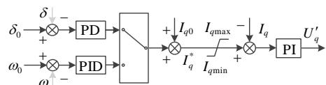  
图2 PV抑制电网功率振荡的控制模型  
Fig. 2 Control model for PV to suppress power oscillation

显然，当系统处于稳态工况时， $I_{d}=I_{d0}$ 、 $I_{q}=I_{q0}$ ；而出现振荡时，图2中  $I_{d} 、 I_{q}$  将偏离稳态工作点  $I_{d0}$ 、 $I_{q0}$ ，其值取决于PV控制策略以及反馈信号。

当反馈信号为 SG 的转速或系统的频率且采用 PID 控制时， $I_{d}$ 、 $I_{q}$  分别为

$$
I _ {d} = I _ {d} ^ {*} = \left(K _ {\mathrm {p p}} + \int_ {0} ^ {t} K _ {\mathrm {i p}} \mathrm {d} t + \frac {\mathrm {d} K _ {\mathrm {d p}}}{\mathrm {d} t}\right) \left(\omega_ {0} - \omega\right) + I _ {d 0} \tag {2}
$$

$$
I _ {q} = I _ {q} ^ {*} = \left(K _ {\mathrm {p q}} + \int_ {0} ^ {t} K _ {\mathrm {i q}} \mathrm {d} t + \frac {\mathrm {d} K _ {\mathrm {d q}}}{\mathrm {d} t}\right) \left(\omega_ {0} - \omega\right) + I _ {q 0} \tag {3}
$$

当反馈信号为 SG 的功角或线路的有功功率且采用 PD 控制时， $I_{d}$ 、 $I_{q}$  分别为

$$
I _ {d} = I _ {d} ^ {*} = \left(K _ {\mathrm {p p}} + \frac {\mathrm {d} K _ {\mathrm {d p}}}{\mathrm {d} t}\right) \left(\delta_ {0} - \delta\right) + I _ {d 0} \tag {4}
$$

$$
I _ {q} = I _ {q} ^ {*} = (K _ {\mathrm {p q}} + \frac {\mathrm {d} K _ {\mathrm {d q}}}{\mathrm {d} t}) (\delta_ {0} - \delta) + I _ {q 0} \tag {5}
$$

式中： $K_{\mathrm{pp}}$ 、 $K_{\mathrm{ip}}$ 、 $K_{\mathrm{dp}}$  和  $K_{\mathrm{pq}}$ 、 $K_{\mathrm{iq}}$ 、 $K_{\mathrm{dq}}$  分别为转速(或功角)有功控制环 P、I、D 和无功控制环 P、I、D 控制器的增益。需要说明的是：当功角或线路有功作为反馈信号时，相应控制器很少采用积分控制，其原因是积分控制器将导致系统动态特性呈现非线性，不利于控制器参数设计。

若PV始终运行于最大功率跟踪(maximumpower point tracking，MPPT)模式，其有功功率输出能力已经达到了上限值，只能在振荡过程中降低其有功功率  $P$  ；或者利用逆变器的剩余容量来调控其无功功率  $Q$  ，且必须满足：

$$
0 \leq | Q | \leq Q _ {\max } = \sqrt {S ^ {2} - P ^ {2}} \tag {6}
$$

式中  $S$  表示光伏逆变器的容量。

考虑到电网的调频需求，本文假定PV留有适量的有功备用，且备用容量可在0至最大输出功率 $P_{\mathrm{mppt}}$ 之间灵活调整，如下式：

$$
0 \leq P \leq P _ {\mathrm {m p p t}} \leq S \tag {7}
$$

显然，有功备用越大，PV向上调节范围越大，对有功不足导致的振荡的抑制能力也越强。

根据图3所示的PV特性曲线可知，以MPPT点为界，PV的功率特性曲线分成了左、右2区域。左、右区域对应的直流电压  $U_{\mathrm{dc}}$  范围分别为  $(U_{\mathrm{min}}$ ，  $U_{\mathrm{mppt}})$  和  $(U_{\mathrm{mppt}}$ ，  $U_{\mathrm{oc}})$  。  $U_{\mathrm{oc}}$  、  $I_{\mathrm{sc}}$  分别为PV的开路电压、短路电流。工程上一般选择右区域(即图3中的阴影区域)作为  $U_{\mathrm{dc}}$  的工作区域。

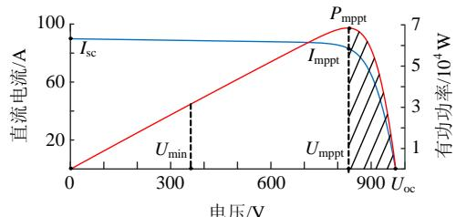  
图3 PV的  $P - U - I$  特性曲线  
Fig.3  $P$  U-I characteristic curve of PV

为防止变流器过载，还需要对  $I_{d} 、 I_{q}$  进行限幅。根据式(6)(7)的约束条件以及图3工作区域的限定，即可得到  $I_{d} 、 I_{q}$  的约束条件为

$$
\left\{ \begin{array}{l} 0 \leq I _ {d} \leq \frac {2 U _ {\mathrm {m p p t}}}{3 U _ {d}} I _ {\mathrm {m p p t}} = I _ {d \max } \\ 0 \leq \left| I _ {q} \right| \leq \frac {2 \sqrt {S ^ {2} - P ^ {2}}}{3 U _ {d}} = I _ {q \max } \end{array} \right. \tag {8}
$$

# 1.2 电网有功功率动态特性分析

PV 参与电网功率振荡抑制时，电网有功功率的动态特性将因 PV 调控其输出功率而发生改变。

功率振荡通常为 s 级，属于机电时间尺度动态过程，而光伏逆变器的响应时间为 ms 级，属于电

磁时间尺度过程[19-20]。根据多时间尺度建模的思路，逆变器电流环控制的动态过程可忽略不计。结合图2给出的控制策略，可将每个PV均等效为2个受转速或功角控制的受控电流源，所有PV合并成2个受控电流源  $\dot{I}_{\mathrm{D}}$  、  $\dot{I}_{\mathrm{Q}}$  ，分别为光伏发电系统发出的有功、无功电流，如图4所示。

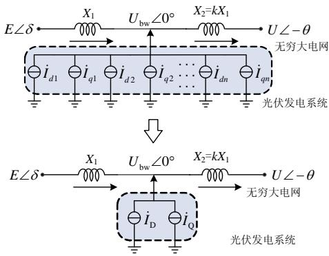  
图4 系统等效模型  
Fig. 4 Equivalent system model

图4中，电动势  $E\angle \delta$  、  $U_{\mathrm{bw}}\angle 0^{\circ}$  、  $U\angle -\theta$  分别表示SG、PV并网点以及大电网；  $X_{1}$  、  $X_{2}$  分别为PV与SG以及大电网之间的线路阻抗，且假设 $X_{2} = kX_{1}$  。  $k$  为PV的位置系数，表示PV的接入位置。当  $k$  趋近于0时，PV靠近电网；当  $k$  趋近于无穷大时，PV靠近SG。

为简化分析，设在电网功率振荡时，每个 PV 模块输出的有功电流和无功电流相等，即

$$
\dot {I} _ {\mathrm {D}} + \dot {I} _ {\mathrm {Q}} = \sum_ {x = 1} ^ {n} \dot {I} _ {d x} + \sum_ {x = 1} ^ {n} \dot {I} _ {q x} = n \dot {I} _ {d} + n \dot {I} _ {q} \tag {9}
$$

系统电压相量图如图5所示，假定  $E$  、  $U$  相等且恒定不变。

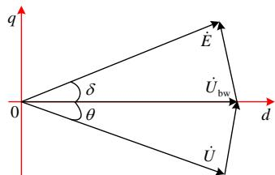  
图5 系统电压相量图  
Fig. 5 Phasor diagram of system

由图5可知，SG发出的电磁功率为

$$
P _ {\mathrm {e}} = \frac {E U _ {\mathrm {b w}}}{X} \sin \delta \tag {10}
$$

电网吸收的功率为

$$
P _ {\infty} = \frac {U U _ {\mathrm {b w}}}{k X} \sin \theta \tag {11}
$$

由KVL定律得：

$$
(k E \sin \delta + k X I _ {\mathrm {D}}) ^ {2} +
$$

$$
[ U _ {\mathrm {b w}} (1 + k) - k E \cos \delta + k X I _ {\mathrm {Q}} ] ^ {2} = U ^ {2} \tag {12}
$$

可知：PV的并网点电压  $U_{\mathrm{bw}}$  是由  $\delta$  、  $I_{\mathrm{D}}$  、  $I_{\mathrm{Q}}$  共

同决定，若  $U_{\mathrm{bw}}$  为因变量，  $\delta$  、  $I_{\mathrm{D}}$  、  $I_{\mathrm{Q}}$  则为自变量。

将式(12)线性化可得：

$$
\Delta U _ {\mathrm {b w}} = A \Delta \delta - B \Delta I _ {\mathrm {D}} - C \Delta I _ {\mathrm {Q}} \tag {13}
$$

其中：

$$
A = - \frac {k E}{1 + k} \left[ \frac {(E \sin \delta_ {0} + n X I _ {d 0}) k \cos \delta_ {0}}{U _ {\mathrm {b w} 0} (1 + k) - k E \cos \delta_ {0} + k n X I _ {q 0}} + \sin \delta_ {0} \right] \tag {14}
$$

$$
B = \frac {k ^ {2} X \left(E \sin \delta_ {0} + n X I _ {d 0}\right)}{\left[ U _ {\mathrm {b w} 0} (1 + k) - k E \cos \delta_ {0} + n k X I _ {q 0} \right] (1 + k)} \sin \delta_ {0} \tag {15}
$$

$$
C = \frac {k X}{1 + k} \tag {16}
$$

由式(13)可知：PV改变向系统注入的有功功率 $P$ 、无功功率  $Q$  将导致并网点电压  $U_{\mathrm{bw}}$  发生变化，进而导致  $P_{\mathrm{e}}$  变化，最终影响系统的有功变化过程。式(10)的线性化表达式即可描述这一作用规律，即

$$
\Delta P _ {\mathrm {e}} = \lambda_ {\mathrm {g}} \Delta \delta - \lambda_ {\mathrm {p}} \Delta I _ {\mathrm {D}} - \lambda_ {\mathrm {q}} \Delta I _ {\mathrm {Q}} \tag {17}
$$

式中  $\lambda_{\mathrm{g}}$  、  $\lambda_{\mathrm{p}}$  、  $\lambda_{\mathrm{q}}$  分别为电网同步系数、PV有功控制系数、PV无功控制系数，且：

$$
\lambda_ {\mathrm {g}} = \frac {E \left(A \sin \delta_ {0} + U _ {\mathrm {b w} 0} \cos \delta_ {0}\right)}{X} \tag {18}
$$

$$
\lambda_ {\mathrm {p}} = \frac {E B \sin \delta_ {0}}{X} \tag {19}
$$

$$
\lambda_ {\mathrm {q}} = \frac {E C \sin \delta_ {0}}{X} \tag {20}
$$

式中： $\lambda_{\mathrm{g}}$  表示系统自身的同步能力； $\lambda_{\mathrm{p}}$ 、 $\lambda_{\mathrm{q}}$  分别表示PV的有功控制、无功控制对  $P_{\mathrm{e}}$  的影响能力。

由式(17)可知：  $I_{\mathrm{D}}$  、  $I_{\mathrm{Q}}$  和  $\delta$  的变化均会影响系统的有功分布，最终改变 SG 的功率平衡状况，影响电网的振荡过程。

# 2 PV抑制电网振荡的机理分析

由以上分析可知，通过动态调控PV注入到系统的有功、无功功率能影响电网的振荡过程。为进一步分析PV对电网动态特性的影响机理，本文引用电气转矩法[21]来描述系统的动态过程，其标准数学模型为

$$
\left\{ \begin{array}{l} \frac {\mathrm {d} \Delta \delta}{\mathrm {d} t} = \Delta \omega \\ T _ {\mathrm {J}} \frac {\mathrm {d} \Delta \omega}{\mathrm {d} t} = - T _ {\mathrm {S}} \Delta \delta - T _ {\mathrm {D}} \Delta \omega \end{array} \right. \tag {21}
$$

式中  $T_{\mathrm{J}}$  、  $T_{\mathrm{S}}$  、  $T_{\mathrm{D}}$  分别为 SG 的惯量、同步、阻尼系数。

根据电气转矩法的理论：增大  $T_{\mathrm{D}}$ ，系统的阻尼能力将随之增强，电网振荡的最大幅值将变小、振幅衰减变快；增大  $T_{\mathrm{S}}$ ，系统的同步能力将随之增强，电网振荡周期变短；增大  $T_{\mathrm{J}}$ ，系统的惯量水平将随之提升，电网抵抗扰动的能力将随之增强，系统不

容易出现功率振荡过程。因此，分析 PV 对系统惯量系数、同步系数、阻尼系数的影响规律即可揭示 PV 抑制电网振荡的物理机制。

为获得式(21)所示的标准方程，本文对系统的机电过程进行了动力学建模。忽略 SG 的机械阻尼，SG 的机电暂态过程常用标幺化的二阶运动方程来描述，即

$$
\left\{ \begin{array}{l} \frac {\mathrm {d} \delta}{\mathrm {d} t} = (\omega - 1) \omega_ {0} \\ 2 H \frac {\mathrm {d} \omega}{\mathrm {d} t} = P _ {\mathrm {m}} - P _ {\mathrm {e}} - D (\omega - \omega_ {0}) \end{array} \right. \tag {22}
$$

式中  $H$  、  $D$  分别为SG的转动惯量、阻尼系数。

将式(22)线性化形式，并假定振荡过程中  $P_{\mathrm{m}}$  保持不变，得到[22]：

$$
\left\{ \begin{array}{l} \frac {\mathrm {d} \Delta \delta}{\mathrm {d} t} = \Delta \omega \\ 2 H \frac {\mathrm {d} \Delta \omega}{\mathrm {d} t} = - \Delta P _ {\mathrm {e}} - D \Delta \omega \end{array} \right. \tag {23}
$$

将式(17)代入式(23)，即可得到考虑PV调控作用时的系统动态方程为

$$
\left\{ \begin{array}{l} \frac {\mathrm {d} \Delta \delta}{\mathrm {d} t} = \Delta \omega \\ 2 H \frac {\mathrm {d} \Delta \omega}{\mathrm {d} t} = - \lambda_ {\mathrm {g}} \Delta \delta + \lambda_ {\mathrm {p}} \Delta I _ {\mathrm {D}} + \lambda_ {\mathrm {q}} \Delta I _ {\mathrm {Q}} - D \Delta \omega \end{array} \right. \tag {24}
$$

由此可知: 光伏逆变器输出电流  $I_{\mathrm{D}} 、 I_{\mathrm{Q}}$  的变化过程会改变电力系统的动态特性, 而  $I_{\mathrm{D}} 、 I_{\mathrm{Q}}$  的变化过程由图 2 所示的逆变器控制策略决定。

# 2.1 基于转速/频率反馈的控制模式

若利用 SG 的转速信号或系统的频率信号作为反馈信号进行控制，且转速/频率控制环采用 PID 控制时， $I_{d}$  的表达式如式(2)所示，将其线性化并联立式(9)转化为  $s$  域方程可得[9]：

$$
\Delta I _ {\mathrm {D}} = - n (K _ {\mathrm {p p}} \Delta \omega + K _ {\mathrm {i p}} \frac {\Delta \omega}{s} + s K _ {\mathrm {d p}} \Delta \omega) \tag {25}
$$

该式表明：当 SG 的转速增加(减少)时，PV 通过减少(增加)有功输出  $P$  来减少有功差额来抑制 SG 转速偏差，从而实现抑制电网功率振荡。

此外，PV还可以同时通过调控其无功输出  $Q$  来改变并网点电压  $U_{\mathrm{bw}}$  ，间接影响SG的电磁功率 $P_{\mathrm{e}}$  。此时，  $I_{q}$  的变化规律如式(3)所示，将其线性化并联立式(9)转化为  $s$  域方程可得：

$$
\Delta I _ {\mathrm {Q}} = - n (K _ {\mathrm {p q}} \Delta \omega + K _ {\mathrm {i q}} \frac {\Delta \omega}{s} + s K _ {\mathrm {d q}} \Delta \omega) \tag {26}
$$

将式(9)、式(25)和式(26)代入式(24)，并整理为类似于式(20)所示的标准形式，即

$$
(2 H + n \lambda_ {\mathrm {p}} K _ {\mathrm {d p}} + n \lambda_ {\mathrm {q}} K _ {\mathrm {d q}}) s \Delta \omega = - (\lambda_ {\mathrm {g}} + n \lambda_ {\mathrm {p}} K _ {\mathrm {i p}} +
$$

$$
\left. n \lambda_ {\mathrm {q}} K _ {\mathrm {i q}}\right) \Delta \delta - \left(n \lambda_ {\mathrm {p}} K _ {\mathrm {p p}} + n \lambda_ {\mathrm {q}} K _ {\mathrm {p q}} + D\right) \Delta \omega \tag {27}
$$

将式(27)与式(21)进行类比，可得：

$$
\left\{ \begin{array}{l} T _ {\mathrm {J}} = 2 H + n \lambda_ {\mathrm {p}} K _ {\mathrm {d p}} + n \lambda_ {\mathrm {q}} K _ {\mathrm {d q}} \\ T _ {\mathrm {S}} = \lambda_ {\mathrm {g}} + n \lambda_ {\mathrm {p}} K _ {\mathrm {i p}} + n \lambda_ {\mathrm {q}} K _ {\mathrm {i q}} \\ T _ {\mathrm {D}} = D + n \lambda_ {\mathrm {p}} K _ {\mathrm {p p}} + n \lambda_ {\mathrm {q}} K _ {\mathrm {p q}} \end{array} \right. \tag {28}
$$

上式表明：当PV采用基于转速或频率信号反馈的有功/无功控制策略时，转速或频率环的控制器参数 $K_{\mathrm{p}}$ 、 $K_{\mathrm{i}}$ 、 $K_{\mathrm{d}}$ 将分别改变系统的阻尼、同步、惯量系数，进而调控电网的功率振荡特性。可以看出，当增大 $K_{\mathrm{p}}$ 、 $K_{\mathrm{i}}$ 、 $K_{\mathrm{d}}$ 时，系统的阻尼能力、同步特性、惯量水平将随之增强。

将式(28)代入式(23)可得系统的传递函数为

$$
\frac {\Delta \delta}{\Delta P _ {\mathrm {m}}} = \frac {1}{T _ {\mathrm {J}} s ^ {2} + T _ {\mathrm {D}} s + T _ {\mathrm {S}}} \tag {29}
$$

其特征根为

$$
\beta_ {1, 2} = - \frac {T _ {\mathrm {D}}}{2 T _ {\mathrm {J}}} \pm \frac {\sqrt {T _ {\mathrm {D}} ^ {2} - 4 T _ {\mathrm {J}} T _ {\mathrm {S}}}}{2 T _ {\mathrm {J}}} \tag {30}
$$

为分析各控制器增益对系统稳定性的影响，绘制出在其他PID控制器增益为0的情况下，从0开始增大  $K_{\mathrm{pp}}$  、  $K_{\mathrm{ip}}$  、  $K_{\mathrm{dp}}$  和  $K_{\mathrm{pq}}$  、  $K_{\mathrm{iq}}$  、  $K_{\mathrm{dq}}$  时系统的特征值根轨迹，如图6所示，其他具体参数见表2。

图6中，点越稀疏代表根轨迹变化越快。由此

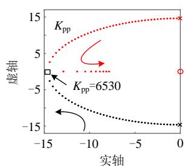

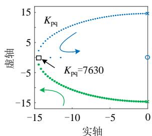

  
(a)  $K_{\mathrm{pp}}$

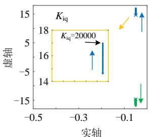  
(b)  $K_{\mathrm{pq}}$

  
(c)  $K_{\mathrm{ip}}$  
(e)  $K_{\mathrm{dp}}$  
图6同步发电机的根轨迹分析  
Fig. 6 Root locus analysis of synchronous generator

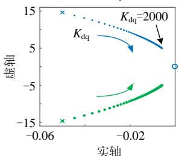  
(d)  $K_{\mathrm{iq}}$  
(f)  $K_{\mathrm{dq}}$

可知，在PV以供电为主的情况下，有功输出  $P$  对系统稳定性的影响比无功输出  $Q$  更大，即通常PV有功调节抑制电网功率振荡的能力更强。此外， $K_{\mathrm{pp}}$  和  $K_{\mathrm{pq}}$  的增加均可使系统趋于稳定。 $K_{\mathrm{ip}}$  和  $K_{\mathrm{iq}}$  不会对系统稳定性产生影响。 $K_{\mathrm{dp}}$  和  $K_{\mathrm{dq}}$  的增加使系统稳定性趋近于临界稳定，但不会使系统失稳。

# 2.2 基于功角/功率反馈的控制模式

若利用 SG 的功角信号或系统功率信号作为反馈信号进行控制，且功角/功率控制环采用 PD 控制时， $I_{d}$  的表达式如式(4)所示，将其线性化并联立式(9)转化为  $s$  域方程可得：

$$
\Delta I _ {\mathrm {D}} = - n (K _ {\mathrm {p p}} \Delta \delta + K _ {\mathrm {d p}} \Delta \omega) \tag {31}
$$

该式表明: 当 SG 的功角  $\delta$  增加(减少)时, PV 通过减少(增加)有功输出  $P$  减少系统中的有功差额来抑制 SG 的功角偏差  $\Delta \delta$ , 从而抑制电网功率振荡。

同理，PV 也可以通过调控其无功输出  $Q$  来实现电网功率振荡抑制，此时， $I_{q}$  的变化规律如式(5)所示，将其线性化并联立式(9)转化为  $s$  域方程：

$$
\Delta I _ {\mathrm {Q}} = - n (K _ {\mathrm {p q}} \Delta \delta + K _ {\mathrm {d q}} \Delta \omega) \tag {32}
$$

将式(31)和式(32)代入式(24)，并整理为类似于式(21)所示的标准形式，即

$$
\begin{array}{l} 2 H s \Delta \omega = - \left(\lambda_ {\mathrm {g}} + n \lambda_ {\mathrm {p}} K _ {\mathrm {p p}} + n \lambda_ {\mathrm {q}} K _ {\mathrm {p q}}\right) \Delta \delta - \\ (D + n \lambda_ {\mathrm {p}} K _ {\mathrm {d p}} + n \lambda_ {\mathrm {q}} K _ {\mathrm {d q}}) \Delta \omega \tag {33} \\ \end{array}
$$

将式(33)与式(22)进行类比，可得：

$$
\left\{ \begin{array}{l} T _ {\mathrm {J}} = 2 H \\ T _ {\mathrm {S}} = \lambda_ {\mathrm {g}} + n \lambda_ {\mathrm {p}} K _ {\mathrm {p p}} + n \lambda_ {\mathrm {q}} K _ {\mathrm {p q}} \\ T _ {\mathrm {D}} = D + n \lambda_ {\mathrm {p}} K _ {\mathrm {d p}} + n \lambda_ {\mathrm {q}} K _ {\mathrm {d q}} \end{array} \right. \tag {34}
$$

该式表明：当PV采用基于功角或功率信号反馈的有功/无功控制策略时，功角或功率环控制器参数 $K_{\mathrm{p}}$  和  $K_{\mathrm{d}}$  可以分别改变系统的同步系数和阻尼系数，进而调控电网的功率振荡特性。当增大  $K_{\mathrm{p}}$  、  $K_{\mathrm{d}}$  ，系统的同步特性、阻尼能力将随之增强。

将式(34)与式(28)进行比较可知，基于功角/功率反馈的控制器增益  $K_{\mathrm{p}}$  、  $K_{\mathrm{d}}$  的根轨迹与于基于转速/频率反馈的控制器增益  $K_{\mathrm{i}}$  、  $K_{\mathrm{p}}$  一一对应。限于篇幅，在PV采用功角/功率控制策略时的系统的根轨迹分析不再赘述。

综上，PV抑制电网功率振荡的机理分析如表1所示。系统的动态特性由其自身的固有系数和PV的控制参数共同决定。基于此，即可设计出有效的PV控制策略，实现对电网功率振荡的有效抑制。

# 3 仿真验证

为验证上述机理分析的正确性，针对图1所示

表 1 PV 抑制电网功率振荡的机理分析  
Table 1 Mechanism analysis of PV suppress power oscillations in power grid  

<table><tr><td>动态特性</td><td>反馈转速</td><td>反馈功角</td></tr><tr><td>惯性系数</td><td>2H+nλdKdp+nλqKdq</td><td>2H</td></tr><tr><td>同步系数</td><td>λg+nλdKip+nλqKiq</td><td>λg+nλdKpp+nλqKpq</td></tr><tr><td>阻尼系数</td><td>D+nλdKpp+nλqKpq</td><td>D+nλdKdp+nλqKdq</td></tr></table>

系统，采用RT-LAB搭建实验环境，如图7所示。光伏模块为2台结构与控制都相同的光伏逆变器并联，主要电路参数如表2所示。其中，光伏模块型号为：SunPower SPR-305-WH T-U，采用15串15并结构。假定温度和光照强度保持不变，PV的  $P-U-I$  曲线如图3所示。

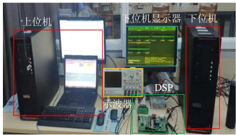  
图7 硬件实验平台  
Fig. 7 Platform of hardware in the loop experiment

表 2 仿真系统主要参数  
Table 2 Main parameters of the simulation system  

<table><tr><td>参数</td><td>数值</td><td>参数</td><td>数值</td></tr><tr><td>线电压E/V</td><td>400</td><td>线电压U/V</td><td>400</td></tr><tr><td>Z0/mΩ</td><td>1+j1</td><td>SG额定功率Pn/MVA</td><td>10</td></tr><tr><td>Z1/mΩ</td><td>1+j1</td><td>Z2/mΩ</td><td>1+j1</td></tr><tr><td>电流内环Kp</td><td>0.1</td><td>电流内环Ki</td><td>10</td></tr><tr><td>温度/℃</td><td>25</td><td>光照强度/lx</td><td>1000</td></tr><tr><td>开关频率/kHz</td><td>10</td><td>接入位置系数k</td><td>1</td></tr><tr><td>直流电压Udc/V</td><td>930</td><td>电网频率/Hz</td><td>50</td></tr><tr><td>H/s</td><td>0.5</td><td>D/pu</td><td>0.1</td></tr><tr><td>δ0/(°)</td><td>15</td><td>极对数p</td><td>2</td></tr><tr><td>ω0/pu</td><td>1</td><td>Pm/pu</td><td>0.5</td></tr><tr><td>光伏逆变器数量n</td><td>2</td><td>Ubw0/V</td><td>380</td></tr></table>

限于篇幅，且转速/频率反馈模式与功角/功率反馈模式的验证思路类似，本文仅对基于转速/频率反馈的控制策略进行验证。通过突然增加原动机功率来激发电网功率振荡，仿真结果如图8—13所示。为便于分析，将2.1节的SG的特征根分析的具体数据列于表3—5。仿真中，没有参与调控的转速环控制器参数均为0。

图8、图9分别给出了有功、无功环P控制器参数变化时同步机的动态响应、PV的功率输出和 $U_{\mathrm{dc}}$  变化曲线。当  $K_{\mathrm{pp}} = 0$  时，系统接近等幅振荡，为弱阻尼系统。

仿真结果表明: 随着  $K_{\mathrm{pp}} 、 K_{\mathrm{pq}}$  的增加, PV 输出的有功功率  $P 、$  无功功率  $Q$  随之出现愈加明显的

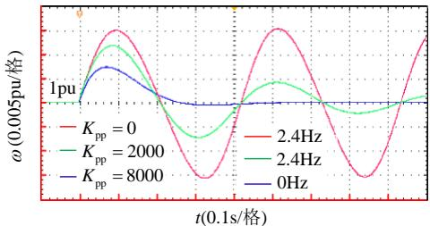  
(a) 转子转速  $\omega$

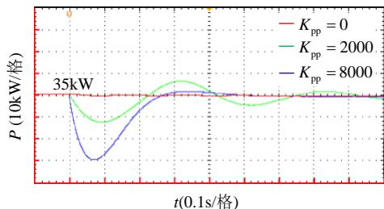  
(b) 有功输出  $P$

  
(c)  $U_{\mathrm{dc}}$

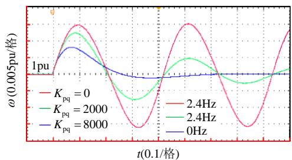  
图8有功控制器参数  $K_{\mathrm{pp}}$  对电网功率振荡的影响规律Fig.8Influenceof  $K_{\mathrm{pp}}$  on power grid oscillation  
(a) 转子转速  $\omega$

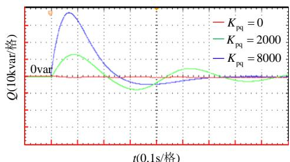

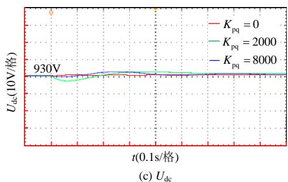  
(b) 无功输出  $Q$  
图9 无功控制器参数  $K_{\mathrm{pq}}$  对电网功率振荡的影响规律  
Fig. 9 Influence of  $K_{\mathrm{pq}}$  on power grid oscillation

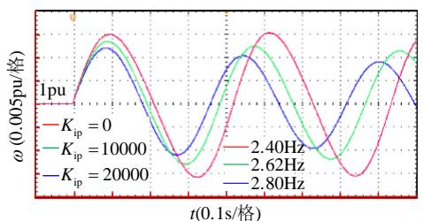

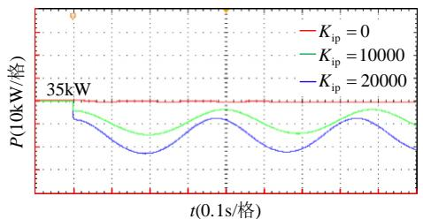  
(a) 转子转速  $\omega$

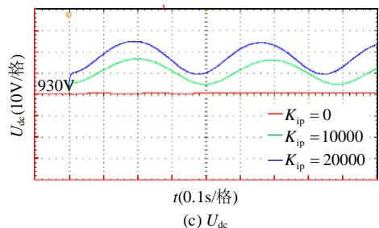  
(b) 有功输出  $P$  
图10有功控制器参数  $K_{\mathrm{ip}}$  对电网功率振荡的影响规律

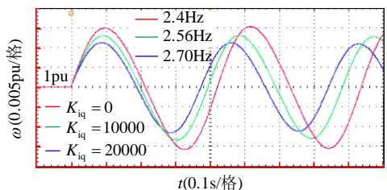  
Fig. 10 Influence of  $K_{\mathrm{ip}}$  on power grid oscillation  
(a) 转子转速  $\omega$

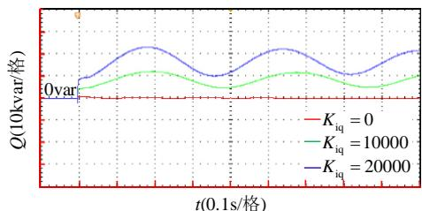  
(b) 无功输出  $Q$  
图11 无功控制器参数  $K_{\mathrm{iq}}$  对电网功率振荡的影响规律  
Fig. 11 Influence of  $K_{\mathrm{iq}}$  on power grid oscillation

与频率偏差成正比的变化，同时振荡过程的最大频率偏差明显变小，振荡衰减速度明显加快，且振荡周期几乎不变。PV直流侧电压  $U_{\mathrm{dc}}$  的变化与其有功输出  $P$  成反比，与其无功输出  $Q$  无关。为此，本文不再给出其他无功控制器参数对PV直流侧电压  $U_{\mathrm{dc}}$  的影响仿真结果。

表3为随着  $K_{\mathrm{pp}}$  与  $K_{\mathrm{pq}}$  的增大，系统特征根、阻尼比和振荡频率的变化，表中数据与图8、图9的仿真结果相吻合。即采用转速反馈时，有功/无功控制环的P控制器主要影响系统的阻尼能力，增益

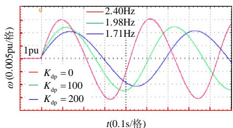  
(a) 转子转速  $\omega$

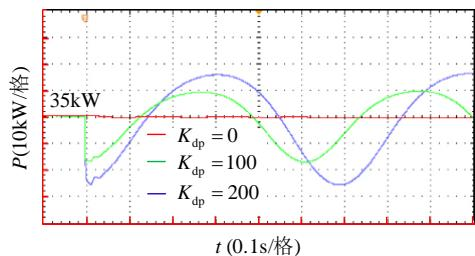  
(b) 有功输出  $P$

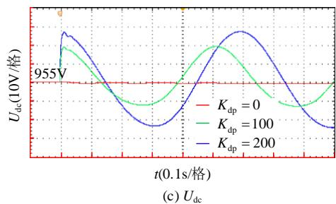

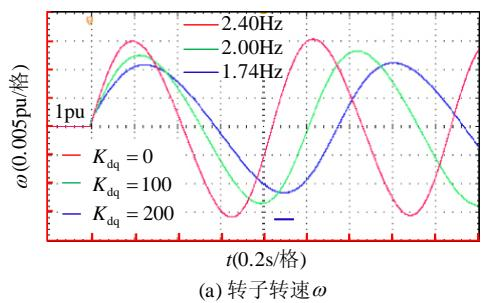  
图12 有功控制器参数  $K_{\mathrm{dp}}$  对电网功率振荡的影响规律 Fig.12 Influence of  $K_{\mathrm{dp}}$  on power grid oscillation

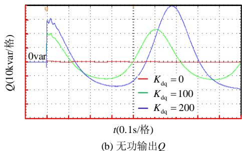  
图13 无功控制器参数  $K_{\mathrm{dq}}$  对电网功率振荡过程影响规律 Fig.13 Influence of  $K_{\mathrm{dq}}$  on power grid oscillation

表3  $K_{\mathrm{p}}$  对系统功率振荡的影响 Table3 Influence of  $K_{\mathrm{p}}$  on system power oscillation  

<table><tr><td>控制器参数</td><td>特征根</td><td>阻尼比</td><td>振荡频率/Hz</td></tr><tr><td>Kpp=0</td><td>-0.05+j14.6</td><td>0.0034</td><td>2.40</td></tr><tr><td>Kpp=2000</td><td>-4.52+j14.3</td><td>0.302</td><td>2.40</td></tr><tr><td>Kpp=8000</td><td>-8.13</td><td>1</td><td>0</td></tr><tr><td>Kpq=0</td><td>-0.05+j15.1</td><td>0.003</td><td>2.40</td></tr><tr><td>Kpq=2000</td><td>-3.88+j14.1</td><td>0.265</td><td>2.40</td></tr><tr><td>Kpq=8000</td><td>-10.8</td><td>1</td><td>0</td></tr></table>

表 4  ${\mathbf{K}}_{\mathrm{i}}$  对系统功率振荡的影响  
Table 4 Influence of  ${K}_{\mathrm{i}}$  on system power oscillation  

<table><tr><td>控制器参数</td><td>特征根</td><td>阻尼比</td><td>振荡频率/Hz</td></tr><tr><td>Kip=0</td><td>-0.05+j14.6</td><td>0.0034</td><td>2.40</td></tr><tr><td>Kip=10000</td><td>-0.05+j16.6</td><td>0.0030</td><td>2.64</td></tr><tr><td>Kip=20000</td><td>-0.05+j17.7</td><td>0.0028</td><td>2.80</td></tr><tr><td>Kiq=0</td><td>-0.05+j14.6</td><td>0.0034</td><td>2.40</td></tr><tr><td>Kiq=10000</td><td>-0.05+j16</td><td>0.0031</td><td>2.55</td></tr><tr><td>Kiq=20000</td><td>-0.05+j17.1</td><td>0.0293</td><td>2.70</td></tr></table>

表 5  ${\mathbf{K}}_{\mathrm{d}}$  对系统功率振荡的影响  
Table 5 Influence of  ${K}_{\mathrm{d}}$  on system power oscillation  

<table><tr><td>控制器参数</td><td>特征根</td><td>阻尼比</td><td>振荡频率/Hz</td></tr><tr><td>Kdp=0</td><td>-0.05+j14.6</td><td>0.0034</td><td>2.40</td></tr><tr><td>Kdp=100</td><td>-0.0346+j12.2</td><td>0.0028</td><td>1.96</td></tr><tr><td>Kdp=200</td><td>-0.0264+j10.6</td><td>0.0029</td><td>1.68</td></tr><tr><td>Kdq=0</td><td>-0.05+j14.6</td><td>0.0034</td><td>2.40</td></tr><tr><td>Kdq=100</td><td>-0.0361+j12.4</td><td>0.0029</td><td>1.98</td></tr><tr><td>Kdq=200</td><td>-0.0284+j10.9</td><td>0.0025</td><td>1.75</td></tr></table>

越大，系统的阻尼系数越大，阻尼能力越强。

图10和图11为有功、无功环I控制器参数变化时同步机的动态响应、PV的功率输出和  $U_{\mathrm{dc}}$  变化曲线。

仿真结果表明: 随着  $K_{\mathrm{ip}} 、 K_{\mathrm{iq}}$  的增加, PV 输出的有功功率  $P$  、无功功率  $Q$  的变化愈加明显, 系统振荡周期大幅度缩短。即采用转速反馈时, 有功/无功控制环的 I 控制器主要影响系统的同步特性, 增益越大, 系统的同步系数越大, 同步能力越强。

表4为随着  $K_{\mathrm{ip}}$  与  $K_{\mathrm{iq}}$  的增大，系统特征根、阻尼比和振荡频率的变化，表中数据与图10、图11的仿真结果相吻合。

图12和图13为有功、无功环D控制器参数变化时同步机的动态响应、PV的功率输出和  $U_{\mathrm{dc}}$  变化曲线。

仿真结果表明：随着  $K_{\mathrm{dp}}$  、  $K_{\mathrm{dq}}$  的增加，PV 输出的有功功率  $P$  、无功功率  $Q$  的变化也愈加明显，系统振荡周期越来越长。即采用转速反馈时，有功/无功控制环的D控制器主要影响系统的惯量水平，增益越大，系统的惯量系数越大，惯量水平越强。

表 5 为随着  $K_{\mathrm{dp}}$  与  $K_{\mathrm{dq}}$  的增大, 系统特征根、阻尼比和振荡频率的变化, 表中数据与图 12、图 13 的仿真结果相吻合。

以上仿真结果与式(29)的分析结果相同。分析和仿真都说明，调节PV的有功输出  $P$  、无功输出 $Q$  可以影响系统的动态特性。PV抑制电网功率振荡的能力与其自身容量息息相关，PV可支配的输出功率  $P$  和无功功率  $Q$  越大，其抑制电网功率振荡能力越强。系统模型的根轨迹分析与仿真数据

在模型根轨迹分析与仿真结果存在  $0.02\mathrm{Hz}$  左右的误差，应用中需要根据实际情况对控制器参数进行微调。

# 4 结论

本文分析了PV利用其有功输出  $P$  、无功输出 $Q$  抑制电网功率振荡的机理。结果表明：在PV抑制电网功率振荡模式下，通过调控其有功输出  $P$  、无功功率  $Q$  可以改变系统的惯量水平、阻尼能力、同步特性，从而抑制电网功率振荡。当PV采用基于转速或频率信号反馈的有功/无功控制策略时，转速或频率环的P、I、D控制器参数分别改变系统的阻尼能力、同步特性、惯量水平；当PV采用基于功角或功率信号反馈的有功/无功控制策略时，功角或功率环的P、D控制器参数分别改变系统的同步特性和阻尼能力。PV响应系统功率振荡所引起的有功/无功功率输出变化越大，系统的动态特性变化越明显。本文的结论将有助于PV抑制电网功率振荡的控制策略的设计和比较，为PV抑制电网功率振荡提供了较为可靠的理论依据。

附录见本刊网络版(http://www.dwjs.com.cn/CN/1000-3673/current.shtml)。

# 参考文献

[1] 肖湘宁，罗超，廖坤玉．新能源电力系统次同步振荡问题研究综述[J].电工技术学报，2017，32(6)：85-97.  
XIAO Xiangning, LUO Chao, LIAO Kunyu. Review of the research on subsynchronous oscillation issues in electric power system with renewable energy sources[J]. Transactions of China Electrotechnical Society, 2017, 32(6): 85-97(in Chinese).  
[2] 王青，孙华东，马世英，等．电力系统小干扰稳定安全评估的一般原则及其在贵州电网中的应用[J].电网技术，2009，33(6)：24-28.  
WANG Qing, SUN Huadong, MA Shiying, et al. General principle of power system small signal stability evaluation and its supplication in Guizhou power grid[J]. Power System Technology, 2009, 33(6): 24-28(in Chinese).  
[3] TAMIMIB,CANIZARESC, BHATTACHARYAK. System stability impact of large-scale and distributed solar photovoltaic generation: the case of Ontario, Canada[J]. IEEE Transactions on Sustainable Energy,2013,4(3):680-688.  
[4] 殷伟斌，熊连松，赵涛．并网逆变器发电系统稳定性分析方法综述[J].南方电网技术，2019，13(1)：14-26.  
YIN Weibin, XIONG Liansong, ZHAO Tao. Review of stability analysis methods of grid-tied inverter power generation systems[J]. Southern Power System Technology, 2019, 13(1): 14-26(in Chinese).  
[5] BIAN X Y, GENG Y, LO K L, et al. Coordination of PSSs and SVC damping controller to improve probabilistic small- signal stability of power system with wind farm integration[J]. IEEE Transactions on Power Systems, 2016, 31(3): 2371-2382.  
[6] 左玉玺，王雅婷，邢琳，等．西北750kV电网大容量新型FACTS设备应用研究[J].电网技术，2013，37(8)：2349-2354.  
ZUO Yuxi, WANG Yating, XING Lin, et al. Applied research on new

types of high capacity FACTS devices in Northwest  $750\mathrm{kV}$  power grid[J]. Power System Technology, 2013, 37(8): 2349-2354(in Chinese).  
[7] MOHAMMADI F. Allocation of centralized energy storage system and its effect on daily grid energy generation cost[J]. IEEE Transactions on Power Systems, 2017, 32(3): 2406-2416.  
[8] 赵静波，雷金勇，甘德强．电池储能装置在抑制电力系统低频振荡中的应用[J].电网技术，2008，32(6)：93-99，108.  
ZHAO Jingbo, LEI Jinyong, GAN Deqiang. Application of battery energy storage devices in suppressing low-frequency oscillation of power system[J]. Power System Technology, 2008, 32(6): 93-99, 108(in Chinese).  
[9] YAO M, CAI X. An overview of the photovoltaic industry status and perspective in China[J]. IEEE Access, 2019(7): 181051-1810 60.  
[10] 龙源，李国杰，程林，等．利用光伏发电系统抑制电网功率振荡的研究[J].电网技术，2006，30(24)：44-49.  
LONG Yuan, LI Guojie, CHENG Lin, et al. A study on damping power system oscillations based on photovoltaic system [J]. Power System Technology, 2006, 30(24): 44-49 (in Chinese).  
[11] 马燕峰，蒋云涛，陈磊，等．光伏电站自抗扰附加阻尼控制抑制低频振荡策略研究[J].电网技术，2017，41(6)：1741-1747.  
MA Yanfeng, JIANG Yuntao, CHEN Lei, et al. An ADRC additional damping control strategy research on low frequency oscillation suppression of photovoltaic plants[J]. Power System Technology, 2017, 41(6): 1741-1747(in Chinese).  
[12] 白凡，王宝华．光伏并网对低频振荡的影响与抑制[J]．太阳能学报，2020，41(3)：255-261.  
BAI Fan, WANG Baohua. Influence and suppression of grid connected solar power plants on low frequency oscillation[J]. Acta Energiae Solaris Sinica, 2020, 41(3): 255-261(in Chinese).  
[13] 李鹏，于航，夏曼，等．分布式光伏集群分层多模式无功控制策略[J]. 电网技术，2016，40(10)：3038-3044.  
LI Peng, YU Hang, XIA Man, et al. A hierarchical multi-mode var control strategy for grid-connected PV clusters[J]. Power System Technology, 2016, 40(10): 3038-3044(in Chinese).  
[14] 张前进，周林，李海啸，等．考虑SVG补偿装置的大型光伏并网系统振荡分析与抑制[J]．中国电机工程学报，2019，39(9)：2636-2644.  
ZHANG Qianjin, ZHOU Lin, LI Haixiao, et al. Oscillation analysis and suppression of large-scale grid-connected photovoltaic system considering SVG equipment[J]. Proceedings of the CSEE, 2019, 39(9): 2636-2644(in Chinese).  
[15] 周林，任伟，余希瑞．大型光伏电站抑制低频振荡的有功阻尼控制策略[J]. 中国电机工程学报，2016，36(11)：2987-2995.

ZHOU Lin, REN Wei, YU Xirui. Active damping control strategy in the large-scale photovoltaic plants restraining low-frequency oscillations[J]. Proceedings of the CSEE, 2016, 36(11): 2987-2995(in Chinese).  
[16] VARMAR K, AKBARI M. Simultaneous fast frequency control and power oscillation damping by utilizing PV solar system as PV-STATCOM[J]. IEEE Transactions on Sustainable Energy, 2020, 11(1): 415-425.  
[17] XIAO W, EL MOURSI M S, KHAN O, et al. Review of grid-tied converter topologies used in photovoltaic systems[J]. IET Renewable Power Generation, 2016, 10(10): 1543-1551.  
[18] 曲立楠，葛路明，朱凌志，等．光伏电站暂态模型及其试验验证[J].电力系统自动化，2018，42(10)：170-175.  
QU Linan, GE Luming, ZHU Lingzhi, et al. Transient modeling of photovoltaic power plant and its test validation[J]. Automation of Electric Power Systems, 2018, 42(10): 170-175(in Chinese).  
[19] 袁小明，程时杰，胡家兵．电力电子化电力系统多尺度电压功角动态稳定问题[J].中国电机工程学报，2016，36(19)：5145-5154，5395.  
YUAN Xiaoming, CHENG Shijie, HU Jiabing. Multi-time scale voltage and power angle dynamics in power electronics dominated large power systems[J]. Proceedings of the CSEE, 2016, 36(19): 5145-5154, 5395(in Chinese).  
[20] YUAN H, YUAN X, HU J. Modeling of grid-connected VSCs for power system small-signal stability analysis in DC-Link voltage control timescale[J]. IEEE Transactions on Power Systems, 2017, 32 (5): 3981-3991.  
[21] PRABHA Kundur. 电力系统稳定与控制[M]. 北京：中国电力出版社，2001：486-488.  
[22] 王锡凡. 现代电力系统分析[M]. 北京：科学出版社，2003：261-263.

  
柴华

在线出版日期：2020-07-15。

收稿日期：2020-03-10。

作者简介：

柴华(1993)，男，硕士研究生，研究方向为电力电子技术在光伏发电中的应用，E-mail：332326637@qq.com;

张学军(1964)，男，教授，通信作者，研究方向为电力系统运行与控制等，E-mail: tyzxj6409@126.com。

（责任编辑 马晓华）

# 附录A

SG具体参数如下：

$$
\begin{array}{l} X _ {d} = 0. 5 1 \mathrm {p u}, X _ {d} ^ {\prime} = 1. 0 1 4 \mathrm {p u}, X _ {d} ^ {\prime \prime} = 1. 2 8 \mathrm {p u}, X _ {q} = 0. 7 7 \mathrm {p u}, \\ X _ {q} ^ {\prime} = 0. 7 7 \mathrm {p u}, \quad X _ {q} ^ {\prime \prime} = 0. 3 7 5 \mathrm {p u}, \quad X _ {1} = 0. 1 5 \mathrm {p u}, \quad T _ {d} ^ {\prime} = \\ 0. 3 2 0 1 \mathrm {s}, \quad T _ {d} ^ {\prime \prime} = 0. 0 2 3 \mathrm {s}, \quad T _ {q} ^ {\prime} = 0. 6 \mathrm {s}, \quad T _ {q} ^ {\prime \prime} = 0. 0 7 \mathrm {s}, \quad R _ {\mathrm {s}} = \\ 0. 0 1 7 8 7 5 \mathrm {p u} 。 \\ \end{array}
$$

将式(12)线性化可得：

$$
\begin{array}{l} (k E \cos \delta_ {0} \Delta \delta + k X \Delta I _ {\mathrm {D}}) (k E \sin \delta_ {0} + k X I _ {\mathrm {D 0}}) = - [ U _ {\mathrm {b w 0}} (1 + \\ k) - k E \cos \delta_ {0} + k X I _ {Q 0} ] (\Delta U (1 + k) + \\ \end{array}
$$

$$
k E \sin \delta_ {0} \Delta \delta + k X \Delta I _ {Q})
$$

将上式整理可得：

$$
\begin{array}{l} \Delta U = - \frac {k ^ {2} \left(E \sin \delta_ {0} + X I _ {\mathrm {D} 0}\right)}{\left[ U _ {\mathrm {b w} 0} (1 + k) - k E \cos \delta_ {0} + k X I _ {\mathrm {Q} 0} \right] (1 + k)}. \\ (E \cos \delta_ {0} \Delta \delta + X \Delta I _ {\mathrm {D}}) - \frac {k E \sin \delta_ {0}}{(1 + k)} \Delta \delta - \frac {k}{(1 + k)} X \Delta I _ {\mathrm {Q}} \\ \end{array}
$$

将上式自变量整理可得：

$$
\begin{array}{l} \Delta U = - \frac {k E}{1 + k} \left[ \frac {(E \sin \delta_ {0} + X I _ {\mathrm {D} 0}) k \cos \delta_ {0}}{U _ {\mathrm {b w} 0} (1 + k) - k E \cos \delta_ {0} + k n X I _ {\mathrm {Q} 0}} + \sin \delta_ {0} \right] \\ \Delta \delta - \frac {k ^ {2} X (E \sin \delta_ {0} + n X I _ {\mathrm {D} 0})}{[ U _ {\mathrm {b w} 0} (1 + k) - k E \cos \delta_ {0} + n k X I _ {\mathrm {Q} 0} ] (1 + k)} \\ \sin \delta_ {0} \Delta I _ {\mathrm {D}} - \frac {k X}{1 + k} \Delta I _ {\mathrm {Q}} \\ \end{array}
$$

将上式整理可得原文中式(13)。