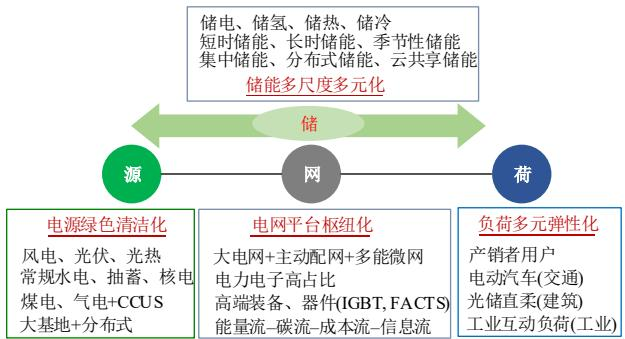
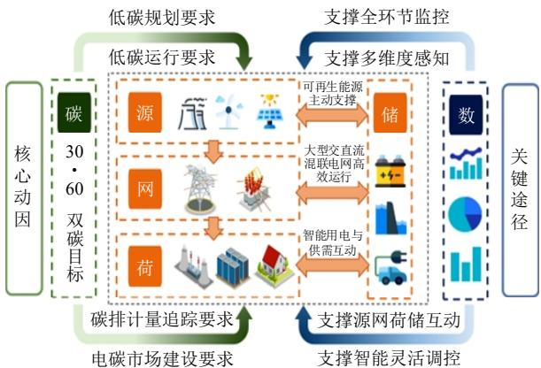
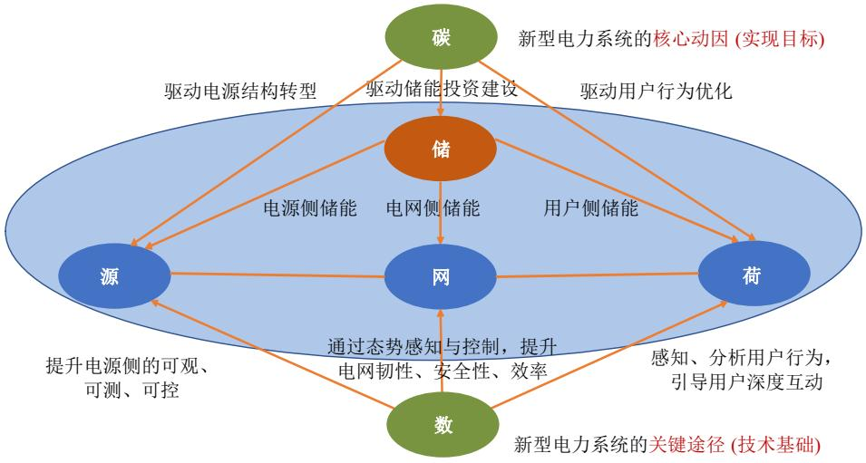
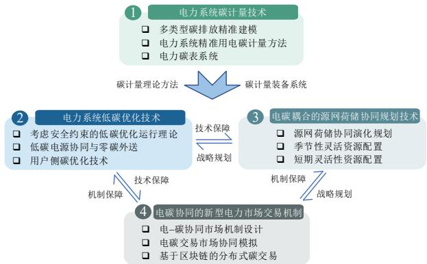
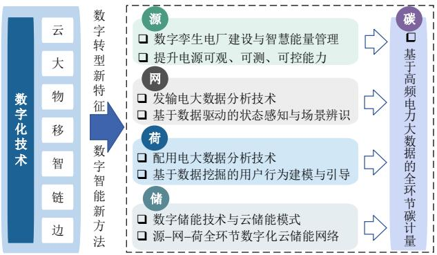
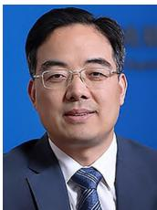

# 新型电力系统的六要素分析

康重庆  $^{1,2,3,4}$ , 杜尔顺  $^{2,3}$ , 郭鸿业  $^{1}$ , 李姚旺  $^{3}$ , 方宇晨  $^{1}$ , 张宁  $^{1,3}$ , 钟海旺  $^{1,3}$

(1. 清华大学电机工程与应用电子技术系，北京市 海淀区 100084；  
2. 清华大学低碳能源实验室，北京市海淀区100084；  
3. 清华四川能源互联网研究院，四川省成都市610213；

4. 天府永兴实验室新型电力系统研究中心，四川省成都市610213)

Primary Exploration of Six Essential Factors in New Power System

KANG Chongqing $^{1,2,3,4}$ , DU Ershun $^{2,3}$ , GUO Hongye $^{1}$ , LI Yaowang $^{3}$ , FANG Yuchen $^{1}$ , ZHANG Ning $^{1,3}$ , ZHONG Haiwang $^{1,3}$

(1. Department of Electrical Engineering, Tsinghua University, Haidian District, Beijing 100084, China;  
2. Laboratory of Low Carbon Energy, Tsinghua University, Haidian District, Beijing 100084, China;  
3. Tsinghua Sichuan Energy Internet Research Institute, Chengdu 610213, Sichuan Province, China;

4. New Power System Research Center, Tianfu Yongxing Laboratory, Chengdu 610213, Sichuan Province, China)

ABSTRACT: Driven by the goal of carbon neutrality, the safe, efficient, and low-carbon transition of the power energy system with digital and intelligent technology innovation has become important development strategies in China. Firstly, this paper discusses the connotation and requirements of the energy revolution for the construction of a new power system from the perspective of the national macro strategies. After that, the reform process of the new power system is introduced and the key elements of the fossil energy-dominated power system, the double-high power system, and the new power system are analyzed. On this basis, the basic characteristics of the new power system are introduced, and the six key elements of the new power system are presented, namely "generation", "grid", "demand", "storage", "decarbonization", and "digitization". The relationships between the six elements are analyzed. Finally, starting from the core motivation driving the development of the new power system and the methodologies to build the new power system, the key technologies of the new power system from the "carbon perspective" and the key technologies in the process of the power system digital transformation are explored and prospects.

KEY WORDS: new power system; source-network-load-storage-decarbonization-digitization; carbon neutrality; digitalization

摘要：面向碳中和目标，能源电力系统的安全高效、绿色低碳转型及数字化智能化技术创新已成为全球发展趋势及我国能源科技创新的关键抓手。该文从国家宏观战略层面探讨

了能源革命对建设新型电力系统的要求，阐述了新型电力系统的变革历程，从化石能源为主导的传统电力系统，到高比例新能源和高比例电力电子为主要特征的“双高”电力系统，再到新能源为主体的新型电力系统，分析了演化过程中不同阶段电力系统的关键要素。在此基础上，总结凝练了新型电力系统的六大关键要素“源网荷储碳数”，阐述了六要素之间的耦合关系。最后，聚焦“碳”与“数”2个新兴的关键要素，分别从低碳化与数字化2个视角对建设新型电力系统的关键技术进行了探析与展望。

关键词：新型电力系统；源网荷储碳数；碳中和；数字化

DOI: 10.13335/j.1000-3673.pst.2023.0535

# 0 引言

在应对气候变化、全球能源产业链遭受严重冲击、世界能源格局动荡等百年未有之大变局形势下，能源电力系统向安全高效、绿色低碳转型已经成为全球发展趋势。2020年9月，我国在联合国大会上承诺宣布：“中国将提高国家自主贡献力度，采取更加有力的政策和措施，二氧化碳排放力争于2030年前达到峰值，努力争取2060年前实现碳中和”[1]。2021年3月，习总书记在中央财经委员会第九次会议上提出构建新型电力系统[2]。2021年10月，国务院印发《2030前碳达峰行动方案》提出“构建新能源占比逐渐提高的新型电力系统”[3]。2023年1月，国家能源局发布《新型电力系统发展蓝皮书(征求意见稿)》，描绘了新型电力系统的内涵特征与发展路径[4]。总体来说，构建新型电力系统已成为我国实现碳中和目标的关键抓手[5]。

我国资源禀赋与能源需求呈现逆向分布，为支撑经济社会发展和快速增长的用电需求，我国建成了世界上规模最大、远距离输送能力最强的电力系统。截至2022年底，我国各类电源总装机规模23.8亿kW，西电东送规模达到2.9亿kW。煤电一直是我国电力供应安全的重要支撑，但近年来电力绿色低碳转型不断加速，可再生能源装机规模达12.13亿kW，占比达到  $47.3\%$  ，首次超过煤电装机规模；其中，风光发电装机7.58亿kW，累计规模与新增装机多年来持续居世界第一[6]。新能源的快速发展与大规模发电并网给电力系统带来了随机性、波动性与不确定性。为了支撑新能源当前的大规模并网以及未来的高比例消纳，电力系统迫切需要构建多元技术多时间尺度的储能体系，电力系统结构形态逐步由“源网荷储”四要素体现。

从“低碳化”出发，能源碳排放约占全社会碳排放的  $88\%$  ，电力行业碳排放占比超过  $40\%$  ，是碳排放与煤炭消费占比最大的单一行业[7]。面向双碳目标，能源是主战场，电力是主力军。为实现碳达峰、碳中和目标，未来40年需要大力发展风电、光伏等新能源技术，提升电力系统的新能源消纳能力，通过统筹发展与安全，逐渐提高电力系统的新能源占比，实现从化石能源为主体向新能源为主体的重大转变，成为我国构建新型电力系统的当务之急与必由之路。简而言之，碳中和目标是建设新型电力系统的核心动因。

从“数字化”出发，数字技术与能源电力基础设施的融合是实现产业智能化转型升级，把握新一轮科技革命和产业变革新机遇的战略选择。2022年10月，党的二十大报告明确提出加快发展数字经济，促进数字经济和实体经济深度融合[8]。2023年3月，十四届全国人大提出组建国家数据局，统筹推进数字中国、数字经济、数字社会规划和建设等[9]。新型电力系统的数字化转型体现为：在电力系统源网荷储各环节广泛推广应用“云大物移智链边”等先进数字化技术与人工智能技术，构建信息物理深度融合的数字化、信息化和智能化新型电力系统，实现多能互补的高效转化利用与源网荷储协同互动。一言蔽之，数字化转型是建设新型电力系统的关键途径。

综上所述，构建新型电力系统是实现碳中和目标的关键抓手，需要依托数字化技术，统筹源、网、荷、储资源，以源网荷储互动及多能互补为支撑，满足绿色消费、安全供应、经济高效的综合性目标。因此，本文认为新型电力系统结构形态将由“源网

荷储”四要素拓展为“源网荷储碳数”六要素。其中，源网荷储是新型电力系统的物理架构；碳中和目标是建设新型电力系统的核心动因，数字化转型是建设新型电力系统的关键途径。

本文的结构如下：首先从国家宏观战略层面探讨了能源革命对建设新型电力系统的要求；其次，从电力行业视角出发，探析了不同阶段电力系统的关键要素；在此基础上，分析了新型电力系统的六要素及其之间的关联耦合关系；最后，分别针对“碳”与“数”2个关键要素，展望了关键技术发展方向。

此外，需要说明的是，本文主要从技术要素角度出发，探讨提出由“源网荷储”四要素拓展为“源网荷储碳数”六要素，其中对“数字化”的理解广义包含了数字化、智能化、信息化等范畴。

# 1 从能源革命到新型电力系统

在新的时代背景下，中国能源革命不断向纵深挺进，正谱写能源高质量发展新篇章，对建设新型电力系统的要求探析如下。

# 1.1 能源革命对新型电力系统的要求

为实现碳达峰、碳中和目标，到2030年非化石能源消费占比需提升至  $25\%$  以上，风光发电装机需提升至18亿kW左右，新能源逐步成为发电量增量主体；到2060年非化石能源消费占比需跨越式提升至  $80\%$  以上，新能源逐步成为发电主体，发电装机增长至50亿kW以上，实现电力系统脱碳[10]。从能源消费革命角度，引导绿色能源消费，提升终端电气化率是推动能源消费模式转型、实现能效提升与保障能源安全的必然选择。从能源技术革命角度，构建新型电力系统是从“0”到“1”的技术突破创新，需要通过源网荷储各环节的关键核心技术创新和重大装备攻关着力提升绿色能源技术和产业竞争力。从能源机制革命角度，电力系统发展逐渐向跨行业、跨领域协同转变，一方面需要构建适应新能源高占比的电力市场体系与成本疏导机制，另一方面需要统筹考虑能源成本与环境价值，推动电碳市场协同发展。

# 1.2 新型电力系统的内涵与特征

根据能源革命对建设新型电力系统的要求，立足我国能源资源禀赋的基本国情，需要以低碳电力技术创新为驱动力，统筹能源安全、经济与低碳，推动构建适合中国国情的新能源占比逐渐提高的新型电力系统。具体而言，新型电力系统是以坚强、智能、柔性电网为枢纽平台，以技术创新突破和体

制机制创新为基础保障，以源网荷储互动与多能互补为坚强支撑，以保障能源电力安全为基本前提，以消纳高比例新能源为主线任务，以满足经济社会高质量发展的电力需求为首要目标的新一代电力系统。低碳、安全、高效是新型电力系统的3个核心内涵，安全高效、清洁低碳、柔性灵活、智慧融合是四大重要特征。其中，安全高效是基本前提，清洁低碳是核心目标，柔性灵活是重要支撑，智慧融合是基础保障[4]。

# 1.3 碳中和目标是新型电力系统的核心动因

碳中和目标将驱动能源电力产业各环节低碳发展[5]。在电源侧，碳中和目标不仅将助力风电、光伏等成熟新能源技术与产业规划化跨越式发展，还将驱动海上风电、太阳能光热发电、钙钛矿太阳能电池、火电碳捕集等新兴低碳电力技术的创新与推广应用，构建新能源占比逐渐提高的电源结构。在电网侧，碳中和目标将促使电网由电力传输平台转型为电碳平台枢纽，构建大电网-配电网-微电网兼容互补的电网结构，支撑火电与新能源跨时空的协同配置与互济，实现对电力流-碳排放流的协同优化管理。在负荷侧，碳中和目标将推动终端能源消费结构和产业结构的调整，电动汽车、智能电器、数据中心、电制氢等新型负荷广泛接入，驱动电力负荷绿色用能与柔性用电。在储能侧，碳中和目标将驱动新能源与储能的协同高质量发展，构建多元多尺度的储能体系，提升低碳电力系统的灵活性。

# 1.4 数字化转型是新型电力系统的关键途径

数字化转型将赋能能源电力产业各环节转型升级[11]。在电源侧，数字化技术将助力新能源发电与传统火电机组的高效运行，依托数字孪生电厂建设与智慧能量管理，提升新能源预测精度、提高火电发电能效等。在电网侧，数字化技术将助力构建以新型传感技术为支撑的电力大数据与人工智能平台，实现信息-物理-能量融合的智慧电网全景感知，助力电力系统实现调度运行与控制的智能决策，实现源网荷储协同优化，挖掘与提升可再生能源消纳能力，提升电力系统安全稳定性。在负荷侧，通过数字化与人工智能技术，实现海量分布式负荷的柔性互联与协同管理，助力虚拟电厂建设，释放需求侧响应潜力，实现源荷柔性互联、双向互动。在储能侧，通过数字化储能运维技术提升储能安全性，通过数字化储能调控技术提升储能经济性，依托云共享储能技术，构建储能应用新业态。通过源网荷储全环节数字化转型，赋能电力系统全景信息感知与智慧高效调控，助力电力低碳高质量发展。

# 2 不同阶段电力系统的关键要素

回顾电力系统的发展历程，对电力系统的认知可根据发展特点与组成要素初步分为3个阶段。第一阶段是以化石能源主导的传统电力系统：此时新能源仍处于小规模，电力系统整体以“发-输-变-配-用”5个环节单向布局，主要包含“源网荷”3个关键要素。第二阶段是大规模新能源并网的电力系统：此时电力系统将逐步呈现以新能源高占比与电力电子装备高占比的“双高”特点，电力系统灵活性资源日益稀缺，迫切需要构建多元技术多时间尺度的储能体系，电力系统结构形态逐步由“源网荷储”四要素体现。第三阶段是面向双碳目标的新型电力系统，在“源网荷储”关键要素的基础上，进一步融入了“碳中和目标”的核心动因与“数字化转型”的关键途径，形成“源网荷储碳数”的六要素协同发展模式。

# 2.1 化石能源主导的传统电力系统

第一阶段，电力系统以“大机组-超高压-大电网”为发展模式，以“源随荷动”为主要运行形态。由于负荷特性相对规律性较强，新能源并网规模小，因此电力系统运行方式与电力潮流分布相对固定。电力规划与运行，通常采用确定性的分析方法，通过预留装机容量备用与运行容量备用等应对负荷需求的不确定性，整体形成了“发-输-变-配-用”的电力系统架构[12]，如图1所示。

  
图1 传统电力系统架构  
Fig. 1 Framework of traditional power system

# 2.2 新能源大规模并网的双高电力系统

“十三五”期间，随着以风电、光伏为代表的新能源技术快速发展，以及直流输电技术的成熟与普及，电力系统中的新能源装机占比不断提升，系统电力电子化程度逐步加剧。行业普遍认为，电力系统将逐渐过渡至高比例新能源、高比例电力电子化的“双高”电力系统，如图2所示[13]。

在该阶段，“源”侧新能源装机占比显著提升，电网运行方式与潮流分布将呈现复杂化、多元化与随机化的特点[14]。在“网”侧，传统的“输-变-配”统一整合为“网”的要素，电网将在承担电能传输

  
图2高比例新能源与高比例电力电子化的电力系统架构

的基本职能外，转型为电力供需平衡跨区互济、备用共享的平台枢纽。在“荷”侧，随着分布式新能源、需求响应、电动汽车双向互动在需求侧的不断普及，将出现电力产消者，使得电力系统呈现源荷界限模糊化的特点[15]。此外，面向新能源大规模并网，储能的作用不断凸显，其将作为一个新的电力系统要素，与源、网、荷各个环节深度融合。

# 2.3 面向双碳目标的新型电力系统

双碳目标提出后，构建新型电力系统成为能源低碳转型的关键抓手，依托数字化技术，统筹源、网、荷、储资源，以源网荷储互动及多能互补为支撑，满足电力安全供应、绿色消费、经济高效的综合性目标。新型电力系统结构形态将由“源网荷储”拓展为“源网荷储碳数”六要素，如图3所示。

在该阶段，电力系统基本框架仍由源、网、荷、

  
Fig. 2 Framework of power systems with high shares of renewable energy and power electronics  
图3新型电力系统架构  
Fig. 3 Framework of new power system

储四方面组成。源侧以新能源为主体，网侧大电网-配电网-微电网多种形态并存，荷侧与工业-建筑-交通等跨行业跨领域融合互动，储能遍布网络各个环节，依托多元多尺度储能体系为源、网、荷提供灵活性支撑。在此基础上，“碳”和“数”加入到新型电力系统的组成要素中。其中，碳中和目标是新型电力系统的核心动因，引导新型电力系统源网荷储各环节协同脱碳，最终实现以新能源为主体的远景目标；数字化转型是新型电力系统的关键途径，通过数字化技术赋能电力系统的全景信息感知与智慧灵活调控，为新型电力系统源网荷储协同互动与安全高效运行提供技术支撑[16]。

综上，3个阶段的电力系统在“源网荷储碳数”各个要素层面的关键特征对比如表1所示。

表 1 电力系统不同认知阶段的关键要素对比  
Table 1 Comparison of key elements of power system in different cognitive stages  

<table><tr><td>关键要素</td><td>传统电力系统</td><td>双高电力系统(“十三五”期间)</td><td>新型电力系统(双碳目标提出后)</td></tr><tr><td>电源侧</td><td>煤电为绝对的装机主体,承担能量供给与系统调节等多方面作用</td><td>新能源逐渐大规模发展,局部地区达到高比例,煤电逐渐转变为灵活调节电源</td><td>清洁能源成为电力电量主体、保留部分化石能源发电作为应急备用,保障能源电力安全</td></tr><tr><td>电网侧</td><td>分输-配-变3个具体环节,电力系统调度运行方式与电网潮流分布相对固定</td><td>大电网与分布式并举,总体维持较高转动惯量和交流同步运行特点</td><td>交直流混联大电网、柔直电网、主动配网、微电网等多种形态电网并存</td></tr><tr><td>负荷侧</td><td>以传统用能主体为主,可以工业、商业、居民进行简单分类</td><td>电动汽车等可调节灵活负荷加快发展、清洁取暖等多种形式的电能替代加速</td><td>与建筑、工业、交通等终端部门深度融合,建成清洁智慧的未来能源互联网</td></tr><tr><td>储能侧</td><td>系统中的储能较少,且以抽蓄为主</td><td>抽蓄与电化学储能快速发展</td><td>多元化多尺度的储能体系与共享模式</td></tr><tr><td>碳目标</td><td>没有明确的碳目标,电力系统要求节能发电调度</td><td>新能源的环境外部性凸显,对于节能降碳的作用显著</td><td>碳中和目标是新型电力系统的核心动因</td></tr><tr><td>数字化</td><td>重数据的采集与存储,对于数据的分析与利用有限</td><td>电力系统不确定性大幅提升,数字化技术的重要性进一步凸显</td><td>数字化技术是实现深度源网荷储互动的重要工具,是建成新型电力系统的关键途径</td></tr></table>

# 3 新型电力系统的六要素分析

面向未来的新型电力系统，结构形态将由“源网荷储”四要素拓展为“源网荷储碳数”六要素。本节将详细介绍新型电力系统各要素的组成特点及六要素之间的关联关系。

# 3.1 新型电力系统的六要素

1）源：清洁电源为主体，多类型电源共同支撑。

首先，清洁电源成为主体，扮演电力系统的主要供能角色，发电量占比达到  $90\%$  以上。其中风电、光伏等强随机性清洁电源发电量占比提升至  $50\%$  以上，成为发电主体电源；水电、核电、生物质、

光热等灵活可控清洁电源作为重要组成部分协同支撑高比例新能源消纳；传统火电机组定位从“发电主体”向“灵活性资源”转变，近期通过灵活性改造，提供包括调峰、调频、爬坡、电压支撑等辅助服务，远期加装碳捕集装置实现深度脱碳，作为应急备用电源，保障能源电力安全[17]。

# 2）网：电碳平台枢纽定位不断凸显。

新型电力系统电网将呈现明显的平台枢纽特性，主要体现为多层次、强互动、多元化的特点[18]。在多层次方面，将形成跨区域大电网+省级坚强电网+主动配电网+多能微网兼容协同模式，多层级电网分别实现资源互济、安全支撑、灵活响应、就地平衡等多种职能[19]；在强互动方面，电网将在承担电能传输的基本职能外，转型为电力供需平衡跨区互济、备用共享、源荷互动的平台枢纽；在多元化方面，未来电网将不仅是电力流的优化配置平台，还将包括碳排放流、成本流、信息数字流在内的信息-能量-价值融合的管理平台。

# 3）荷：终端用能弹性化、多样化与多能融合化。

新型电力系统的负荷要素未来将呈现弹性化、多样化与多能融合化的特点。在弹性化方面，通过数字化技术聚合海量分布式用户，构建虚拟电厂与主动配电网，实现深度广泛的源荷互动。在多样化方面，将涌现大量新型的负荷主体，例如数据中心、电动汽车等，部分负荷主体带有储能设备和分布式发电设备，成为产消者。在多能融合化方面，依托电制热、电制冷、电制气等多能转化技术，实现电-热-冷-气在内的多能协同优化，实现不同能源负荷在时序上的弹性替代；此外，还将依托电制氢制氨等电制非电能源技术，实现电-氢-氨等异质能源的融合发展。

# 4）储：跨时空多元融合的储能体系。

新型电力系统的储能将从多个环节、多个时间尺度构成跨时空多元融合的储能体系[20]。在长时间尺度，通过储氢、储气、储热等手段实现广义季节性储能，提供跨季节的能量互补；在中时间尺度，配置抽水蓄能、压缩空气等储能技术，用于提供日间日内时间尺度的备用与调峰能力，通过聚合海量分布式的用户侧电动汽车来提供日内需求响应能力；在短时间尺度，配置以电化学为主的短时储能，提供包括虚拟惯量、调频、爬坡等辅助服务[21]。

# 5）碳：从电视角转向电碳耦合视角。

未来电力系统的发展趋势与形态演化将转变为节能减排、低碳发展的“外力驱动”倒逼机制[5]。首先，低碳转型的宏观发展环境与政策机制，包括

碳税、碳配额、碳交易机制等，将为电力行业构建全新的发展机遇与挑战，助力低碳技术的突破创新与蓬勃发展；其次，在碳减排目标倒逼下，将对电力系统源网荷储各个环节引入“碳约束”，驱动面向低碳化的电力系统结构形态演化；在此基础上，低碳电力技术的推广应用将使得电力行业呈现明显的低碳发展与运营模式，广泛影响电力系统计量、调控、规划、市场等各个环节。

# 6）数：全景信息感知与智慧灵活调控。

依托数字化转型，新型电力系统将呈现能源-信息-物理系统深度融合特点。在物理系统层面，首先，电力系统通过低功耗、芯片化、智能化微型传感器件实现电力装备全景信息感知及设备健康状态评价与预测；然后，建立广域、分布式电网全景信息实时采集的传感网络，构建信息-能量-物理融合的数字孪生体；在此基础上，依托电力系统大数据以及人工智能平台对电力系统源网荷储各个环节的协同互动运行与优化控制进行智能决策[22]。在赋能转型层面，电力系统数字化转型升级将推动建设数字化的能源基础设施，构建支撑源网荷储协同互动的新型智慧调度运行体系，实现以电为核心的跨能源跨行业的柔性互联与灵活互动，助力电网向能源互联网升级，构建高质量新型电力系统[23]。

# 3.2 六要素之间的关联与耦合关系

首先，“源-网-荷”三要素自始至终是电力系统核心的物理构成要素，实现电力能源的生产、传输与消费。在传统的电力系统中，电力能量是从源到荷的单向流动与调控；在新型电力系统中，源网荷之间由“源随荷动”向“源荷互动”的双向流动与协同互动转变。

在“储”要素方面，新能源占比逐渐提升将使得电力系统灵活性资源日益稀缺，需要在源-网-荷全环节部署储能多元多尺度储能。不同环节储能配置的功能效益不同：在电源侧，储能通过与新能源合理配置与协同运行，可提升新能源电站的并网主动支撑能力、提高置信容量、平抑出力波动性；在电网侧，储能可提供调频、调峰、备用等服务，助力延缓输变电投资改造、降低电网损耗、提升电力安全可靠性、缓解电网阻塞、提升电网新能源消纳能力等；在用户侧，储能接入后能提供经济和安全两方面的效用，其一是提升网荷互动能力，降低用能成本；其二是作为后备电源，提升用电安全可靠性[24]。

在“碳”要素方面，双碳目标作为建设新型电力系统的核心动因，将分别作用在源、网、荷、储4类要素上。在电源侧，双碳目标驱动构建新能源

占比逐渐提高的电源结构；在电网侧，双碳目标驱动电网由电力传输平台向电碳枢纽平台转型，统筹源、网、荷、储资源，实现源网荷储协同互动；在用户侧，双碳目标驱动用户行为优化，实现终端多能互补与科学用能；在储能侧，双碳目标驱动新能源与储能的协同高质量发展，构建多元多尺度的储能体系，提升低碳电力系统的灵活性。

在“数”要素方面，数字化转型作为建设新型电力系统的关键途径，将与源、网、荷、储4类要素全面融合[25]。在电源侧，数字化技术通过全景数

据采集与分析，提升了电源侧的可观、可测、可控能力；在电网侧，数字化技术通过态势感知与控制，实现了电网韧性、安全性与运行效率的有效提升；在用户侧，依托电力大数据的非侵入式辨识与分析，实现对用户行为的感知与分析，引导用户深度互动；在储能侧，通过数字化运维与管理，将助力提升储能系统的安全性与经济性，赋能构建储能新模式与新业态[26]。

综上所述，新型电力系统六要素的关联与耦合关系可见图4。

  
图4新型电力系统的六要素：源网荷储碳数  
Fig. 4 New power system's six essential factors: generation, grid-demand, storage, decarbonization, digitization

# 4 碳中和目标是新型电力系统的核心动因

从“碳视角”出发，碳中和目标作为新型电力系统建设的核心动因，将作用于源-网-荷-储全环节，促使电力系统转向以低碳目标引导、低碳技术驱动的倒逼发展模式。本节将探析“碳视角”下新型电力系统的变革发展趋势，并展望未来相关的关键技术研究方向。

# 4.1 “碳视角”下的新型电力系统

在传统的“电视角”下，电力系统的研究主要围绕“电视角”下的潮流分析、调度运行、电力规划、电力交易等环节展开。双碳目标下，电力系统低碳转型是一项系统性工程，由“碳视角”串联起来的一系列关键问题已广泛受到学术界和工业界的关注。从碳排放的产生方面，准确、全面、精细化地计量与核算电力行业碳排放是构建新型电力系统的重要基础；从低碳运行方面，伴随新能源占比的逐渐提高，兼顾低碳转型发展与电力安全保供，实现源网荷储互动运行与协同减碳将为构建新型电力系统提供技术保障；从战略规划方面，由于电力行业具有明显的“碳锁定效应”，探析电碳耦

合约束下新型电力系统的结构形态与演进路径，为源网荷储资源的优化配置与布局提供决策支撑；从市场机制方面，考虑碳排放的外部性成本，设计激励相容的电碳协同交易市场机制，是激励低碳技术创新、引导低碳产业发展的机制保障。

图5展示了“碳视角”下新型电力系统的研究框架。从电力系统全环节精准“碳计量”出发，研究电力系统“碳优化”方法，开展源网荷储协同的“碳规划”，构建电碳耦合的“碳市场”，形成技术-战略-机制全环节协同的电力系统低碳转型解

  
图5 “碳视角”下新型电力系统的研究框架  
Fig. 5 Research framework of new power system under "carbon perspective"

决方案[5]。

# 4.2 关键技术探析与展望

1）碳计量：电力系统的全面精准碳计量技术。

完善碳计量技术和管理方法，促进碳计量统一标准体系构建，已成为我国实现“碳达峰、碳中和”目标作出的重要战略部署之一。我国当前广泛采用的电力碳排放计量方法存在计量时空分辨率不足、计量结果精准度较低等问题，已难以适应高比例新能源接入趋势下的精准用电碳计量需求，无法支撑电-碳-绿证耦合市场的建设发展，亟需完善[27]。因此，需要开展研究各类型电源与储能的碳排放精准建模方法；研究计及电力潮流与电力交易的电力系统全环节碳排放分布与转移机理；研究计及用电行为的实时精准用电碳计量技术；研究绿电消费的追踪与减排认证方法；研发面向电力系统全环节实时、精准碳排放计量的电力碳表系统。

2）碳优化：电力系统的低碳优化运行技术。

“碳视角”下电网调度方式将发生显著的转变。首先调度模式由传统以最低发电成本为目标的经济调度转变为综合考虑经济-安全-环保等因素的多目标调度；其次，对电力系统调度运行中的多元低碳技术进行深入研究，根据不同地域、不同季节、不同电源结构的特点，提出相应的低碳调度对策；同时，需要考虑碳交易、碳价、碳税等不同减排机制[28]；此外，基于低碳需求响应，引导用户侧绿色用能同样是实现电力系统降碳减排的重要手段[27]。因此，需要开展研究新能源高占比下考虑安全稳定约束的电力系统低碳运行方法；研究送端电网极高比例清洁能源外送的安全可控运行方法；研究受端电网新能源与碳捕集电厂协同运行方法；研究面向用户侧碳减排的低碳需求响应机制及网荷互动技术，挖掘用户侧减碳潜力。

3) 碳规划：电碳耦合的源网荷储协同规划技术。

电力能源基础设施具有明显的碳锁定效应。相对较短时间内完成能源体系与能源基础设施的转换挑战极大。如何协调电源发展与碳减排之间的目标矛盾，如何权衡近期的经济成本与远期的环境成本，如何优化电力系统的低碳化转型路径等，是电力系统低碳转型规划所带来的新问题和挑战[29]。因此，需要研究开展电碳耦合约束驱动下的源网荷储协同规划技术；研究支撑新能源高占比的多时间尺度灵活性资源优化配置技术；研究双碳目标下新能源占比逐渐提高的新型电力系统演进路径优化技术；研究碳轨迹、技术成本、电气化、电氢融合等关键因素对结构形态与演进路径的影响。

4) 碳市场：电碳协同的新型电力市场交易机制。

电力系统实现低碳经济转型，不仅需要解决技术问题，也需要构建合适的市场机制，计及碳排放的外部性成本，为市场主体提供碳减排的激励，引导减排技术与资源的优化配置[30]。目前，我国正处于电力市场改革的深水区，面临电力市场与碳市场同步建设与推进的新形势。在此背景下，如何在考虑电力市场运行特点的基础上，设计激励相容的碳交易市场机制，通过电碳价格信号推动电力系统碳减排，是电力系统低碳化研究不可或缺的部分。因此，需要开展研究电碳协同新型市场机制设计；研究电碳市场协同驱动下的供需互动模式；研究市场主体同时参与电碳多元市场的决策行为，提出电碳交易市场协同模拟方法；研究多主体参与、全流程覆盖、电碳市场协同的基于区块链的分布式碳交易技术。

# 5 数字化转型是新型电力系统的关键途径

从“数字化”出发，数字化转型作为建设新型电力系统的关键途径，将与源、网、荷、储4类要素全面融合，赋能电力系统全景信息感知与智慧高效调控，助力电力低碳高质量发展。本节将探析数字化赋能新型电力系统的变革发展趋势，并展望未来相关的关键技术研究方向。

# 5.1 数字化赋能新型电力系统建设

以云计算、大数据、物联网、移动互联网、人工智能、区块链等新一代数字技术为核心驱动力，以数据为关键生产要素，构建数字与物理系统深度融合的新型电力系统数字化基础平台，将为高效承载高比例新能源的安全、可靠、高效接入，为海量异构负荷的广泛接入、柔性交互与聚合调控提供基础保障，实现数字化技术与源、网、荷、储、碳等其他核心要素的全面融合。在电源侧，通过全景数据采集与分析，提升随机电源的可观、可测、可控能力；在电网侧，通过态势感知与控制，提升电网韧性、安全性与运行效率；在用户侧，实现对用户行为的感知与分析，引导用户深度互动；在储能侧，助力提升储能系统的安全性与经济性，赋能构建储能新模式与新业态；在碳减排方面，发挥电力大数据实时性强、准确度高、分辨率高和采集范围广等优势，构建电-碳分析模型，支撑全尺度范围的碳排放统计核算。图6展示了数字化技术赋能“源网荷储碳”各要素高效分析决策的研究框架。

# 5.2 关键技术探析与展望

1）电源侧：提升电源可观、可测、可控能力。

  
图6新型电力系统数字化转型的研究框架  
Fig. 6 Research framework of power system digital transition

数字化技术将助力新能源发电与传统火电机组的高效运行，依托数字孪生电厂建设与智慧能量管理，提升新能源预测精度、提高火电发电能效，从而显著提升电源侧的可观、可测、可控性[31]。因此，亟需研究新能源出力的人工智能高效预测技术；研究基于数据驱动的新能源时空相关性建模与重构技术；研究基于数据驱动的新能源主动支撑控制技术；以国网新能源云为典型实践，研究新能源规划、建设、并网等全环节的数字化基础平台，促进新能源的科学规划、合理开发、高效建设、安全运营与充分消纳；研究火电智慧电厂的建设与运营技术，提升发电能效。

2）电网侧：电网态势感知与大数据分析决策。

随着新能源占比的逐渐提高，电力系统不确定性和随机性大量增加；此外，分布式资源、电动汽车、需求响应等的发展，使电网的分析和控制更加复杂。海量数据量测装置的应用将有效提升电网的态势感知能力，并在此基础上，基于大数据分析技术助力电力系统的高效分析与决策[32]。因此，依托数字化技术赋能，需要开展研究数据-物理驱动的复杂电力系统拓扑辨识与状态估计技术，增强复杂大系统可观性；研究数据驱动的双高电力系统安全规则提取技术，辨识电网安全运行边界；研究海量复杂电网运行方式的大数据分析技术，实现典型与极端运行方式的自适应辨识与提取。

3）负荷侧：柔性互动与配用电大数据分析。

广泛用户的柔性互动可以给电力系统提供大量灵活性，是建设新型电力系统的关键特征与主要抓手之一。电力用户行为具有多样性、不确定性、高维复杂性等特点。伴随智能电表等信息渠道的建设以及主动配网、虚拟电厂等技术的推广应用，电力用户侧正逐步形成“社会-物理-信息”的深度耦合。数字化技术正逐步支撑实现对电力用户行为的深入感知与分析，引导用户与电网深度互动。因此，

亟需开展研究基于配用电大数据的电力用户行为建模理论与方法；研究基于电力大数据的非侵入式用户行为辨识与分析方法；研究基于深度学习的负荷预测技术；研究海量分布式异构资源的聚合调控技术。

4）储能侧：云储能模式与数字储能技术。

储能系统的安全管理与经济性一直是限制储能规模化推广应用的主要制约因素。数字化转型为储能技术的智慧管理与新商业模式创造了新的契机。需要开展研究数字储能技术，通过对电池能量流进行离散化和数字化处理，实现能量信息化，进一步实现储能系统的数字化定义与动态电池网络重构，显著提升储能安全水平与经济性[33]；研究云共享储能[34]商业模式与调控技术，通过对海量分布式储能系统的协同管控与多元储能需求服务的供需匹配，极大降低储能系统的建设与运维成本，显著提升了储能的经济效益。

5)碳视角：基于高频电力大数据的碳计量技术。

加快建立统一规范的碳排放统计核算体系，对夯实碳排放数据基础、支撑实现碳达峰碳中和目标具有重要意义。依托电力行业与能源活动、经济生产消费之间的关联性，构建电碳分析模型，发挥电力大数据实时性强、准确度高、分辨率高和采集范围广等优势，实现碳排放精准分析与动态监测，是新型电力系统中“数”与“碳”2个要素融合支撑的创新实践。因此，需要研究电碳数据的关联机制分析技术；研究基于高频电力大数据的碳排放分析与监测模型方法；研究构建分区域、分行业、多时间尺度的电碳分析与监测模型方法库。

# 6 结语

构建新型电力系统是实现碳中和目标的关键抓手，需要依托数字化技术，统筹源、网、荷、储资源，以源网荷储互动及多能互补为支撑，满足电力安全供应、绿色消费、经济高效的综合性目标。在碳中和目标的宏观战略与数字化赋能的转型机遇下，本文认为新型电力系统结构形态将由“源网荷储”四要素拓展为“源网荷储碳数”六要素。其中，源网荷储是新型电力系统的物理架构；碳中和目标是建设新型电力系统的核心动因，数字化转型是建设新型电力系统的关键途径。

本文针对“碳”与“数”2个关键要素进行了探析与展望。从“碳视角”出发，电力系统全环节精准碳计量技术将成为支撑电力系统低碳转型的重要基础，电力系统碳优化技术、电碳耦合的源网

荷储协同规划技术、电碳协同的市场交易机制将协同构成技术-战略-市场协同的电力系统低碳化全方位解决方案。从“数字化”出发，数字化技术将与源、网、荷、储4类要素全面融合，在电源侧，通过全景数据采集与分析，提升随机电源的可观、可测、可控能力；在电网侧，通过态势感知与控制，提升电网韧性、安全性与运行效率；在用户侧，实现对用户行为的感知与分析，引导用户深度互动；在储能侧，助力提升储能系统的安全性与经济性，赋能构建储能新模式与新业态。

总体而言，低碳化和数字化是新型电力系统把握新一轮能源革命和产业升级新机遇的战略选择。希望本文对于新型电力系统关键六要素的思考与探析能够为新型电力系统的低碳化和数字化转型研究与实践提供参考。

# 参考文献

[1] 习近平. 在第七十五届联合国大会一般性辩论上的讲话[R]. 北京：中华人民共和国国务院，2020.  
[2] 中华人民共和国国家发展和改革委员会．完善储能成本补偿机制助力构建以新能源为主体的新型电力系统[EB/OL].(2022-04-13)[2023-03-29].https://www.ndrc.gov.cn/wsdwhfz/202204/t20220413_1321981.html.  
[3] 国务院．国务院关于印发2030年前碳达峰行动方案的通知[EB/OL].(2021-10-24)[2023-03-29].http://www.gov.cn/zhengce/content/2021-10/26/content_5644984.htm.  
[4] 国家能源局．国家能源局综合司关于公开征求《新型电力系统发展蓝皮书(征求意见稿)》意见的通知[EB/OL].(2023-01-04)[2023-03-29].http://www.nea.gov.cn/2023-01/06/c_1310688702.htm.  
[5] 康重庆，杜尔顺，李姚旺，等．新型电力系统的“碳视角”：科学问题与研究框架[J].电网技术，2022，46(3)：821-833.  
KANG Chongqing, DU Ershun, LI Yaowang, et al. Key scientific problems and research framework for carbon perspective research of new power systems[J]. Power System Technology, 2022, 46(3): 821-833(in Chinese).  
[6] 国家能源局．国家能源局发布2022年全国电力工业统计数据[EB/OL].(2023-01-18)[2023-01-18].http://www.nea.gov.cn/2023-01/18/c_1310691509.htm.  
[7] 王灿，张雅欣．碳中和愿景的实现路径与政策体系[J].中国环境管理，2020，12(6)：58-64.  
WANG Can, ZHANG Yaxin. Implementation pathway and policy system of carbon neutrality vision[J]. Environmental Conformity Assessment, 2020, 12(6): 58-64(in Chinese).  
[8] 习近平．高举中国特色社会主义伟大旗帜为全面建设社会主义现代化国家而团结奋斗——在中国共产党第二十次全国代表大会上的报告[EB/OL].(2022-10-25)[2023-03-29].http://www.gov.cn/xinwen/2022-10/25/content_5721685.htm.  
[9] 中华人民共和国中央人民政府．中共中央 国务院印发《党和国家机构改革方案》[EB/OL].(2023-03-16)[2023-03-29]. http://www.gov.cn/zhengce/2023-03/16/content_5747072.htm.  
[10] YU Bolin, FANG Debin, XIAO Kun, et al. Drivers of renewable energy penetration and its role in power sector's deep decarbonization towards carbon peak[J]. Renewable and Sustainable Energy Reviews, 2023, 178: 113247.

[11] 张宁，马国明，关永刚，等．全景信息感知及智慧电网[J].中国电机工程学报，2021，41(4)：1274-1283.  
ZHANG Ning，MA Guoming，GUAN Yonggang，et al. Panoramic information perception and intelligent grid[J]. Proceedings of the CSEE，2021，41(4)：1274-1283(in Chinese).  
[12] 周孝信，鲁宗相，刘应梅，等．中国未来电网的发展模式和关键技术[J].中国电机工程学报，2014，34(29)：4999-5008. ZHOU Xiaoxin，LU Zongxiang，LIU Yingmei，et al. Development models and key technologies of future grid in China[J]. Proceedings of the CSEE，2014，34(29)：4999-5008(in Chinese).  
[13] 鲁宗相，黄瀚，单葆国，等．高比例可再生能源电力系统结构形态演化及电力预测展望[J].电力系统自动化，2017，41(9)：12-18.LU Zongxiang，HUANG Han，SHAN Baoguo，etal.Morphological evolution model and power forecasting prospect of future electric power systems with high proportion of renewable energy[J]. Automation of Electric Power Systems，2017，41(9)：12-18(in Chinese).  
[14] 胡家兵，袁小明，程时杰．电力电子并网装备多尺度切换控制与电力电子化电力系统多尺度暂态问题[J]．中国电机工程学报，2019，39(18)：5457-5467. HU Jiabing，YUAN Xiaoming，CHENG Shijie．Multi-time scale transients in power-electronized power systems considering multistime scale switching control schemes of power electronics apparatus[J].Proceedings of the CSEE，2019，39(18)：5457-5467(in Chinese).  
[15] 张智刚，康重庆．碳中和目标下构建新型电力系统的挑战与展望[J].中国电机工程学报，2022，42(8)：2806-2818.ZHANG Zhigang，KANG Chongqing. Challenges and prospects for constructing the new-type power system towards a carbon neutrality future[J].Proceedings of the CSEE，2022，42(8)：2806-2818(in Chinese).  
[16] 王继业，蒲天骄，全杰，等．能源互联网智能感知技术框架与应用布局[J].电力信息与通信技术，2020，18(4)：1-14.WANG Jiye，PU Tianjiao，TONG Jie，et al. Intelligent perception technology framework and application layout of energy internet[J].Electric Power Information and Communication Technology，2020，18(4)：1-14(in Chinese).  
[17] 卓振宇，张宁，谢小荣，等．高比例可再生能源电力系统关键技术及发展挑战[J]．电力系统自动化，2021，45(9)：171-191. ZHUO Zhenyu, ZHANG Ning, XIE Xiaorong, et al. Key technologies and developing challenges of power system with high proportion of renewable energy[J]. Automation of Electric Power Systems, 2021, 45(9): 171-191(in Chinese).  
[18] 马钊，周孝信，尚宇炜，等．未来配电系统形态及发展趋势[J].中国电机工程学报，2015，35(6)：1289-1298.  
MA Zhao，ZHOU Xiaoxin，SHANG Yuwei，et al．Form and development trend of future distribution system[J].Proceedings of the CSEE，2015，35(6)：1289-1298(in Chinese).  
[19] 王成山，李鹏．分布式发电、微网与智能配电网的发展与挑战[J].电力系统自动化，2010，34(2)：10-14，23.WANG Chengshan，LI Peng．Development and challenges of distributed generation，the micro-grid and smart distribution system[J].Automation of Electric Power Systems，2010，34(2)：10-14，23(in Chinese).  
[20] ROUHOLAMINI M, WANG Caisheng, NEHRIR H, et al. A review of modeling, management, and applications of grid-connected li-ion battery storage systems[J]. IEEE Transactions on Smart Grid, 2022, 13(6): 4505-4524.  
[21] 谢小荣，马宁嘉，刘威，等．新型电力系统中储能应用功能的综述与展望[J].中国电机工程学报，2023，43(1)：158-168. XIE Xiaorong，MA Ningjia，LIU Wei，etal．Functions of energy

storage in renewable energy dominated power systems: review and prospect[J]. Proceedings of the CSEE, 2023, 43(1): 158-168(in Chinese).  
[22] 李鹏，习伟，蔡田田，等．数字电网的理念、架构与关键技术[J]. 中国电机工程学报，2022，42(14)：5002-5016.  
LI Peng, XI Wei, CAI Tiantian, et al. Concept, architecture and key technologies of digital power grids[J]. Proceedings of the CSEE, 2022, 42(14): 5002-5016(in Chinese).  
[23] 汪际峰，李鹏，梁锦照，等．电力系统数字化历程与发展趋势[J].南方电网技术，2021，15(11)：1-8.  
WANG Jifeng, LI Peng, LIANG Jinzhao, et al. Development history and trends of power system digitalization[J]. Southern Power System Technology, 2021, 15(11): 1-8(in Chinese).  
[24] 孙玉树，杨敏，师长立，等．储能的应用现状和发展趋势分析[J].高电压技术，2020，46(1)：80-89.  
SUN Yushu, YANG Min, SHI Changli, et al. Analysis of application status and development trend of energy storage[J]. High Voltage Engineering, 2020, 46(1): 80-89(in Chinese).  
[25] 辛保安．抢抓数字新基建机遇推动电网数字化转型[J].电力设备管理，2021(2)：17-19.  
XIN Baoan. Seize the opportunity of new digital infrastructure to promote the digital transformation of power grids[J]. Electric Power Equipment Management, 2021(2): 17-19(in Chinese).  
[26] 彭小圣，邓迪元，程时杰，等．面向智能电网应用的电力大数据关键技术[J]. 中国电机工程学报，2015，35(3)：503-511.  
PENG Xiaosheng, DENG Diyuan, CHENG Shijie, et al. Key technologies of electric power big data and its application prospects in smart grid[J]. Proceedings of the CSEE, 2015, 35(3): 503-511(in Chinese).  
[27] 李姚旺，张宁，杜尔顺，等．基于碳排放流的电力系统低碳需求响应机制研究及效益分析[J]．中国电机工程学报，2022，42(8)：2830-2841.  
LI Yaowang, ZHANG Ning, DU Ershun, et al. Mechanism study and benefit analysis on power system low carbon demand response based on carbon emission flow[J]. Proceedings of the CSEE, 2022, 42(8): 2830-2841(in Chinese).  
[28] 崔杨，邓贵波，曾鹏，等．计及碳捕集电厂低碳特性的含风电电力系统源-荷多时间尺度调度方法[J]．中国电机工程学报，2022，42(16):5869-5886.  
CUI Yang, DENG Guibo, ZENG Peng, et al. Multi-time scale source-load dispatch method of power system with wind power considering low-carbon characteristics of carbon capture power plant[J].

Proceedings of the CSEE, 2022, 42(16): 5869-5886(in Chinese).  
[29] CHEN Siyuan, LIU Pei, LI Zheng. Low carbon transition pathway of power sector with high penetration of renewable energy[J]. Renewable and Sustainable Energy Reviews, 2020, 130: 109985.  
[30] 张希良，张达，余润心．中国特色全国碳市场设计理论与实践[J].管理世界，2021，37(8)：80-94.  
ZHANG Xiliang, ZHANG Da, YU Runxin. Theory and practice of China's national carbon emissions trading system[J]. Journal of Management World, 2021, 37(8): 80-94(in Chinese).  
[31] 孙荣富，王隆扬，王玉林，等．基于数字孪生的光伏发电功率超短期预测[J].电网技术，2021，45(4)：1258-1264.  
SUN Rongfu, WANG Longyang, WANG Yulin, et al. Ultra-short-term prediction of photovoltaic power generation based on digital twins[J]. Power System Technology, 2021, 45(4): 1258-1264(in Chinese).  
[32] 侯庆春，杜尔顺，田旭，等．数据驱动的电力系统运行方式分析[J].中国电机工程学报，2021，41(1)：1-12.  
HOU Qingchun, DU Ershun, TIAN Xu, et al. Data-driven power system operation mode analysis[J]. Proceedings of the CSEE, 2021, 41(1): 1-12(in Chinese).  
[33] 慈松．数字储能系统[J].全球能源互联网，2018，1(3)：338-347. CI Song. Digital energy storage system[J]. Journal of Global Energy Interconnection，2018，1(3)：338-347(in Chinese).  
[34] 康重庆，刘静琨，张宁．未来电力系统储能的新形态：云储能[J].电力系统自动化，2017，41(21)：2-8，16.

KANG Chongqing, LIU Jingkun, ZHANG Ning. A new form of energy storage in future power system: cloud energy storage[J].

Automation of Electric Power Systems, 2017, 41(21): 2-8, 16(in Chinese).

  
康重庆

在线出版日期：2023-04-19。

收稿日期：2023-04-06。

作者简介：

康重庆(1969)，男，教授，博士生导师，研究方向为电力系统规划、负荷预测、低碳电力技术、电力经济，E-mail：cqkang@tsinghua.edu.cn;

杜尔顺(1992)，男，助理研究员，通信作者，研究方向为低碳电力技术、电力系统规划与运行等，E-mail:duershun@tsinghua.edu.cn。

（责任编辑 徐梅）