# 高比例风电电力系统考虑频率安全约束的机组组合

林恒先  ${ }^{1}$ , 侯凯元  ${ }^{2}$ , 陈磊  ${ }^{1}$ , 夏德明  ${ }^{2}$ , 闵勇  ${ }^{1}$ , 秦爽  ${ }^{2}$ , 张博闻  ${ }^{2}$

(1. 电力系统及发电设备控制和仿真国家重点实验室(清华大学 电机系), 北京市 海淀区 100084;

2. 国家电网有限公司 东北分部，辽宁省 沈阳市 110180)

# Unit Commitment of Power System With High Proportion of Wind Power Considering Frequency Safety Constraints

LIN Hengxian $^{1}$ , HOU Kaiyuan $^{2}$ , CHEN Lei $^{1}$ , XIA Deming $^{2}$ , MIN Yong $^{1}$ , QIN Shuang $^{2}$ , ZHANG Bowen $^{2}$

(1. State Key Lab of Control and Simulation of Power System and Generation Equipment

(Department of Electrical Engineering, Tsinghua University), Haidian District, Beijing 100084, China;

2. Northeast Branch of State Grid Corporation of China, Shenyang 110180, Liaoning Province, China)

ABSTRACT: The connection of high proportion of wind power into the power system results in the reduction of the system inertia and the primary frequency regulation capability, which may highlight the issue of frequency safety under power disturbances. Therefore, the frequency safety constraints need to be considered in the unit commitment. First, a simple and practical frequency safety constraint is proposed. When the system satisfies this constraint, the maximum frequency deviation under a given power disturbance remains in the set range. By incorporating this constraint into the unit commitment model, and on the basis that the system can still bear the corresponding power disturbances when the wind power output is in the extreme case, an unit commitment model is established considering the wind power uncertainty and the frequency safety constraints. Simulation results show that the proposed unit commitment model takes into account the uncertainty of wind power, and can also meet the frequency safety needs of the system under high power disturbances.

KEY WORDS: primary frequency regulation; wind power uncertainty; frequency safety; unit commitment; active power and frequency control; linearization

摘要：高比例风电接入电力系统导致转动惯量和一次调频能力降低，功率扰动下的频率安全问题凸显，机组组合中需要

考虑频率安全约束。首先提出了一种简单实用的频率安全约束条件，当系统满足该约束条件时，给定功率扰动下的最大频率偏差将保持在设定限值内。将该约束条件纳入机组组合模型，同时考虑风电出力为预测区间上下限值时系统仍能够承受给定的功率扰动，建立了考虑风电功率不确定性与频率安全约束的机组组合模型。仿真结果证明，所提出的机组组合模型考虑了风电功率的不确定性，同时也能满足系统发生大功率扰动下的频率安全需要。

关键词：一次调频；风电功率不确定性；频率安全；机组组合；有功频率控制；线性化

DOI: 10.13335/j.1000-3673.pst.2020.0190a

# 0 引言

频率是电网运行的关键指标之一。长期以来，随着电网互联规模的增大，电网抵御功率扰动的能力不断提高，频率安全问题并不突出。然而随着风电等新能源的快速发展，常规的同步发电机被取代，系统的转动惯量和一次调频能力降低，频率安全问题日益突出[1-3]。此外，直流输电在我国得到大量应用，直流输电尤其是特高压直流输电设计容量大，一旦发生直流闭锁等故障将会给系统带来巨大的功率冲击。以我国东北电网、华东电网为例，东北电网中，高比例风电电力系统通过特高压直流外送电力，一旦发生直流闭锁将导致严重的高频问题，而华东电网则是通过直流输电馈入直流功率，一旦发生闭锁事故则将引起严重的低频问题。

高比例风电电力系统中，需要同步发电机提供足够的转动惯量和一次调频能力，保证功率扰动下的频率安全。因此，有必要在机组组合(unit

commitment，UC)中考虑频率安全约束，保证开机运行的同步发电机能提供足够的转动惯量和一次调频能力。机组组合是在日前调度的时间尺度下安排机组的启停以及出力状态，而考虑安全约束的机组组合(security constrained unit commitment，SCUC)问题是其中的重要内容[4-5]。通过UC制定的发电计划必须满足系统的安全约束，发电计划才能得以实施。传统SCUC中考虑较多的安全约束包括静态安全约束[6-7]、暂态稳定约束[8-9]等。目前考虑频率安全约束的研究还比较少。文献[10]与[11]在机组组合中考虑了系统发生扰动后的稳态频率约束，却未考虑频率动态过程的约束。

功率扰动后最大频率偏差小于给定限值是最关键的频率安全约束，而最大偏差的计算和表征往往较为复杂。传统的计算最大频率偏差方法有时域仿真法[12-14]、智能算法[15-16]、解析法等。时域仿真法需要构建系统复杂的仿真模型，求解效率不高；智能算法无需已知模型结构与参数，是一类基于样本学习的预测方法，需要大量样本进行学习。但二者均只能求出最大频差的数值解，无法将其解析地表示，不便于将其纳入机组组合约束条件中。

相较而言解析法给出最大频率偏差的解析表达式，更便于纳入机组组合模型约束条件中。早些年已有学者将频率的动态过程约束纳入机组组合中[17]。近年来，由于新能源大量接入电网，系统惯量和一次调频能力降低引起了频率的安全问题，许多文献在机组组合模型中考虑了频率动态过程。然而其做法均是将调速器使用简单的线性模型进行等效[18-20]，该做法对调速器过于简化，不能真实反应调速器的动作。针对此问题，文献[21]基于参数灵敏度统一了调速器模型的部分参数，简化了最大频差计算表达式；文献[22]则分别保留了每台机组调速器动态特性，然而最大偏差表达式较为复杂，求解麻烦；而且两篇文献中均未考虑备用容量对系统调频的影响。此外，由于风电功率预测的困难，进行机组组合时风电功率是不确定的[23]。考虑风电功率不确定性的机组组合问题一种常用方式是鲁棒机组组合[24-25]，其基本思想是考虑满足最坏情况下的供电需要，而后确定系统的备用容量来应对风电的出力波动。系统备用容量与系统调频有着密切关系[26]。如何设置备用容量使得系统同时满足风电波动与系统频率安全约束将是考虑频率安全约束含风电机组组合模型的一个重要问题。

针对以上问题，本文首先提出了一种动态频率安全约束条件，使得当系统满足该条件时，系统受

扰动后的最大频率偏差小于所设定的限值。该频率安全约束表达式较为实用简洁，且考虑了机组备用容量对调频的影响，便于将其纳入进机组组合求解模型中；同时该约束条件具有一定的保守性，可以保障系统安全。然后提出了一种考虑风电不确定性与功率扰动下系统频率动态约束的机组组合模型以及其线性化求解方案。该方案先根据风功率预测区间决定机组启停状态，然后根据风电当日实际出力来对机组的出力进行安排。最后采用IEEE10机39节点系统进行测试，将考虑频率安全约束与不考虑频率安全约束的机组组合优化结果进行对比，证明了本文方法的有效性。

# 1 电力系统动态频率安全约束

电力系统的频率动态过程指发生机组跳机、负荷增减等功率扰动后，系统的频率从正常的稳态值过渡到新的频率稳态值(或失去稳定，系统发生频率崩溃)的过程。频率问题中，低频问题相对于高频问题更难解决，当调频能力不足时，高频问题可以通过切机操作来解决，而通过切负荷解决低频问题的控制代价要大得多。因此，本文重点关注功率缺额导致的低频问题。

频率下降过程中典型的动态频率特性见图1。

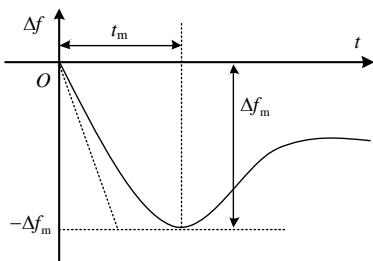  
图1 电力系统动态频率特性  
Fig. 1 Dynamic frequency characteristics of power system

在电力系统的频率动态过程中，系统中各母线所测得的频率会呈现不同的时空分布特征。若忽略网络结构的影响，保留调速器的动态特征，则可建立如图2所示的平均系统频率(average system frequency，ASF)模型。

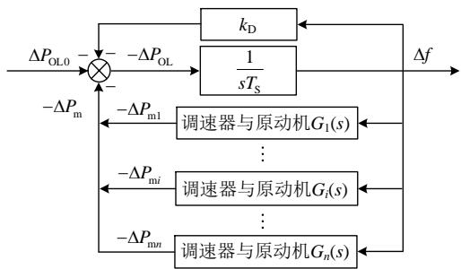  
图2 系统的动态频率响应模型  
Fig. 2 Dynamic frequency response model of the system

系统频率的动态过程可由以下方程进行描述：

$$
\Delta P _ {\mathrm {O L 0}} - \Delta P _ {\mathrm {m}} + T _ {\mathrm {S}} \frac {\mathrm {d} \Delta f}{\mathrm {d} t} + k _ {\mathrm {D}} \Delta f = 0 \tag {1}
$$

式中： $\Delta P_{\mathrm{OL0}}$  为功率缺额； $T_{\mathrm{S}}$  为系统总的转动惯量，等于所有运行机组转动惯量之和； $k_{\mathrm{D}}$  为负荷频率调节效应系数； $\Delta P_{\mathrm{m}}$  为所有发电机原动系统(调速器与原动机)释放的功率总和。在扰动瞬间频率具有最大下降率，其值为  $\left.\frac{\mathrm{d}\Delta f}{\mathrm{d}t}\right|_{t=0} = -\frac{\Delta P_{\mathrm{OL0}}}{T_{\mathrm{S}}}$ 。

如图2所示，功率扰动后的频率动态过程中，当  $\Delta P_{\mathrm{OL}}$  值为零时， $\Delta f$  变化率为零，此时系统频率刚好达到最小值，不妨设为  $f_{0} - \Delta f_{\mathrm{m}}$ ，即原动系统与负荷释放的功率刚好与初始功率缺额平衡时系统频率偏差达到最大值。假设系统频率偏差达到最大值的时间为  $t_{\mathrm{m}}$ ，则在  $t_{\mathrm{m}}$  时刻原动系统与负荷所提供的功率刚好等于系统初始功率缺额，即  $\sum_{i=1}^{n} \Delta P_{\mathrm{mi}} + k_{\mathrm{D}} \Delta f_{\mathrm{m}} = \Delta P_{\mathrm{OL0}}$ 。其中： $\Delta P_{\mathrm{mi}}$  为机组  $i$  原动系统所提供的功率， $\sum_{i=1}^{n} \Delta P_{\mathrm{mi}} = \Delta P_{\mathrm{m}}$ ； $n$  为系统中参与一次调频机组的数量。

换一个角度，如果在  $t_\mathrm{m}$  时刻系统满足下面的约束条件：

$$
\sum_ {i = 1} ^ {n} \Delta P _ {\mathrm {m} i} + k _ {\mathrm {D}} \Delta f _ {\mathrm {m}} \geq \Delta P _ {\mathrm {O L} 0} \tag {2}
$$

则系统频率偏差在到达  $-\Delta f_{\mathrm{m}}$  前就将停止下降，系统的频率偏差最大量将小于  $\Delta f_{\mathrm{m}}$  。如果  $\Delta f_{\mathrm{m}}$  取为系统要求的最大频率偏差限值，则式(2)就可以作为系统频率安全的约束条件，只要系统满足式(2)，就可以保证在功率扰动  $\Delta P_{\mathrm{OL0}}$  下，系统最大频率偏差小于限值  $\Delta f_{\mathrm{m}}$  。而在上述约束方程中，如何确定系统频率最低点时间  $t_{\mathrm{m}}$  与原动系统在  $t_{\mathrm{m}}$  时刻释放的功率成为其关键。

频率最低点时间  $t_{\mathrm{m}}$  受到机组惯量、调速器及原动机、扰动大小等因素的影响，准确的表达式十分复杂。本节提出一种近似计算方法。功率扰动瞬间频率变化率  $\frac{\mathrm{d}\Delta f}{\mathrm{d}t}\big|_{t = 0} = -\frac{\Delta P_{\mathrm{OL0}}}{T_{\mathrm{S}}}$  ，如图3所示。从初始点到频率最低点的平均斜率(频率变化率)设为 $k = \delta \frac{\mathrm{d}\Delta f}{\mathrm{d}t}\big|_{t = 0}$  ，其中  $\delta$  为两斜率的比值。根据附录A的推导，对于无衰减的正弦曲线，  $\delta$  的值为  $2 / \pi$  ；实际的频率响应曲线是衰减的正弦曲线，其  $\delta$  的值小于  $2 / \pi$  。另外，由附录A得证，  $\delta$  越大，调节功率 $\Delta P_{\mathrm{m}}$  越小，因此，取较大的  $\delta$  值能够获得保守的结果。基于保守性原则，本文中比例系数  $\delta$  均取为  $2 / \pi$  。

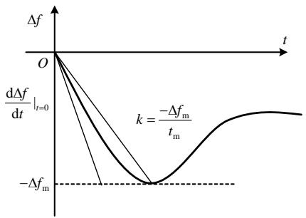  
图3 系统动态频率响应特性  
Fig.3 System dynamic frequency response characteristics 则  $t_\mathrm{m}$  可表示为

$$
t _ {\mathrm {m}} = \frac {\pi T _ {\mathrm {S}} \Delta f _ {\mathrm {m}}}{2 \Delta P _ {\mathrm {O L 0}}} \tag {3}
$$

下面确定各发电机原动系统的功率调节量  $\Delta P_{\mathrm{mi}}$  。由图2不难得知  $\Delta P_{\mathrm{mi}}(s) = -G_{i}(s)\Delta f(s)$  ，即功率调节量与频率的变化曲线、机组  $i$  原动系统传递函数  $G_{i}(s)$  有着紧密关系。本节同样采用近似计算方法。对于图2中的机组原动系统部分，最简单的可以使用一个一阶惯性环节对其动态过程进行模拟[27]，如式(4)所示。对于实际的机组  $i$  ，其中的功频特性系数  $k_{\mathrm{Gi}}$  与发电机调速器和原动机综合时间常数  $T_{\mathrm{Gi}}$  可通过最小二乘法对原动系统的阶跃响应进行拟合得到：

$$
G _ {i} (s) = \frac {k _ {\mathrm {G} i}}{1 + s T _ {\mathrm {G} i}} \tag {4}
$$

由前文分析可知， $\Delta f$  的表达式较为复杂，用图3中初始点到频率最低点的直线近似，斜率为  $k$ 。采用直线近似时，在  $t_{\mathrm{m}}$  之前直线近似获得的频差都小于实际的频差，原动系统调节功率将小于实际值，采用该近似同样可以使得结果是保守的。根据近似后的频率曲线以及原动系统的一阶简化模型，可以得到调速器与原动机随时间所释放的功率为

$$
\Delta P _ {\mathrm {m} i} (t) = - k \cdot k _ {\mathrm {G} i} \left(t - T _ {\mathrm {G} i} + T _ {\mathrm {G} i} \mathrm {e} ^ {- \frac {t}{T _ {\mathrm {G} i}}}\right) \tag {5}
$$

将  $\Delta P_{\mathrm{mi}}$  代回系统频率约束表达式(2)中，可得：

$$
\frac {2 \Delta P _ {\mathrm {O L 0}}}{\pi T _ {\mathrm {S}}} \sum_ {i = 1} ^ {n} k _ {\mathrm {G} i} \left[ t _ {\mathrm {m}} - T _ {\mathrm {G} i} + T _ {\mathrm {G} i} \mathrm {e} ^ {- t _ {\mathrm {m}} / T _ {\mathrm {G} i}} \right] + k _ {\mathrm {D}} \Delta f _ {\mathrm {m}} \geq \Delta P _ {\mathrm {O L 0}} (6)
$$

即若系统运行状态满足该约束条件，当发生功率值为  $\Delta P_{\mathrm{OL0}}$  的功率扰动时，系统的最大频率偏差值可以保证在  $\Delta f_{\mathrm{m}}$  范围内。但是，式(6)并没有考虑到机组的出力限制，后续将对其进行改进。

# 2 考虑频率安全约束和风电不确定性的机组组合模型

上节推导出了电力系统频率安全约束表达式，本节将其作为约束条件纳入至考虑动态频率约束限制的机组组合模型中。

风电出力预测不准确性是其重要特征之一。风电预测常用风功率预测区间进行表示，其代表了某一时刻风电出力的上、下限。风电本身的不确定性将影响机组的开机及出力。

日前安排的机组启停应由风功率预测区间决定，开机机组必须能够应对风电出力极值的场景；而机组的出力是根据风电超短期功率预测决定的。相对于日前风功率预测，日内进行的风功率超短期预测准确度高得多。若在日前将机组的启停与出力一同优化，得到了机组开机安排与出力安排，到了日内仍然要根据实际的风电出力进行机组出力的调整。故考虑风电不确定性及频率安全约束的机组组合模型求解应分为两个阶段：1）根据日前的风功率预测区间进行日前机组启停的安排；2）根据当前时刻机组的出力以及下一时刻风电的超短期出力预测进行下一时刻机组的出力安排。

当机组满出力时，其将失去一次调频作用，故机组应当留有一定的一次调频备用容量。对于某个机组启停状态确定的场景，当风电出力最小，即火电机组出力最大时，系统备用容量为最小值，此时系统的调频能力最低。为满足系统调频能力最低时仍能承受相应的功率冲击，在第一步机组启停的安排阶段应当按照风电出力最小情况，即调频状态“最坏”情况下进行机组启停安排。

# 2.1 机组启停状态安排

在已知次日短期风电预测功率区间时，应当先进行日前机组启停安排。根据前文分析，某时刻机组的启停状态应为风电出力最小值时的启停状态。机组启停安排的求解模型如下。

# 2.1.1 目标函数

目标函数通常为总发电成本最低：

$$
\min  F = \sum_ {t = 1} ^ {T} \sum_ {i = 1} ^ {N} \left[ U _ {i t} C _ {i t} + U _ {i t} \left(1 - U _ {i, t - 1}\right) S _ {i} \right] \tag {7}
$$

式中： $F$  为总发电成本； $C_{it}$  为机组  $i$  在第  $t$  时刻的发电成本，主要是化石能源消耗对应的成本； $S_{i}$  为机组  $i$  的启动成本； $N$  为机组总数； $T$  为时段总数； $t$  表示第  $t$  时刻， $t = 1,2,\dots,T$ ； $i$  表示第  $i$  台机组， $i = 1,2,\dots,N$ ； $U_{it}$  为机组  $i$  在第  $t$  时刻的状态， $U_{it} = 1$  表示机组处于运行状态； $U_{it} = 0$  表示机组处于停机状态。

机组  $i$  的发电成本可用二次函数表示为

$$
C _ {i t} = a _ {i} + b _ {i} P _ {i t} + c _ {i} P _ {i t} ^ {2} \tag {8}
$$

式中： $a_{i}$ 、 $b_{i}$ 、 $c_{i}$  为机组  $i$  发电成本函数的参数； $P_{it}$  为机组  $i$  在  $t$  时刻的出力。

风电不消耗化石燃料，运行成本一般设为零，将目标函数设置为总发电成本，则优化结果将倾向于在满足约束条件的前提下尽可能增加没有成本的风电消纳量，和风电消纳最大的目标基本一致。

# 2.1.2 约束条件

机组组合问题在优化过程中必须要满足如下的约束条件。

# 1）功率平衡约束。

所有运行机组总发电量必须与负荷量相平衡：

$$
D _ {t} = P _ {\mathrm {w} \min , t} + \sum_ {i = 1} ^ {N} U _ {i t} P _ {i t}, \quad t = 1, 2, \dots , T \tag {9}
$$

式中:  $D_{t}$  为  $t$  时刻系统的总负荷;  $P_{\mathrm{wmin}, t}$  为  $t$  时刻风电功率预测区间下限。

# 2）旋转备用约束。

考虑到系统的可靠性，机组还应当提供充足的旋转备用约束：

$$
\sum_ {i = 1} ^ {N} U _ {i t} P _ {i \max } \geq D _ {t} + R _ {t} \tag {10}
$$

式中： $P_{\text{imax}}$  为机组  $i$  的最大出力； $D_{t}$  为第  $t$  时刻系统的总负荷； $R_{t}$  为  $t$  时刻系统的备用容量。本文  $R_{t}$  取为总负荷的  $5\%$ 。

# 3）最小启停时间约束。

机组只有在运行或者停机一段时间后才能再进行停机或者启动操作，满足最小启停时间约束：

$$
\left\{ \begin{array}{l} X _ {i t} \geq \overline {{\tau}} _ {i} \\ (- X _ {i t}) \leq \underline {{\tau}} _ {i} \end{array} \right. \tag {11}
$$

式中： $X_{it}$  为机组  $i$  到  $t$  时刻连续运行  $(X_{it}$  为正值)或连续停机  $(X_{it}$  为负值)的时段数； $\overline{\tau}_i$  为机组  $i$  的最小运行时间； $\tau_i$  为机组  $i$  的最小停机时间。

# 4）机组出力约束。

每台机组的出力应当在一定的范围内

$$
P _ {i \min } \leq P _ {i t} \leq P _ {i \max } \tag {12}
$$

式中：  $P_{i\min}$  为机组  $i$  的出力下限；  $P_{i\max}$  为机组  $i$  的出力上限。

# 5）机组爬坡约束。

$$
\left\{ \begin{array}{l} P _ {i t} - P _ {i, t - 1} \leq D _ {\mathrm {p m a x}} \\ P _ {i t} - P _ {i, t - 1} \geq D _ {\mathrm {p m i n}} \end{array} \right. \tag {13}
$$

式中  $D_{\mathrm{pmax}}$  和  $D_{\mathrm{pmin}}$  分别为机组  $i$  的功率上升、下降量的上下限。

# 6）弃风率约束。

实际含风电的电力系统运行时允许有一定的弃风率。通常为风电出力值最大时系统的弃风率最大。本文设置一天24h内系统的最大总弃风率不高于  $10\%$  。

$$
\sum_ {t = 1} ^ {T} \left[ P _ {\mathrm {w} \max , t} - \left(D _ {t} - \sum_ {i = 1} ^ {N} U _ {i t} P _ {i \min}\right) \right] \leq 0. 1 \sum_ {t = 1} ^ {T} P _ {\mathrm {w} \max , t} \tag {14}
$$

式中  $P_{\mathrm{wmax},t}$  为  $t$  时刻风电功率预测区间上限。

7）频率安全约束条件。

根据上一节分析，每一个时刻应满足的频率安全约束为

$$
\begin{array}{l} \frac {2 \Delta P _ {\mathrm {O L} 0 t}}{\pi T _ {\mathrm {S} t}} \sum_ {i = 1} ^ {N} U _ {i t} k _ {\mathrm {G} i} \left[ t _ {\mathrm {m} t} - T _ {\mathrm {G} i} + T _ {\mathrm {G} i} \mathrm {e} ^ {- t _ {\mathrm {m} t} / T _ {\mathrm {G} i}} \right] + k _ {\mathrm {D} t} \Delta f _ {\mathrm {m}} \geq \\ \Delta P _ {\mathrm {O L 0} t} \tag {15} \\ \end{array}
$$

式中： $\Delta P_{\mathrm{OL0t}}$  为  $t$  时刻系统预想的最大功率扰动； $k_{\mathrm{Dt}}$  为  $t$  时刻负荷调节效应系数； $T_{\mathrm{St}}$  为  $t$  时刻系统的惯量； $t_{\mathrm{mr}}$  为  $t$  时刻系统频率最低点时间。但是，式(15)并没有考虑机组的出力限制。

式(10)中考虑的旋转备用约束为运行备用容量，为的是根据系统负荷变化自动调整发电出力。而式(15)考虑的是系统发生大功率扰动的情况，对应的备用容量则是事故备用容量。故除约束条件(10)中的运行备用，同时也应当考虑应对大功率扰动的事故备用。由频率安全约束可知，其成立的前提条件为  $t_{\mathrm{m}}$  时刻机组和负荷能够提供数值大于等于  $\Delta P_{\mathrm{OL0}}$  的功率值。实际上，当部分机组满出力时，其将失去了一次调频作用。另外，备用容量应尽量配置在调节速度快的机组上，否则即使整个系统拥有足够的备用容量，但是却无法在  $t_{\mathrm{m}}$  时刻释放出值为  $\Delta P_{\mathrm{OL0}}$  的功率，也无法满足频率安全约束条件。故加入如下约束：

$$
\left\{ \begin{array}{c} \Delta P _ {i t} = \min  \left(\frac {2 \Delta P _ {\mathrm {O L} 0 t}}{\pi T _ {\mathrm {S} t}} k _ {\mathrm {G} i} \left[ t _ {\mathrm {m} t} - T _ {\mathrm {G} i} + T _ {\mathrm {G} i} \mathrm {e} ^ {- t _ {\mathrm {m} t} / T _ {\mathrm {G} i}} \right], \right. \\ \left. P _ {i \max } - P _ {i t}\right) \quad (1 6) \\ \sum_ {i = 1} ^ {N} U _ {i t} \Delta P _ {i t} + k _ {\mathrm {D} t} \Delta f _ {\mathrm {m}} \geq \Delta P _ {\mathrm {O L} 0 t} \end{array} \right.
$$

加入此约束保证  $t_{\mathrm{m}}$  时刻系统能提供足够的功率以满足调频需求。

以上表达式适用于系统外接直流联络线发生闭锁故障时的场景。若假设系统中的功率缺额来源于最大出力机组退出运行，则功率扰动  $\Delta P_{\mathrm{OL}0t}$  则变成一个不确定的值，同时某一台机组的原动系统退出调频，系统惯量  $T_{\mathrm{St}}$  也将发生变化。针对此场景，可令  $\Delta P_{\mathrm{OL}0t} = \max (P_{1,t}, P_{2,t}, \dots; P_{n,t})$ ，同时  $T_{\mathrm{St}}$  变为  $T_{\mathrm{St}} - T_{\mathrm{St}}'$ ，其中  $T_{\mathrm{St}}'$  为最大出力机组的惯量。

求解以上模型，所得机组启停状态即为日前机组启停安排。

# 2.2 机组出力安排

日内运行时，机组启停的安排已经确定，根据当前时刻(记为  $t - 1$  时刻)机组的出力以及  $t$  时刻的超

短期负荷预测与风电出力预测，求解以下模型得到  $t$  时刻的机组出力安排。

# 2.2.1 目标函数

目标函数同样为总发电成本最低。与之前不同， $U_{it}$  为已知量。

$$
\min  F = \sum_ {i = 1} ^ {N} \left[ U _ {i t} C _ {i t} + U _ {i t} \left(1 - U _ {i, t - 1}\right) S _ {i} \right] \tag {17}
$$

# 2.2.2 约束条件

机组出力安排则需要满足如下约束条件。

1）功率平衡约束。

$$
D _ {t} = P _ {\mathrm {w}, t} + \sum_ {i = 1} ^ {N} U _ {i t} P _ {i t} \tag {18}
$$

式中  $P_{\mathrm{w},t}$  为  $t$  时刻风电实际出力值。

2）旋转备用约束。

$$
\sum_ {i = 1} ^ {N} U _ {i t} P _ {i \max } \geq D _ {t} + R _ {t} \tag {19}
$$

3）机组出力约束。

$$
\left\{ \begin{array}{l} P _ {i \min } \leq P _ {i t} \leq P _ {i \max } \\ P _ {\mathrm {w}, t} \leq P _ {\mathrm {w}, t} ^ {\prime} \end{array} \right. \tag {20}
$$

式中： $P_{\mathrm{w},t}^{\prime}$  为  $t$  时刻的风电功率超短期预测值； $t$  时刻风电的实际出力不大于其超短期预测值。

4）机组爬坡约束。

$$
\left\{ \begin{array}{l} P _ {i t} - P _ {i, t - 1} \leq D _ {\mathrm {p m a x}} \\ P _ {i t} - P _ {i, t - 1} \geq D _ {\mathrm {p m i n}} \end{array} \right. \tag {21}
$$

5）频率安全约束条件。

$$
\sum_ {i = 1} ^ {N} \Delta P _ {i t} + k _ {\mathrm {D} t} \Delta f _ {\mathrm {m}} \geq \Delta P _ {\mathrm {O L} 0 t} \tag {22}
$$

求解以上模型即可得  $t$  时刻的机组出力安排。

# 2.3 机组组合模型求解

机组组合问题是一个混合整数非线性规划的问题。将UC问题中的非线性公式转化为线性公式，建立混合整数线性规划(mixed integer linear programming，MILP)模型，即可使用高效的商用求解器进行求解。本文采用Gurobi求解器进行求解。以下将讨论如何对频率约束条件进行线性化。

频率安全约束条件式(15)可变形为

$$
\begin{array}{l} \frac {2}{\pi} \Delta P _ {\mathrm {O L 0 t}} \sum_ {i = 1} ^ {N} U _ {i t} k _ {\mathrm {G} i} \left[ t _ {\mathrm {m} t} - T _ {\mathrm {G} i} + T _ {\mathrm {G} i} \mathrm {e} ^ {- t _ {\mathrm {m} t} / T _ {\mathrm {G} i}} \right] \geq \\ T _ {S t} \left(\Delta P _ {\mathrm {O L} 0 t} - k _ {\mathrm {D} t} \Delta f _ {\mathrm {m}}\right) \\ \end{array}
$$

其中会出现3种非线性式：指数项、0-1变量与0-1变量相乘、0-1变量与连续变量相乘；式(16)中出现min与max函数。非线性项的线性化方法为：

1）指数项、两个0-1变量相乘、0-1变量与连续变量相乘的线性化。指数项线性化的方式可参考文献[28]；而0-1变量相乘与0-1变量乘以连续变量

线性化的方式可参考文献[29]。

# 2）min、max函数的线性化。

对于  $\min (a_1, a_2, \dots, a_n)$ ，引入  $n$  个中间 0-1 变量  $\nu_1, \nu_2, \dots, \nu_n$ ，则  $\min$  函数可添加以下约束条件后使用  $c$  表示：

$$
\left\{ \begin{array}{l} c = v _ {1} a _ {1} + \dots + v _ {n} a _ {n} \\ \sum v _ {i} = 1 \\ c \leq a _ {1}, \dots , c \leq a _ {n} \end{array} \right. \tag {23}
$$

max函数的处理方式与其类似，将其中不等号反向即可。同时该方法可在式(16)中找到最大功率缺额的机组编号(即中间0-1变量  $\nu_{i}$  )，则退出调频的原动系统以及系统的惯量减少量可确定。

# 3 算例分析

# 3.1 频率安全约束验证

本部分对第一章中推导的频率动态安全约束条件进行验证。随机生成1600个5机系统，其中每一台机组的  $T_{\mathrm{S}}, T_{\mathrm{G}}, k_{\mathrm{G}}, k_{\mathrm{D}}$  参数范围参考文献[27]分别为(2,10)、(5,11)、(16.7,25)、(2,10)，机组开机状态也随机生成。分别求出符合频率约束与不符合频率约束系统的频率最低值，并与最大频差限值进行对比。同时分别以功率扰动值20、45MW，频率最大偏差值限值分别为0.65、1.5Hz。进行试验可得结果如图4、5所示。图中纵坐标表示的是每个系统的最低频率，蓝色横线表示最大频差限值。

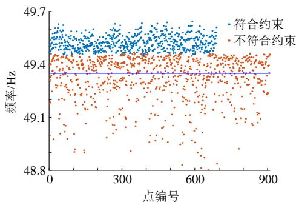  
图4 功率扰动20MW，频率最大偏差限值0.65Hz

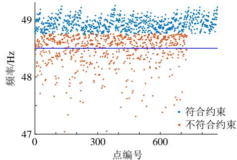  
Fig. 4 Power disturbance 20MW, the maximum frequency deviation requires 0.65Hz  
图5 功率扰动45MW，频率最大偏差限值1.5Hz  
Fig. 5 Power disturbance 45MW, maximum frequency deviation 1.5Hz required

可见，所有代表符合频率约束方程的系统最大频差的点(蓝点)均在蓝色横线以上，即其最大频差小于限值。而红色的点代表不符合约束方程的系统，其有相当一部分的最大频差是不满足要求的。说明了满足该约束方程的系统受到相应扰动后，其最大频率偏差小于所要求的限值，同时其具有一定的保守性。

# 3.2 机组组合算例分析

使用 IEEE 10 机 39 节点系统进行算例分析，将 39 号母线处机组修改为一个大型风力发电场，将 38 号母线机组修改为外接输入功率为 800MW 的直流输电系统。机组参数、负荷数据详见附录 C，风功率预测区间见图 6，其出力上下限详见附录 C。

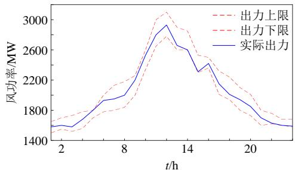  
图6 风功率预测区间出力范围及实际可提供功率  
Fig. 6 Wind power prediction interval output range and actual available power

选取系统标幺值为100MW。分别考虑以下两种功率扰动情况：任意时刻直流输电系统发生双极闭锁，即受到800MW的功率扰动，系统的频率最小值不低于48.5Hz；任意时刻系统中最大出力机组跳闸，系统的频率最小值不低于48.5Hz。本文将对未添加与分别添加了两种不同故障场景的频率约束的机组组合模型分别进行求解，并对比其在相应功率扰动下的频率最大偏差值。

# 3.2.1 调速器拟合

本文中调速系统模型选用典型的机械液压式调速系统模型，模型具体结构及参数详见附录B。使用一阶惯性环节对调速器的动态过程进行模拟，用最小二乘法对参数  $k_{\mathrm{G}}$  与  $T_{\mathrm{G}}$  进行拟合。

式(5)中，考虑的是原动系统  $0 \sim t_{\mathrm{m}}$  时间段的动态性能，故拟合数据也应为原动系统  $0 \sim t_{\mathrm{m}}$  秒的阶跃响应数据。根据式(3)中  $t_{\mathrm{m}}$  计算表达式以及附录C表C1中各机组惯量，可得  $t_{\mathrm{mmax}} = 5.32\mathrm{s}$ ，故拟合时间段为  $0 \sim 5.32\mathrm{s}$ 。拟合结果如表1所示。

表 1 调速器拟合结果  
Table 1 Governor fitting results  

<table><tr><td>参数组别</td><td>kG</td><td>TG</td></tr><tr><td>1</td><td>16.37</td><td>3.72</td></tr><tr><td>2</td><td>20.05</td><td>3.62</td></tr><tr><td>3</td><td>22.56</td><td>2.94</td></tr></table>

其中额定功率为500MW的机组使用1组参数原动系统，额定功率为600MW机组分别使用2组和3原动系统参数。且在计算频率约束条件前应当根据系统基值与额定功率基值的关系进行换算。

# 3.2.2 机组组合模型求解

对未添加频率约束条件的系统进行求解，得到其机组启停状态；同时对添加频率约束条件的机组组合系统进行求解，得到其机组的启停状态。二者具体结果详见附录C。

可见相对于未添加频率约束的机组组合模型，增加了频率约束的机组组合模型的机组启停状态略有不同，这使得系统的调频能力上升，能够满足频率约束的要求。

令风电的实际可提供的功率如图6，具体数值见附录C，则可根据风电的实际出力与上一步所求得的机组启停状态进行机组出力安排。分别对未添加频率约束的组合模型与两种不同场景的添加频率约束的组合模型进行求解，可得其出力安排，详见附录C。同时分别对两个不同频率扰动场景分别进行相应的功率扰动操作，对比其频率最大偏差，结果详见表2—5。

未添加频率约束的机组组合模型求解所得的开机以及运行总成本为  $5.8552 \times 10^{5}$ ；考虑了直流闭锁故障的频率约束的机组组合开机及运行总成本为  $7.2433 \times 10^{5}$ ，考虑了最大出力机组跳闸的频率约束的机组组合开机及运行总成本为  $6.0789 \times$

表 2 未加约束时直流闭锁频率最小值  
Table 2 Minimum frequency without constraints when DC blocking  

<table><tr><td>时段/h</td><td>频率/Hz</td><td>时段/h</td><td>频率/Hz</td><td>时段/h</td><td>频率/Hz</td></tr><tr><td>1</td><td>45.7857</td><td>9</td><td>47.3202</td><td>17</td><td>46.9250</td></tr><tr><td>2</td><td>45.3472</td><td>10</td><td>47.4718</td><td>18</td><td>46.9588</td></tr><tr><td>3</td><td>47.4606</td><td>11</td><td>47.5967</td><td>19</td><td>46.9588</td></tr><tr><td>4</td><td>47.6471</td><td>12</td><td>47.3041</td><td>20</td><td>47.2885</td></tr><tr><td>5</td><td>47.7879</td><td>13</td><td>47.9504</td><td>21</td><td>47.0597</td></tr><tr><td>6</td><td>47.8670</td><td>14</td><td>47.0886</td><td>22</td><td>46.7858</td></tr><tr><td>7</td><td>47.4975</td><td>15</td><td>47.2492</td><td>23</td><td>47.1871</td></tr><tr><td>8</td><td>47.0090</td><td>16</td><td>47.6635</td><td>24</td><td>47.3271</td></tr></table>

表 3 添加约束后直流闭锁频率最小值  
Table 3 Minimum frequency with constraints when DC blocking  

<table><tr><td>时段/h</td><td>频率/Hz</td><td>时段/h</td><td>频率/Hz</td><td>时段/h</td><td>频率/Hz</td></tr><tr><td>1</td><td>48.7940</td><td>9</td><td>48.7461</td><td>17</td><td>48.7461</td></tr><tr><td>2</td><td>48.8000</td><td>10</td><td>48.7624</td><td>18</td><td>48.7327</td></tr><tr><td>3</td><td>48.8030</td><td>11</td><td>48.7784</td><td>19</td><td>48.7260</td></tr><tr><td>4</td><td>48.8060</td><td>12</td><td>48.7846</td><td>20</td><td>48.8236</td></tr><tr><td>5</td><td>48.8089</td><td>13</td><td>48.7720</td><td>21</td><td>48.8178</td></tr><tr><td>6</td><td>48.8119</td><td>14</td><td>48.7527</td><td>22</td><td>48.8236</td></tr><tr><td>7</td><td>48.8265</td><td>15</td><td>48.7592</td><td>23</td><td>48.8089</td></tr><tr><td>8</td><td>48.7327</td><td>16</td><td>48.7559</td><td>24</td><td>48.8060</td></tr></table>

表4 未加约束时最大出力机组跳闸频率最小值 Table 4 Minimum frequency without constraints when maximum output unit tripped  

<table><tr><td>时段/h</td><td>频率/Hz</td><td>时段/h</td><td>频率/Hz</td><td>时段/h</td><td>频率/Hz</td></tr><tr><td>1</td><td>46.6429</td><td>9</td><td>47.5741</td><td>17</td><td>47.2067</td></tr><tr><td>2</td><td>46.1806</td><td>10</td><td>47.7243</td><td>18</td><td>47.5501</td></tr><tr><td>3</td><td>47.7672</td><td>11</td><td>47.8418</td><td>19</td><td>47.3206</td></tr><tr><td>4</td><td>47.9522</td><td>12</td><td>47.5540</td><td>20</td><td>47.0313</td></tr><tr><td>5</td><td>47.9815</td><td>13</td><td>48.1771</td><td>21</td><td>47.4516</td></tr><tr><td>6</td><td>48.7778</td><td>14</td><td>47.3301</td><td>22</td><td>47.6087</td></tr><tr><td>7</td><td>47.1668</td><td>15</td><td>47.5024</td><td>23</td><td>49.4613</td></tr><tr><td>8</td><td>47.2508</td><td>16</td><td>47.1668</td><td>24</td><td>49.5295</td></tr></table>

表5添加约束后最大出力机组跳闸频率最小值 Table5 Minimum frequency with constraints when maximum output unit tripped  

<table><tr><td>时段/h</td><td>频率/Hz</td><td>时段/h</td><td>频率/Hz</td><td>时段/h</td><td>频率/Hz</td></tr><tr><td>1</td><td>49.0815</td><td>9</td><td>48.6052</td><td>17</td><td>48.6052</td></tr><tr><td>2</td><td>48.8827</td><td>10</td><td>48.5982</td><td>18</td><td>48.6110</td></tr><tr><td>3</td><td>48.8541</td><td>11</td><td>48.5916</td><td>19</td><td>48.6140</td></tr><tr><td>4</td><td>48.8591</td><td>12</td><td>48.5891</td><td>20</td><td>48.6201</td></tr><tr><td>5</td><td>49.0249</td><td>13</td><td>48.5942</td><td>21</td><td>48.6233</td></tr><tr><td>6</td><td>49.0101</td><td>14</td><td>48.7716</td><td>22</td><td>48.6201</td></tr><tr><td>7</td><td>48.6186</td><td>15</td><td>48.5996</td><td>23</td><td>48.6282</td></tr><tr><td>8</td><td>48.6110</td><td>16</td><td>48.6010</td><td>24</td><td>48.6298</td></tr></table>

$10^{5}$ 。可见频率约束的添加增加了机组组合计划的运行成本。且相对于直流闭锁，机组退出运行对应的功率扰动数值较低，故相对而言该约束下的优化结果更为经济。同时，未添加频率约束的机组组合模型中，一旦发生闭锁事件或者发生最大出力机组跳闸事件，由表2与表4可知系统的最低频率值是低于  $48.5\mathrm{Hz}$  的；而在添加了动态频率约束后，由表3与表5知，任意时刻发生对应的直流闭锁故障、最大功率机组跳闸故障，系统的最低频率均高于  $48.5\mathrm{Hz}$ 。

与未增加约束下大部分机组满出力的情况相比,添加了频率安全约束后的求解结果给机组预留了备用容量,为系统的调频提供了充足的备用功率。在添加直流闭锁故障的频率安全约束的优化结果中,因为要保证一定的开机数量,受到机组最小出力限制的影响,在1、2、4、5、6这5个时刻分别出现了130、50、30、100、180MW的弃风现象。从理论上这是合理的,为了保证频率安全增加开机数量,这就需要牺牲掉一部分风电的消纳量。同时,目标函数为总发电成本最小,则机组组合优化结果倾向于在满足频率安全约束条件下最大消纳无成本的风电。若进一步考虑弃风最小,可在目标函数中加入弃风惩罚项  $C_{\mathrm{w}}q_{\mathrm{w},t}$ ,其中  $C_{\mathrm{w}}$  为弃风罚函数成本,参考文献[30]取为100\$/MW;  $q_{\mathrm{w},t}$  为  $t$  时刻的弃风量。仿真结果显示机组组合优化结果与不加罚项完全一致,总目标函数变为7.7333×10^5\$,增加量

刚好等于弃风量乘以罚函数成本系数，说明本文采用的优化目标也实现了风电最大消纳。

本文频率安全约束条件表达式存在有一定的保守性。现对其进行仿真分析。

以直流闭锁系统为例，逐步减小系数δ的取值，并对每个不同的δ取值重新优化出机组组合安排，直到出现受到扰动后频率刚好降至  $48.5\mathrm{Hz}$  的时刻，并考察δ变化时该时刻的机组组合结果，便可获得保守度的大小及其对结果的影响。

前面分析中  $\delta = 2 / \pi = 0.637$  ，将  $\delta$  逐步减少，发现当  $\delta$  降低至0.540时，2时刻功率扰动后的频率最低值为  $48.5242\mathrm{Hz}$  ，最大频差大致为  $1.5\mathrm{Hz}$  。系数  $\delta$  逐渐降低时2时刻的机组组合结果与频率最小值详见附录C表C12。

相较于保守度为0的情况(δ=0.540,5台开机,运行成本23909$),随着系数δ的增大,2时刻的系统的开机数量也由5台机增至7台机(δ=0.637);最低频率则由48.5242Hz增加到48.8000Hz,显示保守性增大。对于运行成本而言,随着系数δ的增大,运行成本由23909$增至27040$,由于保守度所引起的成本增加了5.16%~13.10%;而对于风电消纳而言,δ=0.637时,2时刻弃风量为50MW。而当δ降低到0.562及以下后,由于减少了开机量,风电得以全部消纳。

实际工程应用中，可以针对实际电网总结出一些保守性大小的经验，然后通过调整文中的δ值改善保守性，但这是一种工程的做法，存在无法从理论上保证保守性的风险。

# 4 结论

本文基于频率动态过程中的功率平衡提出了一种电力系统动态频率安全约束条件，同时将该频率安全约束加入至机组组合优化模型中，并考虑了风电预测的不准确性，提出了一种考虑风电功率不确定性与频率安全约束的机组组合模型。主要结论有下：

1）对于给定的功率扰动以及频率最大偏差要求，若系统运行状态满足该约束条件时，则系统受相应扰动后的最大频率偏差将小于所要求的频率最大偏差值。相较于传统计算频率最大偏差值的方法该约束条件更为简洁实用，同时充分考虑了备用容量在系统调频中的影响，且具有一定保守性，能够保障系统安全，便于更好地应用于电力系统中。  
2）相较于传统机组组合模型，添加了频率安全约束条件并考虑风电功率不确定性的机组组合

模型能够使得系统开机状态满足频率安全条件，同时兼顾其经济性，加强了电力系统的可靠性。

3）该约束条件本身存在有一定的保守性，将会导致机组组合求解结果的运行成本增加。在实际工程应用中可以通过调整方法中的参数  $\delta$  来改善保守性。如何量化评估保守度、尽量降低保守性将是未来工作。

附录见本刊网络版(http://www.dwjs.com.cn/CN/1000-3673/current.shtml)。

# 参考文献

[1] 胡益，王晓茹．一种计及紧急功率支援的直流互联异步电网动态频率分析方法[J].电网技术，2018，42(9)：2859-2868.  
Hu Yi, Wang Xiaoru. A dynamic frequency analysis method for HVDC-interconnected asynchronous power grid considering emergency power support[J]. Power System Technology, 2018, 42(9): 2859-2868(in Chinese).  
[2] 郑超，王士元，张波琦，等．光伏高渗透电网动态频率特性及应对措施[J].电网技术，2019，43(11)：4064-4073.  
Zheng Chao, Wang Shiyuan, Zhang Boqi, et al. Dynamic frequency characteristics and countermeasures of power grid with highly penetrated photovoltaics[J]. Power System Technology, 2019, 43(11): 4064-4073(in Chinese).  
[3] 常烨骐，刘娆，巴宇，等．新能源高占比的特高压电网频率控制模式及性能评价[J]．电网技术，2019，43(2)：621-629.  
Chang Yekui, Liu Rao, Ba Yu, et al. Frequency control mode and performance assessment in UHV grid with high proportion of renewable energy resources[J]. Power System Technology, 2019, 43(2): 621-629(in Chinese).  
[4] 夏清，钟海旺，康重庆．安全约束机组组合理论与应用的发展和展望[J].中国电机工程学报，2013，33(16)：123-132.  
Xia Qing, Zhong Haiwang, Kang Chongqing. Development and prospect of safety-constrained unit combination theory and application[J]. Proceedings of the CSEE, 2013, 33(16): 123-132(in Chinese).  
[5] 张利，赵建国，韩学山. 考虑网络安全约束的机组组合新算法[J]. 电网技术，2006，30(21)：50-55.  
Zhang Li, Zhao Jianguo, Han Xueshan. New algorithm for generating unit combination considering network security constraints[J]. Power System Technology, 2006, 30(21): 50-55 (in Chinese).  
[6] 杨朋朋，韩学山，查浩．一种计及静态安全约束机组组合的有效算法[J]．电力系统自动化，2009，33(8)：39-43.  
Yang Pengpeng, Han Xueshan, Zha Hao. An effective algorithm considering static safety constrained unit combination[J]. Automation of Electric Power Systems, 2009, 33(8): 39-43(in Chinese).  
[7] 江全元，张铭泽，高强．考虑交流潮流约束的机组组合并行解法[J].电工技术学报，2009，24(8)：120-126.  
Jiang Quanyuan, Zhang Mingze, Gao Qiang. Parallel solution of unit combination considering AC power flow constraints[J]. Transactions of China Electrotechnical Society, 2009, 24(8): 120-126(in Chinese).  
[8] 张铭泽．考虑动态安全约束的电力系统机组组合研究[D]．杭州：浙江大学，2010.  
[9] Xu Y, Dong Z Y, Zhang R, et al. A decomposition-based practical approach to transient stability-constrained unit commitment[J]. IEEE Transactions on Power Systems, 2015, 30(3): 1455-1464.  
[10] 林涛，叶婧，陈汝斯，等．考虑稳态频率约束的含大规模风电电

力系统机组组合研究[J].电力科学与技术学报，2014，29(4)：18-24. Lin Tao，Ye Jing，Chen Rusi，et al. Research on unit combination of large-scale wind power system with steady frequency constraints [J]. Journal of Electric Power Science and Technology，2014，29(4)：18-24(in Chinese).  
[11] 叶婧，林涛，徐遐龄，等．考虑稳态频率约束的含高渗透率风电的孤立电网机组组合[J]. 高电压技术，2018，44(4)：1311-1318. Ye Jing，Lin Tao，Xu Xialing，et al. Isolated grid unit combination with high permeability wind power considering steady-state frequency constraints[J]. High Voltage Technology，2018，44(4)：1311-1318(in Chinese).  
[12] 高林，戴义平，马庆中，等．特高压线路解列后区域互联电网一次调频稳定性研究[J].电网技术，2009，33(20)：27-32. Gao Lin，Dai Yiping，Ma Qingzhong，et al. Study on primary frequency regulation stability of regional interconnected power grid after UHV line decommissioning[J].Power System Technology，2009，33(20)：27-32(in Chinese).  
[13] 刘克天，王晓茹．电厂锅炉及辅机对电力系统动态频率影响的仿真研究[J].电力系统保护与控制，2014，42(13)：53-58. Liu Ketian，Wang Xiaoru. Simulation study on the influence of power plant boilers and auxiliary equipment on the dynamic frequency of power system[J]. Power System Protection and Control，2014，42(13)：53-58(in Chinese).  
[14] 刘柳，李卫东，唱友义，等．大功率缺失下频率最低点估计的低阶仿真模型[J].电力系统自动化，2019，43(17)：78-86. Liu Liu, Li Weidong, Chang Youyi, et al. Low-order simulation model of frequency lowest point estimation under high power loss [J]. Automation of Electric Power Systems, 2019, 43(17): 78-86(in Chinese).  
[15] 仇怡超，闻达，王晓茹，等．基于深度置信网络的电力系统扰动后频率曲线预测[J].中国电机工程学报，2019，39(17)：5095-5104，5290. Zhang Yichao，Wen Da，Wang Xiaoru，et al. Prediction of frequency curve after power system disturbance based on deep confidence network[J].Proceedings of the CSEE，2019，39(17)：5095-5104，5290(in Chinese).  
[16] Alizadeh M, Amraee T. Adaptive scheme for local prediction of post-contingency power system frequency[J]. Electric Power Systems Research, 2014, 107(2): 240-249.  
[17] Restrepo J F, Galiana F D. Unit commitment with primary frequency regulation constraints[J]. IEEE Transactions on Power Systems, 2005, 20(4): 1836-1842.  
[18] Wen Y, Li W, Huang G, et al. Frequency dynamics constrained unit commitment with battery energy storage[J]. IEEE Transactions on Power Systems, 2016, 31(6): 5115-5125.  
[19] Nguyenhong N, Nakanishi Y. Frequency-constrained unit commitment considering battery storage system and forecast error [C]//IEEE Innovative Smart Grid Technologies Asia. IEEE, 2018: 1171-1176.  
[20]TrovatoV，BialeckiA，DallagiA．Unitcommitmentwith inertia-dependent and multispeed allocation of frequency response services[J].IEEE Transactions on Power Systems，2019，34(2):

1537-1548.  
[21] Ahmadi H, Ghasemi H. Security-constrained unit commitment with linearized system frequency limit constraints[J]. IEEE Transactions on Power Systems, 2014, 29(4): 1536-1545.  
[22] 叶婧，林涛，张磊，等．考虑动态频率约束的含高渗透率光伏电源的孤立电网机组组合[J].电工技术学报，2017，32(13)：194-202. Ye Jing，Lin Tao，Zhang Lei，et al. Isolation grid unit combination with high permeability photovoltaic power source considering dynamic frequency constraints[J]. Transactions of China Electrotechnical Society，2017，32(13)：194-202(in Chinese).  
[23] 周博然. 含风电的机组组合模型及算法研究[D]. 杭州：浙江大学，2015.  
[24] Zhao L, Zeng B. Robust unit commitment problem with demand response and wind energy[C]/2012 IEEE Power and Energy Society General Meeting. IEEE, 2012: 1-8.  
[25] Jiang R, Wang J, Guan Y. Robust unit commitment with wind power and pumped storage hydro[J]. IEEE Transactions on Power Systems, 2012, 27(2): 800-810.  
[26] 赵晶晶，徐传琳，吕雪，等．微电网一次调频备用容量与储能优化配置方法[J]．中国电机工程学报，2017，37(15)：4324-4332，4572. Zhao Jingjing，Xu Chuanlin，Lü Xue，et al．Optimized allocation method of primary frequency regulation reserve capacity and energy storage of microgrid[J]．Proceedings of the CSEE，2017，37(15)：4324-4332，4572(in Chinese).  
[27] 闵勇，陈磊，姜齐荣．电力系统稳定分析[M].北京：清华大学出版社，2016.  
[28] Padberg M. Approximating separable nonlinear functions via mixed zero-one programs[J]. Operations Research Letters, 2000, 27(1): 1-5.  
[29] Wang C, Wei W, Wang J, et al. Robust defense strategy for gas-electric systems against malicious attacks[J]. IEEE Transactions on Power Systems, 2017, 32(4): 2953-2965.  
[30] 刘小聪，王蓓蓓．李扬，等．基于实时电价的大规模风电消纳机组组合和经济调度模型[J]．电网技术，2014，38(11)：2955-2963. Liu Xiaocong，Wang Beibei，Li Yang，et al．Large-scale wind power consumption unit combination and economic dispatch model based on real-time electricity price[J]．Power System Technology，2014，38(11)：2955-2963(in Chinese).

  
林恒先

在线出版日期：2020-10-27。

收稿日期：2020-02-05。

作者简介：

林恒先(1996)，男，硕士研究生，研究方向为电力系统频率动态过程，E-mail: lin-hx18@tsinghua.edu.cn;

侯凯元(1971)，男，博士，教授级高级工程师，主要研究方向为电网调度运行、稳定分析和控制等，E-mail：houkaiyuan2010@163.com;

陈磊(1982)，男，博士，副研究员，通信作者，研究方向为电力系统动态分析与控制，E-mail:chenlei08@tsinghua.edu.cn。

（责任编辑 王金芝）

# 附录A

比例系数  $\delta$  最大值的推导：

比例系数  $\delta = \frac{\Delta f_{\mathrm{m}}}{t_{\mathrm{m}}} / \frac{\Delta P_{\mathrm{OL0}}}{T_{\mathrm{S}}}$  。对于单机系统，系统的频率动态曲线可求得为

$$
\Delta f = - \frac {\Delta P _ {\mathrm {O L 0}}}{k _ {\mathrm {s}}} \left[ 1 - A _ {\mathrm {m}} \mathrm {e} ^ {- \alpha t} \cos (\varOmega t + \varphi) \right]
$$

式中：

$$
\alpha = \frac {1}{2} \left(\frac {1}{T _ {\mathrm {G}}} + \frac {k _ {\mathrm {D}}}{T _ {\mathrm {S}}}\right)
$$

$$
\varOmega = \sqrt {\frac {k _ {\mathrm {S}}}{T _ {\mathrm {S}} T _ {\mathrm {G}}} - \alpha^ {2}}
$$

$$
A _ {\mathrm {m}} = \frac {1}{2 \Omega T _ {\mathrm {S}}} \sqrt {k _ {\mathrm {S}} k _ {\mathrm {G}}}
$$

$$
\varphi = \arctan (\frac {1}{\Omega} (\frac {k _ {\mathrm {s}}}{T _ {\mathrm {s}}} - \alpha))
$$

$$
k _ {\mathrm {S}} = k _ {\mathrm {D}} + k _ {\mathrm {G}}
$$

频率最大偏差发生的时刻可求得为  $t_{\mathrm{m}} = \frac{1}{\Omega}$ $\arctan \left(\frac{2T_{\mathrm{S}}T_{\mathrm{G}}\varOmega}{k_{\mathrm{D}}T_{\mathrm{G}} - T_{\mathrm{S}}}\right)$  ，则比例系数  $\delta = (\frac{\Delta f_{\mathrm{max}}}{t_{\mathrm{m}}}$ $\frac{\Delta P_{\mathrm{OL}}}{T_{\mathrm{S}}}) = g(T_{\mathrm{S}},T_{\mathrm{G}},k_{\mathrm{D}},k_{\mathrm{G}})$

$\delta$  是关于4个参数  $T_{\mathrm{S}}$  、  $T_{\mathrm{G}}$  、  $k_{\mathrm{D}}$  、  $k_{\mathrm{G}}$  的函数，表达式较为复杂。使用粒子群算法对其进行极大值求解，所得结果为0.63511。目标函数收敛图如图A1。对最优解对应的决策变量(即该4个参数)组成的传递函数进行阶跃试验，可得结果如图A2。

可见决策变量取值趋向于将表达式化为无衰

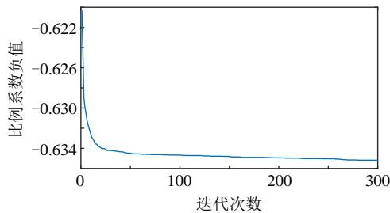  
图A1 目标函数收敛图

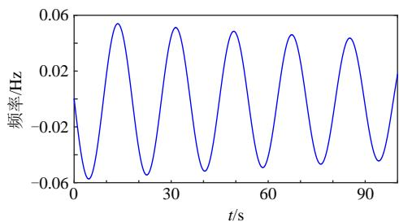  
图A2 决策变量最优取值下系统的阶跃响应

表 A1 决策变量最优取值  

<table><tr><td>参数</td><td>TS</td><td>TG</td><td>kD</td><td>kG</td></tr><tr><td>求解结果</td><td>50.3723</td><td>147.169</td><td>0</td><td>2391.93</td></tr></table>

减系数的正弦曲线(可观察决策变量取值而得)。而正弦函数初始导数值与原点和最低点连线斜率比值为  $2 / \pi$  (0.6366)，这与粒子群求解结果相近(相对误差  $0.237\%$  )。即  $\delta$  极限值为  $2 / \pi$  。

$\delta$  的选取对  $\Delta P_{\mathrm{m}}(t_{\mathrm{m}})$  的影响：

将式(3)以及  $k$  的表达式代入式(5)  $\Delta P_{\mathrm{m}}(t) = -kk_{\mathrm{G}}$ $(t - T_{\mathrm{G}} + T_{\mathrm{G}}\mathrm{e}^{-\frac{t}{T_{\mathrm{G}}}})$  中，可得：  $\Delta P_{\mathrm{m}}(t_{\mathrm{m}}) = k_{\mathrm{G}}(\Delta f_{\mathrm{m}} + \frac{T_{\mathrm{G}}\Delta P_{\mathrm{OL0}}\delta}{T_{\mathrm{S}}} (\mathrm{e}^{-\frac{T_{\mathrm{S}}\Delta f_{\mathrm{m}}}{T_{\mathrm{G}}\Delta P_{\mathrm{OL0}}\delta}} - 1))$  。令  $\frac{T_{\mathrm{S}}f_{\mathrm{m}}}{T_{\mathrm{G}}\Delta P_{\mathrm{OL0}}} = k^{\prime}$  ，则  $\Delta P_{\mathrm{m}}(t_{\mathrm{m}}) = k_{\mathrm{G}}(\Delta f_{\mathrm{m}} + \frac{T_{\mathrm{G}}\Delta P_{\mathrm{OL0}}\delta}{T_{\mathrm{S}}} (\mathrm{e}^{-\frac{k^{\prime}}{\delta}} - 1))$  ，其为仅与  $\delta$  有关的函数 $(\Delta P_{\mathrm{m}}(t_{\mathrm{m}})$  表达式中除  $\delta$  外其他参数均为与  $\delta$  无关的常数)；对于函数  $\delta (\mathrm{e}^{-\frac{k^{\prime}}{\delta}} - 1)$  ，可求得其对  $\delta$  单调递减。故  $\delta$  取最大值时  $\Delta P_{\mathrm{m}}(t_{\mathrm{m}})$  有最小值。即  $\delta$  取其最大值时  $\Delta P_{\mathrm{m}}(t_{\mathrm{m}})$  偏保守。有关本方法保守性的一些探讨如下。

关于该方法保守性的程度，首先对于不同的系统，该方法的保守程度是不同的。以单机系统为例，保守程度(如以与真实频率最小值的偏差百分比进行评估)可以认为是  $T_{\mathrm{S}}$  、  $T_{\mathrm{G}}$  、  $k_{\mathrm{D}}$  、  $k_{\mathrm{G}}$  的函数，其表达式极为复杂，目前无法通过理论上进行分析计算。

针对该问题仅能使用算例对其进行评估。针对频率限值分别为0.01、0.015、0.02、0.025(标幺值)4个情况，分别随机生成1000个单机系统，机组的 $T_{\mathrm{S}}$ 、 $T_{\mathrm{G}}$ 、 $k_{\mathrm{D}}$ 、 $k_{\mathrm{G}}$ 参数参数范围参考文献[27]分别为(2,10)、(5,11)、(16.7,25)、(2,10)且机组的上述4个参数能够刚好使得频率约束条件等式成立。并且计算其真实的频率最小值，并同预设的频率最小限值进行比较。

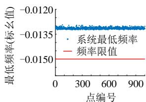

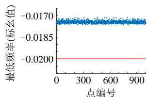  
图A34种情况下真实频率最小值与频率限值的比较附录B

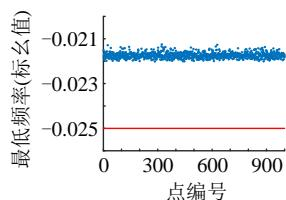

本文中使用的调速器与原动机环节框图如图B1所示。图中：  $\mu_{\mathrm{max}} = 1$  ，  $\mu_{\mathrm{min}} = 0$  ，  $\rho_{\mathrm{max}} = 1$  ，  $\rho_{\mathrm{min}} = -1$

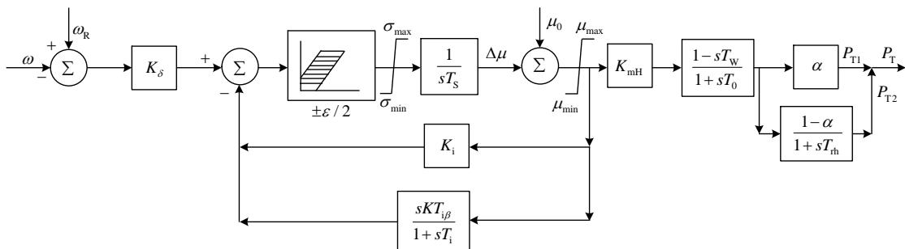  
图B1 调速系统与原动机传递函数框图

$K_{\mathrm{i}} = 1, K_{\mathrm{mH}} = 1, T_{\mathrm{W}} = 0$ 。本文研究对象为大功率扰动频率动态过程，频率偏差量远大于死区范围，故在此不考虑死区影响。

1组参数：  $K_{\delta} = 16.67$  ，  $T_{\mathrm{S}} = 0.5$  ，  $T_{0} = 0.2$  ，  $\alpha = 0.2$ $T_{\mathrm{RH}} = 4$  。

2组参数：  $K_{\delta} = 25$  ，  $T_{\mathrm{S}} = 0.5$  ，  $T_{0} = 0.3$  ，  $\alpha = 0.25$ $T_{\mathrm{RH}} = 7$  。  
3组参数：  $K_{\delta} = 33.33$  ，  $T_{\mathrm{S}} = 0.5$  ，  $T_{0} = 0.4$  ，  $\alpha = 0.3$ $T_{\mathrm{RH}} = 10$  。

附录C

表 C1 机组参数  

<table><tr><td>参数</td><td>机组1</td><td>机组2</td><td>机组3</td><td>机组4</td><td>机组5</td><td>机组6</td><td>机组7</td><td>机组8</td></tr><tr><td>Pimax/MW</td><td>680</td><td>530</td><td>540</td><td>650</td><td>508</td><td>632</td><td>650</td><td>576</td></tr><tr><td>Pimin/MW</td><td>210</td><td>150</td><td>150</td><td>180</td><td>160</td><td>200</td><td>200</td><td>160</td></tr><tr><td>ai/$</td><td>1160</td><td>1080</td><td>1080</td><td>1080</td><td>1000</td><td>1100</td><td>1180</td><td>1000</td></tr><tr><td>bi/$ (MW)-1</td><td>14.68</td><td>15.23</td><td>16.23</td><td>15.69</td><td>16.19</td><td>15.98</td><td>15.98</td><td>16.19</td></tr><tr><td>ci/$ (MW)-2</td><td>0.00037</td><td>0.00047</td><td>0.0005</td><td>0.00038</td><td>0.00048</td><td>0.00037</td><td>0.0004</td><td>0.00048</td></tr><tr><td>τi/$</td><td>5</td><td>4</td><td>4</td><td>5</td><td>4</td><td>5</td><td>5</td><td>4</td></tr><tr><td>τi/$</td><td>5</td><td>4</td><td>4</td><td>5</td><td>4</td><td>5</td><td>5</td><td>4</td></tr><tr><td>Si/$</td><td>7000</td><td>5550</td><td>5600</td><td>6700</td><td>5300</td><td>6800</td><td>7200</td><td>5800</td></tr><tr><td>Ts/s</td><td>80</td><td>69</td><td>48.6</td><td>52.8</td><td>52</td><td>57.2</td><td>71.6</td><td>60.6</td></tr><tr><td>kG/(MW/Hz)</td><td>135.3</td><td>81.858</td><td>81.9</td><td>120.3</td><td>81.9</td><td>120.3</td><td>120.3</td><td>81.9</td></tr><tr><td>TG/s</td><td>2.94</td><td>3.62</td><td>3.72</td><td>3.62</td><td>3.72</td><td>3.62</td><td>3.62</td><td>3.72</td></tr><tr><td>Dpmax/(MW h)</td><td>300</td><td>200</td><td>200</td><td>250</td><td>200</td><td>250</td><td>250</td><td>200</td></tr><tr><td>Dpmin/(MW h)</td><td>300</td><td>200</td><td>200</td><td>250</td><td>200</td><td>250</td><td>250</td><td>200</td></tr></table>

表 C2 负荷参数  

<table><tr><td>时段/h</td><td>负荷/MW</td><td>时段/h</td><td>负荷/MW</td><td>时段/h</td><td>负荷/MW</td><td>时段/h</td><td>负荷/MW</td><td>时段/h</td><td>负荷/MW</td><td>时段/h</td><td>负荷/MW</td></tr><tr><td>1</td><td>3500</td><td>5</td><td>3750</td><td>9</td><td>4500</td><td>13</td><td>4900</td><td>17</td><td>4500</td><td>21</td><td>3900</td></tr><tr><td>2</td><td>3600</td><td>6</td><td>3800</td><td>10</td><td>4750</td><td>14</td><td>4600</td><td>18</td><td>4300</td><td>22</td><td>4000</td></tr><tr><td>3</td><td>3650</td><td>7</td><td>4050</td><td>11</td><td>5000</td><td>15</td><td>4700</td><td>19</td><td>4200</td><td>23</td><td>3750</td></tr><tr><td>4</td><td>3700</td><td>8</td><td>4300</td><td>12</td><td>5100</td><td>16</td><td>4650</td><td>20</td><td>4000</td><td>24</td><td>3700</td></tr></table>

表 C3 风电出力上下限  
$10^{3}\mathrm{MW}$  

<table><tr><td>时段/h</td><td>上/下限</td><td>时段/h</td><td>上/下限</td><td>时段/h</td><td>上/下限</td><td>时段/h</td><td>上/下限</td><td>时段/h</td><td>上/下限</td><td>时段/h</td><td>上/下限</td></tr><tr><td>1</td><td>1.5/1.65</td><td>5</td><td>1.7/1.8</td><td>9</td><td>2/2.26</td><td>13</td><td>2.6/2.9</td><td>17</td><td>2.01/2.32</td><td>21</td><td>1.6/1.8</td></tr><tr><td>2</td><td>1.55/1.7</td><td>6</td><td>1.78/2</td><td>10</td><td>2.34/2.6</td><td>14</td><td>2.6/2.85</td><td>18</td><td>1.94/2.24</td><td>22</td><td>1.62/1.76</td></tr><tr><td>3</td><td>1.52/1.73</td><td>7</td><td>1.8/2.13</td><td>11</td><td>2.65/3</td><td>15</td><td>2.3/2.53</td><td>19</td><td>1.8/2.1</td><td>23</td><td>1.6/1.68</td></tr><tr><td>4</td><td>1.56/1.78</td><td>8</td><td>1.84/2.18</td><td>12</td><td>2.78/3.1</td><td>16</td><td>2.36/2.5</td><td>20</td><td>1.73/2.01</td><td>24</td><td>1.58/1.68</td></tr></table>

表 C4 风电实际可提供功率  

<table><tr><td>时段/h</td><td>出力/MW</td><td>时段/h</td><td>出力/MW</td><td>时段/h</td><td>出力/MW</td><td>时段/h</td><td>出力/MW</td><td>时段/h</td><td>出力/MW</td><td>时段/h</td><td>出力/MW</td></tr><tr><td>1</td><td>1580</td><td>5</td><td>1800</td><td>9</td><td>2200</td><td>13</td><td>2660</td><td>17</td><td>2150</td><td>21</td><td>1700</td></tr><tr><td>2</td><td>1600</td><td>6</td><td>1930</td><td>10</td><td>2530</td><td>14</td><td>2600</td><td>18</td><td>2010</td><td>22</td><td>1630</td></tr><tr><td>3</td><td>1580</td><td>7</td><td>1950</td><td>11</td><td>2800</td><td>15</td><td>2310</td><td>19</td><td>1940</td><td>23</td><td>1600</td></tr><tr><td>4</td><td>1680</td><td>8</td><td>2000</td><td>12</td><td>2930</td><td>16</td><td>2420</td><td>20</td><td>1850</td><td>24</td><td>1590</td></tr></table>

表 C5 弃风量  

<table><tr><td>时段/h</td><td>弃风/MW</td><td>时段/h</td><td>弃风/MW</td><td>时段/h</td><td>弃风/MW</td><td>时段/h</td><td>弃风/MW</td><td>时段/h</td><td>弃风/MW</td><td>时段/h</td><td>弃风/MW</td></tr><tr><td>1</td><td>130</td><td>5</td><td>100</td><td>9</td><td>0</td><td>13</td><td>0</td><td>17</td><td>0</td><td>21</td><td>0</td></tr><tr><td>2</td><td>50</td><td>6</td><td>180</td><td>10</td><td>0</td><td>14</td><td>0</td><td>18</td><td>0</td><td>22</td><td>0</td></tr><tr><td>3</td><td>0</td><td>7</td><td>0</td><td>11</td><td>0</td><td>15</td><td>0</td><td>19</td><td>0</td><td>23</td><td>0</td></tr><tr><td>4</td><td>30</td><td>8</td><td>0</td><td>12</td><td>0</td><td>16</td><td>0</td><td>20</td><td>0</td><td>24</td><td>0</td></tr></table>

表 C6 未添加频率约束求得的机组启停状态  

<table><tr><td>时刻</td><td>1</td><td>2</td><td>3</td><td>4</td><td>5</td><td>6</td><td>7</td><td>8</td><td>9</td><td>10</td><td>11</td><td>12</td><td>13</td><td>14</td><td>15</td><td>16</td><td>17</td><td>18</td><td>19</td><td>20</td><td>21</td><td>22</td><td>23</td><td>24</td></tr><tr><td>机组1</td><td>1</td><td>1</td><td>1</td><td>1</td><td>1</td><td>1</td><td>1</td><td>1</td><td>1</td><td>1</td><td>1</td><td>1</td><td>1</td><td>1</td><td>1</td><td>1</td><td>1</td><td>1</td><td>1</td><td>1</td><td>1</td><td>1</td><td>1</td><td>1</td></tr><tr><td>机组2</td><td>0</td><td>0</td><td>1</td><td>1</td><td>1</td><td>1</td><td>1</td><td>1</td><td>1</td><td>1</td><td>1</td><td>1</td><td>1</td><td>1</td><td>1</td><td>1</td><td>1</td><td>1</td><td>1</td><td>1</td><td>1</td><td>1</td><td>1</td><td>1</td></tr><tr><td>机组3</td><td>0</td><td>0</td><td>0</td><td>0</td><td>0</td><td>0</td><td>0</td><td>0</td><td>0</td><td>0</td><td>0</td><td>0</td><td>0</td><td>0</td><td>0</td><td>0</td><td>0</td><td>0</td><td>0</td><td>0</td><td>0</td><td>0</td><td>0</td><td>0</td></tr><tr><td>机组4</td><td>1</td><td>1</td><td>1</td><td>1</td><td>1</td><td>1</td><td>1</td><td>1</td><td>1</td><td>1</td><td>1</td><td>1</td><td>1</td><td>1</td><td>1</td><td>1</td><td>1</td><td>1</td><td>1</td><td>1</td><td>1</td><td>1</td><td>1</td><td>1</td></tr><tr><td>机组5</td><td>0</td><td>0</td><td>0</td><td>0</td><td>0</td><td>0</td><td>0</td><td>0</td><td>0</td><td>0</td><td>0</td><td>0</td><td>0</td><td>0</td><td>0</td><td>0</td><td>0</td><td>0</td><td>0</td><td>0</td><td>0</td><td>0</td><td>0</td><td>0</td></tr><tr><td>机组6</td><td>0</td><td>0</td><td>0</td><td>0</td><td>0</td><td>0</td><td>0</td><td>0</td><td>0</td><td>0</td><td>0</td><td>0</td><td>0</td><td>0</td><td>0</td><td>0</td><td>0</td><td>0</td><td>0</td><td>0</td><td>0</td><td>0</td><td>0</td><td>0</td></tr><tr><td>机组7</td><td>0</td><td>0</td><td>0</td><td>0</td><td>0</td><td>0</td><td>0</td><td>0</td><td>0</td><td>0</td><td>0</td><td>0</td><td>0</td><td>0</td><td>0</td><td>0</td><td>0</td><td>0</td><td>0</td><td>0</td><td>0</td><td>0</td><td>0</td><td>0</td></tr><tr><td>机组8</td><td>0</td><td>0</td><td>0</td><td>0</td><td>0</td><td>0</td><td>0</td><td>0</td><td>0</td><td>0</td><td>0</td><td>0</td><td>0</td><td>0</td><td>0</td><td>0</td><td>0</td><td>0</td><td>0</td><td>0</td><td>0</td><td>0</td><td>0</td><td>0</td></tr></table>

表 C7 添加频率约束求得的机组启停状态(直流闭锁)  

<table><tr><td>时刻</td><td>1</td><td>2</td><td>3</td><td>4</td><td>5</td><td>6</td><td>7</td><td>8</td><td>9</td><td>10</td><td>11</td><td>12</td><td>13</td><td>14</td><td>15</td><td>16</td><td>17</td><td>18</td><td>19</td><td>20</td><td>21</td><td>22</td><td>23</td><td>24</td></tr><tr><td>机组1</td><td>1</td><td>1</td><td>1</td><td>1</td><td>1</td><td>1</td><td>1</td><td>1</td><td>1</td><td>1</td><td>1</td><td>1</td><td>1</td><td>1</td><td>1</td><td>1</td><td>1</td><td>1</td><td>1</td><td>1</td><td>1</td><td>1</td><td>1</td><td>1</td></tr><tr><td>机组2</td><td>1</td><td>1</td><td>1</td><td>1</td><td>1</td><td>1</td><td>1</td><td>1</td><td>1</td><td>1</td><td>1</td><td>1</td><td>1</td><td>1</td><td>1</td><td>1</td><td>1</td><td>1</td><td>1</td><td>1</td><td>1</td><td>1</td><td>1</td><td>1</td></tr><tr><td>机组3</td><td>1</td><td>1</td><td>1</td><td>1</td><td>1</td><td>1</td><td>1</td><td>0</td><td>0</td><td>0</td><td>0</td><td>0</td><td>0</td><td>0</td><td>0</td><td>0</td><td>0</td><td>0</td><td>0</td><td>0</td><td>1</td><td>1</td><td>1</td><td>1</td></tr><tr><td>机组4</td><td>1</td><td>1</td><td>1</td><td>1</td><td>1</td><td>1</td><td>1</td><td>1</td><td>1</td><td>1</td><td>1</td><td>1</td><td>1</td><td>1</td><td>1</td><td>1</td><td>1</td><td>1</td><td>1</td><td>1</td><td>1</td><td>1</td><td>1</td><td>1</td></tr><tr><td>机组5</td><td>0</td><td>0</td><td>0</td><td>0</td><td>0</td><td>0</td><td>0</td><td>0</td><td>0</td><td>0</td><td>0</td><td>0</td><td>0</td><td>0</td><td>0</td><td>0</td><td>0</td><td>0</td><td>0</td><td>0</td><td>0</td><td>0</td><td>0</td><td>0</td></tr><tr><td>机组6</td><td>1</td><td>1</td><td>1</td><td>1</td><td>1</td><td>1</td><td>1</td><td>1</td><td>1</td><td>1</td><td>1</td><td>1</td><td>1</td><td>1</td><td>1</td><td>1</td><td>1</td><td>1</td><td>1</td><td>1</td><td>1</td><td>1</td><td>1</td><td>1</td></tr><tr><td>机组7</td><td>1</td><td>1</td><td>1</td><td>1</td><td>1</td><td>1</td><td>1</td><td>1</td><td>1</td><td>1</td><td>1</td><td>1</td><td>1</td><td>1</td><td>1</td><td>1</td><td>1</td><td>1</td><td>1</td><td>1</td><td>1</td><td>1</td><td>1</td><td>1</td></tr><tr><td>机组8</td><td>1</td><td>1</td><td>1</td><td>1</td><td>1</td><td>1</td><td>1</td><td>1</td><td>1</td><td>1</td><td>1</td><td>1</td><td>1</td><td>1</td><td>1</td><td>1</td><td>1</td><td>1</td><td>1</td><td>1</td><td>1</td><td>1</td><td>1</td><td>1</td></tr></table>

表 C8 添加频率约束求得的机组启停状态(最大出力机组跳闸)  

<table><tr><td>时刻</td><td>1</td><td>2</td><td>3</td><td>4</td><td>5</td><td>6</td><td>7</td><td>8</td><td>9</td><td>10</td><td>11</td><td>12</td><td>13</td><td>14</td><td>15</td><td>16</td><td>17</td><td>18</td><td>19</td><td>20</td><td>21</td><td>22</td><td>23</td><td>24</td></tr><tr><td>机组1</td><td>1</td><td>1</td><td>1</td><td>1</td><td>1</td><td>0</td><td>0</td><td>0</td><td>0</td><td>0</td><td>0</td><td>0</td><td>0</td><td>0</td><td>0</td><td>0</td><td>0</td><td>0</td><td>0</td><td>0</td><td>0</td><td>0</td><td>0</td><td>0</td></tr><tr><td>机组2</td><td>0</td><td>0</td><td>0</td><td>0</td><td>0</td><td>0</td><td>0</td><td>0</td><td>0</td><td>0</td><td>0</td><td>0</td><td>0</td><td>0</td><td>0</td><td>0</td><td>0</td><td>0</td><td>0</td><td>0</td><td>0</td><td>0</td><td>0</td><td>0</td></tr><tr><td>机组3</td><td>1</td><td>1</td><td>1</td><td>1</td><td>1</td><td>1</td><td>1</td><td>1</td><td>1</td><td>1</td><td>1</td><td>1</td><td>1</td><td>1</td><td>1</td><td>1</td><td>1</td><td>1</td><td>1</td><td>1</td><td>1</td><td>1</td><td>1</td><td>1</td></tr><tr><td>机组4</td><td>1</td><td>1</td><td>1</td><td>1</td><td>1</td><td>1</td><td>1</td><td>1</td><td>1</td><td>1</td><td>1</td><td>1</td><td>1</td><td>1</td><td>1</td><td>1</td><td>1</td><td>1</td><td>1</td><td>1</td><td>1</td><td>1</td><td>1</td><td>1</td></tr><tr><td>机组5</td><td>1</td><td>1</td><td>1</td><td>1</td><td>1</td><td>1</td><td>1</td><td>1</td><td>1</td><td>1</td><td>1</td><td>1</td><td>1</td><td>1</td><td>1</td><td>1</td><td>1</td><td>1</td><td>1</td><td>1</td><td>1</td><td>1</td><td>1</td><td>1</td></tr><tr><td>机组6</td><td>0</td><td>0</td><td>0</td><td>0</td><td>0</td><td>0</td><td>0</td><td>0</td><td>0</td><td>0</td><td>0</td><td>0</td><td>0</td><td>0</td><td>0</td><td>0</td><td>0</td><td>0</td><td>0</td><td>0</td><td>0</td><td>0</td><td>0</td><td>0</td></tr><tr><td>机组7</td><td>0</td><td>0</td><td>0</td><td>0</td><td>0</td><td>1</td><td>1</td><td>1</td><td>1</td><td>1</td><td>1</td><td>1</td><td>1</td><td>1</td><td>1</td><td>1</td><td>1</td><td>1</td><td>1</td><td>1</td><td>1</td><td>1</td><td>1</td><td>1</td></tr><tr><td>机组8</td><td>1</td><td>1</td><td>1</td><td>1</td><td>1</td><td>1</td><td>1</td><td>1</td><td>1</td><td>1</td><td>1</td><td>1</td><td>1</td><td>1</td><td>1</td><td>1</td><td>1</td><td>1</td><td>1</td><td>1</td><td>1</td><td>1</td><td>1</td><td>1</td></tr></table>

表 C9 未添加频率约束求得的机组出力状态  

<table><tr><td>时刻</td><td>1</td><td>2</td><td>3</td><td>4</td><td>5</td><td>6</td><td>7</td><td>8</td><td>9</td><td>10</td><td>11</td><td>12</td></tr><tr><td>机组1</td><td>587.5</td><td>667.5</td><td>587.5</td><td>562.5</td><td>562.5</td><td>505</td><td>617.5</td><td>680</td><td>680</td><td>680</td><td>680</td><td>680</td></tr><tr><td>机组2</td><td>0</td><td>0</td><td>150</td><td>150</td><td>150</td><td>150</td><td>150</td><td>170</td><td>170</td><td>150</td><td>150</td><td>150</td></tr><tr><td>机组3</td><td>0</td><td>0</td><td>0</td><td>0</td><td>0</td><td>0</td><td>0</td><td>0</td><td>0</td><td>0</td><td>0</td><td>0</td></tr><tr><td>机组4</td><td>532.5</td><td>532.5</td><td>532.5</td><td>507.5</td><td>437.5</td><td>415</td><td>532.5</td><td>650</td><td>650</td><td>590</td><td>570</td><td>540</td></tr><tr><td>机组5</td><td>0</td><td>0</td><td>0</td><td>0</td><td>0</td><td>0</td><td>0</td><td>0</td><td>0</td><td>0</td><td>0</td><td>0</td></tr><tr><td>机组6</td><td>0</td><td>0</td><td>0</td><td>0</td><td>0</td><td>0</td><td>0</td><td>0</td><td>0</td><td>0</td><td>0</td><td>0</td></tr><tr><td>机组7</td><td>0</td><td>0</td><td>0</td><td>0</td><td>0</td><td>0</td><td>0</td><td>0</td><td>0</td><td>0</td><td>0</td><td>0</td></tr><tr><td>机组8</td><td>0</td><td>0</td><td>0</td><td>0</td><td>0</td><td>0</td><td>0</td><td>0</td><td>0</td><td>0</td><td>0</td><td>0</td></tr><tr><td>时刻</td><td>13</td><td>14</td><td>15</td><td>16</td><td>17</td><td>18</td><td>19</td><td>20</td><td>21</td><td>22</td><td>23</td><td>24</td></tr><tr><td>机组1</td><td>680</td><td>562.5</td><td>680</td><td>680</td><td>680</td><td>680</td><td>680</td><td>667.5</td><td>680</td><td>680</td><td>667.5</td><td>627.5</td></tr><tr><td>机组2</td><td>150</td><td>150</td><td>260</td><td>150</td><td>220</td><td>160</td><td>150</td><td>150</td><td>150</td><td>240</td><td>150</td><td>150</td></tr><tr><td>机组3</td><td>0</td><td>0</td><td>0</td><td>0</td><td>0</td><td>0</td><td>0</td><td>0</td><td>0</td><td>0</td><td>0</td><td>0</td></tr><tr><td>机组4</td><td>610</td><td>487.5</td><td>650</td><td>600</td><td>650</td><td>650</td><td>630</td><td>532.5</td><td>570</td><td>650</td><td>532.5</td><td>532.5</td></tr><tr><td>机组5</td><td>0</td><td>0</td><td>0</td><td>0</td><td>0</td><td>0</td><td>0</td><td>0</td><td>0</td><td>0</td><td>0</td><td>0</td></tr><tr><td>机组6</td><td>0</td><td>0</td><td>0</td><td>0</td><td>0</td><td>0</td><td>0</td><td>0</td><td>0</td><td>0</td><td>0</td><td>0</td></tr><tr><td>机组7</td><td>0</td><td>0</td><td>0</td><td>0</td><td>0</td><td>0</td><td>0</td><td>0</td><td>0</td><td>0</td><td>0</td><td>0</td></tr><tr><td>机组8</td><td>0</td><td>0</td><td>0</td><td>0</td><td>0</td><td>0</td><td>0</td><td>0</td><td>0</td><td>0</td><td>0</td><td>0</td></tr></table>

MW

表 C10 添加频率约束求得的机组出力状态(直流闭锁)  

<table><tr><td>时刻</td><td>1</td><td>2</td><td>3</td><td>4</td><td>5</td><td>6</td><td>7</td><td>8</td><td>9</td><td>10</td><td>11</td><td>12</td></tr><tr><td>机组1</td><td>210</td><td>210</td><td>230</td><td>210</td><td>210</td><td>210</td><td>260</td><td>445</td><td>445</td><td>412.5</td><td>392.5</td><td>362.5</td></tr><tr><td>机组2</td><td>150</td><td>150</td><td>150</td><td>150</td><td>150</td><td>150</td><td>150</td><td>150</td><td>150</td><td>150</td><td>150</td><td>150</td></tr><tr><td>机组3</td><td>150</td><td>150</td><td>150</td><td>150</td><td>150</td><td>150</td><td>150</td><td>0</td><td>0</td><td>0</td><td>0</td><td>0</td></tr><tr><td>机组4</td><td>180</td><td>180</td><td>180</td><td>180</td><td>180</td><td>180</td><td>180</td><td>345</td><td>345</td><td>297.5</td><td>297.5</td><td>297.5</td></tr><tr><td>机组5</td><td>0</td><td>0</td><td>0</td><td>0</td><td>0</td><td>0</td><td>0</td><td>0</td><td>0</td><td>0</td><td>0</td><td>0</td></tr><tr><td>机组6</td><td>200</td><td>200</td><td>200</td><td>200</td><td>200</td><td>200</td><td>200</td><td>200</td><td>200</td><td>200</td><td>200</td><td>200</td></tr><tr><td>机组7</td><td>200</td><td>200</td><td>200</td><td>200</td><td>200</td><td>200</td><td>200</td><td>200</td><td>200</td><td>200</td><td>200</td><td>200</td></tr><tr><td>机组8</td><td>160</td><td>160</td><td>160</td><td>160</td><td>160</td><td>160</td><td>160</td><td>160</td><td>160</td><td>160</td><td>160</td><td>160</td></tr><tr><td>时刻</td><td>13</td><td>14</td><td>15</td><td>16</td><td>17</td><td>18</td><td>19</td><td>20</td><td>21</td><td>22</td><td>23</td><td>24</td></tr><tr><td>机组1</td><td>432.5</td><td>310</td><td>465</td><td>422.5</td><td>445</td><td>445</td><td>445</td><td>310</td><td>327.5</td><td>412.5</td><td>310</td><td>270</td></tr><tr><td>机组2</td><td>150</td><td>150</td><td>150</td><td>150</td><td>150</td><td>150</td><td>150</td><td>150</td><td>150</td><td>150</td><td>150</td><td>150</td></tr><tr><td>机组3</td><td>0</td><td>0</td><td>0</td><td>0</td><td>0</td><td>0</td><td>0</td><td>150</td><td>150</td><td>150</td><td>150</td><td>150</td></tr><tr><td>机组4</td><td>297.5</td><td>180</td><td>415</td><td>297.5</td><td>395</td><td>335</td><td>305</td><td>180</td><td>212.5</td><td>297.5</td><td>180</td><td>180</td></tr><tr><td>机组5</td><td>0</td><td>0</td><td>0</td><td>0</td><td>0</td><td>0</td><td>0</td><td>0</td><td>0</td><td>0</td><td>0</td><td>0</td></tr><tr><td>机组6</td><td>200</td><td>200</td><td>200</td><td>200</td><td>200</td><td>200</td><td>200</td><td>200</td><td>200</td><td>200</td><td>200</td><td>200</td></tr><tr><td>机组7</td><td>200</td><td>200</td><td>200</td><td>200</td><td>200</td><td>200</td><td>200</td><td>200</td><td>200</td><td>200</td><td>200</td><td>200</td></tr><tr><td>机组8</td><td>160</td><td>160</td><td>160</td><td>160</td><td>160</td><td>160</td><td>160</td><td>160</td><td>160</td><td>160</td><td>160</td><td>160</td></tr></table>

MW

表 C11 添加频率约束求得的机组出力状态(最大出力机组跳闸)  

<table><tr><td>时刻</td><td>1</td><td>2</td><td>3</td><td>4</td><td>5</td><td>6</td><td>7</td><td>8</td><td>9</td><td>10</td><td>11</td><td>12</td></tr><tr><td>机组1</td><td>352.5</td><td>432.5</td><td>445</td><td>445</td><td>382.5</td><td>0</td><td>0</td><td>0</td><td>0</td><td>0</td><td>0</td><td>0</td></tr><tr><td>机组2</td><td>0</td><td>0</td><td>0</td><td>0</td><td>0</td><td>0</td><td>0</td><td>0</td><td>0</td><td>0</td><td>0</td><td>0</td></tr><tr><td>机组3</td><td>150</td><td>150</td><td>150</td><td>150</td><td>150</td><td>150</td><td>209.2</td><td>394.2</td><td>382.2</td><td>287.2</td><td>252.2</td><td>216.2</td></tr><tr><td>机组4</td><td>297.5</td><td>297.5</td><td>355</td><td>305</td><td>297.5</td><td>400</td><td>570.84</td><td>585.8</td><td>597.8</td><td>612.8</td><td>627.8</td><td>633.8</td></tr><tr><td>机组5</td><td>160</td><td>160</td><td>160</td><td>160</td><td>160</td><td>160</td><td>160</td><td>160</td><td>160</td><td>160</td><td>160</td><td>160</td></tr><tr><td>机组6</td><td>0</td><td>0</td><td>0</td><td>0</td><td>0</td><td>0</td><td>0</td><td>0</td><td>0</td><td>0</td><td>0</td><td>0</td></tr><tr><td>机组7</td><td>0</td><td>0</td><td>0</td><td>0</td><td>0</td><td>200</td><td>200</td><td>200</td><td>200</td><td>200</td><td>200</td><td>200</td></tr><tr><td>机组8</td><td>160</td><td>160</td><td>160</td><td>160</td><td>160</td><td>160</td><td>160</td><td>160</td><td>160</td><td>160</td><td>160</td><td>160</td></tr><tr><td>时刻</td><td>13</td><td>14</td><td>15</td><td>16</td><td>17</td><td>18</td><td>19</td><td>20</td><td>21</td><td>22</td><td>23</td><td>24</td></tr><tr><td>机组1</td><td>0</td><td>0</td><td>0</td><td>0</td><td>0</td><td>0</td><td>0</td><td>0</td><td>0</td><td>0</td><td>0</td><td>0</td></tr><tr><td>机组2</td><td>0</td><td>0</td><td>0</td><td>0</td><td>0</td><td>0</td><td>0</td><td>0</td><td>0</td><td>0</td><td>0</td><td>0</td></tr><tr><td>机组3</td><td>298.2</td><td>150</td><td>350</td><td>303.1</td><td>432.2</td><td>384.2</td><td>360.2</td><td>262.2</td><td>318.2</td><td>442.5</td><td>277.2</td><td>240.2</td></tr><tr><td>机组4</td><td>621.8</td><td>530</td><td>609.8</td><td>606.8</td><td>597.8</td><td>585.8</td><td>579.8</td><td>567.8</td><td>561.8</td><td>567.8</td><td>552.8</td><td>549.8</td></tr><tr><td>机组5</td><td>160</td><td>160</td><td>160</td><td>160</td><td>160</td><td>160</td><td>160</td><td>160</td><td>160</td><td>160</td><td>160</td><td>160</td></tr><tr><td>机组6</td><td>0</td><td>0</td><td>0</td><td>0</td><td>0</td><td>0</td><td>0</td><td>0</td><td>0</td><td>0</td><td>0</td><td>0</td></tr><tr><td>机组7</td><td>200</td><td>200</td><td>310.2</td><td>200</td><td>200</td><td>200</td><td>200</td><td>200</td><td>200</td><td>239.7</td><td>200</td><td>200</td></tr><tr><td>机组8</td><td>160</td><td>160</td><td>160</td><td>160</td><td>160</td><td>160</td><td>160</td><td>160</td><td>160</td><td>160</td><td>160</td><td>160</td></tr></table>

表 C12 评估保守度对机组组合求解结果影响的开机状态与运行成本的对比  

<table><tr><td>开机状态</td><td>机组1</td><td>机组2</td><td>机组3</td><td>机组4</td><td>机组5</td><td>机组6</td><td>机组7</td><td>机组8</td><td>运行成本/$</td><td>成本增加比例/%</td><td>最低频率/Hz</td></tr><tr><td>δ=0.637</td><td>1</td><td>1</td><td>1</td><td>1</td><td>0</td><td>1</td><td>1</td><td>1</td><td>27 040</td><td>13.10</td><td>48.8000</td></tr><tr><td>δ=0.612</td><td>1</td><td>1</td><td>1</td><td>1</td><td>0</td><td>1</td><td>1</td><td>1</td><td>27 040</td><td>13.10</td><td>48.8000</td></tr><tr><td>δ=0.587</td><td>1</td><td>1</td><td>1</td><td>1</td><td>0</td><td>1</td><td>1</td><td>1</td><td>27 040</td><td>13.10</td><td>48.8000</td></tr><tr><td>δ=0.562</td><td>1</td><td>1</td><td>0</td><td>1</td><td>1</td><td>1</td><td>1</td><td>0</td><td>25 143</td><td>5.16</td><td>48.6730</td></tr><tr><td>δ=0.540</td><td>1</td><td>1</td><td>0</td><td>1</td><td>0</td><td>1</td><td>1</td><td>0</td><td>23 909</td><td>0.00</td><td>48.5242</td></tr></table>