Received January 2, 2022, accepted January 25, 2022, date of publication February 4, 2022, date of current version February 25, 2022.

Digital Object Identifier 10.1109/ACCESS.2022.3149052

# A Survey of Deep Learning-Based Object Detection Methods and Datasets for Overhead Imagery

JUNHYUNG KANG $^{1}$ , SHAHROZ TARIQ $^{2,3}$ , HAN OH $^{4}$ , AND SIMON S. WOO $^{1,5}$

$^{1}$ Department of Artificial Intelligence, Sungkyunkwan University, Suwon 16419, South Korea  
$^{2}$ Department of Computer Science and Engineering, Sungkyunkwan University, Suwon, South Korea  
$^{3}$ Data61, CSIRO, Australia  
$^{4}$ National Satellite Operation and Application Center, Korea Aerospace Research Institute (KARI), Daejeon 34133, South Korea  
$^{5}$ Department of Applied Data Science, Sungkyunkwan University, Suwon 16419, South Korea

Corresponding author: Simon S. Woo (swoo@g.skuu.edu)

This work was supported in part by the Institute of Information and Communications Technology Planning and Evaluation (IITP) grant funded by the Korea Government (MSIT), AI Graduate School Support Program, Sungkyunkwan University, under Grant 2019-0-00421; in part by the Regional strategic industry convergence security core talent training business under Grant 2019-0-01343; in part by the Basic Science Research Program through the National Research Foundation of Korea (NRF) grant funded by Korea Government (MSIT) under Grant 2020R1C1C1006004 and Grant 2020M1A3B2A02084969; in part by IITP grant funded by the Korea Government (MSIT), Original Technology Development of Artificial Intelligence Industry, under Grant 2021-0-02157 and Grant 2021-0-00017; and in part by the Institute of Information and Communications Technology Planning and Evaluation (IITP) Grant funded by the Korea Government (MSIT) (Artificial Intelligence Innovation Hub) under Grant 2021-0-02068.

ABSTRACT Significant advancements and progress made in recent computer vision research enable more effective processing of various objects in high-resolution overhead imagery obtained by various sources from drones, airplanes, and satellites. In particular, overhead images combined with computer vision allow many real-world uses for economic, commercial, and humanitarian purposes, including assessing economic impact from access crop yields, financial supply chain prediction for company's revenue management, and rapid disaster surveillance system (wildfire alarms, rising sea levels, weather forecast). Likewise, object detection in overhead images provides insight for use in many real-world applications yet is still challenging because of substantial image volumes, inconsistent image resolution, small-sized objects, highly complex backgrounds, and nonuniform object classes. Although extensive studies in deep learning-based object detection have achieved remarkable performance and success, they are still ineffective yielding a low detection performance, due to the underlying difficulties in overhead images. Thus, high-performing object detection in overhead images is an active research field to overcome such difficulties. This survey paper provides a comprehensive overview and comparative reviews on the most up-to-date deep learning-based object detection in overhead images. Especially, our work can shed light on capturing the most recent advancements of object detection methods in overhead images and the introduction of overhead datasets that have not been comprehensively surveyed before.

INDEX TERMS Object detection, satellites, synthetic aperture radar, unmanned aerial vehicles.

# I. INTRODUCTION

Deep learning has advanced rapidly in recent years, achieving great success in a variety of fields. As opposed to traditional algorithms, deep learning-based approaches frequently use deep networks to extract feature representations from raw data for various tasks. Especially, the application of

The associate editor coordinating the review of this manuscript and approving it for publication was Zhongyi Guo.

deep learning in remote sensing is now gaining considerable attention, motivated by numerous successful applications in the computer vision community [1]–[7]. Consequently, the expeditious advancement of deep learning applications in remote sensing boosts the volume and variety of classification methods available to identify different objects on the earth's surface, such as cars, airplanes, and houses [8], [9]. Our work focus on reviewing the recent advancements in remote sensing for satellite and aerial-imagery-based object detection.

With this work, we hope to promote further research in the related fields by providing a general overview of the object detection for overhead imagery to both the experts and beginners.

Previously, Cheng and Han [1] surveyed object detection methods in optical remote sensing images and discussed the challenges with promising research directions. Although they proposed a deep learning-based feature representation as one of the promising research directions, they focused on traditional methods such as template matching [10], [11] or knowledge-based methods [12], [13], which are far from recently developed deep learning-based methods. On the other hand, our survey performs a comprehensive review focused on modern deep learning-based approaches for object detection in overhead imagery.

For the performance assessment, Groener et al. [2] and Alganci et al. [3] compared the object detection performance of deep learning-based models on single class type satellite datasets sampled from a publicly available database [8], [9]. They contributed to assessing the advantages and limitations of each model based on the performance. Furthermore, Zheng et al. [6] systematically summarized the deep learning-based object detection algorithms for remote sensing images. However, these studies mainly focus on general object detection methods, not specifically on the remote sensing and overhead imagery domains. Moreover, they conducted the experiments for the one-class object detection task, which is not the case for the overhead imagery that usually requires detecting multi-class objects. Thus, this survey paper aims to discuss the modern methods for object detection in satellite and aerial images with multi-class datasets.

Furthermore, Yao et al. [4] and Cazzato et al. [5] reviewed the object detection methods for aerial images from unmanned aerial vehicles (UAV) and provided new insight into future research directions. Moreover, Li et al. [7] presented a comprehensive review of the deep learning-based object detection methods in optical remote sensing images. Compared to their approaches, this survey aims to cover the comprehensive methods for object detection in the broader scope of overhead imageries, including both satellite images (Electro-Optical (EO), Synthetic Aperture Radar (SAR)) and aerial images.

There are other studies for reviewing the deep learning-based application for satellite and aerial images [14]–[17]. While these studies cover general state-of-the-art object detection methods, our work specifically aims to investigate the recent advancements in object detection for overhead imagery and examine the challenges. The contributions of this paper are summarized as follows:

- This paper provides a comprehensive survey of deep learning-based object detection methods and datasets using satellite images (SAR and EO) and aerial images after thoroughly reviewing more than 90 research papers from the past six years.  
- We define the six major areas and construct a taxonomy to tackle the challenges of overhead imagery, and

extensively analyze and categorize existing studies accordingly.

- Based on the study, we provide a comparative study among the latest methods and datasets, then discuss the limitation of the current approach and the promising future research directions.

# II. APPLYING DEEP LEARNING-BASED METHODS FOR OVERHEAD IMAGERY IN CHALLENGING ENVIRONMENTS

Recently, there has been an increasing interest in deep learning-based object detection methods along with significant performance improvement compared to traditional algorithms such as template matching and knowledge-based methods [10]–[13]. In general, deep learning-based object detection models consist of a backbone and a head network, where the basic structures of deep learning-based object detection models are described in Fig. 2. And the pseudo code of object detector is provided in Appendix. The backbone network is capable of extracting features from the input images, while the head network uses the extracted features to localize the bounding boxes of the detected objects and classify them (See Fig. 2).

In the case of backbone networks, CNN-based networks are commonly employed. Meanwhile, methods such as ViT-FRCNN [18], ViT-YOLO [19], and Swin transformer [20] that incorporate transformer-based networks and self-attention mechanisms have recently demonstrated high performance. However, developing a new backbone structure capable of achieving high performance is a difficult task that requires massive computation cost and requires pre-training on large-scale image data such as ImageNet [21]. To overcome this limitation, Liang et al. [22] proposed CBNetV2, which improved object detection performance by using existing pre-trained backbones, such as ResNet50 [23], ResNet152 [23] and Res2Net50 [24]. CBNetV2 achieved this performance improvement by composing multiple pre-trained identical backbones with assisting backbones and lead backbones. CBNetV2 can apply both CNN-based and transformer-based backbones.

On the other hand, the head network is divided into one-stage or two-stage detectors. While the one-stage detector performs object localization and classification simultaneously, the two-stage detector performs classification to determine classes after proposing the regions of interests (ROIs). A typical two-stage detector is Faster-RCNN [25], and a one-stage detector is YOLOv3 [26]. In general, two-stage detectors have higher accuracy than one-stage detectors because the two-stage detector performs localization and classification on the proposed regions from the first stage. However, the inference time of two-stage detectors tends to be longer due to a large number of regions and additional stage processing.

While many methods focus on extracting more accurate features from an image, recently, Dai et al. [27] proposed a new head network structure called Dynamic head. From this approach, the Dynamic head takes the input data that is the

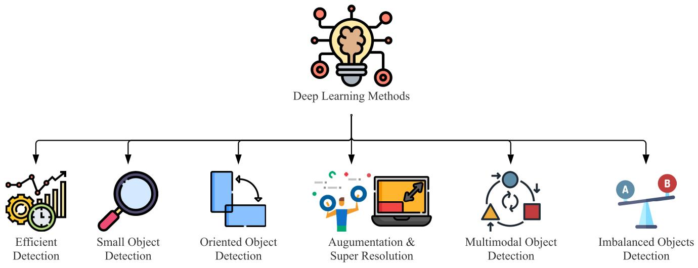  
FIGURE 1. High level overview for six different categories of deep learning-based object detection methods for the overhead imagery.

output data of the backbone network. Then, the head network considers the input data as a 3-dimensional tensor according to the scale, location, and representation of objects. Furthermore, an attention mechanism is applied to each dimension of the feature tensor. Therefore, the proposed approach improved the detection performance more efficiently than simultaneously applying the full self-attention mechanism to the feature tensors.

However, it is challenging to apply the aforementioned state-of-the-art methods on overhead imagery because of the unique underlying characteristics of satellite and aerial images. Therefore, our survey focuses explicitly on different methods used in overhead imagery domains instead of general deep learning-based methods such as Faster-RCNN [25], YOLO [28]–[30], and SSD [31].

We define the following six major object detection categories based on the unique challenges associated with overhead imagery as shown in Fig. 1: 1) efficient detection, 2) small object detection, 3) oriented object detection, 4) augmentation and super-resolution, 5) multimodal object detection, and 6) imbalanced objects detection. We discuss the details of each area in the following section.

# A. EFFICIENT DETECTION

Efficiency is one of the important performance metrics of the object detection task. As the size of deep learning-based models as well as the resolution, complexity, and size of the images increases, the importance of efficiency has become paramount recently. In particular, the Swin Transformer V2 [32] and the Focal Transformer [33] method are proposed. The Swin Transformer V2 is a method of scaling up the Swin Transformer [20], which has shown high performance in object detection tasks. For scaling up, the Swin Transformer V2 applies specific techniques such as post normalization, scaled cosine attention, and a log-spaced continuous position bias. Additionally, the Focal transformer [33]

is a method to overcome the computational overhead of self-attention by applying the focal self-attention method.

In recent years, enormous quantities of high-resolution overhead photographs being created near-real-time, due to the advancements made in earth observing technologies. Therefore, the efficiency research area has also gained considerable interests in the overhead and satellite imagery domains.

The representative methods for efficient object detection in overhead imagery are proposed in two approaches, as shown in Fig. 3. One stands for the reducing computation method that reduces the computational load of the model. The other approach is the reducing search area that reduces the search area from provided input images.

# 1) REDUCING COMPUTATION

Zhang et al. [34] proposed SlimYOLOv3 using the channel pruning method to make the object detection model lighter and more efficient. The proposed method was inspired by a network slimming approach [35], which prunes the Convolutional Neural Network (CNN) model to reduce the costs for the computational processes. Their approach added the Spatial Pyramid Pooling module [36] on the originalYOLOv3 [26] and pruned the less informative CNN channels to improve detection accuracy and reduce floating-point operations (FLOPs) by reducing the size of the parameters. On the Visdrone dataset [37], their experimental results showed that the proposed method runs twice faster with only about  $8\%$  of the original parameter size.

Usually, training with high-resolution overhead images requires a high computational cost. To alleviate this problem, Uzkent et al. [38] applied reinforcement learning (RL) to object detection models for minimizing the usage of high-resolution overhead images. The agent from the reinforcement learning model determines whether the low-resolution image is enough to detect objects or the high-resolution image is required. This process increases

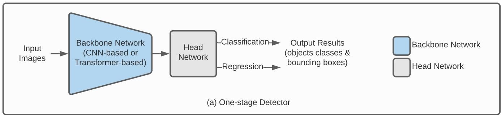

  
FIGURE 2. Basic deep learning-based one-stage vs. two-stage object detection model architectures. The backbone network can be used as a CNN or transformer-based network, where the backbone network can be categorized into one-stage or two-stage networks according to the structure of the head network. As shown in (a), the one-stage detector simultaneously performs object localization and classification in the head network. On the other hand, localization and classification in the two-stage detector are performed on regions after the region proposals are obtained, as shown in (b).

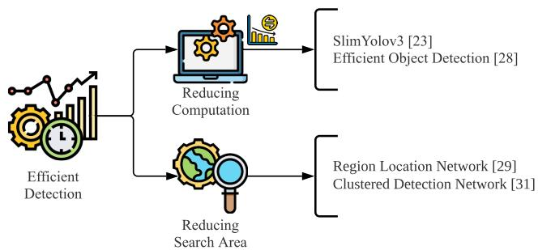  
FIGURE 3. The two primary categories of the efficient object detection methods. Efficient detection methods are achieved by reducing the computation and reducing search area. The representative methods are listed on the right.

runtime efficiency by reducing the number of required high-resolution images. However, the proposed method [38] requires pair of low-resolution images and high-resolution images, while SlimYOLOv3 [34] can be applied directly to high-resolution images without pairing the low and high resolution dataset.

# 2) REDUCING SEARCH AREA

Unlike other methods that use the information from entire image areas for object detection, several methods [39]–[41] suggested reducing the search area of images for efficient object detection.

Han et al. [39] applied Region Locating Network (RLN) in addition to Faster R-CNN [25] to generate cropped images. The proposed architecture of RLN is the same as Region Proposal Network (RPN) in Faster R-CNN. However, unlike

RPN, the RLN can predict the possible areas of the object location from the original overhead images. Also, since the cropped images of predicted areas are much smaller than the entire area of the original images, the proposed method showed a significant improvement in terms of efficiency for detecting specific objects.

In addition, Sommer et al. [40] proposed a similar approach with RLN [39] called Search Area Reduction (SAR) module. The image is divided into several image patches; then, the module predicts the scores based on the number of objects contained in each image patch. In particular, there are two distinguished characteristics of the SAR module from the previous RLN [39]. Firstly, contrary to the RLN that generates various sized images based on the clustering method, the SAR module handles divided images with the specific sized image. Secondly, while the SAR module is integrated with Faster R-CNN to share the network, RLN has a separate network for finding the regions. Such an integrated approach significantly reduces the inference time.

Also, Yang et al. [41] proposed Clustered Detection (ClusDet) network composed of a cluster proposal subnetwork (CPNet), a scale estimation sub-network (ScaleNet), and a dedicated detection network (DetecNet). CPNet is attached to the feature extraction backbone network and obtains high-level feature maps. Based on the feature map information, the CPNet produces the prediction of location and scales of clusters of input images. Then, ScaleNet predicts the scale offset for objects to rescale the cluster chips. Finally, detection results from DetecNet on cluster chips and a whole image are combined together to generate the final result. This method achieves high runtime efficiency

by reducing the search area with the clustering approach. Compared with the existing search area-based methods [39], [40], it is noteworthy that ClusDet achieves not only high efficiency, but also improved detection performance for small objects.

# B. SMALL OBJECT DETECTION

Moreover, limitation in detecting small-sized objects is another challenging problem associated with overhead images. Object detection in the overhead image is not only targeting to distinguish relatively large-sized objects such as buildings, bridges, and soccer ball fields but also, in many cases, it needs to detect small-sized objects such as vehicles, people, and ships. However, if the resolution of images decreases, the capability of detecting small-sized objects decreases drastically. Therefore, performance degradation in detecting the small-sized objects in the overhead image is extremely challenging and needs to be addressed. Recently, several methods have been proposed for small object detection to achieve better performance, as shown in Fig. 4, which we will describe more in the following sections.

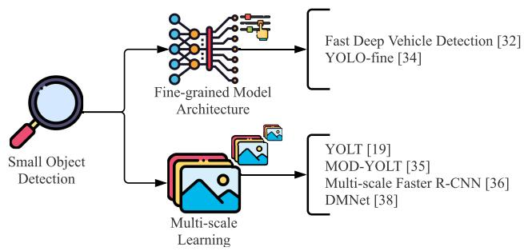  
FIGURE 4. The two primary categories of the small object detection. Small object detection methods are achieved by fine-grained model architecture and multi-scale learning, and the corresponding methods are listed on the right.

# 1) FINE-GRAINED MODEL ARCHITECTURE

The intuitive and straightforward approach to solve small-sized objects detection problems is to extract fine-grained features from source images by adjusting model parameters.

First, Sommer et al. [42] demonstrated the effectiveness of deep learning-based detection methods for vehicle detection in aerial images. Mainly, they performed the experiments based on Fast R-CNN [43] and Faster R-CNN [25] that are widely used in the object detection domain for terrestrial applications. Specifically, they proposed a common model architecture to detect small size objects. To maintain sufficient information for feature maps, they optimized parameters, including a number of layers, kernel size, and anchor scale. This work showed the applicability of a general object detection model when applied for vehicle detection in overhead imagery. However, the proposed work could not present a novel methodology except for optimizing the network parameters of the existing models [25], [43].

While Sommer et al. [42] utilized Faster R-CNN, which is a representative two-stage object detection model, other approaches employed the one-stage object detection models such as YOLO [26], [29], [30]. Pham et al. [44] proposed YOLO-fine, which is an one-stage object detection model. The proposed model was implemented based on YOLOv3 [26] to effectively handle small objects. In detail, this model replaced feature extraction layers with finer ones by a lower sub-sampling factor. With this finer object search grid, YOLO-fine could recognize objects smaller than eight pixels that were not recognized by the original YOLOv3. Also, they reduced the number of model parameters compared to the original YOLOv3 by removing the last two convolutional blocks that were not helpful in small-sized object detection. Overall, their work improved the detection performance for small objects by improving the adjacent objects' discrimination capabilities through a finer grid search, while reducing the number of model parameters by removing unnecessary convolution layers.

# 2) MULTI-SCALE LEARNING

While some achieved a better performance in small object detection through parameters optimization, others suggested a multi-scale approach that obtains features of various scaled objects for small object detection.

Van Etten [28] proposed the You Only Look Twice (YOLT) model inspired by YOLO [29], [30]. They introduced a new structure that is a similar approach adopted to fine-grained model architecture. In YOLT model, fine-grained features are extracted by adjusting architecture parameters. Furthermore, YOLT applied a multi-scale training approach concurrently, because the fine-grained model could suffer from the high false-positive issue. The intuitive way to understand multi-scale training is that it is similar to building two different models. In this way, YOLT combines the detection results obtained from two different models that detect small and large objects, respectively, to determine the final object detection result.

Inspired by YOLT, Li et al. [45] proposed MOD-YOLT for a Multi-scale object detection (MOD) task. They categorized objects into three types with different size criteria empirically. Then, categorized objects were trained with Multi-YOLT Network (MYN). While YOLT used a single network structure, MOD-YOLT proposes MYN to obtain optimal feature maps using optimized network structures for each scale. With this advanced framework, MOD-YOLT achieved higher detection performance than YOLT on a dataset from the second stage of the AIIA1 Cup Competition.

Also, Zhou et al. [46] applied the multi-scale network in addition to the Faster R-CNN architecture. Because a depth of convolutional neural networks is related to feature level, the multi-scale network enabled the model to use multiple levels of input feature. Therefore, this multi-scale network is beneficial to detect small objects such as ships in SAR imagery,

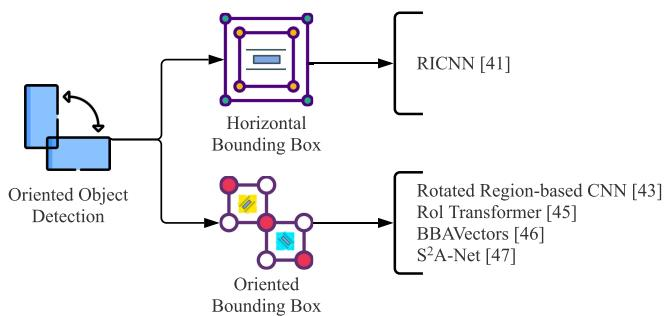  
FIGURE 5. The two primary categories of the oriented object detection, where they are divided into the horizontal and oriented bounding box methods at the high level. The core methods are illustrated on the right-hand side.

improving mAP performance, compared to the baseline models such as Single Shot Multibox Detector (SSD) [31] and RetinaNet [47].

Another method [48] to overcome a challenges lies in small object detection is to apply multi-scale training to cropped images from a source image. Based on a clustering method or density map, cropped images are generated, where the cropped images have various object scales. In particular, Li et al. [48] proposed Density-Map guided object detection Network (DMNet) to crop the images based on a density map from the proposed density generation module. Multicolumn CNN (MCNN) [49] inspired the idea of density generation module, which learned features of images and generated a density map. The cropped images were fed into the object detector, and the result was fused to increase detection performance for small objects.

# C. ORIENTED OBJECT DETECTION

Also, oriented objects can cause misclassification and produce a considerable decrease in object detection models' performance. Therefore, deep learning-based methods [50]–[54] have recently been proposed to detect oriented objects with higher accuracy, as shown in Fig. 5. Existing overhead imagery datasets can be classified according to whether the coordinate of oriented bounding boxes is provided or the coordinate is provided as horizontal boxes such as center point, width, and height of boxes. However, according to the dataset labeling configuration, different methods are employed for detecting oriented objects. Thus, we categorized oriented object detection methods based on the application of bounding box format: either horizontal or oriented.

# 1) DETECTING HORIZONTAL BOUNDING BOX

The most intuitive way to improve the detection accuracy of the oriented object is to explore data augmentation. Cheng et al. [50] applied the data augmentation strategy and proposed the new objective function to achieve rotation invariance of the feature representations. The proposed method was extended from AlexNet [55] by replacing the last classification layer with the rotation-invariant CNN (RICNN)

layer and softmax layers. They applied rotation augmentation on the data so that both before and after rotation were used jointly. During the training phase, a unique loss function enabled the RICNN to obtain similar features from an image before and after rotation. The RICNN improved the detection performance for oriented objects on the NWPU VHR-10 [56] dataset; however, this method required additional fine-tuning and cannot be applied to the dataset labeled as oriented bounding box form.

# 2) DETECTING ORIENTED BOUNDING BOX

Liu et al. [51] proposed rotated region-based CNN (RR-CNN) with a rotated region of interest (RRoI) pooling layer. The proposed RRoI pooling layer pooled rotated features into 5-tuple; center position with respect to x and y-axis, width, height, and rotation angle. The pooled features obtained by RROI are more robust and accurate than the previously proposed Free-form RoI pooling layer [57]. Another advantage of this approach is the extensibility as it can be combined with any other two-stage object detection model. For example, Liu et al. [51] used Fast R-CNN with RR-CNN in the experiments.

Even though RRoI can accurately extract rotated features, it suffered from expensive computational costs to generate proposal regions. To address this issue, Ding et al. [52] proposed an RoI transformer that consists of an RRoI learner and a Rotated Position Sensitive (RPS) RoI alignment module. The RRoI leaner is trained to learn transformation from HRoIs (Horizontal RoIs) to RRoIs, and the RPS RoI alignment module extracts the rotation-invariant features. Despite negligible computational cost increase, this RoI transformer-based method [52] significantly improved performance to detect oriented objects.

In addition, Yi et al. [53] introduced the box boundary aware vectors (BBAVectors) to detect and predict the oriented bounding boxes of objects. Instead of using predicted angle values from features [51], BBAVectors employed a Cartesian coordinate system. And, the model detects the center key point and then specifies the position of bounding boxes. The entire model architecture is implemented as an anchor-free one-stage detector so that the model can make inferences faster than other two-stage detectors.

On the other hand, Han et al. [54] proposed a one-stage detection method called the single-shot alignment network  $(S^2\mathrm{A}$  -Net), where the Feature Alignment Module (FAM) and Oriented Detection Module (ODM) were introduced. FAM consisted of Anchor Refinement Network (ARN) and Alignment Convolution Layer (ACL). ARN generated rotated anchors, and ACL decoded anchor prediction map to the oriented bounding box, extracting aligned features using alignment convolution (AlignConv). On the other hand, ODM applied active rotating filters (ARF) [58] to extract orientation-sensitive features and orientation-invariant features. These features were used to predict the bounding boxes and classify the categories from two sub-networks. It achieved the state-of-the-art performance on the DOTA [9]

and HRSC2016 [59] datasets, where these dataset are widely utilized in the oriented object detection research area.

# D. AUGMENTATION AND SUPER-RESOLUTION

In order to further improve the detection performance, image data augmentation and super-resolution can be applied at a preprocessing stage. Different preprocessing strategies are categorized and described in Fig. 6.

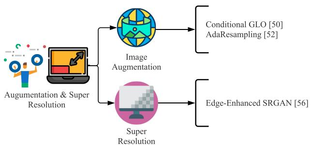  
FIGURE 6. The two primary categories of the preprocessing method. The most frequently used preprocessing methods for improving detection performance are super-resolution and image augmentation.

# 1) IMAGE AUGMENTATION

Chou et al. [60] proposed an interesting approach for detecting stingrays, employing a generative approach called Conditional GLO (C-GLO) in aerial images. Their approach was motivated by Generative Latent Optimization (GLO) proposed by Bojanowski et al. [61]. Unlike original GLO, C-GLO generates objects that are mixed with the background of the selected image region. Through training with these augmented images, the baseline model showed the significant performance improvement.

Also, Chen et al. [62] applied an adaptive augmentation method called AdaResampling to improve the model performance, where there are two significant issues with the regular augmentation methods, background and scale mismatch. To address the issues, AdaResampling applied a pretrained segmentation network during the augmentation phase to produce a segmented road map. From the segmented road map, the model used the position information to place objects. Additionally, a simple linear function was utilized to calculate the scale factor to resize objects. The augmented images were passed to the proposed hybrid detector called RRNet, which has a re-regression module. Then, the re-regression module took feature maps with coarse bounding boxes as input then predicted the final bounding boxes as an output.

# 2) SUPER-RESOLUTION

Another approach that is often applied to the original image at the preprocessing stage is to generate a super-resolution image. Shermeyer and Van [63] analyzed the effect of different resolutions of overhead imagery on object detection performance. Very Deep Super-Resolution (VDSR) [64] and Random-Forest Super-Resolution (RFSR), which is extended from Super-Resolution Forest (SRF) [65], were used to

generate super-resolution images for their experiments. The results demonstrated that these super-resolution methods improved detection performance. When the resolution of the input images was increased from  $30cm$  to  $15cm$ , the mAP performance was increased by  $13\%$  to  $36\%$ . Conversely, when the resolution was degraded from  $30cm$  to  $120cm$ , the detection performance was decreased by  $22\%$  to  $27\%$ . The outcome of the experiments demonstrated that image resolution is highly related to detection performance; thus, generally the super-resolution methods can improve the overall object detection performance.

In a similar direction, Rabbi et al. [66] introduced Edge-Enhanced Super-Resolution GAN (EESRGAN) method, which was inspired by Edge Enhanced GAN (EEGAN) [67] and Enhanced Super-Resolution GAN (ESRGAN) [68]. The proposed method consists of EESRGAN and the end-to-end network structure such as Faster R-CNN and SSD as a base detection network. In particular, EESRGAN generated super-resolution images with rich edge information, and base detection networks (Faster R-CNN and SSD) achieved improved accuracy with the super-resolution images.

# E. MULTIMODAL OJBECT DETECTION

Another challenging but promising research area is object detection with multimodal data such as different resolutions, view points, and data types. In this section, we will examine methods using multimodal data for object detection. In order to achieve more robust and accurate detection performance utilizing various types of data, multimodal object detection can be applied, as shown in Fig. 7.

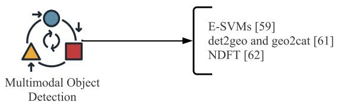  
FIGURE 7. Illustration of multimodal object detection methods. E-SVMs and NDFT are the most frequently used methods.

First, a fundamental approach multimodal object detection is to use different resolution images from separate sensors. Cao et al. [69] introduced a detection framework that simultaneously used low-resolution satellite images and high-resolution aerial images. Coupled dictionary learning was applied to obtain augmented features for the detection framework, then E-SVM [70] was used to make them a more robust model in various image resolutions. Compared with multi-scale training and super-resolution generated images, the proposed method obtained data with separate domains, which provide different image resolutions such as satellite and aerial.

Similar to using multi-resolution information, Wegner et al. [71] used information obtained from multiple views such as street and overhead view. The Faster R-CNN model was utilized as a base detection model to detect objects

TABLE 1. Summary of EO satellite datasets. The SpaceNet 1 and 2 datasets provide two types of images, which are 8-band multispectral and 3-band RGB imagery. All datasets are publicly available, where  $\dagger$  indicates the performance achieved by the best team for the challenge evaluation metric.  

<table><tr><td>Dataset</td><td>Categories</td><td>Images</td><td>Objects</td><td>Year</td><td>Sensor</td><td>GSD (m)</td><td>Image Size</td><td>Representative Performance</td></tr><tr><td>HRSC2016</td><td>22</td><td>1,070</td><td>2,819</td><td>2017</td><td>Google Earth</td><td>0.4 – 2</td><td>300×300 – 1,500×900</td><td>mAP: 90.56 [78]</td></tr><tr><td>SpaceNet 1</td><td>1</td><td>9,735</td><td>382,534</td><td>2018</td><td>WorldView-2</td><td>0.5, 1</td><td>439×407 – 440×407</td><td>F1-score: 0.255292†</td></tr><tr><td>SpaceNet 2</td><td>1</td><td>24,586</td><td>302,701</td><td>2018</td><td>WorldView-3</td><td>0.3, 1.24</td><td>650×650</td><td>F1-score: 0.693†</td></tr><tr><td>xView</td><td>60</td><td>1,129</td><td>800,636</td><td>2018</td><td>WorldView-3</td><td>0.3</td><td>2,576×2,564 – 5,121×3,023</td><td>mAP: 31.74† [74]</td></tr><tr><td>SpaceNet MVOI</td><td>1</td><td>62,000</td><td>126,747</td><td>2019</td><td>WorldView-2</td><td>0.46 – 1.67</td><td>900×900</td><td>F1-score: 0.730†</td></tr></table>

from each street view image. The results with geographic coordination were combined to calculate multi-view proposal scores, and the scores generated final detection results to the input region. The proposed model showed significant improvement in mAP score at the evaluation stage compared to the Faster R-CNN model on simple overhead images.

Unlike the approaches that utilized different types of images, Wu et al. [72] proposed Nuisance Disentangled Feature Transform (NDFT) to use meta-data in conjunction with the images to obtain domain-robust features. Furthermore, adopting adversarial learning, the NDFT disentangles the features of domain-specific nuisances such as altitudes, angles, and weather information. Their proposed training process enables the model to be robust in various domains by learning domain-invariant features.

# F. IMBALANCED OBJECTS DETECTION

Imbalanced objects are one of the challenging issues in the overhead imagery research [47], [73]–[76]. After RetinaNet [47] introduced focal loss to overcome detecting the imbalanced objects, there have been more studies to extend focal loss and improve the performance, as shown in Fig. 8.

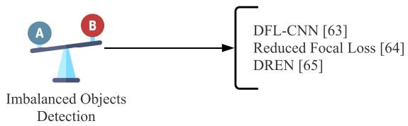  
FIGURE 8. A visual overview for detecting imbalanced objects, where detailed methods are presented.

Especially, Yang et al. [73] proposed a double focal loss convolutional neural network (DFL-CNN) using focal loss to region proposal network (RPN) and classifier module of Faster R-CNN model. Using the focal loss instead of the cross-entropy loss, the RPN considers the class imbalance problem when determining the region of interest, and the classifier is enabled to handle hard negative data during training. Additionally, skip connection was proposed to pass detailed features from the shallow layer to the deeper layer. Their methods demonstrated an improvement in detection performance compared with the Faster R-CNN model on the ITCVD dataset, which was constructed in this study.

Sergievskiy and Ponamarev [74] addressed the challenging imbalance issue with a reduced focal loss, a modified

version of the original focal loss function. A threshold was applied to keep minimum weights to positive samples to prevent the unintended drop of recall. The proposed method was experimented on the xView [8] dataset with a random undersampling strategy and achieved first place with DIUx xView 2018 Detection Challenge [8].

Unlike the previous studies using the focal loss function, Zhang et al. [75] proposed a Difficult Region Estimation Network (DREN). The DREN was trained to generate cropped images for the difficult-to-detect region for the testing phase, and these images were passed to the detector with original images. Their network utilized a balanced L1 loss from Libra R-CNN [77]. Then, the balanced L1 loss restrained gradients produced by outliers, which were samples with high loss values. To clip maximum gradients from outliers, it made a more balanced regression from accurate samples.

# III. DATASETS

In this section, we explain the most popular and openly available satellite imagery datasets based on their image sensor sources.

# A. EO SATELLITE IMAGERY DATASETS

Although EO satellite images are generally low-resolution and difficult to collect compared to other images, EO images are advantageous in capturing the large areas that are physically difficult to be collected by UAV or flight. Following datasets are constructed with EO satellites, as shown in Table 1.

# 1) HRSC2016

Liu et al. [79] introduced the High-Resolution Ship Collection 2016 (HRSC2016) dataset to promote research on optical remote sensing ship detection and recognition. The dataset was utilized by Liu et al. [59] before publishing the dataset to demonstrate a detection performance for rotated ships. Therefore, the dataset provides labeling information of rotated and horizontal bounding boxes coordinations. It is extraordinary to provide hierarchical classes of ships compared to other ship detection datasets that usually contain a single class. Moreover, since both labeling formats are also supported, the dataset can be used in various detection models. However, most ship images are presented with harbor backgrounds, so for the better quality of the dataset, separate sea images

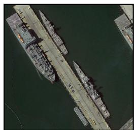  
(a) HRSC 2016

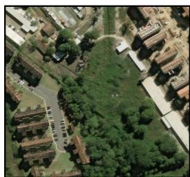  
(b) SpaceNet 1  
FIGURE 9. Images taken from EO satellite datasets as examples. Each dataset is composed of images captured using different sensors with varying resolutions.

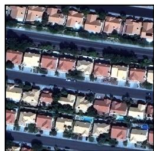  
(c)SpaceNet 2

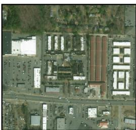  
(d) xView

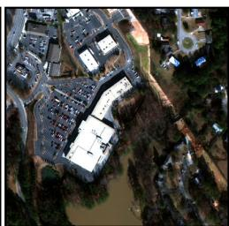  
(e) SpaceNet MVOI

are needed to be included as indicated in their future work. The sample image is shown in Fig. 9. (a).

# 2) SPACENET CHALLENGE 1 AND 2

Van et al. [80] and SpaceNet partners (CosmiQ Works, Radiant Solutions, and NVIDIA) released a large satellite dataset called SpaceNet. The SpaceNet comprises a series of datasets, dataset 1 and 2, which aims to extract building footprints. The SpaceNet1 obtained images from Rio De Janeiro with the WorldView-2 satellite at  $50\mathrm{cm}$  GSD. Furthermore, images of SpaceNet2 were captured from various areas, including Las Vegas, Paris, Shanghai, and Khartoum, with the WorldView-3 satellite at  $30\mathrm{cm}$  ground sample distance (GSD). Both datasets contain 8-band multispectral images with lower resolution. Because building footprints are provided as polygon format, these datasets enable detection models to evaluate performance more accurately than datasets with bounding boxes format. The sample image is shown in Fig. 9. (b) and (c).

# 3) XVIEW

Lam et al. [8] constructed the xView dataset, consisting of over 1 million objects across 60 classes with  $30cm$  ground sample distance from the WorldView-3 satellites. Compared to other satellite datasets introduced before, xView provides high geographic diversity and various class categories. However, since xView collected images from only a single source, the dataset is not suitable for evaluating detection performance on images from various sources. In addition, they maintained the quality of the dataset through three stages of quality control; worker, supervisory, and expert. Labelers performed the role of reviewers to check the work of other labelers related to bounding boxes in the worker quality control stage. Afterward, in the supervisory quality control stage, quality was checked and provided feedback to labelers by hosting the training session. Lastly, in the expert quality control stage, a standard dataset was generated to make thresholds to compare precision and recall with generated dataset batches. Throughout the quality process, xView minimized human error and achieved the consistency of the dataset. The sample image is shown in Fig. 9. (d).

# 4) SPACENET MVOI

Weir et al. [81] addressed limitations of the previous satellite imagery dataset, which cannot represent various viewpoint in real-world cases, and introduced SpaceNet Multi-View Overhead Imagery (MVOI) dataset. While other datasets had a fixed viewing angle viewpoint from sensing sources, SpaceNet MVOI was constructed with a broad range of off-nadir images from the WorldView-2 satellite. Therefore, SpaceNet MVOI obtained different images of the same area in various angles. This characteristic provides the dataset effectiveness in evaluating the generalization performance of detection models. Similar to SpaceNet 1 and 2 [80], the labels are provided in polygon format to represent the accurate ground truth of building footprints. The sample image is shown in Fig. 9. (e).

# B. SAR SATELLITE IMAGERY DATASETS

Although imagery from SAR satellite is embedded with many speckle noises, the SAR satellite imagery is an important research area due to the unique characteristic that SAR images can be provided regardless of the obstacles, such as clouds and lights. In particular, most of the existing SAR datasets are constructed for ship detection, as shown in Table 2.

# 1)SSDD

SAR Ship Detection Dataset (SSDD) is the widely used dataset for the SAR ship detection research, which was first introduced by Li et al. [88] in 2017. The images were collected from RadarSat-2, TerraSAR-X, and Sentinel-1 satellites to utilize various sensor types and resolutions. The minimum size of a ship on low-resolution images is three pixels to recognize the ship. This dataset is helpful to start evaluating the performance of the ship detection model on SAR imagery. However, the number of objects is relatively small compared to other datasets, and it is considered as a less challenging dataset that has already achieved higher than  $95\%$  mAP values [82], [89].

# 2) OPENSARSHIP 2.0

Li et al. [90] presented a SAR ship detection dataset called OpenSARShip 2.0, an updated version of OpenSARShip [91].

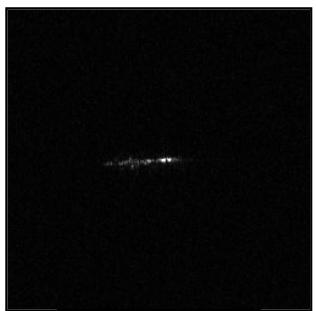  
(a) OpenSARShip

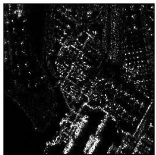  
(b) SAR-SHIP

  
(c) HRSID  
FIGURE 10. Sample images from SAR satellite imagery datasets. The radar waves are collected from active sensors and converted to black and white images. Compared with images from passive sensors, generally, a SAR image has speckle noises.

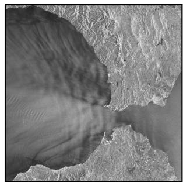  
(d) LS-SSDD

TABLE 2. Summary of SAR satellite imagery datasets. Because OpenSARShip datasets provide only ship chips without raw images, image size is not described in this table. For LS-SSDD-v1.0, both sizes of raw images and split image patches are described. All the datasets have ship class only, and they are publicly available.  

<table><tr><td>Dataset</td><td>Categories</td><td>Images</td><td>Objects</td><td>Year</td><td>Sensor</td><td>GSD (m)</td><td>Image Size</td><td>Representative Performance</td></tr><tr><td>SSDD</td><td>1</td><td>1,160</td><td>2,456</td><td>2017</td><td>RadarSat-2, TerraSAR-X, Sentinel-1</td><td>1 - 15</td><td>500×500</td><td>mAP: 95.29 [82]</td></tr><tr><td>OpenSARShip</td><td>1</td><td>41</td><td>11,346</td><td>2017</td><td>Sentinel-1</td><td>2.7 - 22</td><td>ship chips only</td><td>Accuracy: 79.25 [83]</td></tr><tr><td>OpenSARShip 2.0</td><td>1</td><td>87</td><td>34,528</td><td>2017</td><td>Sentinel-1</td><td>2.7 - 22</td><td>ship chips only</td><td>Accuracy: 79.12 [84]</td></tr><tr><td>SAR-Ship-Dataset</td><td>1</td><td>11,796</td><td>43,819</td><td>2019</td><td>Gaofen-3, Sentinel-1</td><td>3 - 22</td><td>256×256</td><td>mAP: 94.7 [85]</td></tr><tr><td>HRSID</td><td>1</td><td>5,604</td><td>16,951</td><td>2020</td><td>Sentinel-1B, TerraSAR-X, TanDEM</td><td>1 - 5</td><td>800×800</td><td>mAP: 96.01 [86]</td></tr><tr><td>LS-SSDD-v1.0</td><td>1</td><td>15 (9,000)</td><td>6,015</td><td>2020</td><td>Sentinel-1</td><td>5 - 20</td><td>24,000×16,000 (800×800)</td><td>mAP: 71.7 [87]</td></tr></table>

The images were collected from Sentinel-1 satellite with two different product types; Single look complex and Ground range detected product. Compared to the previous version, OpenSARShip 2.0 provides the additional information called automatic identification system (AIS) and Marine Traffic information that contains ship type, longitude, and latitude. Although detailed position information is annotated for each ship, images are provided as cropped ship chips. Thus, the dataset is more suitable for a classification task instead of object detection. The sample image is shown in Fig. 10. (a).

# 3) SAR-SHIP DATASET

Wang et al. [92] constructed a SAR image dataset using 102 images from the Chinese Gaofen-3 satellite and 108 images from the Sentinel-1 satellite. Compared with the previous SAR datasets, this dataset focused on containing complex background images such as a harbor or near an island. Throughout this characteristic of the dataset, it aimed to increase the performance of the ship detection model without any land-ocean segmentation image pre-processing. The sample image is provided in Fig. 10. (b).

# 4) HRSID

Wei et al. [93] constructed and released a High-Resolution SAR Images Dataset (HRSID) to foster research for ship detection and instance segmentation on SAR imagery. From Sentinel-1B, TerraSAR-X, and TanDEM satellites, 136 raw images were collected. Then, the images were cropped into a fixed size with a  $25\%$  overlapping area. Optical imagery from Google Earth was utilized to minimize annotation errors. While OpenSARShip [90] and SAR-Ship [92]

datasets provides ship chips or small size images, HRSID provides comparatively large size images, which are beneficial for evaluating object detection methods. Furthermore, the HRSID is composed of higher resolution images than other SAR datasets so that the HRSID dataset is more effective in discriminating the adjacent ships. The sample image is shown in Fig. 10. (c).

# 5) LS-SSDD-v1.0

Unlike previously released datasets containing ship chips or small sized images, Zhang et al. [94] released a dataset with large-scaled 15 raw images collected from Sentinel-1. The dataset called a Large-Scale SAR Ship Detection Dataset-v1.0 (LS-SSDD-v1.0) provides raw images of the size  $24,000 \times 16,000$  pixels with split sub-images of  $800 \times 800$  pixels. In order to create similar conditions to the actual environment, images are provided with pure backgrounds without making separate ship chips. It means that sub-image patches are also provided regardless of whether they contained target objects or not. This characteristic is helpful for detection models to learn pure backgrounds without objects, making it more practical to real-world cases. The sample raw image is presented in Fig. 10. (d).

# C. AERIAL IMAGERY DATASETS

As shown in Table 3, there are datasets constructed with images from passive optical sensors such as flights and drones. And, it is difficult to specify detailed sensor information because the sensor specifications can not be described in detail generally. Initial datasets have been more focused on primarily detecting cars. However, recent trends for object

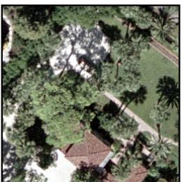  
(a) OIRDS

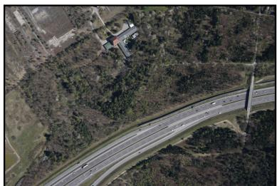  
(b) DLR-MVDA

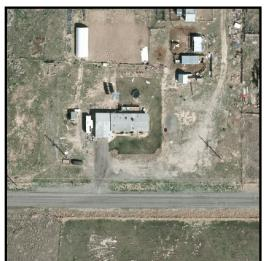  
(c) VEDAI

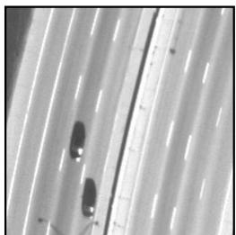  
(d) COWC

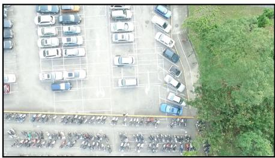  
(e)CARPK

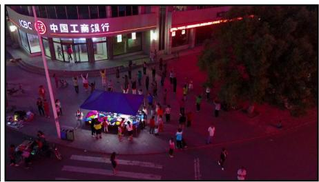  
(f) VisDrone

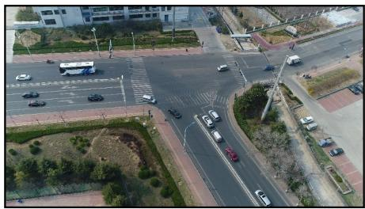  
(g) UAVDT  
FIGURE 11. Sample images from aerial imagery datasets. Generally, aerial imagery datasets have higher resolution than satellite images.

detection on aerial imagery have extended to detect various objects in backgrounds.

# 1) OIRDS

Tanner et al. [101] created Overhead Imagery Research Data Set (OIRDS) with non-copyrighted overhead imagery. They obtained images from the United States Geological Survey (USGS) and the Video Verification of Identity (VIVID) program of the Defense Advanced Research Projects Agency (DARPA). The dataset contains approximately 1,800 vehicle targets categorized as car, truck, pick-up truck, and unknown. Based on the comparative color distribution analysis of the actual vehicle statistics with the statistics of the collected images from the dataset, the OIRDS dataset showed a high quality reflection on the natural distribution of the reality. However, since the amount of data is relatively small, there is a limitation in improving the generalized performance when a deep learning-based method is applied. A sample image is shown in Fig. 11. (a).

# 2) DLR MVDA DATASET

German Aerospace Center (DLR) obtained aerial images by the DLR 3K camera system and provided a dataset called DLR-MVDA. Liu and Mattyus [95] firstly utilized the DLR-MVDA dataset to evaluate the performance of the proposed method. Although they considered only two vehicle classes in the research, the dataset have seven vehicle classes. The images were captured from an airplane at the height of 1,000 meters above Munich, Germany. DLR-MVDA has an advantage as the annotation includes angle information of each object. Therefore, the dataset can be utilized in oriented object detection methods. A sample image is shown in Fig. 11. (b).

# 3) VEDAI

Razakarivony and Jurie [102] introduced Vehicle Detection in Aerial Imagery (VEDAI) Dataset, where the dataset consists of subsets of two different image resolutions that support color or infrared image type. They cut large original images into small images on selected regions to maximize diversity. The total number of vehicle classes is nine, and two meta-classes are also defined. Although this dataset is composed of several image types and has an advantage in scalability to various sensor images in real-world cases, the amount of data is relatively small for to be used in the deep learning detection method as similar to OIRDS [101]. A sample image is shown in Fig. 11. (c).

# 4)COWC

Mundhenk et al. [99] created a large contextual dataset called Cars Overhead with Context (COWC). Unlike the existing dataset covering one region or the same sensor source [101], [102], COWC covers six regions from Toronto Cannada, Selwyn New Zealand, Potsdam, Vaihingen Germany, Columbus, and Utah to guarantee diversity. The images from two regions (Vaihingen and Columbus) are grayscale, and the other is color images. COWC has the advantage as the dataset contains a diverse range of objects that can be utilized in the deep learning-based method for vehicle detection than the other previous datasets [101], [102]. Also, COWC includes various usable negative targets for the difficulty of the dataset. A sample image is shown in Fig. 11. (d).

# 5) CARPK

Hsieh et al. [103] presented aerial view images dataset collected by drones that detected cars on parking lots. The dataset contains 89,777 cars with various viewpoints from four different places. Compared to previous datasets used

TABLE 3. Summary of aerial imagery datasets. For DLR-MVDA, the values in parentheses are the number used for the training in the study [95]. All datasets are publicly available, where  $\dagger$  indicates the performance achieved by the best team for the challenge evaluation metric.  

<table><tr><td>Dataset</td><td>Categories</td><td>Images</td><td>Objects</td><td>Year</td><td>Sensor</td><td>GSD (m)</td><td>Image Size</td><td>Representative Performance</td></tr><tr><td>OIRDS</td><td>4</td><td>908</td><td>1,796</td><td>2009</td><td>-</td><td>Approx. 0.15</td><td>256×256 - 640×480</td><td>precision/recall: 95.09/93.72 [96]</td></tr><tr><td>DLR-MVDA</td><td>7 (2)</td><td>20 (10)</td><td>5,892 (3,472)</td><td>2015</td><td>Canon Eos-1Ds Mark III</td><td>Approx. 0.13</td><td>5,616×3,744</td><td>mAP: 79.54 [97]</td></tr><tr><td>VEDAI</td><td>9</td><td>1,210</td><td>3687</td><td>2015</td><td>-</td><td>0.125, 0.25</td><td>1,024×1,024, 512×512</td><td>F1-score: 0.69 [98]</td></tr><tr><td>COWC</td><td>1</td><td>29,549</td><td>90,963</td><td>2016</td><td>-</td><td>0.15</td><td>256×256</td><td>F1-score: 0.9434 [99]</td></tr><tr><td>CARPK</td><td>1</td><td>1,448</td><td>89,777</td><td>2017</td><td>-</td><td>-</td><td>1,280×720</td><td>MAE: 6.77 [100]</td></tr><tr><td>VisDrone</td><td>10</td><td>10,209</td><td>54,200</td><td>2018</td><td>-</td><td>-</td><td>2,000×1,500</td><td>mAP: 62.05†</td></tr><tr><td>UAVDT</td><td>3</td><td>40,735</td><td>763,817</td><td>2018</td><td>-</td><td>-</td><td>1080×540</td><td>mAP: 26.5 [41]</td></tr></table>

for car detection, such as OIRDS, VEDAI, and COWC, this dataset provides higher resolution images to utilize fine-grained information. In addition, since the images were collected from one designated spot (parking lot), a large portion of the image is filled with objects compared to images with sparse objects from the previous datasets. Because CARPK is a high-resolution image dataset, the image contains distinguishable objects located in proximity. A sample image is presented in Fig. 11. (e).

# 6) VISDRONE

There have been two object detection challenges called VisDrone Challenge in 2018 and 2019 with a drone-based benchmark dataset called VisDrone [104]. Zhu et al. [37] released the dataset to motivate the research in computer vision tasks on the drone platform. It contains 263 video clips (179,264 frames) and 10,209 images captured by drones in various areas of China. Besides, occlusion and truncation ratio information is provided to capture the characteristics of overhead imagery. Whereas the existing aerial image datasets usually use vehicles as target objects, Visdrone includes some other smaller objects classes such as vehicles, pedestrians, and bicycles so that the dataset can be used for various object detection purposes. A sample image is shown in Fig. 11. (f).

# 7) UAVDT

Du et al. [105] constructed a dataset for detecting vehicles on a UAV platform. This dataset is called UAV Detection and Tracking (UAVDT), and it provides useful annotated attributes such as weather conditions, flying altitude, camera view, vehicle occlusion, and out-of-view. In particular, the out-of-view was categorized based on a ratio of objects in the frame outside. Because UAVDT represents real-world environments by focusing on various scenes, weather, and camera angles, it has the advantage of evaluating the generalization performance of detection methods. Furthermore, it also contains various backgrounds in divided subsets for training and testing, respectively. The volume of images described in Table 3 excludes images for a single object tracking task. A sample image is shown in Fig. 11. (g).

# D. SATELLITE AND AERIAL IMAGERY DATASETS

Lastly, there are datasets constructed with images from both satellite and aerial sources, as shown in Table 4, where such datasets are helpful to improve and evaluate the generalization performance of the object detection methods.

Generally, EO satellite is utilized for satellite images that have lower image resolution than aerial images.

# 1) TAS DATASET

Heitz and Koller [109] constructed an overhead car detection dataset obtained from Google Earth for demonstrating the performance of the things and stuff (TAS) context model. The dataset is a set of 30 color images of the city and suburbs of Brussels, Belgium, with a size of  $792 \times 636$  pixels. A total of 1,319 cars are labeled manually with an average size of a car being  $45 \times 45$  pixels. The TAS dataset is meaningful in that it is one of the earliest developed overhead-viewed vehicle datasets. However, the amount of data is insufficient and lacks diversity for applying the latest deep learning-based detection methods. A sample image is shown in Fig. 11. (a).

# 2)SZTAKI-INRIA

Benedek et al. [110] developed the SZTAKI-INRIA Building Detection Benchmark dataset for evaluating proposed detection methods. The dataset contains 665 building footprints in 9 images from several cities of Hungary, UK, Germany, and France. Among nine images, two images were obtained from an aerial source, and the rest were from satellite and Google Earth platform. The SZTAKI-INRIA dataset, similar to the TAS dataset [109], is not suitable for applying a deep learning-based object detection method due to the insufficient volume of images and objects. A sample image is shown in Fig. 11. (b)

# 3) NWPU VHR-10

Cheng et al. [56] constructed the NWPU VHR-10 dataset, which contains 800 satellite and aerial images from Google Earth and Vaihingen data [111]. The dataset consists of ten different types of objects such as airplanes, ships, storage tanks, Etc. The size of each object type varies from  $418 \times 418$  pixels for large objects to  $33 \times 33$  pixels for small ones. Furthermore, the image resolution varies from  $0.08\mathrm{m}$  to  $2\mathrm{m}$  for a diversity of the dataset. In order to use the dataset according to the applying purpose, the NWPU VHR-10 dataset provides the independently divided four sub-groups; 1) negative image set, 2) positive image set, 3) optimizing set, and 4) testing set. A sample image is shown in Fig. 11. (c).

# 4) DOTA

Xia et al. [9] firstly introduced a large-scale Dataset for Object deTecction in Aerial images (DOTA), aiming for an

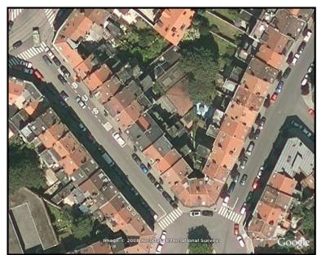  
(a) TAS

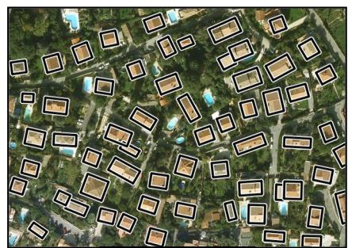  
(b)SZTAKI-INRIA

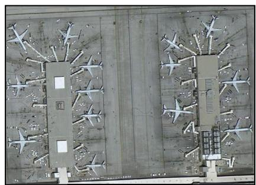  
(c) NWPU VHR-10

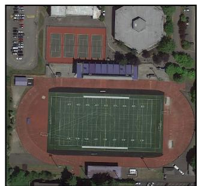  
(d) DOTA-v1.0

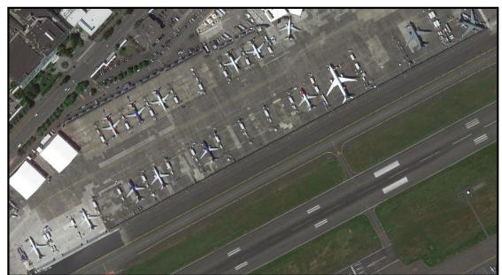  
(e) DOTA-v1.5

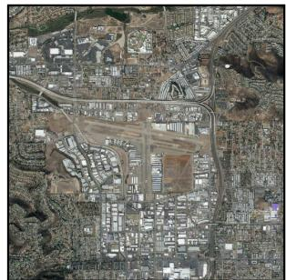  
(f) DOTA-v2.0  
FIGURE 12. Sample images for satellite and aerial imagery datasets. Since it contains both satellite and aerial images, datasets consist of various characteristics such as sensor, resolution, and angle.

TABLE 4. Summary of satellite and aerial imagery datasets. All datasets are publicly available, where  $\dagger$  indicates the performance achieved by the best team for the challenge evaluation metric.  

<table><tr><td>Dataset</td><td>Categories</td><td>Images</td><td>Objects</td><td>Year</td><td>Sensor</td><td>GSD (m)</td><td>Image Size</td><td>Representative Performance</td></tr><tr><td>TAS dataset</td><td>1</td><td>30</td><td>1,319</td><td>2008</td><td>Google Earth</td><td>-</td><td>792×636</td><td>-</td></tr><tr><td>SZTAKI-INRIA</td><td>1</td><td>9</td><td>665</td><td>2012</td><td>Google Earth</td><td>-</td><td>600×490 to 1,437×814</td><td>F1-score: 0.948 [106]</td></tr><tr><td>NWPU VHR-10</td><td>10</td><td>800</td><td>3,775</td><td>2014</td><td>Leica ALS50, Google Earth</td><td>0.08, 0.5 to 2</td><td>533×597 to 1,728×1,028</td><td>mAP: 94.87 [107]</td></tr><tr><td>DOTA-v1.0</td><td>15</td><td>2,806</td><td>188,282</td><td>2018</td><td>Google Earth, GF-2, JL-1</td><td>0.1, 1</td><td>800×800 to 4,000×4,000</td><td>mAP: 0.824†</td></tr><tr><td>DOTA-v1.5</td><td>16</td><td>2,806</td><td>403,318</td><td>2019</td><td>Google Earth, GF-2, JL-1</td><td>0.1, 1</td><td>800×800 to 4,000×4,000</td><td>mAP: 0.7834†</td></tr><tr><td>DOTA-v2.0</td><td>18</td><td>11,268</td><td>1,793,658</td><td>2021</td><td>Google Earth, GF-2, JL-1</td><td>0.1, 1</td><td>800×800 to 20,000×20,000</td><td>mAP: 48.81 [108]</td></tr></table>

international object detection challenge. After DOTA-v1.0 issued, DOTA-v1.5 and v2.0 were subsequently issued in 2019, and 2021 [112], respectively. DOTA-v.1.5 used the same image as DOTA-v1.0. However, one object class and annotations for small objects were added because DOTA-v1.0 do not contain annotations for objects less than 10 pixels. In DOTA-v2.0, images were additionally collected from various sources such as Google Earth, GF-2, and JL-1 satellite. Moreover, object categories were broadened from 15 to 18 classes. Because objects in overhead images exist with arbitrary orientations in the real world, the DOTA datasets provide oriented bounding box information to evaluate the accurate performance. A sample image is shown in Fig. 11. (d), (e), and (f).

# IV. FUTURE RESEARCH DIRECTIONS

In this work, we propose two promising research directions based on the comprehensive survey of deep learning-based methods and overhead imagery datasets.

# A. ACCURACY VS. EFFICIENCY

Accurate detection for small and imbalanced objects is closely related to the efficiency of detection methods because accuracy and efficiency are in a trade-off relationship in general. Although well-established object detection methods for natural images have been studied [113]–[115] to meet both accuracy and efficiency requirement, overhead imagery has to consider this problem a more critical issue because the amount of data and the size of the images to be processed are more extensive than that of the natural images. In the case of the currently proposed methods, the efficiency was improved; however, the upper bound of the detection performance of the methods was the performance of the vanilla detection model [34], [38], [40]. On the one hand, there are methods [28], [46], [63] focusing on improve accuracy; however, the efficiency was decreased due to the high computational load for modified model architecture. Therefore, research on a novel approach that improves both accuracy and efficiency is the first primary research direction.

# B. FUSION OF OTHER DOMAIN DATA

Another direction is to utilize additional information from other domains for the overhead imagery. In most cases, it is practically challenging to obtain sufficiently labeled data in various computer vision tasks. Therefore, many studies such as the soft teacher method [116] have recently been conducted to overcome this problem. Xu et al. [116] proposed the soft teacher method, where the proposed framework is composed of the teacher and student networks. The teacher network in the method assigns a classification score to an unlabeled bounding box and calculates the loss. Throughout this process, the accuracy of pseudo labels is gradually improved. For object detection on the overhead imagery, this challenge with scarce data can be overcome through fusion with other domain data. Even though labeled data is not sufficient, we can leverage more data from other domain data, such as different sensing sources [71], [81] and metadata information [105]. Therefore, detection performance can be improved by using the additional information so that more meaningful results can be obtained from real-world use cases. Moreover, overhead imagery is closely related to social, and real-world applications because it is obtained over a broad area in real-time basis [117]–[119]. Given these considerations, one of the most significant research directions is to apply other domain information with overhead imagery.

# V. CONCLUSION

Object detection on overhead imagery is one of the exciting research areas in the computer vision community. However, there are challenging issues due to the unique characteristics of overhead images that are different from natural images. The characteristics cause difficulty in applying the state-of-the-art methods in natural images directly. Therefore, many approaches have been introduced recently to overcome the challenging issues.

Our survey paper explores the recent approaches in satellite and aerial imagery-based object detection research and aims to stimulate further research in this area by presenting comprehensive and comparative reviews. After researching a number of papers, we categorized the most important approaches into the six different categories. Further, we compare and analyze publicly available datasets to utilize and motivate research on object detection with the overhead imagery domain. Also, based on the difference in image sources, our paper surveyed the datasets with helpful information such as image resolution and size. We hope this paper will be helpful in developing more advanced deep learning-based approaches as well as understanding and discussing future research directions.

# APPENDIX

# PSEUDO CODE FOR OBJECT DETECTOR

The training procedure for one and two-stage detectors is formally presented in Algorithm 1.

Algorithm 1 Training Algorithm of Deep Learning-Based Object Detection Methods. Based on a Procedure of Head Network, the Methods Can Be Defined Into One or Two-Stage Detectors

1: Require:mini-batch  $x$  compose of pre-processed image patches, the total number of mini-batch  $N$ , A detection model  $M$  compose of the backbone network  $B$  and the head network  $H$  
2: Set hyper-parameters such as batch size, learning rate, IOU threshold, confidence threshold, the maximum number of objects to find  
3: for each epoch do  
4: for  $N$  steps do  
5: Extract features  $x_{f}$  from mini-batch data  $x$  by the backbone network  $B$  
6: if The model  $M$  is one-stage then  
7: Predict objects classes  $c$  and bounding boxes  $b$  
8: else if The model  $M$  is two-stage then  
9: Extract Regions of Interest (ROIs) by search method such as selective search or region proposal network  
10: From the ROIs, predict objects classes  $c$  and bounding boxes  $b$  
11: end if  
12: Delete uncertain objects based on the confidence threshold  
13: Delete overlapped objects based on the IOU threshold  
14: Choose accurate objects up to the maximum number of objects  
15: Calculate batch loss from the objective function  
16: end for  
17: Update model parameter based on calculated loss  
18: end for

# ACKNOWLEDGMENT

The authors would like to thank Jin Yong Park for reviewing the earlier version of the draft, and providing helpful and insightful comments.

# REFERENCES

[1] G. Cheng and J. Han, "A survey on object detection in optical remote sensing images," *ISPRS J. Photogramm. Remote Sens.*, vol. 117, pp. 11-28, Jul. 2016.  
[2] A. Groener, G. Chern, and M. Pritt, “A comparison of deep learning object detection models for satellite imagery,” in Proc. IEEE Appl. Imag. Pattern Recognit. Workshop (AIPR), Oct. 2019, pp. 1–10.  
[3] U. Alganci, M. Soydas, and E. Sertel, "Comparative research on deep learning approaches for airplane detection from very high-resolution satellite images," Remote Sens., vol. 12, no. 3, p. 458, Feb. 2020.  
[4] H. Yao, R. Qin, and X. Chen, “Unmanned aerial vehicle for remote sensing applications—A review,” Remote Sens., vol. 11, no. 12, p. 1443, Jun. 2019.  
[5] D. Cazzato, C. Cimarelli, J. L. Sanchez-Lopez, H. Voos, and M. Leo, "A survey of computer vision methods for 2D object detection from unmanned aerial vehicles," J. Imag., vol. 6, no. 8, p. 78, Aug. 2020.  
[6] Z. Zheng, L. Lei, H. Sun, and G. Kuang, “A review of remote sensing image object detection algorithms based on deep learning,” in Proc. IEEE 5th Int. Conf. Image, Vis. Comput. (ICIVC), Jul. 2020, pp. 34–43.

[7] K. Li, G. Wan, G. Cheng, L. Meng, and J. Han, "Object detection in optical remote sensing images: A survey and a new benchmark," *ISPRS* J. Photogramm. Remote Sens.*, vol. 159, pp. 296-307, Jan. 2020.  
[8] D. Lam, R. Kuzma, K. McGee, S. Dooley, M. Laielli, M. Klaric, Y. Bulatov, and B. McCord, "XView: Objects in context in overhead imagery," 2018, arXiv:1802.07856.  
[9] G.-S. Xia, X. Bai, J. Ding, Z. Zhu, S. Belongie, J. Luo, M. Datcu, M. Pelillo, and L. and Zhang, "DOTA: A large-scale dataset for object detection in aerial images," in Proc. IEEE Conf. Comput. Vis. Pattern Recognit., Jun. 2018, pp. 3974-3983.  
[10] M. A. Fischler and R. A. Elschlager, “The representation and matching of pictorial structures,” IEEE Trans. Comput., vol. C-22, no. 1, pp. 67–92, Jan. 1973.  
[11] D. M. McKeown, Jr., and J. L. Denlinger, "Cooperative methods for road tracking in aerial imagery," in Proc. DARPA IUS Workshop, 1988, pp. 327-341.  
[12] A. Huertas and R. Nevatia, “Detecting buildings in aerial images,” Comput. Vis., Graph., Image Process., vol. 41, no. 2, pp. 131-152, Feb. 1988.  
[13] R. B. Irvin and D. M. McKeown, “Methods for exploiting the relationship between buildings and their shadows in aerial imagery,” IEEE Trans. Syst., Man Cybern., vol. 19, no. 6, pp. 1564–1575, Nov. 1989.  
[14] J. E. Ball, D. T. Anderson, and C. S. Chan, "Comprehensive survey of deep learning in remote sensing: Theories, tools, and challenges for the community," J. Appl. Remote Sens., vol. 11, no. 4, p. 042609, 2017.  
[15] Y. Gu, Y. Wang, and Y. Li, "A survey on deep learning-driven remote sensing image scene understanding: Scene classification, scene retrieval and scene-guided object detection," Appl. Sci., vol. 9, no. 10, p. 2110, May 2019.  
[16] L. Ma, Y. Liu, X. Zhang, Y. Ye, G. Yin, and B. A. Johnson, "Deep learning in remote sensing applications: A meta-analysis and review," ISPRS J. Photogramm. Remote Sens., vol. 152, pp. 166-177, Jun. 2019.  
[17] Q. Yuan, H. Shen, T. Li, Z. Li, S. Li, Y. Jiang, H. Xu, W. Tan, Q. Yang, J. Wang, J. Gao, and L. Zhang, “Deep learning in environmental remote sensing: Achievements and challenges,” Remote Sens. Environ., vol. 241, May 2020, Art. no. 111716.  
[18] J. Beal, E. Kim, E. Tzeng, D. H. Park, A. Zhai, and D. Kislyuk, “Toward transformer-based object detection,” 2020, arXiv:2012.09958.  
[19] Z. Zhang, X. Lu, G. Cao, Y. Yang, L. Jiao, and F. Liu, "ViT-YOLO: Transformer-based YOLO for object detection," in Proc. IEEE/CVF Int. Conf. Comput. Vis. Workshops (ICCVW), Oct. 2021, pp. 2799-2808.  
[20] Z. Liu, Y. Lin, Y. Cao, H. Hu, Y. Wei, Z. Zhang, S. Lin, and B. Guo, "Swin transformer: Hierarchical vision transformer using shifted Windows," 2021, arXiv:2103.14030.  
[21] J. Deng, W. Dong, R. Socher, L.-J. Li, K. Li, and L. Fei-Fei, "ImageNet: A large-scale hierarchical image database," in Proc. IEEE Conf. Comput. Vis. Pattern Recognit., Jun. 2009, pp. 248-255.  
[22] T. Liang, X. Chu, Y. Liu, Y. Wang, Z. Tang, W. Chu, J. Chen, and H. Ling, "CBNetV2: A composite backbone network architecture for object detection," 2021, arXiv:2107.00420.  
[23] K. He, X. Zhang, S. Ren, and J. Sun, “Deep residual learning for image recognition,” in Proc. IEEE Conf. Comput. Vis. pattern Recognit., 2016, pp. 770–778.  
[24] S.-H. Gao, M.-M. Cheng, K. Zhao, X.-Y. Zhang, M.-H. Yang, and P. Torr, “Res2Net: A new multi-scale backbone architecture,” IEEE Trans. Pattern Anal. Mach. Intell., vol. 43, no. 2, pp. 652–662, Feb. 2021.  
[25] S. Ren, K. He, R. Girshick, and J. Sun, “Faster R-CNN: Towards real-time object detection with region proposal networks,” 2015, arXiv:1506.01497.  
[26] J. Redmon and A. Farhadi, "YOLOv3: An incremental improvement," 2018, arXiv:1804.02767.  
[27] X. Dai, Y. Chen, B. Xiao, D. Chen, M. Liu, L. Yuan, and L. Zhang, "Dynamic head: Unifying object detection heads with attentions," in Proc. IEEE/CVF Conf. Comput. Vis. Pattern Recognit. (CVPR), Jun. 2021, pp. 7373-7382.  
[28] A. Van Etten, “You only look twice: Rapid multi-scale object detection in satellite imagery,” 2018, arXiv:1805.09512.  
[29] J. Redmon, S. Divvala, R. Girshick, and A. Farhadi, "You only look once: Unified, real-time object detection," in Proc. IEEE Conf. Comput. Vis. Pattern Recognit., Jun. 2016, pp. 779-788.  
[30] J. Redmon and A. Farhadi, “YOLO9000: Better, faster, stronger,” in Proc. IEEE Conf. Comput. Vis. Pattern Recognit., Jul. 2017, pp. 7263-7271.  
[31] W. Liu, D. Anguelov, D. Erhan, C. Szegedy, S. Reed, C.-Y. Fu, and A. C. Berg, "SSD: Single shot multibox detector," in Proc. Eur. Conf. Comput. Vis. Springer, 2016, pp. 21-37.

[32] Z. Liu, H. Hu, Y. Lin, Z. Yao, Z. Xie, Y. Wei, J. Ning, Y. Cao, Z. Zhang, L. Dong, F. Wei, and B. Guo, "Swin transformer v2: Scaling up capacity and resolution," 2021, arXiv:2111.09883.  
[33] J. Yang, C. Li, P. Zhang, X. Dai, B. Xiao, L. Yuan, and J. Gao, “Focal self-attention for local-global interactions in vision transformers,” 2021, arXiv:2107.00641.  
[34] P. Zhang, Y. Zhong, and X. Li, "SlimYOLOv3: Narrower, faster and better for real-time UAV applications," in Proc. IEEE/CVF Int. Conf. Comput. Vis. Workshop (ICCVW), Oct. 2019, pp. 1-9.  
[35] Z. Liu, J. Li, Z. Shen, G. Huang, S. Yan, and C. Zhang, “Learning efficient convolutional networks through network slimming,” in Proc. IEEE Int. Conf. Comput. Vis., Oct. 2017, pp. 2736–2744.  
[36] K. He, X. Zhang, S. Ren, and J. Sun, "Spatial pyramid pooling in deep convolutional networks for visual recognition," IEEE Trans. Pattern Anal. Mach. Intell., vol. 37, no. 9, pp. 1904-1916, Jul. 2015.  
[37] P. Zhu, L. Wen, X. Bian, H. Ling, and Q. Hu, “Vision meets drones: A challenge,” 2018, arXiv:1804.07437.  
[38] B. Uzkent, C. Yeh, and S. Ermon, "Efficient object detection in large images using deep reinforcement learning," in Proc. IEEE Winter Conf. Appl. Comput. Vis. (WACV), Mar. 2020, pp. 1824-1833.  
[39] Z. Han, H. Zhang, J. Zhang, and X. Hu, "Fast aircraft detection based on region locating network in large-scale remote sensing images," in Proc. IEEE Int. Conf. Image Process. (ICIP), Sep. 2017, pp. 2294-2298.  
[40] L. Sommer, N. Schmidt, A. Schumann, and J. Beyerer, "Search area reduction fast-RCNN for fast vehicle detection in large aerial imagery," in Proc. 25th IEEE Int. Conf. Image Process. (ICIP), Oct. 2018, pp. 3054-3058.  
[41] F. Yang, H. Fan, P. Chu, E. Blasch, and H. Ling, “Clustered object detection in aerial images,” in Proc. IEEE/CVF Int. Conf. Comput. Vis. (ICCV), Oct. 2019, pp. 8311–8320.  
[42] L. W. Sommer, T. Schuchert, and J. Beyerer, "Fast deep vehicle detection in aerial images," in Proc. IEEE Winter Conf. Appl. Comput. Vis. (WACV), Mar. 2017, pp. 311-319.  
[43] R. Girshick, "Fast R-CNN," in Proc. IEEE Int. Conf. Comput. Vis. (ICCV), Dec. 2015, pp. 1440-1448.  
[44] M.-T. Pham, L. Courtrail, C. Friguet, S. Lefèvre, and A. Baussard, "YOLO-fine: One-stage detector of small objects under various backgrounds in remote sensing images," Remote Sens., vol. 12, no. 15, p. 2501, Aug. 2020.  
[45] W. Li, W. Li, F. Yang, and P. Wang, “Multi-scale object detection in satellite imagery based on YOLT,” in Proc. IEEE Int. Geosci. Remote Sens. Symp. (IGARSS), Jul. 2019, pp. 162–165.  
[46] Y. Zhou, Z. Cai, Y. Zhu, and J. Yan, "Automatic ship detection in SAR image based on multi-scale faster R-CNN," J. Phys., Conf., vol. 1550, no. 4, May 2020, Art. no. 042006.  
[47] T.-Y. Lin, P. Goyal, R. Girshick, K. He, and P. Dollar, “Focal loss for dense object detection,” in Proc. IEEE Int. Conf. Comput. Vis. (ICCV), Oct. 2017, pp. 2980–2988.  
[48] C. Li, T. Yang, S. Zhu, C. Chen, and S. Guan, “Density map guided object detection in aerial images,” in Proc. IEEE/CVF Conf. Comput. Vis. Pattern Recognit. Workshops (CVPRW), Jun. 2020, pp. 190–191.  
[49] Y. Zhang, D. Zhou, S. Chen, S. Gao, and Y. Ma, "Single-image crowd counting via multi-column convolutional neural network," in Proc. IEEE Conf. Comput. Vis. Pattern Recognit. (CVPR), Jun. 2016, pp. 589-597.  
[50] G. Cheng, P. Zhou, and J. Han, “Learning rotation-invariant convolutional neural networks for object detection in VHR optical remote sensing images,” IEEE Trans. Geosci. Remote Sens., vol. 54, no. 12, pp. 7405–7415, Dec. 2016.  
[51] Z. Liu, J. Hu, L. Weng, and Y. Yang, "Rotated region based CNN for ship detection," in Proc. IEEE Int. Conf. Image Process. (ICIP), Sep. 2017, pp. 900-904.  
[52] J. Ding, N. Xue, Y. Long, G.-S. Xia, and Q. Lu, “Learning RoI transformer for oriented object detection in aerial images,” in Proc. IEEE/CVF Conf. Comput. Vis. Pattern Recognit., Jun. 2019, pp. 2849–2858.  
[53] J. Yi, P. Wu, B. Liu, Q. Huang, H. Qu, and D. Metaxas, “Oriented object detection in aerial images with box boundary-aware vectors,” in Proc. IEEE/CVF Winter Conf. Appl. Comput. Vis., Jan. 2021, pp. 2150–2159.  
[54] J. Han, J. Ding, J. Li, and G.-S. Xia, "Align deep features for oriented object detection," IEEE Trans. Geosci. Remote Sens., vol. 60, pp. 1-11, 2022.  
[55] A. Krizhevsky, I. Sutskever, and G. E. Hinton, "Imagenet classification with deep convolutional neural networks," in Proc. Adv. Neural Inf. Process. Syst., vol. 25, 2012, pp. 1097-1105.

[56] G. Cheng, J. Han, P. Zhou, and L. Guo, “Multi-class geospatial object detection and geographic image classification based on collection of part detectors,” *ISPRS J. Photogramm. Remote Sens.*, vol. 98, pp. 119–132, Dec. 2014.  
[57] H. Caesar, J. Uijlings, and V. Ferrari, “Region-based semantic segmentation with end-to-end training,” in Proc. Eur. Conf. Comput. Vis. Springer, 2016, pp. 381–397.  
[58] Y. Zhou, Q. Ye, Q. Qiu, and J. Jiao, “Oriented response networks,” in Proc. IEEE Conf. Comput. Vis. Pattern Recognit., Jul. 2017, pp. 519–528.  
[59] Z. Liu, H. Wang, H. Weng, and L. Yang, "Ship rotated bounding box space for ship extraction from high-resolution optical satellite images with complex backgrounds," IEEE Geosci. Remote Sens. Lett., vol. 13, no. 8, pp. 1074-1078, Aug. 2016.  
[60] Y.-M. Chou, C.-H. Chen, K.-H. Liu, and C.-S. Chen, "Stingray detection of aerial images using augmented training images generated by a conditional generative model," in Proc. IEEE/CVF Conf. Comput. Vis. Pattern Recognit. Workshops (CVPRW), Jun. 2018, pp. 1403-1409.  
[61] P. Bojanowski, A. Joulin, D. Lopez-Paz, and A. Szlam, “Optimizing the latent space of generative networks,” 2017, arXiv:1707.05776.  
[62] C. Chen, Y. Zhang, Q. Lv, S. Wei, X. Wang, X. Sun, and J. Dong, "RRNet: A hybrid detector for object detection in drone-captured images," in Proc. IEEE/CVF Int. Conf. Comput. Vis. Workshops, Oct. 2019, pp. 1-9.  
[63] J. Shermeyer and A. Van Etten, “The effects of super-resolution on object detection performance in satellite imagery,” in Proc. IEEE/CVF Conf. Comput. Vis. Pattern Recognit. Workshops, Jun. 2019, pp. 1–10.  
[64] J. Kim, J. K. Lee, and K. M. Lee, "Accurate image super-resolution using very deep convolutional networks," in Proc. IEEE Conf. Comput. Vis. Pattern Recognit., Jun. 2016, pp. 1646-1654.  
[65] S. Schulter, C. Leistner, and H. Bischof, "Fast and accurate image upscaling with super-resolution forests," in Proc. IEEE Conf. Comput. Vis. Pattern Recognit. (CVPR), Jun. 2015, pp. 3791-3799.  
[66] J. Rabbi, N. Ray, M. Schubert, S. Chowdhury, and D. Chao, “Small-object detection in remote sensing images with end-to-end edge-enhanced GAN and object detector network,” Remote Sens., vol. 12, no. 9, p. 1432, May 2020.  
[67] K. Jiang, Z. Wang, P. Yi, G. Wang, T. Lu, and J. Jiang, "Edge-enhanced GAN for remote sensing image superresolution," IEEE Trans. Geosci. Remote Sens., vol. 57, no. 8, pp. 5799-5812, Mar. 2019.  
[68] X. Wang, K. Yu, S. Wu, J. Gu, Y. Liu, C. Dong, Y. Qiao, and C. C. Loy, "ESRGAN: Enhanced super-resolution generative adversarial networks," in Proc. Eur. Conf. Comput. Vis. (ECCV) Workshops, Sep. 2018, pp. 1-16.  
[69] L. Cao, R. Ji, C. Wang, and J. Li, “Towards domain adaptive vehicle detection in satellite image by supervised super-resolution transfer,” in Proc. AAAI Conf. Artif. Intell., vol. 30, no. 1, 2016, pp. 1-7.  
[70] T. Malisiewicz, A. Gupta, and A. A. Efros, “Ensemble of exemplar-SVMs for object detection and beyond,” in Proc. Int. Conf. Comput. Vis., Nov. 2011, pp. 89–96.  
[71] J. D. Wegner, S. Branson, D. Hall, K. Schindler, and P. Perona, "Cataloging public objects using aerial and street-level images-urban trees," in Proc. IEEE Conf. Comput. Vis. Pattern Recognit., Jun. 2016, pp. 6014-6023.  
[72] Z. Wu, K. Suresh, P. Narayanan, H. Xu, H. Kwon, and Z. Wang, “Delving into robust object detection from unmanned aerial vehicles: A deep nuisance disentanglement approach,” in Proc. IEEE/CVF Int. Conf. Comput. Vis. (ICCV), Oct. 2019, pp. 1201–1210.  
[73] M. Y. Yang, W. Liao, X. Li, and B. Rosenhahn, “Deep learning for vehicle detection in aerial images,” in Proc. 25th IEEE Int. Conf. Image Process. (ICIP), Oct. 2018, pp. 3079–3083.  
[74] N. Sergievskiy and A. Ponamarev, “Reduced focal loss: 1st place solution to xView object detection in satellite imagery,” 2019, arXiv:1903.01347.  
[75] J. Zhang, J. Huang, X. Chen, and D. Zhang, "How to fully exploit the abilities of aerial image detectors," in Proc. IEEE/CVF Int. Conf. Comput. Vis. Workshops, Oct. 2019, pp. 1-8.  
[76] S. Hong, S. Kang, and D. Cho, "Patch-level augmentation for object detection in aerial images," in Proc. IEEE/CVF Int. Conf. Comput. Vis. Workshop (ICCVW), Oct. 2019, pp. 1-8.  
[77] J. Pang, K. Chen, J. Shi, H. Feng, W. Ouyang, and D. Lin, "Libra R-CNN: Towards balanced learning for object detection," in Proc. IEEE/CVF Conf. Comput. Vis. Pattern Recognit., Jun. 2019, pp. 821-830.  
[78] D. Liang, Q. Geng, Z. Wei, D. A. Vorontsov, E. L. Kim, M. Wei, and H. Zhou, "Anchor retouching via model interaction for robust object detection in aerial images," IEEE Trans. Geosci. Remote Sens., early access, Dec. 16, 2021, doi: 10.1109/TGRS.2021.3136350.

[79] Z. Liu, L. Yuan, L. Weng, and Y. Yang, "A high resolution optical satellite image dataset for ship recognition and some new baselines," in Proc. Int. Conf. Pattern Recognit. Appl. Methods, vol. 2, 2017, pp. 324-331.  
[80] A. Van Etten, D. Lindenbaum, and T. M. Bacastow, "SpaceNet: A remote sensing dataset and challenge series," 2018, arXiv:1807.01232.  
[81] N. Weir, D. Lindenbaum, A. Bastidas, A. V. Etten, S. McPherson, J. Shermeyer, V. Kumar, and H. Tang, "SpaceNet MVOI: A multi-view overhead imagery dataset," in Proc. IEEE/CVF Int. Conf. Comput. Vis., Oct. 2019, pp. 992-1001.  
[82] T. Zhang, X. Zhang, and X. Ke, “Quad-FPN: A novel quad feature pyramid network for SAR ship detection,” Remote Sens., vol. 13, no. 14, p. 2771, Jul. 2021.  
[83] T. Zhang and X. Zhang, "Squeeze- and-excitation Laplacian pyramid network with dual-polarization feature fusion for ship classification in SAR images," IEEE Geosci. Remote Sens. Lett., vol. 19, pp. 1-5, 2022.  
[84] Y. Wu, Y. Yuan, J. Guan, L. Yin, J. Chen, G. Zhang, and P. Feng, "Joint convolutional neural network for small-scale ship classification in SAR images," in Proc. IEEE Int. Geosci. Remote Sens. Symp. (IGARSS), Jul. 2019, pp. 2619-2622.  
[85] Z. Cui, X. Wang, N. Liu, Z. Cao, and J. Yang, "Ship detection in large-scale SAR images via spatial shuffle-group enhance attention," IEEE Trans. Geosci. Remote Sens., vol. 59, no. 1, pp. 379-391, Jan. 2021.  
[86] Z. Sun, M. Dai, X. Leng, Y. Lei, B. Xiong, K. Ji, and G. Kuang, "An anchor-free detection method for ship targets in high-resolution SAR images," IEEE J. Sel. Topics Appl. Earth Observ. Remote Sens., vol. 14, pp. 7799-7816, 2021.  
[87] X. Zhang, C. Huo, N. Xu, H. Jiang, Y. Cao, L. Ni, and C. Pan, "Multitask learning for ship detection from synthetic aperture radar images," IEEE J. Sel. Topics Appl. Earth Observ. Remote Sens., vol. 14, pp. 8048-8062, 2021.  
[88] J. Li, C. Qu, and J. Shao, "Ship detection in SAR images based on an improved faster R-CNN," in Proc. AR Big Data Era, Models, Methods Appl. (BIGSARDATA), Nov. 2017, pp. 1-6.  
[89] H. Guo, X. Yang, N. Wang, and X. Gao, “A CenterNet++ model for ship detection in SAR images,” Pattern Recognit., vol. 112, Apr. 2021, Art. no. 107787.  
[90] B. Li, B. Liu, L. Huang, W. Guo, Z. Zhang, and W. Yu, "OpenSARShip 2.0: A large-volume dataset for deeper interpretation of ship targets in Sentinel-1 imagery," in Proc. SAR Big Data Era, Models, Methods Appl. (BIGSARDATA), Nov. 2017, pp. 1-5.  
[91] L. Huang, B. Liu, B. Li, W. Guo, W. Yu, Z. Zhang, and W. Yu, "Opensarship: A dataset dedicated to sentinel-1 ship interpretation," IEEE J. Sel. Topics Appl. Earth Observ. Remote Sens., vol. 11, no. 1, pp. 195-208, Jan. 2017.  
[92] Y. Wang, C. Wang, H. Zhang, Y. Dong, and S. Wei, “A SAR dataset of ship detection for deep learning under complex backgrounds,” Remote Sens., vol. 11, no. 7, p. 765, Mar. 2019.  
[93] S. Wei, X. Zeng, Q. Qu, M. Wang, H. Su, and J. Shi, "HRSID: A high-resolution SAR images dataset for ship detection and instance segmentation," IEEE Access, vol. 8, pp. 120234-120254, 2020.  
[94] T. Zhang, X. Zhang, X. Ke, X. Zhan, J. Shi, S. Wei, D. Pan, J. Li, H. Su, Y. Zhou, and D. Kumar, "LS-SSDD-v1.0: A deep learning dataset dedicated to small ship detection from large-scale sentinel-1 SAR images," Remote Sens., vol. 12, no. 18, p. 2997, Sep. 2020.  
[95] K. Liu and G. Mattyus, "Fast multiclass vehicle detection on aerial images," IEEE Geosci. Remote Sens. Lett., vol. 12, no. 9, pp. 1938-1942, Sep. 2015.  
[96] H. Tayara, K. G. Soo, and K. T. Chong, "Vehicle detection and counting in high-resolution aerial images using convolutional regression neural network," IEEE Access, vol. 6, pp. 2220-2230, 2018.  
[97] T. Tang, S. Zhou, Z. Deng, H. Zou, and L. Lei, "Vehicle detection in aerial images based on region convolutional neural networks and hard negative example mining," Sensors, vol. 17, no. 2, p. 336, 2017.  
[98] T. Tang, S. Zhou, Z. Deng, L. Lei, and H. Zou, "Arbitrary-oriented vehicle detection in aerial imagery with single convolutional neural networks," Remote Sens., vol. 9, no. 11, p. 1170, 2017.  
[99] T. N. Mundhenk, G. Konjevod, W. A. Sakla, and K. Boakye, “A large contextual dataset for classification, detection and counting of cars with deep learning,” in Proc. Eur. Conf. Comput. Vis. Springer, 2016, pp. 785–800.  
[100] E. Goldman, R. Herzig, A. Eisenschat, J. Goldberger, and T. Hassner, "Precise detection in densely packed scenes," in Proc. IEEE/CVF Conf. Comput. Vis. Pattern Recognit., Jun. 2019, pp. 5227-5236.

[101] F. Tanner, B. Colder, C. Pullen, D. Heagy, M. Eppolito, V. Carlan, C. Oertel, and P. and Sallee, "Overhead imagery research data set—An annotated data library & tools to aid in the development of computer vision algorithms," in Proc. IEEE Appl. Imag. Pattern Recognit. Workshop (AIPR), Oct. 2009, pp. 1-8.  
[102] S. Razakarivony and F. Jurie, "Vehicle detection in aerial imagery: A small target detection benchmark," J. Vis. Commun. Image Represent., vol. 34, pp. 187-203, Jan. 2016.  
[103] M.-R. Hsieh, Y.-L. Lin, and W. H. Hsu, “Drone-based object counting by spatially regularized regional proposal network,” in Proc. IEEE Int. Conf. Comput. Vis. (ICCV), Oct. 2017, pp. 4145–4153.  
[104] P. Zhu, L. Wen, D. Du, X. Bian, H. Fan, Q. Hu, and H. Ling, “Detection and tracking meet drones challenge,” 2020, arXiv:2001.06303.  
[105] D. Du, Y. Qi, H. Yu, Y. Yang, K. Duan, G. Li, W. Zhang, Q. Huang, and Q. Tian, “The unmanned aerial vehicle benchmark: Object detection and tracking,” in Proc. Eur. Conf. Comput. Vis. (ECCV), 2018, pp. 370–386.  
[106] E. Li, J. Femiani, S. Xu, X. Zhang, and P. Wonka, “Robust rooftop extraction from visible band images using higher order CRF,” IEEE Trans. Geosci. Remote Sens., vol. 53, no. 8, pp. 4483–4495, Aug. 2015.  
[107] Z. Deng, H. Sun, S. Zhou, J. Zhao, L. Lei, and H. Zou, “Multi-scale object detection in remote sensing imagery with convolutional neural networks,” ISPRS J. Photogramm. Remote Sens., vol. 145, pp. 3–22, Nov. 2018.  
[108] W. Qian, X. Yang, S. Peng, J. Yan, and X. Zhang, "RSDet++: Point-based modulated loss for more accurate rotated object detection," 2021, arXiv:2109.11906.  
[109] G. Heitz and D. Koller, “Learning spatial context: Using stuff to find things,” in Proc. Eur. Conf. Comput. Vis. Springer, 2008, pp. 30–43.  
[110] C. Benedek, X. Descombes, and J. Zerubia, “Building development monitoring in multitemporal remotely sensed image pairs with stochastic birth-death dynamics,” IEEE Trans. Pattern Anal. Mach. Intell., vol. 34, no. 1, pp. 33–50, Jan. 2011.  
[111] M. Cramer, “The DGPF-test on digital airborne camera evaluation overview and test design,” Photogrammetrie Fernerkundung Geoinformation, vol. 2010, no. 2, pp. 73-82, May 2010.  
[112] J. Ding, N. Xue, G.-S. Xia, X. Bai, W. Yang, M. Ying Yang, S. Belongie, J. Luo, M. Datcu, M. Pelillo, and L. Zhang, "Object detection in aerial images: A large-scale benchmark and challenges," 2021, arXiv:2102.12219.  
[113] G. Chen, W. Choi, X. Yu, T. Han, and M. Chandraker, “Learning efficient object detection models with knowledge distillation,” in Proc. Adv. Neural Inf. Process. Syst., vol. 30, 2017, pp. 1–10.  
[114] S. Zhang, L. Wen, X. Bian, Z. Lei, and S. Z. Li, “Single-shot refinement neural network for object detection,” in Proc. IEEE/CVF Conf. Comput. Vis. Pattern Recognit., Jun. 2018, pp. 4203–4212.  
[115] M. Tan, R. Pang, and Q. V. Le, "EfficientDet: Scalable and efficient object detection," in Proc. IEEE/CVF Conf. Comput. Vis. Pattern Recognit. (CVPR), Jun. 2020, pp. 10781-10790.  
[116] M. Xu, Z. Zhang, H. Hu, J. Wang, L. Wang, F. Wei, X. Bai, and Z. Liu, "End-to-end semi-supervised object detection with soft teacher," 2021, arXiv:2106.09018.  
[117] M. M. Bennett and L. C. Smith, “Advances in using multitemporal nighttime lights satellite imagery to detect, estimate, and monitor socioeconomic dynamics,” Remote Sens. Environ., vol. 192, pp. 176–197, Apr. 2017.  
[118] J. Chen, W. Fan, K. Li, X. Liu, and M. Song, “Fitting Chinese cities” population distributions using remote sensing satellite data,” Ecol. Indicators, vol. 98, pp. 327–333, Mar. 2019.  
[119] C. Yeh, A. Perez, A. Driscoll, G. Azzari, Z. Tang, D. Lobell, S. Ermon, and M. Burke, "Using publicly available satellite imagery and deep learning to understand economic well-being in Africa," Nature Commun., vol. 11, no. 1, pp. 1-11, Dec. 2020.

JUNHYUNG KANG received the B.S. degree in mechanical engineering from Sungkyunkwan University (Natural Sciences Campus), Suwon, South Korea, where he is currently pursuing the M.S. degree.

SHAHROZ TARIQ received the B.S. degree (Hons.) in computer science from the National University of Computer and Emerging Sciences, (FAST-NUCES), Islamabad, Pakistan, and the M.S. degree (Hons.) in computer science from Sangmyung University, Cheonan, South Korea. He is currently pursuing the Ph.D. degree with Sungkyunkwan University (Natural Sciences Campus), Suwon, South Korea. He worked as a Software Engineer at Bentley Systems,

from 2014 to 2015. He was a Ph.D. Research Assistant at Stony Brook University and SUNY Korea, from 2017 to 2019.

HAN OH received the B.E. degree (Hons.) in computer engineering from Myongji University, Yongin, South Korea, in 2004, the M.S. degree in information and communications engineering from the Gwangju Institute of Science and Technology (GIST), Gwangju, South Korea, in 2006, and the Ph.D. degree in electrical engineering from The University of Arizona, Tucson, AZ, USA, in 2011. In 2012, he joined Samsung Electronics, Suwon, South Korea, where he was involved in

development of digital cameras and 3D scanning systems. Since 2014, he has been with the Korea Aerospace Research Institute (KARI), where he is currently with the Satellite Application Division. His current research interests include deep learning-based image processing, digital communications, and space/ground network protocols.

SIMON S. WOO received the B.S. degree in electrical engineering from the University of Washington (UW), Seattle, WA, USA, the M.S. degree in electrical and computer engineering from the University of California, San Diego (UCSD), La Jolla, CA, USA, and the M.S. and Ph.D. degrees in computer science from the University of Southern California (USC), Los Angeles, CA, USA. He was a member of technical staff (technologist) for nine years at the NASA's Jet Propulsion Laboratory

(JPL), Pasadena, CA, USA, conducting research in satellite communications, networking, and cybersecurity areas. He was also worked at Intel Corp. and the Verisign Research Laboratory. Since 2017, he has been a Tenure-Track Assistant Professor at SUNY, South Korea, and a Research Assistant Professor at Stony Brook University. He is currently a Tenure-Track Assistant Professor at the SKKU Institute for Convergence and the Department of Applied Data Science and Software, Sungkyunkwan University, Suwon, South Korea.