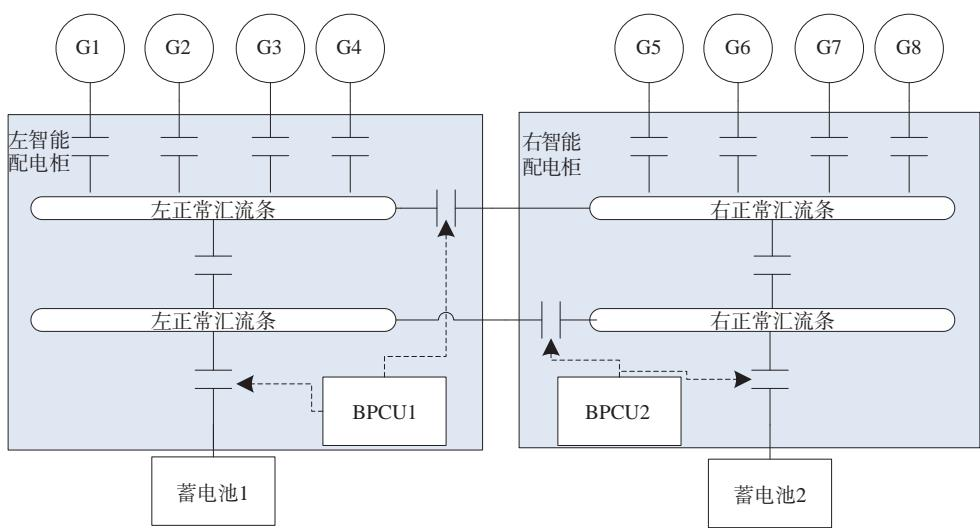
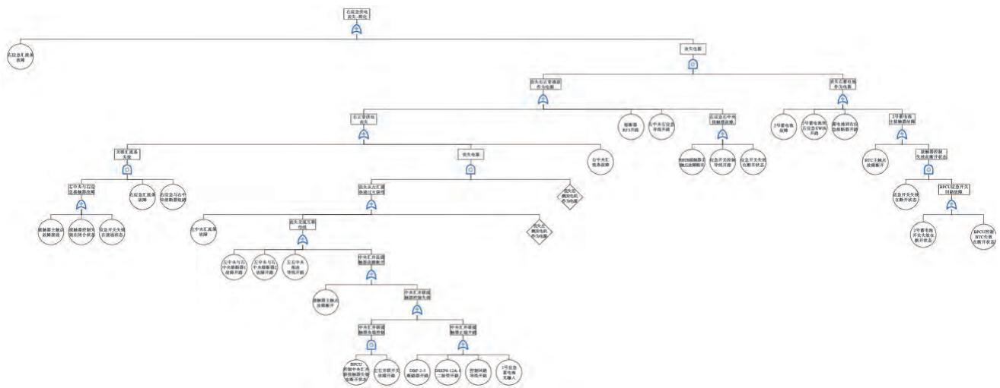

# 配电系统安全性分析技术研究

李阳阳\*姚磊周俊童(天津航空机电有限公司研发中心，天津市300308)

摘要：为了保证配电系统的安全可靠,结合SAEARP4761针对配电系统的特点对评估流程和方法作适应性改进,包括功能危害性分析(FHA）、初步安全性分析(PSSA）、安全性分析(SSA）、共模分析(CMA)。同时提出了安全性分析与系统研制流程的融合关系，提出了配电系统安全性分析与零组件安全性分析的衔接方法，为配电系统安全性分析提供了指导。在故障树分析分配中采用了基于模型的分析方式,可减少故障树分析造成的巨大工作量,便于安全性分析在系统研发中的应用。

关键词：配电系统;安全性;故障树;共模分析中图分类号：V242. $4 ^ { + } 3$ 文献标识码：A

# 0引言

飞机配电系统是实现电能到用电设备输送、分配和控制保护的系统,它由馈电电缆、汇流条、配电板以及配电器件等组成。目前，飞机正朝着多电化和全电化的方向发展,机载电气电子设备的数量急剧增加，飞机供配电系统正变得日趋庞大和复杂，飞机供配电系统的可靠运行是关系飞机飞行安全的关键因素[1-3]。在飞机配电网络的设计阶段,需要对供配电系统进行可靠性分析和预测,寻找系统设计中的薄弱环节,优化供配电系统的设计方案，从而大幅降低后期出现问题时因更改设计而产生的时间和金钱成本。因此，开展对大型飞机供配电系统安全性评估的研究非常重要。

经过长期发展,美国已形成了针对民用运输飞机的系统安全性设计、分析预评估的理论体系。该体系由功能危害性分析(functional hazard analysis,FHA）、初步系统安全性分析（preliminary systemsafetyassessment,PSSA）、系统安全性分析（systemsafetyassessment，SSA）以及共因分析（commoncause analysis,CCA)四大部分组成,形成了完整的指导文件体系，如 SAE ARP4761、SAE ARP4754、DO-178B、D0-254等[4-5]。国内多采用故障树分析法(faulttreeanalysis,FTA)对飞机配电系统进行安全性评估[6-8]。但是国内外关于飞机配电系统安全性分析技术研究的公开发表文献较少，无法有效指导配电系统进行安全性分析。

当配电网络比较庞大和复杂时，传统的安全性分析方法是采用故障树分析法对网络系统进行建模和分析。然而,这种方法工作量较大,需要根据网络系统的具体特点进行针对性的分析方法研究。系统的复杂性导致了分析工作的繁重，进而使得安全性评估的进度滞后于系统研发的进度[9]。

文献［10]将一种基于Petri网的故障树分析法运用于飞机配电系统的可靠性分析中，这种方法有效地简化了传统飞机配电系统可靠性分析方法的复杂性，减少了计算量，从而弥补了传统故障树分析法的不足。近年来，欧洲和美国兴起了一种基于模型的形式化安全性分析和评估方法，这种方法旨在提高安全性分析的效率,减少误差，其一大优势就是能对目标系统进行自动化分析和结果生成[11]。然而，由于其算法的复杂性,这种方法在实际工程应用中并不适用。

因此,本文结合SAEARP4761标准,针对配电系统的特点对评估流程和方法作适应性改进，为配电系统安全性分析提供了指导。同时，该方法采用故障树模型的方式，可减少传统故障树分析造成的巨大工作量,便于安全性分析在系统研发中的应用。

# 1功能危害性分析

根据电源系统的功能清单，分析配电系统的功能，经分析与配电系统相关的飞机级功能主要为：提供电源、提供电源状态信息、告警信息等,根据飞机级功能分解为配电系统功能清单，如表1所示。

表1配电系统功能清单(以提供电源为例)  

<table><tr><td>序号</td><td>相关飞机级功能要求功能编号</td><td></td><td>配电系统功能</td><td>功能描述</td></tr><tr><td>1</td><td rowspan="4"></td><td>F-24-07</td><td>一次直流配电</td><td>向全机直流用电设备提供合适的电能</td></tr><tr><td>2</td><td>F-24-08</td><td>一次交流配电</td><td>向全机交流用电设备提供合适的电能</td></tr><tr><td>3</td><td>F-24-09</td><td>应急直流供电</td><td>对蓄电池及用电负载进行过流保护、超温警示</td></tr><tr><td>4</td><td>F-24-10</td><td>交流外电源供电</td><td>对外部电源提供电接口 针对交流外部电源,应具有过压、电压、过频、欠频和反相序保护</td></tr><tr><td>5</td><td></td><td>F-24-11</td><td>直流外电源供电</td><td>对外部电源提供电接口 针对直流外部电源,应具有过压、欠压和反极性保护</td></tr></table>

根据飞机级分配的安全性指标、配电系统的基本架构，考虑飞机和电源系统各种可预期的环境条件和运行条件，同时考虑了功能失效的形式,包括全部丧失、部分丧失、功能失调等，最终确定了配电系统的失效状态清单，表2为部分示例。通过FHA分析共识别出灾难级失效状态4项、危险级功能故障7项、较大的失效状态13项、较小的功能故障2项。

表2配电系统失效状态示例  

<table><tr><td>功能及 编号</td><td>失效状态</td><td>飞行 阶段</td><td>失效状态 编号</td><td>失效状态对其他系 统的影响</td><td>失效状态对飞机、 机组及乘客的影响</td><td>影响 等级</td><td>支撑材料</td><td>验证方法</td></tr><tr><td>F-24-07左正常通 流配电电失效</td><td>一次直 道直流供 T/F/L FC-24-07-A1</td><td></td><td></td><td>机上部分重要和正作,显著地降低飞机运 常直流、部分交流 行能力或安全裕度 用电系统和设备无 b)显著地增加机组工 法工作</td><td>a)部分用电设备不工 作负担 c）无</td><td>Ⅲ工程经验</td><td></td><td>失效模式及影响 分析(failure mode and effects analysis , FMEA)</td></tr><tr><td>F-24-07 一次直 流配电</td><td>左应急通道 和右正常通 道直流供电 丧失</td><td></td><td></td><td>机上部分重要直流 T/F/L FC-24-07-A6用电系统和设备无 法工作</td><td>a)机上部分重要直流 用电设备不工作,极大 降低飞机运行能力或 安全裕度 b)极大地增加机组工 作负担和心理压力 c)个别乘员受到严重</td><td>1</td><td>工程经验</td><td>FTA FMEA FTA</td></tr></table>

# 2初步系统安全性分析

在系统研制过程中，将安全性需求纳入系统需求的范畴，随后进行系统架构设计。系统的初步架构设计(图1)完成后，紧接着进行初步的系统安全性分析。这一流程确保了安全性需求从项目初期就被纳入考量，并贯穿整个系统设计和开发过程。

对FHA分析中识别出的安全性需求进行分析后,需开展配电系统安全性设计/架构决策。以“左应急通道和右正常通道直流供电丧失"为例阐述架构决策过程如下：

  
图1系统初步架构图

1)左应急通道和右正常通道直流供电丧失会导致部分关键设备失电，影响等级为灾难级（I）。

2)左应急通道和右正常通道直流供电丧失，可能由丧失直流发电机引起,也可能由一次配电系统失效引起。

3)配电系统中，由一次配电系统接收来自直流发电机及蓄电池的电功率,并分配至了左中央、左应急、右中央、右应急汇流条，左应急和右正常通道分别位于左智能配电柜、右智能配电柜2个配电盘中，互相之间独立安装,并且汇流条间均设有接触器及熔断器，防止单个汇流条的故障蔓延至多个供电通道。

4)左右智能配电柜汇流条间接触器受驾驶舱控制板开关的控制,左右智能配电柜的一次配电系统由两台BPCU进行控制。控制开关是简单硬件设备,汇流条电源控制组件（bus power control unit,BPCU)基于软件和复杂硬件实现。将BPCU的设计保证等级(design assurance level,DAL)分配为B,将“控制开关"的DAL分配为B,实际中开关作为简单硬件按照DALA开发。

# 2.1失效状态评定

选取配电系统的失效状态清单中定义失效状态作为顶事件。以SAEARP4761为指南，采用了基于模型的故障树分析方法，本文以“左正常供电丧失"为例创建了如图2所示的故障树。故障树分析中应用的源数据，主要来源于配电系统故障模式库。经分析能够满足FHA中确定的安全性指标要求。计算I、Ⅱ类失效状态的一阶最小割集,识别是否有单点故障。若有单点故障,通过改进设计将该故障消除。以左应急通道和右正常通道直流供电丧失为例，该故障树无I阶最小割集，故无单点故障。

# 2.2组件级安全性指标确定

根据PSSA故障树，对零组件安全性指标进行分配,分配的过程如下：

1)将顶事件故障率设置为FHA中的要求值，分配值为 $1 { \times } 1 0 ^ { - 5 } / \mathrm { F H }$ ,故障率分配采用模型的故障率分配功能。故障率采用平均分配的方式，若实际故障率不满足要求,需重新分配,可把特定事件的故障率设置为固定分配值，重新分配。经迭代，分配概率均小于发生概率。故障率必须达到故障树分析中规定的故障率，任何不能满足给定值的事件必须得到系统设计的支持。

2)对于I、Ⅱ阶最小割集、隐蔽故障(如应急转换开关故障、左右并联开关故障)应重点关注。隐蔽故障需要对安全性维护需求提出要求。

经分配得出的零组件安全性指标见表3。

根据上述对组件的功能及故障树分析，确定配电系统组件(软/硬件)的项目研制保证等级(itemdevelopment assurance level,IDAL)见表4。

# 3共模分析

共因分析包括共模分析（common mode analy-sis,CMA）、区域安全分析(zonal safety analysis,ZSA）

  
图2“左正常供电丧失"故障树

表3零组件安全性指标  

<table><tr><td>序号</td><td>组件名称</td><td>节点名称</td><td>每小时故障率入</td><td>暴露时间t/h</td><td>来源</td></tr><tr><td>1</td><td>配电柜</td><td>左中央汇流条故障</td><td>3.33×10-6</td><td>3</td><td>左正常供电丧失</td></tr><tr><td>2</td><td>配电柜</td><td>熔断器1故障开路</td><td>3.75×10-6</td><td>3</td><td>左正常供电丧失</td></tr><tr><td>3</td><td>BPCU</td><td>BPCU控制连接接触器失效在断开状态</td><td>0. 012 161</td><td>3</td><td>左正常供电丧失</td></tr></table>

表4配电系统软件和复杂硬件IDAL  

<table><tr><td>序号</td><td>设备名称</td><td>设备数量</td><td></td><td></td><td>软件DAL（DO-178B）硬件DAL（DO-254B）合同签订等级是否满足要求</td></tr><tr><td>1</td><td>BPCU</td><td>2</td><td>B</td><td>B</td><td>是</td></tr></table>

和特定风险分析（particular risksanalysis，PRA）。ZSA关注系统间的相互影响，PRA评估外部威胁对飞行安全性的影响，对于配电系统,ZSA分析和PRA分析不适用，故只需进行CMA分析。

根据通用CMA检查单模板，结合配电系统的实际设计，确定了适用于配电系统的共模分析检查单。

基于配电系统FHA和PSSA，得出配电系统的独立性需求共6项。针对每项独立性需求按照共模分析检查单进行检查，经分析所有独立性需求均能得到满足。表5为以"左通道与右通道应相互独立”为例的共模分析方法。

# 4系统安全性分析

# 4.1零组件FMEA分析

各零组件设计完成后，需对各零组件进行FMEA分析。通过FMEA分析,进一步识别是否具有导致配电系统I、Ⅱ类功能失效的故障模式。若有,则需要设计改进。

在目前的研制过程中，存在着零组件FMEA中严酷度定义不明确、零组件故障模式无法支撑上层系统安全性分析的问题。

零组件FMEA中严酷度等级为I类的通常为产品失效，严酷度等级为Ⅱ类的通常定义为重要功能失效,但重要功能的定义并不明确。通过从系统级到零组件的安全性分析得出，零组件FMEA中严酷度等级应与系统安全性分析协调一致，应根据系统功能的安全性等级，确认分配下来的功能的安全性等级,进而确定失效模式的严酷度等级。

零组件的FMEA故障模式应能支撑上层系统进行安全性分析，故零组件故障模式名称应与图1的底事件相一致。目前研制中的零组件FMEA故障模式笼统，如"BPCUXX接触器控制功能失效”。而“BPCUXX接触器控制功能失效在断开状态”和“BPCUXX接触器控制功能失效在失效状态"会导致系统不同的失效模式,故零组件级的故障模式应细化为两种。

表5“左通道与右通道应相互独立"共模分析  

<table><tr><td>共模源</td><td>共模失效/差错</td><td>设计采取的防护措施</td><td>可以接受的相 关证明或更改 备注 设计的建议</td></tr><tr><td>公共外部源</td><td>公共外部源 （发电机驱动）（发电机驱动)失效</td><td>电源系统中共设有8台独立的直流发电机(分别由1、2、3、4个 发动机驱动)及2台蓄电池。因此,任一公共外部源(发电机、 发动机）、蓄电池的失效不会导致多个供电通道失效</td><td>可以接受</td></tr><tr><td>公共外部源 (通风)</td><td>公共外部源 (通风)失效</td><td>左直流供电通道主要包括LDP(leftdistribution panel)（集成有左 中央汇流条、左应急汇流条、接触器等部件)、LBPCU、左蓄电池等 设备及相关EWIS部件;右直流供电通道主要包括RDP(right distribution panel)（集成有右中央汇流条、右应急汇流条、接触器 等部件）、RBPCU、右蓄电池、飞控蓄电池等设备及相关EWIS部件。 电源系统不同供电通道的设备安装于不同的区域，不会因单个区 域通风系统的失效而导致多个供电通道同时失效</td><td>可以接受</td></tr></table>

通过FMEA分析，确定了零组件各故障模式的失效率，识别了系统PSSA分析中未识别出的故障模式,并进行了迭代。

同时,经分析本系统中的配电柜、BPCU均无导致配电系统I、Ⅱ类功能失效的故障模式，无需进行设计改进。

# 4.2零组件FTA分析

对各零组件进行FTA分析，评估零组件是否满足分配的FTA指标，同时得出PSSA中各底事件的

失效率。

在PSSA底事件中，有些为零组件航线可更换部件(line replaceable unit,LRU)级的故障模式,通过零组件FMEA分析便可得出失效率。有些底事件为FMEA中LRU级故障模式的逻辑组合,需要运用故障树的方法进行运算，采用2.1节中的基于模型的故障树分析方法，其底层数据为FMEA各故障模式的失效率。

若不满足，则需进行设计改进，通常采用的设计改进方法有余度设计、降额设计、提升元器件等级等。

经计算各零组件能够满足PSSA中分配的失效率要求，如表6所示，无需进行设计改进。

表6零组件FTA分析  

<table><tr><td>序号</td><td>组件名称</td><td>节点名称</td><td>每小时故障率入</td></tr><tr><td>1</td><td>配电柜</td><td>左中央汇流条故障</td><td>1. 1×10-7</td></tr><tr><td>2</td><td>配电柜</td><td>熔断器1故障开路</td><td>6.09x10-7</td></tr><tr><td>3</td><td>BPCU</td><td>BPCU控制连接接触器失效在断开状态</td><td>3.152x10-6</td></tr><tr><td colspan="2"></td><td></td><td></td></tr></table>

# 4.3系统安全性分析

对系统安全性进行重新评估，评估过程与第3章相似。故障树分析中应用的源数据为4.2节计算的数据。经分析，配电系统能够满足安全性要求。以左应急通道和右正常通道直流供电丧失为例,经计算其概率小于 $1 \times 1 0 ^ { - 9 }$ ,满足I类故障的失效率要求。

特点对安全性评估流程和方法作了适应性改进，包括FHA分析、PSSA分析、SSA分析以及系统安全性分析与零组件安全性分析的衔接方法,为配电系统安全性分析提供了指导。同时该方法采用故障树模型的方式，可减少故障树分析造成的巨大工作量，便于安全性分析在系统研发中的应用。

# 5结论

本文结合SAEARP4761标准,针对配电系统的

# 参考文献：

［1］蔡林,张玲,杨善水,等.大型飞机供配电系统可靠性评估与分析[J].航空学报，2011,32(8):1488-1496.

［2］秦海鸿，严仰光.多电飞机的电气系统[M].北京：北京航空航天大学出版社，2016.  
［3」郭博智，王敏芹,阮宏泽.民用飞机安全性丛书 民用飞机安全性设计与验证技术[M].北京：航空工业出版社，2015.  
[4] ARP4754B.Guidelines for Development of Civil Aircraftand Systems．SAE International，Dec.2O23.URL:https://www.sae.org/standards/content/arp4754b/.  
[5] ARP4761A.Guidelines for Conducting the Safety Assess-ment Process on Civil Aircraft. Systems，and Equipment.SAE International，Dec.2023.URL：https://www.sae.org/standards/content/arp4761a/.  
［6］周素莹.多电飞机电气系统的研究[D].西安：西北工业大学,2003.  
［7］李彦锋.复杂系统动态故障树分析的新方法及其应用研究[D].成都：电子科技大学,2013.  
［8］张国防.计入导线故障的民机安全性定量分析方法研究[J].航空工程进展，2012,3(2):241-246.  
［9］王豪,高亚奎,戌永灵,等.基于功能模型的飞控系统安全性设计技术研究[J].测控技术，2017,36(5)：77-81.  
[10] 于开民,孙时珍,张树团，等.一种基于Petri网的飞机配电系统可靠性分析方法[J].电子设计工程，2010,18(10):133-135.  
[11] 董力.基于模型的飞行控制系统安全性分析方法研究[D].南京：南京航空航天大学,2020.

# 作者简介

李阳阳女，硕士，高级工程师。主要研究方向：飞机配电系统及产品设计。E-mail:whyyzfn@163.com  
姚磊男，硕士，研究员。主要研究方向：飞机配电系统及产品设计。E-mail:yaolei1056@126.com  
周俊童女,硕士,工程师。主要研究方向：飞机配电系统及产品设计。E-mail:z_j_tong@126.com

# Research on safety design technology for power distribution system

LI Yangyang”YAO Lei ZHOU Juntong

(R&D Department of Tianjin Aviation Electro-Mechanical Co.,Ltd.,Tianjin,300308,China)

Abstract: This paper adapts and improves the safety asessment process and methods in accordance with the characteristics of the power distribution system，based on SAE ARP4761，including functional hazard analysis (FHA)，preliminary safety analysis (PSSA），safety analysis (SSA），common mode analysis (CMA). The integration relationship between safety analysis and system development process is also proposed.The connecting method of power distribution system safety analysis and component safety analysis is then proposed.All provide guidance fordistributionsystemsafetyanalysis.Model-based analysis is adopted infault tree analysis and allocation，which can reduce the huge workload caused byfault tree analysis andfacilitate the application of safety analysis in system development.

Keywords:power distribution system ;safety ;fault tree;common mode analysis