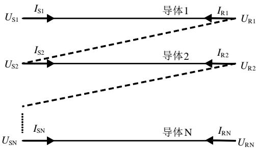
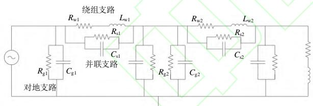
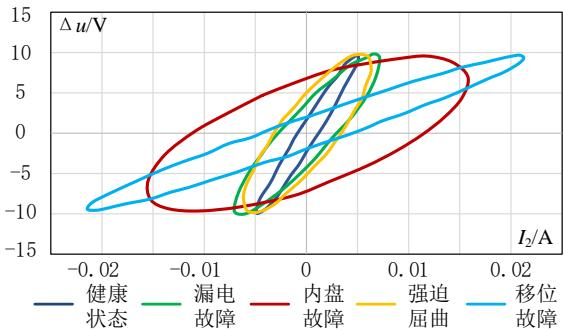
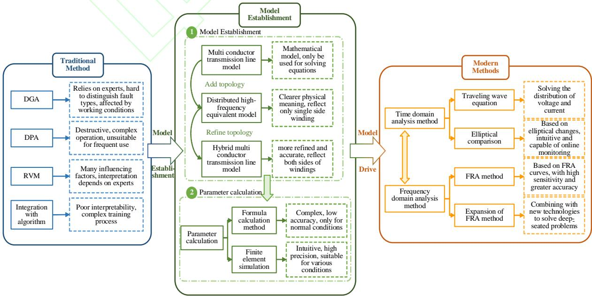

# 《电网技术》网络首发论文

题目：  
作者：  
收稿日期：  
网络首发日期：  
引用格式：电力变压器绝缘状态检测与评估方法研究综述  
盛万兴，陈洁，郑格，宋晓辉，古凌云，李律枢  
2025-03-03  
2025-12-26  
盛万兴，陈洁，郑格，宋晓辉，古凌云，李律枢．电力变压器绝缘状态检测与评估方法研究综述[J/OL]．电网技术.  
https://link.cnki.net/urlid/11.2410.tm.20251225.0919.002

网络首发：在编辑部工作流程中，稿件从录用到出版要经历录用定稿、排版定稿、整期汇编定稿等阶段。录用定稿指内容已经确定，且通过同行评议、主编终审同意刊用的稿件。排版定稿指录用定稿按照期刊特定版式（包括网络呈现版式）排版后的稿件，可暂不确定出版年、卷、期和页码。整期汇编定稿指出版年、卷、期、页码均已确定的印刷或数字出版的整期汇编稿件。录用定稿网络首发稿件内容必须符合《出版管理条例》和《期刊出版管理规定》的有关规定；学术研究成果具有创新性、科学性和先进性，符合编辑部对刊文的录用要求，不存在学术不端行为及其他侵权行为；稿件内容应基本符合国家有关书刊编辑、出版的技术标准，正确使用和统一规范语言文字、符号、数字、外文字母、法定计量单位及地图标注等。为确保录用定稿网络首发的严肃性，录用定稿一经发布，不得修改论文题目、作者、机构名称和学术内容，只可基于编辑规范进行少量文字的修改。

出版确认：纸质期刊编辑部通过与《中国学术期刊（光盘版）》电子杂志社有限公司签约，在《中国学术期刊（网络版）》出版传播平台上创办与纸质期刊内容一致的网络版，以单篇或整期出版形式，在印刷出版之前刊发论文的录用定稿、排版定稿、整期汇编定稿。因为《中国学术期刊（网络版）》是国家新闻出版广电总局批准的网络连续型出版物（ISSN 2096-4188，CN 11-6037/Z），所以签约期刊的网络版上网络首发论文视为正式出版。

# 电力变压器绝缘状态检测与评估方法研究综述

盛万兴，陈洁，郑格，宋晓辉，古凌云，李律枢（中国电力科学研究院有限公司，北京市 海淀区 100192）

Overview of insulation state detection and evaluation methods for power transformers

SHENG Wanxing, CHEN Jie, ZHENG Ge, SONG Xiaohui, GU Lingyun, LI Lüshu (China Electric Power Research Institute, Haidian District, Beijing 100192, China)

ABSTRACT: Transformers are critical components in the power system, and due to the complexity of their working environment, their insulation status will gradually age during operation, which may lead to faults in the transformer and power system. Therefore, timely insulation status detection and evaluation of transformers is essential. Firstly, the traditional methods widely used in transformer insulation state detection and evaluation are introduced, with their principles, operations, influencing factors, and integration with modern algorithms. Secondly, in response to the shortcomings of traditional methods, a method based on establishing transformer equivalent model is introduced. The process of establishing three commonly used equivalent models of transformers is detailed, and two model parameter calculation methods based on formula calculation and finite element simulation calculation are elaborated. Subsequently, the applications of each transformer model are elaborated, namely the modern transformer insulation state detection and evaluation method, which comprehensively covers technologies in both time and frequency domains. Compared with traditional methods, modern methods are based on the transformer models, which offer clearer physical interpretation and enable quantitative evaluation of insulation status and aging processes, providing significant advantages in defect identification and localization. Finally, the limitations of existing methods are summarized, and prospects for proposing more advanced and comprehensive transformer insulation state detection and evaluation technologies are presented.

KEY WORDS: distribution transformer；insulation testing； time-frequency domain analysis；condition monitoring

摘要：变压器是电力系统中的核心设备之一，而由于变压器工作环境的复杂性，在运行过程中其绝缘状态会逐渐老化，这可能会导致变压器乃至电力系统发生故障。因此，及时对变压器进行绝缘状态检测评估，是确保电力系统安全可靠运行的关键。首先，介绍了当前广泛应用于变压器绝缘状态检测评估领域的传统方法，概述了每种方法的原理、操作、影响因素和与现代算法的融合情况。其次，针对传统方法的缺陷，引出了基于建立变压器等效模型的绝缘状态检测方法，详细介绍了常用的 3 类变压器等效模型的建立过程，并阐述了基于公式计算和有限元仿真计算的两种模型参数计算方法。随后，针对 3 种变压器等效模型分别阐述了其具体应用，即现代变压器绝缘状态检测和评估方法，全面涵盖了时域和频域上的技术。相较于传统方法，现代方法基于变压器等效模型构建，具备更明确的物理意义，可量化表征变压器各部位的绝缘状态及其老化的演化过程，并对解决绝缘缺陷的对应和定位等关键问题具有突出优势。最后，对现有方法存在的局限性进行了总结，对提出更先进、更全面的变压器绝缘状态检测和评估技术进行了展望。

关键词：配电变压器；绝缘检测；时频域分析；状态评估

# 0 引言

随着国家经济社会的不断发展，工业生产和人民生活对于电力的需求都急剧增加，电网的建设规模和复杂程度也在逐步增大[1-2]。这一趋势在保障电网稳定运行方面带来了诸多新的挑战。根据国家电网公司调查显示[3]，近年来电力设备故障所导致的电网故障数占电网总故障数的平均比例高达$4 1 . 8 \%$ 。这说明由于设备故障风险显著提高，电网中各类设备的运行状态对整个电力系统的安全和可靠性的影响显著增强。

在众多电力设备中，变压器作为电力系统的核心设备之一，其作用尤为关键。变压器的主要功能是将电压转换到合适水平以满足电力传输和分配的需求。它不仅在输电过程中承担着电压转换的任务，还在电网的不同电压等级之间起到桥梁作用，确保电能能够高效、安全地从发电厂传输到终端用户。因此，变压器的稳定运行直接关系到电网的整体安全和供电的可靠性[4-5]。

然而，随着电网的不断扩展和复杂化，变压器面临的运行环境也日益复杂，故障风险随之增加。变压器内部的绝缘系统，包括绝缘油和绝缘纸，在长期运行过程中，可能受到电、热、机械和化学等多种因素的影响，逐渐发生老化[6-7]。这些老化现象会导致变压器的绝缘强度降低，最终可能引发绝缘故障，甚至导致变压器损坏，从而对电网的正常运行造成严重影响。据不完全统计[8]，国家电网公司系统内曾在一年中发生 $1 1 0 \ \mathrm { k V }$ 及以上电压等级变压器损坏事故53台次，事故容量达 $4 2 2 1 . 5 \mathrm { M V A }$ 。其中变压器绕组、主绝缘及引线等是主要损坏部位。由此可见，加强对变压器绝缘状态的监测和评估尤为必要，通过对变压器绝缘状态的定期评估，可以及早发现潜在的绝缘问题，有针对性地采取预防性维护措施，从而避免故障的发生。

本文将首先总结目前常用的变压器绝缘状态检测评估的传统方法，包括传统方法的原理、操作、影响因素和与现代算法的结合等等。其次，针对传统方法存在的缺陷，本文将着重分析基于建立变压器等效模型的绝缘状态检测方法，详细阐述建立 3类变压器模型的过程和模型参数计算方法。随后，本文将对基于3类变压器模型的现代变压器绝缘状态检测评估方法进行综述，包括时域方法、频域方法和重点问题的分析，例如绝缘缺陷的对应和定位。最后，本文将总结展望今后研究中需要重点关注的问题并提出解决建议和思路，以期为电力变压器绝缘状态检测和评估提供有力支持。

# 1 传统方法

# 1.1 溶解气体分析法

溶解气体分析法是一种广泛应用于电力行业的故障诊断技术。其原理是利用气相色谱法检测变压器油中溶解的各种气体的种类和浓度，从而评估变压器内部的工作状况和潜在故障[9-11]。变压器在运行过程中，由于电气或热故障，绝缘油和固体绝缘材料会分解产生各种气体，如氢气(H₂)、甲烷(CH₄)、乙烷(C₂H₆)、乙烯 $\mathrm { ( C _ { 2 } H _ { 4 } ) }$ 、乙炔 $( \mathrm { C } _ { 2 } \mathrm { H } _ { 2 } )$ 、一氧化碳(CO)和二氧化碳 $\left( \mathbf { C O } _ { 2 } \right)$ 等等。不同的故障类型会产生不同种类和比例的气体，通过检测这些气体的组成和浓度，可以判断变压器内部是否存在故障以及故障的性质。

气体含量的表示方法主要包括 Doernenburg 比值法、Rogers 比值法和 Duval 三角法[12]。这 3 种方法均涉及对气体含量进行比较，得到不同的比值，如式(1)所示。

比值1=（CH）， ，比值 $2 { = } \frac { c ( \mathbf { C } _ { 2 } \mathbf { H } _ { _ { 2 } } ) } { c ( \mathbf { C } _ { 2 } \mathbf { H } _ { _ { 4 } } ) }$ 比值 $3 { = } \frac { c ( \mathbf { C } _ { 2 } \mathbf { H } _ { 2 } ) } { c ( \mathbf { C } \mathbf { H } _ { 4 } ) }$ ，比值 $4 { = } \frac { c ( \mathbf { C } _ { 2 } \mathbf { H } _ { 6 } ) } { c ( \mathbf { C } _ { 2 } \mathbf { H } _ { 2 } ) }$ ，比值5=c（CH）

Doernenburg 比值法主要利用比值 1、2、3 和 4；Rogers 比值法则主要利用比值 1、2 和 5。在采集出油样，通过油色谱检测分析仪测量气体含量并计算比值后，根据行业标准即可判断故障类型和严重程度。然而，Duval[13]认为变压器的故障类型繁多，无法通过单一规范完全诊断。为解决这一问题，他们提出了气体含量的变化与对应故障的三角形分布关系。在后续研究中，Duval 对模型进行了完善和补充，提出了五边形模型[14-15]，该模型能够更准确地对应故障关系，如图 1 所示。

  
图 1 Duval 五边形评估标准示意图Fig. Schematic diagram of Duval pentagon evaluationcriteria

溶解气体分析法的优势在于：一方面，该方法可以在故障早期阶段发现问题，防止故障进一步扩大，避免变压器的重大损坏。另一方面，在采集油样时不需要停机，不会影响变压器的正常运行。但在实际案例中，可能存在气体浓度低于使用该方法的临界值、比值法无法对应到某一故障类型的问题，且整体正确率一般在 $8 0 \%$ 左右[16]。

# 1.2 聚合度分析法

变压器的绝缘纸主要由纤维素组成，纤维素分子的聚合度(degree of polymerization, DP)表示分子链中葡萄糖单元的数量。变压器在长期运行过程中，由于热、氧化和湿气等因素的作用，绝缘纸会逐渐老化，导致纤维素分子链断裂，聚合度下降。通过测定绝缘纸的聚合度，可以评估其老化程度和剩余使用寿命[17-18]。国家标准和国际电工委员会规定了基于粘度法的测量聚合度的标准方法。但是，该方法面临必须停电取样、难以采集到典型纸样和对绝缘造成破坏等弊端[19]。R. M. Morais 等人[20]认为油中的水含量和溶解一氧化碳含量与 DP 值之间存在强相关关系。因此，通过测量水含量和溶解一氧化碳含量，并根据所得曲线确定相应的 DP值，这使得在变压器运行中进行取样测试成为可能。纸张的初始 DP 值通常在 1000-1300 之间，在使用过程中会慢慢下降，一般以 DP 值下降至 200-250 作为绝缘寿命结束的标准[12]。

A. M. Emsely 等人[21]认为 DP 值还可用于预测绝缘寿命，并给出了具体的表达式，如式(2)所示。

$$
\frac { 1 } { c _ { \mathrm { D P } } ( t ) } - \frac { 1 } { c _ { \mathrm { D P } } ( 0 ) } = k t
$$

式中： $c _ { \mathrm { { D P } } } ( t )$ 表示 $t$ 时刻的 DP 值； $c _ { \mathrm { { D P } } } ( 0 )$ 表示初始时刻的 DP 值； $k$ 是一个常数。后来，他们对模型进行了改进，提出了二阶动力学模型，如式(3)所示，其中 $k _ { 1 0 }$ 和 $k _ { 2 }$ 均为常数。由此计算得出油纸绝缘寿命的表达式如式(4)所示，其中： $L$ 表示油纸绝缘的寿命； $c _ { \mathrm { D P } }$ 表示寿命终止时对应的 DP 值[22]。

$$
\frac { 1 } { c _ { \mathrm { { D P } } } ( t ) } - \frac { 1 } { c _ { \mathrm { { D P } } } ( 0 ) } = \frac { k _ { 1 0 } } { k _ { 2 } } \big ( 1 - \mathrm { e } ^ { - k _ { 2 } t } \big )
$$

$$
L = - \frac { 1 } { k _ { 2 } } \ln \left[ 1 - \frac { k _ { 2 } } { k _ { 1 0 } } \left( \frac { 1 } { c _ { \scriptscriptstyle \mathrm { D P } } ( \mathrm { e n d } ) } - \frac { 1 } { c _ { \scriptscriptstyle \mathrm { D P } } ( 0 ) } \right) \right]
$$

为了解决纤维素在简单的有机溶剂中难以溶解的问题，可以对绝缘纸的纤维素成分进行改造，以提高其溶解度。其中，凝胶渗透色谱法(gelpermeation chromatography, GPC)是最常用的方法[12-23]。通过使变压器绝缘纸在特定条件下发生化学反应，收集产物并进行提纯和滴定，对比色谱图可以观察到老化的绝缘纸纤维素组分的变化情况，从而推测出绝缘材料的状态。一般而言，由于绝缘材料老化过程中分子量的微小变化都可以在色谱图中观察到，因此 GPC 可以更详细地分析纤维素老化过程中的变化，为更复杂的退化模型提供基础。

除了对纤维素本身进行分析，还可以对纤维素的降解产物进行分析。糠醛类有机物是纤维素绝缘纸主要的降解产物，糠醛分析提供了一种比在绝缘纸上直接测量更为方便的分析方法[24-25]。姜飞宇等人[26]对新疆地区的变压器进行了测试分析，利用红外光谱对变压器油中糠醛的甲醇萃取液进行检测，发现该方法糠醛甲醇溶液的标准曲线与吸光度的线性相关性可以达到 0.999，可以作为一种检测变压器油中糠醛的手段。D. H. Shroff 等人[27]通过加速老化实验总结了纤维素绝缘纸降解形成 2-糠醛的情况。他们发现油中 2-糠醛的浓度 $F$ 与纸中纤维素的聚合度 $c _ { \mathrm { { D P } } } ( t )$ 之间存在近似对数关系，如式(5)所示。在电力标准 DL/T 596—2005 和 $\mathrm { D L / T 9 8 4 - }$ 2018 中规定了基于油中糠醛含量的油纸绝缘老化程度的评判依据[28-29]，认为糠醛含量大于 $4 \ \mathrm { m g / L }$ 标志着绝缘纸已严重老化，须引起重视。

$$
\log \left( F \right) = 1 . 5 1 - 0 . 0 0 3 5 \cdot c _ { \mathrm { D P } } ( t )
$$

# 1.3 回复电压法

变压器的绝缘系统主要包括绝缘油和绝缘纸，这些材料具有极化特性。当对变压器绕组施加直流电压时，绝缘材料内部的电偶极子会发生极化。切断电压后，这些电偶极子会逐渐恢复原状，产生回复电压。通过测量和分析这段时间内的回复电压曲线，可以反映出绝缘材料的极化和去极化过程，从而判断绝缘的健康状况[30-31]，其测试结果如图 2所示。回复电压法实验关注的参数包括回复电压最大值 $U _ { \mathrm { m a x } }$ 、初始斜率 $S$ 和中心时间常数 $t _ { \mathrm { c d o m } }$ 。主要步骤是固定充放电时间比 $T _ { \mathrm { d } } / T _ { \mathrm { e } }$ ，改变充电时间 $T _ { c }$ ，记录极化去极化电流和回复电压曲线。通常情况下认为，主时间常数 $t _ { \mathrm { c d o m } }$ 越大，初斜率 $S$ 越小，绝缘状态越好。

  
图 2 回复电压法测试结果图  
Fig. 2 Test result of the recovery voltage method

回复电压法需断电实验，且测量结果易受温度、水分等因素的影响，近年来国内外学者对不同因素的影响机理和作用进行了全方位研究[22]。

1）水分的影响。

Osvath 等人[32]研究了大量使用时长差别很大的变压器，指出中心时间常数 $t _ { \mathrm { c d o m } }$ 越小，变压器的状况越恶劣。徐维宗等人[33]通过试验发现，随着油纸绝缘含水量增加和运行年限增长，回复电压极化谱曲线峰向左移动，即主时间常数减小。T. K. Saha等[34]引入专家系统，通过试验发现纸中水分含量与中心时间常数 $t _ { \mathrm { c d o m } }$ 的对数值有较好的线性关系。

2）温度的影响。

变压器油箱内温度是测量回电压的一个敏感参数。Gafver 等人[35]由实验得出当温度升高时，回复电压曲线在越来越短的时间内达到峰值。Y. C.Kuang[36]对不同温度下的绝缘试品进行测量，发现温度越高，回复电压峰值 $U _ { \mathrm { m a x } }$ 越小。

3）绝缘结构的影响。

文献[37]指出，绝缘结构的变化会导致 Debye模型中的绝缘电阻和绝缘电容的变化，随着绝缘电阻的增加，回复电压最大值 $U _ { \mathrm { m a x } }$ 呈二次函数增大、中心时间常数 $t _ { \mathrm { c d o m } }$ 呈对数增大、初始斜率 $S$ 并不变化；随着几何电容的增大，回复电压最大值 $U _ { \mathrm { m a x } }$ 、中心时间常数 $t _ { \mathrm { c d o m } }$ 保持不变，初始斜率 S 呈对数减少的趋势。

# 1.4 传统方法与现代算法的结合

实验结果表明，在变压器发生故障前，无论是油中溶解气体含量、纤维素聚合度和含水量等理化指标，还是介电常数和损耗因数等电气指标，均会随时间的推移呈现出有规律的变化[38-43]。因此，目前对于变压器故障预测技术的研究主要集中在利用变压器试验的结果，通过使用现代算法对电力变压器各项试验的历史数据进行分析和预测，及时了解电力变压器故障发展的态势，这是正确识别变压器潜在故障的前提，也是进行变压器故障预测技术的关键。其中，常用的预测算法包括支持向量机算法(support vector machine, SVM)、遗传算法(geneticalgorithm, GA)和神经网络算法 (neural networks,NN)等等。例如，熊浩等人[44]提出了一种改进的聚类算法，根据实测油色谱数据将广州抽水蓄能电厂2 号变压器和兰州西固热电厂 2 号主变正确归类到高能放电和高温过热类故障。汪可等人[45]针对 118组 IEC TC10数据和 117组国家电网公司收集的变压器故障数据，将众多气体含量的比值代入支持向量机模型中，比较了使用不同比值进行预测的结果，从而选出了最可靠的指标，使故障诊断的正确率达到 $8 7 . 1 8 \%$ 。邹阳等人[46]将回复电压法与灰色关联分析和聚类云模型相结合，对 10 台运行年数为 5-26 年的变压器进行评估，评估结果与以糠醛含量为指标的结果完全相符，且能根据综合评分细化同一状态等级内的差异性。这些研究为电力变压器故障预测提供了多样化的思路和方法。

# 2 变压器等效模型建立

上述传统的绝缘状态检测评估方法各有优势和劣势，具体总结如表 1 所示。然而，传统方法普遍缺乏明确的物理意义，无法表征出变压器各部分的绝缘情况，难以适应当前电网复杂化建设对于变压器运行状态精确把控的需求[47]。近年来，基于变压器等效模型的绝缘状态检测评估方法得到越来越广泛的应用，主要建立的模型有多导体传输线模型[48-49]、高频分布式等效模型[50-51]和混合多导体传输线模型[52-53]三类。该方法基于对变压器进行建模，通过对模型进行分析求解来获得实际变压器的绝缘情况。该方法基于的一个重要前提是等效模型中的参数与变压器的绝缘状态之间有极为重要的关系[54]，如表 2 所示。

表 2 变压器等效模型参数与绝缘状态的关系 Table 2 Relationship between equivalent model parameters of transformers and insulation state   

<table><tr><td>元件 绝缘影响</td></tr><tr><td>电感L 绕组变形，铁心变形，绕组短路，绕组盘空间变化</td></tr><tr><td>并联电容Cs 绕组盘变化，绕组变形，绝缘受潮，夹紧压力变小</td></tr><tr><td>串联电容CHL 绝缘受潮，绕组位移</td></tr><tr><td>电阻R 绕组短路，分接开关触点磨损</td></tr></table>

由于变压器绝缘状态的变化会导致对应的模型参数随之变化，因此为了检测和评估某台变压器当前的绝缘老化情况，从而做到准确预防和解决潜在的绝缘风险问题，只需计算出该台变压器相应的等效模型的参数值即可。

# 2.1 变压器多导体传输线模型

变压器的多导体传输线模型是一种用于描述变压器绕组内部和外部电磁行为的数学模型[55]。该模型基于以下3个假设[56-57]：忽略线匝弯曲的影响，忽略线饼间连线及电压源引线对电磁场分布的影响，忽略电磁波沿轴向、径向的延时效应。该模型通过将变压器的绕组展开并看作是由多根导体组成的传输线系统，从而准确模拟变压器在高频条件下的电磁特性[49]。变压器多导体传输线模型如图 3所示。

表 1 传统方法优劣势比较 Table 1 Comparison of advantages and disadvantages of traditional methods   

<table><tr><td>方法</td><td>优势</td><td>劣势</td></tr><tr><td>溶解气体分析法</td><td>能够在故障发展初期就进行检测，从而避免设备进一步 损坏；非侵入性方法，测试过程中变压器无需退出运行。</td><td>对结果的解释依赖专家经验，存在主观性；多重故障共存时，难以 区分不同故障类型；气体生成量和速率会受到负载和操作环境的影 响；与标准的对应性可能较差。</td></tr><tr><td>聚合度分析法</td><td>聚合度是评估绝缘纸老化的直接指标；与油分析（溶解 气体分析，糠醛分析）结合效果好；能实现对绝缘变化 的长期趋势评估，适合用于变压器全生命周期管理。</td><td>需要对变压器纸绝缘进行物理取样，对绝缘材料有破坏性；操作复 杂且需要专门设备，增加了检测的成本和时间；不适合频繁检测， 通常只能在特定的维护周期内进行。</td></tr><tr><td>回复电压法</td><td>能够通过极化和去极化信号区分油和纸绝缘的老化状 态，提供对油纸绝缘系统的更深入分析；检测过程不具 有破坏性。</td><td>测试结果受多种因素影响，对结果的解释需要经验丰富的专家；对 复杂多层绝缘结构的评估能力有限；需在变压器断电状态下测试。</td></tr><tr><td>与现代算法结合</td><td>提高了处理大规模数据的效率，减少了对专家的依赖， 提高了故障检测和预测的准确性。</td><td>缺乏可解释性，难以解释具体的故障原因和诊断机理；模型的训练 和调参较为复杂。</td></tr></table>

  
图 3 变压器多导体传输线模型示意图Fig. 3 Schematic diagram of transformer multi-conductortransmission line model

多导体传输线模型可以从经典的电路理论、微分形式的麦克斯韦方程和积分形式的麦克斯韦方程 3 种方式推导得到[58-59]。在建立多导体传输线模型时，需要关注的参数有传输线上每单位长度的电阻、电感，和对地的电容、电导参数，这些参数与变压器实际的绝缘情况密切相关。

# 2.2 变压器分布式高频等效模型

变压器高频分布式等效模型的原理与多导体传输线模型类似，不过其物理意义更加明确。高频分布式等效模型将变压器绕组视作一个由分布电阻、电感和电容组成的电路网络[50]。由于高频电磁波在绕组中的传播需要考虑分布效应，故传统的集中参数模型在高频下失效，而分布式模型通过引入分布参数，可以有效描述绕组中的高频电磁波传播。变压器高频分布式等效模型如图 4 所示。

  
图 4 变压器高频分布式等效模型示意图 Fig. 4 Schematic diagram of high-frequency distributed equivalent model for transformers

在变压器高频分布式等效模型建立过程中，需要关注的参数有绕组电阻、电感，匝间电容、电导和对地电容、电导参数。在实际应用中，为简化模型，有学者会选择忽略匝间和对地的电导，仅保留分布电阻、电感和电容参数[51-60]。对于该模型的求解，除了可以像多导体传输线模型一样求解其中电压、电流信号的行波方程以外，由于其本身具备电路拓扑结构，因此还可对其进行电路仿真分析。

# 2.3 变压器混合多导体传输线模型

变压器高频分布式等效模型虽然能描述变压器的部分绝缘关系，但其关注的只是变压器的一侧，并不能描述变压器高压侧和低压侧之间的联系。对此，可以将高频分布式等效模型拓展到两侧，称为变压器混合多导体传输线模型[52]。该模型的结构与变压器本身的几何结构相对应，因此模拟精度较高，研究性能较好，如图 5 所示。

  
图 5 变压器混合多导体传输线模型示意图Fig. 5 Schematic diagram of a mixed multi-conductortransmission line model for transformers

在该模型中，对地支路表示绕组与地之间的绝缘关系，并联支路表示绕组与绕组间的绝缘关系，高低压链接支路表示高压绕组与低压绕组间的绝缘关系。混合多导体传输线模型的建立与变压器的绕组结构有关。常见的绕组结构可分为连续式绕组和交叠式绕组[61]，在计算前需要根据绕组结构进行精确建模。该模型被广泛应用于对变压器进行频域的分析中，这将会在下文中具体介绍。

# 2.4 模型参数计算方法

在对模型进行分析前，需要计算上述 3 类模型中每个元件的参数，常用的方法有公式计算法和有限元仿真计算法。

# 2.4.1 公式计算法

公式计算法的原理是根据变压器的电磁场分布及能量关系来推导出参数的计算公式。在计算电阻参数 $R$ 时，需要考虑高频信号作用下的集肤效应

影响。在信号频率为 $f$ 的情况下，其计算公式如式(6)所示：

$$
R = R _ { \mathrm { 0 } } + R _ { \mathrm { s } }
$$

$$
R _ { 0 } = \frac { 1 } { d _ { 1 } d _ { 2 } \sigma }
$$

$$
R _ { \mathrm { s } } = \frac { \sqrt { f } } { 2 \sigma \delta ( d _ { 1 } + d _ { 2 } ) }
$$

式中： $R _ { 0 }$ 表示绕组的直流电阻； $R _ { \mathrm { s } }$ 表示因集肤效应而产生的电阻； $d _ { \scriptscriptstyle 1 }$ 和 $d _ { 2 }$ 分别表示导体横截面的长度和宽度； $\sigma$ 表示导体的电导率。

电感参数 $L$ 同样也受集肤效应的影响[62]，因此电感矩阵也由两部分组成的，如式(7)所示：

$$
\begin{array} { l } { { { \cal L } = { \cal L } _ { \mathrm { 0 } } + { \cal L } _ { \mathrm { s } } } } \\ { { { \cal L } _ { \mathrm { 0 } } = \displaystyle \frac { \varepsilon _ { \mathrm { r } } } { c ^ { 2 } } C ^ { - 1 } } } \\ { { { \cal L } _ { \mathrm { s } } = \displaystyle \frac { R _ { \mathrm { s } } } { 2 \pi f } } } \end{array}
$$

式中： $L _ { 0 }$ 表示低频电感； $L _ { \mathrm { s } }$ 表示因集肤效应而产生的电感； $C$ 表示电容参数值； $c$ 表示真空中的光速； $\mathcal { E } _ { \mathrm { r } }$ 表示介质的相对介电常数。

电导参数 $G$ 是根据绝缘材料的容性损耗计算的[48]，其计算公式如式(8)所示：

$$
G = 2 \pi f C \tan \delta
$$

式中： $f$ 表示工频 $5 0 \mathrm { { H z } }$ ； $C$ 表示电容的计算矩阵；tan $\delta$ 表示损耗因数[62]，绝缘纸的损耗因数 计算公式如式(9)所示：

电容参数可以根据实际情况进行简化计算[51]。例如：由于线圈半径远大于导体半径，因此绕组匝与匝之间的电容 $C _ { \mathrm { w } }$ 、盘与盘之间的电容 $C _ { \mathrm { s } }$ 可以简化为同轴圆柱体电容器计算，计算公式如式(10)、式(11)所示：

$$
C _ { \mathrm { w } } = \frac { \varepsilon _ { \mathrm { 0 } } \varepsilon _ { \mathrm { p } } \pi d _ { \mathrm { m } } a } { a _ { \mathrm { p } } } \times 1 0 ^ { - 2 }
$$

$$
C _ { \mathrm { s } } = { \frac { \varepsilon _ { \mathrm { 0 } } \varepsilon _ { \mathrm { d e } } \pi d _ { \mathrm { m } } D } { a _ { \mathrm { d } } } } \times 1 0 ^ { - 2 }
$$

式中： $\varepsilon _ { \scriptscriptstyle 0 } \setminus \varepsilon _ { \mathrm { p } } \setminus \varepsilon _ { \scriptscriptstyle \mathrm { d e } }$ 分别表示对应位置处的相对介电常数； $d _ { \mathrm { m } }$ $D$ $a$ 分别表示线圈平均直径、线饼宽度、导线高度； $a _ { \mathrm { p } } \cdot \textit { a } _ { \mathrm { d } }$ 分别为对应位置处的绝缘厚度。此外，低压绕组与铁芯之间的电容 $C _ { \mathrm { w i } }$ 可以简化为平行板电容器进行计算，计算公式如式(12)所示：

$$
C _ { \mathrm { w i } } = \frac { 2 \pi h \varepsilon _ { \mathrm { 0 } } \varepsilon _ { \mathrm { w e } } } { \displaystyle \ln \frac { R _ { \mathrm { w } } } { R _ { \mathrm { i } } } } \times 1 0 ^ { - 2 }
$$

式中： $\varepsilon _ { \mathrm { w e } }$ 表示绝缘介质的相对介电常数； $R _ { \mathrm { { w } } } \setminus R _ { \mathrm { { i } } }$ 分别表示绕组的内半径、铁心的外半径； $h$ 表示绕组的轴向高度。

# 2.4.2 有限元仿真计算法

由于变压器结构的复杂性，公式计算法往往较为复杂，精度较低，且只能计算正常状态下的变压器参数，当发生绕组变形、绕组位移等非正常现象时，计算结果的准确性将显著降低。因此，更常用的方法是有限元计算法[63]。

有限元仿真(finite element simulation, FES)是一种强大的数值分析工具，广泛应用于变压器等效电路参数的计算。该方法通过将复杂的几何结构分解为简单的有限元素，能够精确分析变压器内部的电磁场分布，如图 6 所示。通过观察电磁场分布的情况，可以大致获得变压器的绝缘状态[64]。

  
图 6 变压器有限元仿真结果图Fig. 6 Finite element simulation results of transformer

有限元分析除了可以仿真电磁场分布，还可以用来计算等效模型的参数。文献[63]中详细介绍了通过有限元仿真建模和计算参数的方法。整个计算过程可以概括为以下几个步骤：首先，根据实际变压器的结构和尺寸等参数建立变压器有限元仿真模型，如图 7所示。对于电阻和电感的计算，需要考虑线圈的匝数，建立精细的绕组模型；对于电导和电容的计算，则可以建立简化的模型。其次，在对应的物理场中添加激励和边界条件，添加测量矩阵，并划分网格。最后，进行仿真，在仿真结束后即可查看计算结果。当变压器发生故障时，其对应的等效模型的参数也会随之变化，故可以在建模时引入故障特征，建立如图 6 所示的带故障的变压器模型，此时计算出来的参数即为当前故障状态下的参数。

  
图 7 用于参数计算的变压器有限元模型Fig. 7 Finite element model of transformer for parametercalculation

一般来说，参数的计算结果会受到元件位置的影响，学者们更倾向于将处于同一电气位置的参数的数值。但是，Xiaozhen Zhao 等人[52]认为为了使仿真结果更接近实际情况，需要将每个元件的参数单独设置并考虑处于同一电气位置的参数的差异。陈晓晗[51]对一台型号为 SF-40000-110 的电力变压器进行参数计算，并对比了公式计算法和有限元计算法的结果，如图 8 所示。两种方法得到的结果存在一些差异，是因为公式计算法没有考虑电场分布的不均匀性，因此有限元仿真计算法更准确。

  
图 8 公式计算法和有限元仿真计算法结果比较Fig. 8 Comparison of results between formula calculationmethod and finite element simulation calculation method

为提高有限元法在变压器等效参数计算中的实用性，可以从建模精度、仿真设置和参数提取三方面系统优化。在建模阶段，应对绕组、铁芯等关键结构进行精细建模，模型与实际结构的接近程度直接影响计算结果的准确性；同时，在电磁场变化剧烈的区域采用局部加密网格，以提升场分布模拟的准确性。在仿真设置方面，应根据目标参数合理设置激励源类型、幅值及边界条件，确保模拟环境与运行工况一致。在参数提取阶段，可通过多次仿真计算取平均值以减小数值误差，并结合参数的空间分布特性，细化提取不同位置的等效参数，以增强模型的局部响应能力和整体代表性。

# 3 现代方法

不同于传统的绝缘状态检测评估方法，现代的

绝缘状态检测评估方法主要是基于上述3类变压器等效模型进行展开，主要分为时域分析方法和频域分析方法两类。

# 3.1 时域分析方法

# 3.1.1 行波方程法

行波方程法主要适用于图3所示的多导体传输线模型。该方法的原理是求解传输线中电压、电流分布的偏微分方程，又称为电报方程，其基本形式如式(13)所示[65-66]。

$$
\left\{ \begin{array} { l } { \displaystyle - \frac { \hat { o } \pmb { u } ( x , t ) } { \hat { o } x } = \pmb { R } \pmb { i } ( x , t ) + \pmb { L } \frac { \hat { o } \pmb { i } ( x , t ) } { \hat { o } t } } \\ { \displaystyle - \frac { \hat { o } \pmb { i } ( x , t ) } { \hat { o } x } = \pmb { G } \pmb { u } ( x , t ) + \pmb { C } \frac { \hat { o } \pmb { u } ( x , t ) } { \hat { o } t } } \end{array} \right.
$$

式中： ${ \pmb u } ( x , t )$ 和 $i ( x , t )$ 分别表示传输线中的电压、电流向量； $R , L , G , C$ 表示传输线单位长度的参数矩阵。由式(13)可知，传输线中的电压和电流不仅与时间有关，还与空间距离有关，因此是时间与空间的二元函数。式(13)方程的边界条件通常是：将导体分为 $N$ 段时，第 $n$ 段导体与第 $n + 1$ 段导体连接处的电压和电流相等，导体首端和末端的电压、电流已知[48]，如式(14)所示。

$$
\begin{array} { r l } & { \left\{ \boldsymbol { i } _ { n , \mathrm { M } } = \boldsymbol { i } _ { n + 1 , 0 } \right. } \\ & { u _ { n , \mathrm { M } } = u _ { n + 1 , 0 } } \\ & { \left\{ u _ { 1 , 0 } = f ( t ) \right. } \\ & { \left. u _ { N , \mathrm { M } } = 0 ( \boldsymbol { \sharp } \overleftrightarrow { \chi } _ { i } { \boldsymbol { i } } _ { N , \mathrm { M } } = 0 . . . ) \right. } \end{array}
$$

式中：0 代表每根传输线线匝首端； $\mathbf { M }$ 代表每根传输线线匝末端。通过联合边界条件求解方程，可以解出传输线中的电压、电流信号随时间和距离的关系式，从而得知电压、电流信号在变压器绕组中的分布情况。通过采集实际变压器的电压、电流信号，代入到方程中，将方程的解和实际情况对比，可以推导出方程参数的变化，从而得知变压器的绝缘老化情况[67]，如图 9 所示。

  
图 9 电容参数变化对绕组电流行波传输函数的影响Fig. 9 Influence of changes in capacitance parameters onthe traveling wave transfer function of winding current

行波方程法还可以拓展应用到频域中。式(13)的频域表示形式为

$$
\left\{ \begin{array} { l l } { \displaystyle - \frac { \mathrm { d } U ( s ) } { \mathrm { d } x } = ( R + s L ) I ( s ) = Z ( s ) I ( s ) } \\ { \displaystyle - \frac { \mathrm { d } I ( s ) } { \mathrm { d } x } = ( G + s C ) U ( s ) = Y ( s ) U ( s ) } \end{array} \right.
$$

式中： $\mathbf { \vec { Z } } ( s )$ 和 $\pmb { Y } ( s )$ 分别为 $N { \times } N$ 阶串联阻抗矩阵和并联导纳矩阵。频域的传输线方程可用于描述变压器在频域的行为，例如 Mehdi Bagheri 等人通过式(15)推导了整个变压器系统的传递函数表达式，从传递函数谐振点处的信息提取出等效的绝缘参数。

# 3.1.2 椭圆比较法

椭圆比较法主要适用于图 4 所示的变压器高频分布式等效模型。A.Abu-Siada 等人[60]提出了这种新的在线技术来检测功率变压器内部故障。该技术依赖于构造特定相高压侧的电压差 $u _ { 1 } ( t ) - u _ { 2 } ( t )$ 与输入电流 $i _ { 1 } ( t )$ 之间的轨迹 $L$ 。他们通过数学证明$L$ 一定是椭圆的形式，表达式如式(16)所示。

$$
( 2 U _ { \mathrm { m } } \cos \delta ) ^ { 2 } x ^ { 2 } + 4 U _ { \mathrm { m } } I _ { \mathrm { m l } } \cos \delta \sin \left( \varphi + { \frac { \delta } { 2 } } \right) x y + I _ { \mathrm { m l } } ^ { 2 } y ^ { 2 }
$$

$$
+ \Biggl ( 2 U _ { \mathrm { m } } I _ { \mathrm { m l } } \cos \delta \sin \Biggl ( \varphi + \frac { \delta } { 2 } \Biggr ) \Biggr ) ^ { 2 } - ( 2 U _ { \mathrm { m } } \mathrm { I } _ { \mathrm { m l } } \cos \delta ) ^ { 2 } = 0
$$

其中：

$$
x = i _ { 1 } ( t ) = I _ { \mathrm { m 1 } } \sin ( \omega t - \varphi )
$$

$$
y = u _ { 1 } ( t ) - u _ { 2 } ( t ) = U _ { \mathrm { m } } \left( \sin ( \omega t + \delta ) - \sin ( \omega t ) \right)
$$

他们通过有限元仿真探索了不同故障类型对轨迹L的影响。涉及的故障类型有：漏电故障、内盘故障，强迫屈曲和移位故障等，具体比较结果如图 10 所示。此外，他们对 $0 . 5 \mathrm { k V } \mathrm { A }$ ，150/170 V 的单相变压器进行实验，发现随着故障匝数的增加，椭圆的面积和旋转角度差异明显，可作为诊断的可靠判据。

  
图 10 常见绝缘缺陷对于椭圆曲线的影响Fig. 10 Influence of common insulation defects onelliptical curves

该技术的一大优势在于可以在工频下进行，因此能够实现对变压器机械状态的在线监测[68-69]。同时，该方法不需要过多额外的设备，因为它使用的是附加到电力变压器的计量设备来监测输入/输出电压和输入电流，大大降低了检测的仪器成本。此外，该方法减少了对于专家的依赖性，降低了人力成本并保证了准确性。Ali. S. Masoum 等人[64]对一台 $2 \mathrm { k V A }$ ， $2 2 0 / 1 1 0 \mathrm { V }$ 的变压器进行实验测试，通过短路不同数量的二次抽头来创建绕组短路的故障，同时用非正弦电压激励变压器，绘制相应的∆v-i 轨迹，结果显示在绕组短路故障下轨迹旋转角显著减小，面积显著增大。此外，他们认为电压源谐波通过引入小回路扭曲轨迹的形状。小回路的形状、大小和数量取决于谐波的阶数、百分比和相位角。Xiaozhen Zhao 等人[70]对椭圆的表达式进行了简化，并对一台 $4 0 0 \mathrm { \ k V _ { A } , \ell 1 0 / 0 . 4 \ k V }$ ，Yyn0 的三相变压器进行了实验测量，发现随着绕组径向变形水平的增加，椭圆的整个面积和周长都在明显增加。他们针对该技术在实际应用中的挑战，如负载动力学的影响、高水平背景噪声的不利影响和测量的可重复性，提出了效益高且简单的图形用户界面，在定制变压器的实验测量中表现良好。

# 3.2 频域分析方法

# 3.2.1 频率响应分析法的原理

尽管最近发展的频域介电谱法被认为是检测绕组故障的最有效的诊断工具之一[71-72]，但它通常局限于反映故障后的状态。目前，我们更需要一种可以反映故障前的老化状态及整个老化过程的方法 ， 其 中 频 率 响 应 分 析 法 (frequency responseanalysis, FRA)具有一定优势。频率响应分析法主要适用于变压器高频分布式等效模型和变压器混合多导体传输线模型，后者由于拓扑结构的详细性能提供更丰富的频响信息。电力变压器的频率响应分析法一般分为两种[73-75]，即扫描频响分析法(sweepfrequency response analysis, SFRA)和脉冲频率响应法 (impulse frequency response analysis, IFRA) 。SFRA 的优势在于有更高的信噪比、更好的可重复性和再现性、对测量设备的要求更少，IFRA 的优势则在于脉冲信号能量小，对变压器产生的影响更小。Vahid Behjat 等人[76]设计并使用了一种结构简单的无创电容传感器，这是一层由铜带制成的薄导体，安装在靠近地电位的套管瓷表面，通过与套管层之间的电容形成耦合机制，来施加测试信号，测试系统如图 11 所示。

  
图 11 变压器频率响应分析法示意图Fig. 11 Schematic diagram of transformer frequencyresponse analysis method

选取输入端电压 $U _ { \mathrm { i n } } \left( f \right)$ 和中性端电压 $U _ { \mathrm { o u t } } \left( f \right)$ 作为分析信号，则该系统的传递函数表达式如式(17)所示：

$$
H \left( f \right) = 2 0 \cdot \log \frac { U _ { \mathrm { o u t } } \left( f \right) } { U _ { \mathrm { i n } } \left( f \right) }
$$

# 3.2.2 频率响应分析法的应用

Vahid Behjat 等人[76]对一台内部预设了匝间短路故障的 $1 0 0 \mathrm { k V } \mathrm { A }$ ， $3 5 / 0 . 4 \mathrm { k V }$ 的配电变压器进行频率响应实验，并对频率响应曲线进行了分析，如图12 所示。通过修改匝间短路的短路电阻 $R _ { \mathrm { f } }$ 的数值，从响应轨迹可以看出匝间故障的总体影响是传递函数向更高频率移动。由于匝间故障的发生，谐振频率在响应图上向右移动，在 $1 0 \sim 6 0 \mathrm { k H z }$ 频率范围内更为明显。在这个频率范围内，也可以检测到响应绝对值的增加和减少趋势。从振幅上来看，在$3 9 \mathrm { k H z }$ 左右的明显中频谐振中，传递函数的大小从故障情况到正常响应的变化高达 5 dB。专家认为，一组SFRA测量值与下一组测量值之间存在0.2 dB左右的差异是变压器内部物理变化的指示。在高频范围内正常和故障走线几乎完全相同，因此失去了判别故障的作用。

  
图 12 变压器频谱图变化  
Fig. 12 Changes in transformer spectrum

为了比较传递函数之间的相似度，可以使用两条曲线的相关系数和差值的均方根来反映传递函数曲线差异的大小，相关系数主要用来描述两条曲线的相似程度，均方根差值主要用来描述两者之间的绝对差值。相关系数越大，则两条曲线的相似程度越高；均方根差值越小，说明两条曲线越接近。在实际应用传递函数进行绕组变形诊断时，通常是比较不同时期的绕组传递函数曲线之间的差异，可以有纵向比较和横向比较的方法。前者是比较实测的传递函数曲线与变压器投运前的原始曲线；后者是利用同一台变压器的三相一致性，将三相绕组的传递函数曲线进行比较。除此之外，还可以通过对原始频谱曲线进行变换，来丰富信息的获取维度并提高诊断的灵敏度。例如，赵仲勇等人[77]为了将相频特性曲线包含的信息同幅频曲线所包含的信息结合起来，提出了一种频率响应二值化的极坐标曲线评估方法。而周利军等人[78]在此基础上对自耦变压器进行研究，对 10 kV分裂式自耦变压器绕组原始频谱曲线进行多分辨率分析多级处理，并转化为极坐标图，提取出相应的图像特征。该方法能捕捉到频谱图更为微小的变化，从而对分析自耦变压器的故障程度与故障位置等提供帮助。

# 3.2.3 频率响应分析法的拓展

在图 6 所示模型中，每个位置的元件数值变化均对应着一定的绝缘缺陷[54-79]。在实际运用中，通过对比仿真分析和实测得到的 SFRA 曲线，可以总结出等效的绝缘参数的变化，进而评估绝缘状态。但是，由于 SFRA曲线较为复杂，这种感性的比对往往精度较低，并且可能忽略很多曲线中蕴含的信息。为了解决这一问题，A. Abu-Siada 等人[79]提出了利用现代优化算法来提取等效的绝缘参数。他们将等效模型的参数提取转化为一个优化问题，具体的方法是通过优化算法调整等效模型中的各项参数，来使得仿真分析得到的 SFRA 曲线逐渐靠近实测曲线。理想情况下，当两条曲线足够重合时，意味着此时变压器等效模型即可代表该台实测变压器当下的绝缘状态。

除了提取等效的绝缘参数以评估绝缘状态，现实中还希望能够对绝缘老化的部分进行准确定位，从而方便检修。K. Usha 等人[80]研究了不同故障位置对于频率响应的影响，并提出了故障因子这一指标。他们对 $3 1 5 \mathrm { k V A }$ ， $3 . 3 / 0 . 5 5 \mathrm { k V }$ 变压器进行实验，认为故障因子随故障位置呈现双曲线分布，如图 13所示，因此只需要两次终端测量就可以预测不同故障百分比的准确故障位置。

  
图 13 故障因子随故障位置的变化曲线  
Fig. 13 Curve of fault factor variation with fault location

Mehdi Bagheri 等人[81]将 FRA 曲线数据分为三个频段，即低频段、中频段和高频段，并采用行波理论的数学方法，研究了变压器绕组频率响应谱在波德图中的中频振荡。他们根据行波理论推导了在频域下的电压、电流的行波方程及传递函数表达式，并求出了 FRA曲线中谐振点对应的频率坐标，发现该坐标的表达式与故障位置有关，因此可以根据谐振点对应的频率坐标来定位老化位置，在两台容量分别为45 MVA和66 MVA的变压器上进行实验验证，结果表明实测曲线变化情况与理论分析相符。Geye Lu等人[82]也认为一般情况下的传递函数中包含着健康状态下的传递函数信息和故障情况下的转递函数信息。同时他们也阐述了监测谐振点对应的频率坐标 $( f _ { z } )$ 的优势在于 $f _ { z }$ 会随着缺陷位置的变化 $( L _ { x } )$ 和老化程度的变化(即Δ $C _ { g }$ 的增大)而变化，如图 14 所示。此外，监测 $f _ { z }$ 还可以描述缺陷发生后，位置不再改变，老化逐渐严重，即 $L _ { x }$ 保持不变且 $\Delta C _ { g }$ 逐渐增大的情况。因此，基于所提出的传递函数测量方法，可以通过首先识别缺陷发生，定位老化部件，最后评估老化严重程度。

  
图 14 谐振点对应的频率坐标 $( f _ { z } )$ 随缺陷位置 $\left( \pmb { L } _ { x } \right)$ 和老化程度 $( \Delta C _ { g } )$ 的变化  
Fig. 14 Changes in frequency coordinates $( f _ { z } )$ corresponding to resonance points with defect location $( L _ { x } )$ and aging degree $( \Delta C _ { g } )$

陆格野等人[83]对换流变压器进行了研究，提出了一种基于共模特征谐波的换流变绝缘监测策略。他们首先构建了在特征频段上换流变压器的等效电路模型，给出了各节点共模电压与绝缘电参数之间的解析关系，通过检测传递函数的变化既可以实现整体的老化程度评价，又可以根据变化情况对老化区域进行定位。

# 4 挑战与展望

本文综述了传统的以及现代的变压器绝缘状态检测评估理论和技术，技术路线图如图 15 所示。然而，在这一领域内仍有一些需要继续深入探索和挖掘的内容，主要包括多源数据融合诊断方法、优化变压器模型的选择与调整策略、加强高效算法在变压器缘状态诊断中的应用等方面。具体如下：

1）多源数据融合诊断方法。

本文综述的方法大多是基于实验数据进行变压器状态评估的。但在电网复杂化建设的背景下，单一的实验数据难以准确且全面地反映变压器的情况，需要综合多源数据进行评估。现在多源数据融合诊断方法已经在变压器绝缘状态检测中得到初步应用[84]，但该方法的核心难点不仅在于探索多源数据与变压器状态的关联关系，还在于如何有效获取关键数据，尤其是设备在故障状态下的数据。变压器在故障时的表现往往是随机且难以预见的，这导致数据样本的稀缺性成为诊断精度提升的瓶颈。此外，不同数据源之间的数据一致性和完整性问题也是目前多源数据融合中亟待解决的难题。未来可通过引入数字孪生技术，实时捕捉并融合各类传感器数据、运行工况与历史信息，实现对变压器整体与关键部件绝缘状态的动态评估。同时，可通过部署边缘计算技术在数据采集端实现预处理与初步诊断，从而避免关键数据在传输过程中的丢失或延迟，提高数据完整性。这类融合架构有望实现更高精度、更具时效性的多源融合诊断，是智能电网时代评估体系发展的关键方向。

2）优化变压器模型的选择与调整策略。

文中 2.1 节至 2.3 节介绍了目前最常用的三类变压器等效模型，但与变压器实际结构相比，每类模型仍进行了一定程度的忽略和简化。另外，不同型号的变压器往往会有不同的几何结构和绕制方式，如果只用一类拓扑结构的模型来模拟各种变压器，那么模拟的效果可能是不精确的。因此，需要根据实际研究的变压器型号和研究目的，选择合适的变压器模型，并对模型进行有针对性的修改和调整，例如基于经典模型开发新的拓扑结构或基于运行数据对模型参数进行动态校正，来实现精确模拟该台变压器行为的目标。

  
图 15 全文技术路线图  
Fig. 15 Technical roadmap of this paper

3）加强高效算法在变压器诊断中的应用。

文中 1.4 节和 3.2 节介绍的方法均需要使用现代算法进行求解，因此算法的性能将极大程度地影响求解结果。通过利用更高效的智能算法，如构建人工神经网络[85]，利用变压器各类试验数据进行训练，可以不断地更新完善算法结构。针对高频信息易被埋没的问题，可以通过傅里叶变换[86]、小波变换[87]等算法提取出隐蔽的信号特征，从而拓宽信息的来源和提高算法求解的准确度，支撑变压器绝缘缺陷类型判断和定位等关键问题的解决。

# 5 结论

变压器作为电力系统中的核心设备之一，其绝缘状态在运行过程中会逐渐老化，及时对变压器进行绝缘状态检测评估是确保电力系统安全可靠运行的关键。本文首先介绍了常用的变压器绝缘状态检测评估的传统方法，指出了溶解气体分析法具备早期预警和非侵入性优点，但依赖专家经验，难以识别复合故障。聚合度分析法可长期跟踪绝缘老化，但属破坏性检测。回复电压法对油纸绝缘系统具有较强区分能力，但适用性受限于绝缘结构和停电条件。现代算法的引入提升了诊断准确性，但可解释性差，模型优化难度较高。针对这些问题本文从变压器建模、模型参数计算和模型应用 3 个方面阐述了基于变压器等效模型的现代绝缘状态检测评估方法，涵盖了时域和频域上的应用，这类方法物理意义更加明确，可量化表征变压器各部位的绝缘状态及其老化过程，并在绝缘缺陷的定位等关键问题上有显著作用。最后，本文从多源数据融合诊断、优化变压器模型的选择与调整策略和加强高效算法在变压器诊断中的应用 3 个方面，对更先进、全面的变压器绝缘状态检测评估技术进行了展望。

# 参考文献

[1] 康重庆，姚良忠．高比例可再生能源电力系统的关键科学问题与理论研究框架[J]．电力系统自动化，2017，41(9)：1-10

KANG Chongqing ， YAO Liangzhong ． Key scientific issues and theoretical research framework for power systems with high proportion of renewable energy[J]．Automation of Electric Power Systems，2017，41(9)：1-10 (in Chinese)．

[2] 张智刚，康重庆．碳中和目标下构建新型电力系统的挑战与展望[J]．中国电机工程学报，2022，42(8)：2806-2818

ZHANG Zhigang，KANG Chongqing．Challenges and prospects for constructing the new-type power system towards a carbon neutrality future[J] Proceedings of the CSEE，2022，42(8)：2806-2818 (in Chinese)．

[3] 孙建锋，葛睿，郑力，等．2010 年国家电网安全运行情况分析[J]．中国电力，2011，44(5)：1-4

SUN Jianfeng，GE Rui，ZHENG Li，et al．Analysis of state grid security operation in 2010[J]．Electric Power，2011，44(5)：1-4 (in Chinese)．

[4] 刘云鹏，许自强，李刚，等．人工智能驱动的数据分析技术在电力变压器状态检修中的应用综述[J]．高电压技术，2019，45(2)：337-348

LIU Yunpeng，XU Ziqiang，LI Gang，et al．Review on applications of artificial intelligence driven data analysis technology in condition based maintenance of power transformers[J]．High Voltage Engineering，2019，45(2)： 337-348 (in Chinese)

[5] 陈伟根，奚红娟，苏小平，等．广义回归神经网络在变压器绕组热点温度预测中的应用[J]．高电压技术，2012，38(1)：16-21

CHEN Weigen，XI Hongjuan，SU Xiaoping，et al．Application of generalized regression neural network to transformer winding hot spot temperature forecasting[J]．High Voltage Engineering，2012，38(1)：16-21 (in

Chinese)．

[6] 欧小波，周丹，林春耀，等．油浸式电力变压器老化及寿命评估研究综述[J]．南方电网技术，2015，9(9)：58-70

OU Xiaobo，ZHOU Dan，LIN Chunyao，et al．Review of aging and life assessment of oil-immersed power transformer[J] ． Southern Power System Technology，2015，9(9)：58-70 (in Chinese)

[7] 王伟，董文妍，蒋达，等．基于分子模拟技术的变压器油纸绝缘老化研究综述[J]．绝缘材料，2018，51(5)：7-17

WANG Wei，DONG Wenyan，JIANG Da，et al．Research review of transformer oil-paper insulation ageing based on molecular simulation technology[J]．Insulating Materials，2018，51(5)：7-17 (in Chinese)

[8] 王梦云．2004 年度 110kv 及以上变压器事故统计分析[J]．电力设备，2005(11)：35-41

WANG Mengyun．Statistics and analysis of $1 1 0 ~ \mathrm { \ k V }$ and the above transformer fault in 2004[J]．Electrical Equipment，2005(11)：35-41 (in Chinese)

[9] 彭岳．油中溶解气体分析在变压器故障判断中的应用[J]．电工技术，2023(21)：194-196

PENG Yue ． Application of analyzing dissolved gas in oil to fault diagnosis of transformers[J]．Electric Engineering ，2023(21)：194-196 (in Chinese)．

[10] 高文胜，严璋，谈克雄．基于油中溶解气体分析的电力变压器绝缘故障诊断方法[J]．电工电能新技术，2000，19(1)：22-26

GAO Wensheng，YAN Zhang，TAN Kexiong．Fault diagnosis of insulation in power transformer based on dissolved gas analysis method[J] Advanced Technology of Electrical Engineering and Energy，2000，19(1)：22-26 (in Chinese)．

[11] 杜江，范志远，范仲华，等．电力变压器油中溶解气体异常数据识别与含量预测研究[J]．电网技术，2025，49(2)：844-853

DU Jiang，FAN Zhiyuan，FAN Zhonghua，et al．Research on abnormal data identification and content prediction of dissolved gas in power transformer oil[J]．Power System Technology，2025，49(2)：844-853(in Chinese)

[12] SAHA T K．Review of modern diagnostic techniques for assessing insulation condition in aged transformers[J]．IEEE Transactions on Dielectrics and Electrical Insulation，2003，10(5)：903-917

[13] DUVAL M．Dissolved gas analysis：it can save your transformer[J]．IEEEElectrical Insulation Magazine，1989，5(6)：22-27

[14] DUVAL M，LAMARRE L．The duval pentagon-a new complementary tool for the interpretation of dissolved gas analysis in transformers[J]．IEEE Electrical Insulation Magazine，2014，30(6)：9-12

[15] DUVAL M，BUCHACZ J．Detection of carbonization of paper in transformers using duval pentagon 2 and triangle 5[J]．IEEE Transactions on Dielectrics and Electrical Insulation，2023，30(4)：1534-1539

[16] 廖才波，杨金鑫，胡雄，等．基于油中溶解气体特征量筛选的变压器故障诊断方法[J]．电力工程技术，2024，43(1)：192-200

LIAO Caibo，YANG Jinxin，HU Xiong，et al．Fault diagnosis method for transformers based on feature selection of dissolved gas in oil[J]．Electric Power Engineering Technology，2024，43(1)：192-200 (in Chinese)

[17] 廖瑞金，杨丽君，郑含博，等．电力变压器油纸绝缘热老化研究综述[J]．电工技术学报，2012，27(5)：1-12

LIAO Ruijin，YANG Lijun，ZHENG Hanbo，et al．Reviews on oil-paper insulation thermal aging in power transformers[J] ． Transactions of China Electrotechnical Society，2012，27(5)：1-12 (in Chinese)

[18] 杨丽君，廖瑞金，孙会刚，等．变压器油纸绝缘热老化特性及特征量研究[J]．电工技术学报，2009，24(8)：27-33

YANG Lijun，LIAO Ruijin，SUN Huigang，et al．Investigation on properties and characteristics of oil-paper insulation in transformer during thermal degradation process[J]．Transactions of China Electrotechnical Society， 2009，24(8)：27-33 (in Chinese)．

[19] 金泱，王新，钱坤，等．基于变压器油中水分的变压器绝缘纸聚合度检测研究[J]．变压器，2023，60(7)：35-39

JIN Yang，WANG Xin，QIAN Kun，et al．Research on detection of polymerization degree of transformer insulating paper based on moisture in transformer oil[J]．Transformer，2023，60(7)：35-39 (in Chinese)．

[20] MORAIS R M，MANNHEIMER W A，CARBALLEIRA M，et al Furfural analysis for assessing degradation of thermally upgraded papers in transformer insulation[J] ． IEEE Transactions on Dielectrics and Electrical Insulation，1999，6(2)：159-163．

[21] EMSLEY A M，STEVENS G C．Review of chemical indicators of degradation of cellulosic electrical paper insulation in oil-filled transformers[J] IEEE Proceedings-Science Measurement and Technology，1994，141(5)： 324-334．

[22] 杨丽君．变压器油纸绝缘老化特征量与寿命评估方法研究[D]．重庆：重庆大学，2009

[23] ALI M，ELEY C，EMSLEY A M，et al．Measuring and understanding the ageing of kraft insulating paper in power transformers[J] ．IEEE Electrical Insulation Magazine，1996，12(3)：28-34

[24] 毕鹏翔，张文元，秦少臻，等．变压器固体绝缘状况的监测方法[J]高电压技术，2000，26(3)：47-49，51

BI Pengxiang，ZHANG Wenyuan，QIN Shaozhen，et al．Methods for monitoring the condition of insulation in power transformers[J]．High Voltage Engineering，2000，26(3)：47-49，51 (in Chinese)

[25] 杨丽君，廖瑞金，孙会刚，等．油纸绝缘热老化特性及生成物的对比分析[J]．中国电机工程学报，2008，28(22)：53-58

YANG Lijun，LIAO Ruijin，SUN Huigang，et al．Contrasting analysis and investigation on properties and products of oil-paper during thermal aging process[J]．Proceedings of the CSEE，2008，28(22)：53-58 (in Chinese)．

[26] 姜飞宇，吴雄，高松涛，等．红外光谱法检测变压器油中糠醛含量[J]中国测试，2022，48(S2)：72-77．

JIANG Feiyu，WU Xiong，GAO Songtao，et al．Furfural dissolved in transformer oil using FTIR[J]．China Measurement & Test，2022，48(S2)：72-77

(in Chinese)．

[27] SHROFF D H，STANNETT A W．A review of paper aging in powertransformers[J]．IEE Proceedings C (Generation，Transmission and Distribution)，1985，132(6)：312-319

[28] 赵珩，杨耀杰，苗堃，等．油浸式电力变压器绝缘纸老化特征量的研究进展[J]．变压器，2020，57(9)：38-43

ZHAO Heng，YANG Yaojie，MIAO Kun，et al．Research progress on aging indicator of insulating paper of oilimmersed power transformer[J] Transformer，2020，57(9)：38-43 (in Chinese)．

[29] 乔胜亚，李光茂，杨森，等．基于拉曼光谱技术直接检测矿物绝缘油中糠醛含量方法[J]．变压器，2021，58(1)：47-51

QIAO Shengya，LI Guangmao，YANG Sen，et al．Direct determination of furfural content in mineral insulating oil based on raman spectroscopy[J] Transformer，2021，58(1)：47-51 (in Chinese)．

[30] 贡春艳．极化去极化电流法和回复电压法融合的油纸绝缘老化状态评估[D]．重庆：重庆大学，2013

[31] 李明华，董明，严璋．一种新的绝缘测试方法——回复电压法[J]．高电压技术，2002，28(8)：43-45．

LI Minghua，DONG Ming，YAN Zhang．A new insulation testingmethod-return voltage method[J]．High Voltage Engineering，2002，28(8)：43-45(in Chinese)．

[32] OSVATH P，CSEPES G，WEBB M．Polarisation spectrum analysis fordiagnosis of insulation systems[C]//Proceedings of 1992．，Sixth InternationalConference on Dielectric Materials ， Measurements and ApplicationsManchester，UK：IEEE，1992：270-273

[33] 许维宗，刘勇，许文蕾，等．电力变压器油纸绝缘状态的诊断— 回复电压法[J]．华中电力，2007，20(4)：4-7，12．

XU Weizong，LIU Yong，XU Wenlei，et al．Diagnosis of powertransformer oil-paper insulation condition-recovery voltage method[J]．CentralChina Electric Power，2007，20(4)：4-7，12 (in Chinese)

[34] SAHA T K，PURKAIT P．Investigation of an expert system for the condition assessment of transformer insulation based on dielectric response measurements[J] ． IEEE Transactions on Power Delivery ， 2004 ， 19(3) ： 1127-1134

[35] GAFVERT U，ADEEN L，TAPPER M，et al．Dielectric spectroscopy in time and frequency domain applied to diagnostics of power transformers[C]//Proceedings of the 6th International Conference on Properties and Applications of Dielectric Materials (Cat．No．00CH36347)．Xi'an，China： IEEE，2000：825-830

[36] KUANG Y C，CHEN G，JARMAN P．Recovery voltage measurement onoil-paper insulation with simple geometry and controlledenvironment[C]//Proceedings of 2004 IEEE International Conference on SolidDielectrics，2004．ICSD 2004．Toulouse，France：IEEE，2004：739-742[37] 江贵贵．变压器油纸绝缘状态检测的回复电压法应用研究[D]．广州：华南理工大学，2013

[38] 夏彦卫，高树国，成立，等．热老化下换流变压器内油纸绝缘组合理化和电气特性研究[J]．电气应用，2020，39(7)：101-107

XIA Yanwei ， GAO Shuguo ， CHENG Li ， et al ． Study on thephysicochemical and electrical properties of oil-paper insulation combination bythermal ageing[J]．Electrotechnical Application，2020，39(7)：101-107 (inChinese)

[39] 赵勇军，陈俊威，蔡伟，等．变压器长时间尺度油中溶解气体演化规律分析[J]．电工技术，2022(13)：103-106，109

ZHAO Yongjun，CHEN Junwei，CAI Wei，et al．Analysis of evolution law of dissolved gas in transformer oil on a long-term scale[J] ． Electric Engineering，2022(13)：103-106，109 (in Chinese)

[40] 咸日常，李云淏，刘焕国，等．电力变压器内部故障的递进分层诊断方法[J]．电网技术，2025，49(4)：1726-1734

XIAN Richang，LI Yunhao，LIU Huanguo，et al．Progressive hierarchical diagnosis of internal faults in power transformers[J]．Power System Technology， 2025，49(4)：1726-1734(in Chinese)．

[41] 刘建锋，范一凡，宋伊宁，等．基于改进连续变分模态分解和深度残差网络及漏磁信号的变压器绕组故障诊断[J]．电网技术，2025，49(10)：4428-4437．

LIU Jianfeng，FAN Yifan，SONG Yining，et al．Fault diagnosis of transformer windings based on improved sequential variational mode decomposition，deep residual network and magnetic leakage signals[J]．Power System Technology，2025，49(10)：4428-4437(in Chinese)．

[42] 黄灿，仝杰，唐鹏飞，等．基于改进型主动深度学习框架的油浸式变压器故障辨识算法[J]．电网技术，2025，49(6)：2563-2572

HUANG Can，TONG Jie，TANG Pengfei，et al．An algorithm of oil-immersed transformer fault classification based on improved active deep learning framework[J]．Power System Technology，2025，49(6)：2563-2572(in Chinese)．

[43] 林蔚青，郑垂锭，陈静，等．融合 PERT 与高效全局指针网络的电力变压器缺陷文本实体识别方法[J]．电网技术，2025，49(11)：4876-4887

LIN Weiqing，ZHENG Chuiding，CHEN Jing，et al．Text entity recognition method for power transformer defects combining PERT and efficient global pointer[J]．Power System Technology，2025，49(11)：4876-4887(in Chinese)．

[44] 熊浩，孙才新，廖瑞金，等．基于核可能性聚类算法和油中溶解气体分析的电力变压器故障诊断研究[J]．中国电机工程学报，2005，25(20)：162-166

XIONG Hao，SUN Caixin，LIAO Ruijin，et al．Study on kernel-basedpossibilistic clustering and dissolved gas analysis for fault diagnosis of powertransformer[J]．Proceedings of the CSEE，2005，25(20)：162-166 (in Chinese)[45] 汪可，李金忠，张书琦，等．变压器故障诊断用油中溶解气体新特征参量[J]．中国电机工程学报，2016，36(23)：6570-6578

WANG Ke，LI Jinzhong，ZHANG Shuqi，et al．New features derived from dissolved gas analysis for fault diagnosis of power transformers[J]．Proceedings of the CSEE，2016，36(23)：6570-6578 (in Chinese)

[46] 邹阳，林锦茄，李安娜，等．基于灰色关联分析和聚类云模型的变压器油纸绝缘状态评估[J]．电力系统保护与控制，2023，51(21)：35-43

ZOU Yang，LIN Jinjia，LI Anna，et al．Evaluation of transformer oil-paper insulation status based on grey relational analysis and a cluster cloud model[J] Power System Protection and Control，2023，51(21)：35-43 (in Chinese)

[47] 李刚，于长海，刘云鹏，等．电力变压器故障预测与健康管理：挑战与展望[J]．电力系统自动化，2017，41(23)：156-167

LI Gang，YU Changhai，LIU Yunpeng，et al．Challenges and prospects of fault prognostic and health management for power transformer[J]．Automation of Electric Power Systems，2017，41(23)：156-167 (in Chinese)

[48] 郭静．VFTO 作用下的变压器绕组分数阶模型研究[D]．保定：华北电力大学，2014

[49] 张旭东，张重远，陈涛，等．基于多导体传输线模型变压器宽频参数的计算[J]．变压器，2014，51(8)：5-10

ZHANG Xudong，ZHANG Zhongyuan，CHEN Tao，et al．Calculation of broadband admittance parameters for transformer based on MTL[J] Transformer，2014，51(8)：5-10 (in Chinese)

[50] 任亚楠．基于振荡波法的变压器绕组变形检测方法研究[D]．昆明：昆明理工大学，2022

[51] 陈晓晗．基于有限元法的电力变压器绕组变形检测与识别的仿真研究[D]．重庆：重庆大学，2015．

[52] ZHAO Xiaozhen，YAO Chenguo，ABU-SIADA A，et al．High frequencyelectric circuit modeling for transformer frequency response analysis studies[J]International Journal of Electrical Power & Energy Systems，2019，111：351-368．[53] HASHEMNIA N ， ABU-SIADA A ， ISLAM S ． Improved powertransformer winding fault detection using FRA diagnostics – part 1 ： axialdisplacement simulation[J]．IEEE Transactions on Dielectrics and ElectricalInsulation，2015，22(1)：556-563．

[54] ZHAO Xiaozhen，YAO Chenguo，ZHANG Cheng，et al．Toward reliable interpretation of power transformer sweep frequency impedance signatures： Experimental analysis[J]．IEEE Electrical Insulation Magazine，2018，34(2)： 40-51．

[55] 梁贵书，张喜乐，王晓晖，等．特快速暂态过电压下变压器绕组高频电路模型的研究[J]．中国电机工程学报，2006，26(4)：144-148

LIANG Guishu，ZHANG Xile，WANG Xiaohui，et al．Research onhigh-frequency circuit model of transformer windings in VFTO[J]．Proceedingsof the CSEE，2006，26(4)：144-148 (in Chinese)

[56] 卞士朋，李彦松．基于多导体传输线模型的单相双绕组变压器宽频网络参数计算[J]．广东电力，2012，25(9)：16-19，66

BIAN Shipeng ， LI Yansong ． Computation of wide band network parameters on single-phase two-winding transformer based on multi-conductor transmission line theory[J]．Guangdong Electric Power，2012，25(9)：16-19， 66 (in Chinese)．

[57] 普子恒，冯子灏，王耀强，等．雷电冲击下变压器绕组电压分布求解模型算法优化设计[J]．电瓷避雷器，2024(2)：81-89

PU Ziheng，FENG Zihao，WANG Yaoqiang，et al．Optimization designof transformer winding voltage distribution solving model algorithm underlightning impulse[J]．Insulators and Surge Arresters，2024(2)：81-89 (in Chinese)[58] 吴振军，王丽芳，廖承林．分析端接频变负载的多导体传输线 fdtd 新方法[J]．物理学报，2009，58(9)：6146-6151

WU Zhenjun，WANG Lifang，LIAO Chenglin．A novel FDTD method for multi-conductor transmission lines terminating in frequency-dependent loads[J] Acta Physica Sinica，2009，58(9)：6146-6151 (in Chinese)．

[59] 方举昊．基于多导体传输线理论的传输线串扰方法研究[D]．南京：南京师范大学，2021

[60] ABU-SIADA A，ISLAM S．A novel online technique to detect power transformer winding faults[J]．IEEE Transactions on Power Delivery，2012， 27(2)：849-857．

[61] 张旭东．110kv 变压器二端口宽频网络参数的测量与计算[D]．保定：华北电力大学，2014．

[62] 梁贵书．陡波前过电压下变压器的建模及快速仿真算法研究[D]．保定：华北电力大学，2007．

[63] 咸日常，张冰倩，张启哲，等．基于有限元分析的配电变压器匝间绝缘劣化特征分析[J]．高压电器，2023，59(2)：169-176

XIAN Richang，ZHANG Bingqian，ZHANG Qizhe，et al．Deterioration characteristics analysis of inter-turn insulation of distribution transformers based on finite element analysis[J]．High Voltage Apparatus，2023，59(2)：169-176 (in Chinese)

[64] MASOUM A S，HASHEMNIA N，ABU-SIADA A，et al．Online transformer internal fault detection based on instantaneous voltage and current measurements considering impact of harmonics[J]．IEEE Transactions on Power Delivery，2017，32(2)：587-598

[65] 高骏，高树国，刘海峰．变压器绕组的高频模型及其时域解法的研究[J]．变压器，2009，46(12)：37-40

GAO Jun，GAO Shuguo，LIU Haifeng．Research on high-frequency model and its time-domain solution of transformer winding[J]．Transformer， 2009，46(12)：37-40 (in Chinese)

[66] 梁贵书，王雁超．考虑频变参数的油浸式变压器绕组分数阶传输线模型[J]．电工技术学报，2016，31(17)：178-186

LIANG Guishu，WANG Yanchao．Fractional transmission line model of oil-immersed transformer winding considering frequency-dependent parameters[J]．Transactions of China Electrotechnical Society，2016，31(17)： 178-186 (in Chinese)

[67] 李阳，唐志国．变压器多导体传输线模型求解改进设计研究[J]．电测与仪表，2025，62(4)：201-207．

LI Yang，TANG Zhiguo．Research on improved design of transformer multi-conductor transmission line model solution[J]．Electrical Measurement & Instrumentation，2025，62(4)：201-207 (in Chinese)

[68] 李成祥，朱天宇，姚陈果，等．基于变压器电压电流图形特性的绕组变形在线监测方法[J]．高电压技术，2018，44(11)：3532-3539

LI Chengxiang，ZHU Tianyu，YAO Chenguo，et al．Online diagnosis method for transformer winding deformation based on characteristic of figure constructed by voltage and current[J]．High Voltage Engineering，2018，44(11)： 3532-3539 (in Chinese)．

[69] 李亚宁，于虹，彭文邦，等．基于电压/电流李萨如特性的变压器绕组变形检测方法[J]．云南电力技术，2016，44(3)：25-29

LI Yaning，YU Hong，PENG Wenbang，et al．A detection method for transformer winding deformations based on the lissajous graphical characteristics of voltage and current[J]．Yunnan Electric Power，2016，44(3)：25-29 (in Chinese)．

[70] ZHAO Xiaozhen，YAO Chenguo，ZHOU Zehong，et al．Experimental evaluation of transformer internal fault detection based on V – I characteristics[J]．IEEE Transactions on Industrial Electronics，2019，67(5)： 4108-4119

[71] 廖瑞金，郝建，杨丽君，等．变压器油纸绝缘频域介电谱特性的仿真与实验研究[J]．中国电机工程学报，2010，30(22)：113-119

LIAO Ruijin，HAO Jian，YANG Lijun，et al．Simulation and experimental study on frequency-domain dielectric spectroscopy of oil-paper insulation for transformers[J]．Proceedings of the CSEE，2010，30(22)：113-119 (in Chinese)

[72] 董明，王丽，吴雪舟，等．油纸绝缘介电响应检测技术研究现状与发展[J]．高电压技术，2016，42(4)：1179-1189

DONG Ming，WANG Li，WU Xuezhou，et al．Status and progress in study of dielectric response technology for oil-paper insulation[J]．High Voltage Engineering，2016，42(4)：1179-1189 (in Chinese)．

[73] 李成祥，夏麒，朱天宇，等．基于脉冲频率响应法的变压器绕组变形带电检测仪[J]．电力自动化设备，2018，38(1)：110-115，120

LI Chengxiang，XIA Qi，ZHU Tianyu，et al．Live transformer winding deformation detector based on impulse frequency response method[J]．Electric Power Automation Equipment，2018，38(1)：110-115，120 (in Chinese)

[74] 黄晶晶，唐文虎，周九江，等．基于纳秒级 ifra方法的变压器绕组变形检测研究[J]．电测与仪表，2018，55(1)：6-13．

HUANG Jingjing，TANG Wenhu，ZHOU Jiujiang，et al．Investigation of nanosecond impulse frequency response analysis system for power transformer winding displacement detection[J]．Electrical Measurement & Instrumentation， 2018，55(1)：6-13 (in Chinese)

[75] 钱国超，赵仲勇，邹德旭，等．基于连续小波变换的变压器绕组变形故障类型检测[J]．高电压技术，2017，43(6)：2016-2023

QIAN Guochao，ZHAO Zhongyong，ZOU Dexu，et al．Detection of transformer winding deformation fault types based on continuous wavelet transform[J]．High Voltage Engineering，2017，43(6)：2016-2023 (in Chinese) [76] BEHJAT V，VAHEDI A，SETAYESHMEHR A，et al．Diagnosing shorted turns on the windings of power transformers based upon online FRA using capacitive and inductive couplings[J]．IEEE Transactions on Power Delivery， 2011，26(4)：2123-2133

[77] 赵仲勇，唐超，李成祥，等．基于频率响应二值化图像的变压器绕组变形故障诊断方法[J]．高电压技术，2019，45(5)：1526-1534

ZHAO Zhongyong，TANG Chao，LI Chengxiang，et al．Diagnosis method of transformer winding deformation faults based on frequency response binary image[J]．High Voltage Engineering，2019，45(5)：1526-1534 (in Chinese)

[78] 周利军，林桐，江飞明，等．频响多级分解与图像特征在自耦变压器绕组故障的应用研究[J]．高电压技术，2021，47(10)：3617-3625

ZHOU Lijun，LIN Tong，JIANG Feiming，et al．Application research of autotransformer winding fault by using FRA multi-decomposition and image features[J]．High Voltage Engineering，2021，47(10)：3617-3625 (in Chinese) [79] ABU-SIADA A，MOSAAD M I，KIM D，et al．Estimating power transformer high frequency model parameters using frequency response analysis[J]．IEEE Transactions on Power Delivery，2020，35(3)：1267-1277． [80] USHA K，USA S．Inter disc fault location in transformer windings using sfra[J]．IEEE Transactions on Dielectrics and Electrical Insulation，2015，22(6)： 3567-3573．

[81] BAGHERI M，PHUNG B，BLACKBURN T．Transformer frequencyresponse analysis ： mathematical and practical approach to interpretmid-frequency oscillations[J]．IEEE Transactions on Dielectrics and ElectricalInsulation，2013，20(6)：1962-1970．

[82] LU Geye，ZHANG Qinghao，ZHENG Dayong，et al．A novel online monitoring strategy for the localized grounding insulation defect of converter transformers based on converter switching states control[J]．IEEE Transactions on Power Electronics，2022，37(9)：11124-11134．

[83] 陆格野，张品佳．VSC 系统换流变压器共模模型及主绝缘在线监测方法[J]．中国电机工程学报，2021，41(11)：3885-3895

LU Geye，ZHANG Pinjia．Common-mode model and method of onlineinsulation monitoring for converter transformer in voltage sourced convertersystem[J]．Proceedings of the CSEE，2021，41(11)：3885-3895 (in Chinese)[84] 张永新，许建军，陈鹏，等．基于大数据分析的智慧变压器专家诊断系统研究[J]．电工技术，2020(14)：27-29，49

ZHANG Yongxin，XU Jianjun，CHEN Peng，et al．Research on intelligent transformer expert diagnosis system based on big data analysis[J]．Electric Engineering，2020(14)：27-29，49 (in Chinese)

[85] 盛吉，高明，钱雨峰，等．基于大数据分析的变压器油溶乙炔气体浓度自动化检测技术研究[J]．自动化与仪表，2024，39(7)：75-78，83

SHENG Ji，GAO Ming，QIAN Yufeng，et al．Research on automatic detection technology of acetylene gas concentration in transformer oil based on big data analysis[J]．Automation & Instrumentation，2024，39(7)：75-78，83 (in Chinese)．

[86] MORADZADEH A，POURHOSSEIN K，MOHAMMADI-IVATLOO B， et al．Locating inter-turn faults in transformer windings using isometric feature mapping of frequency response traces[J] ． IEEE Transactions on Industrial Informatics，2021，17(10)：6962-6970

[87] 郑海龙，吕桂贤，江覃晴，等．基于信息熵理论对变压器光纤传感器声探测信号的特征提取及识别研究[J]．电力系统保护与控制，2024，52(10)：156-166

ZHENG Hailong，LÜ Guixian，JIANG Tanqing，et al．Feature extraction and recognition of transformer fiber optic sensor acoustic detection signals based on information entropy theory[J]．Power System Protection and Control，2024， 52(10)：156-166 (in Chinese)

收稿日期：2025 年 3 月 3 日。

作者简介：

盛万兴(1965)，男，工学博士，研究员，博士生导师，享受国务院政府特殊津贴专家，国家电网公司中国电科院院士，IEEE Fellow、IET Fellow、CSF Fellow，主要研究方向为配电系统分析与分布式电源发电。

陈洁(1994)，男，硕士，通信作者，研究方向为配电系统风险评估、可靠性、自动化与设备试验检测，E-mail：chenjie@epri.sgcc.com.cn。

# Overview of insulation state detection and evaluation methods for power transformers

SHENG Wanxing, CHEN Jie, ZHENG Ge, SONG Xiaohui, GU Lingyun, LI Lüshu (China Electric Power Research Institute, Haidian District, Beijing 100192, China)

KEY WORDS: Distribution transformer；Insulation testing；Time-frequency domain analysis；Condition monitoring

As one of the core equipment in the power system, the insulation status of transformers will gradually deteriorate during operation. Timely insulation status detection and evaluation of transformers is the key to ensuring the safe and reliable operation of the power system.

This paper first introduces the traditional methods for detecting and evaluating the insulation status of transformers, and points out that the dissolved gas analysis method (DGA) has the advantages of early warning and non-invasiveness, but it relies on expert experience and is difficult to identify composite faults. The degree of polymerization analysis method (DPA) can track insulation aging for a long time, but it is a destructive detection. The return voltage method (RVM) has strong discriminatory ability for oil paper insulation systems, but its applicability is limited by the insulation structure and power outage conditions. The integration of modern algorithms has improved the diagnostic accuracy, but has poor interpretability and high difficulty in model training process.

This paper elaborates on the modern insulation state detection and evaluation method based on transformer equivalent model from three aspects: transformer modeling, model parameter calculation, and model application. This paper establishes transformer multi conductor transmission line model, high-frequency distributed equivalent model, and hybrid multi conductor transmission line model, and introduces the traveling wave equation method, ellipse comparison method, frequency response analysis method (FRA) with its extensions, which comprehensively cover applications in both time and frequency domains. These methods have clearer physical meanings and can quantitatively characterize the insulation status and aging process of various parts of the transformer. They also play a significant role in key issues such as the location of insulation defects. The technical roadmap of this paper is shown in Fig. 1.

Finally, this paper looks forward to more advanced and comprehensive transformer insulation state detection and evaluation technologies from three aspects: multi-source data fusion diagnosis, optimization of transformer model selection and adjustment strategies, and strengthening the application of efficient algorithms in transformer diagnosis, to provide strong support for insulation status detection and evaluation of power transformers.

  
Fig. 1 The technical roadmap of this paper